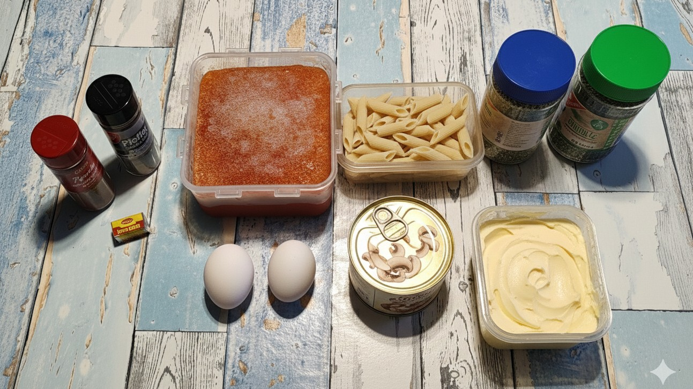
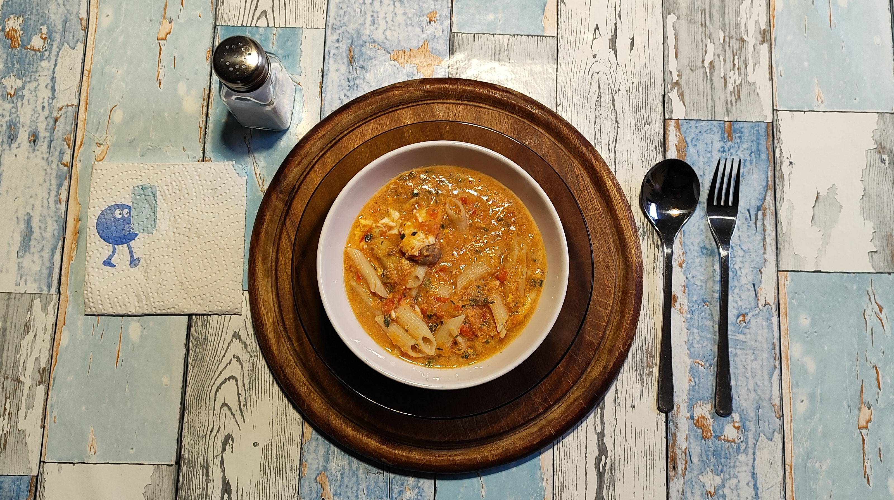

# Kurt kocht (01) - Dinkelpenne in Tomate

Dieses Rezept ist ein echtes Kraftpaket für den Körper, besonders durch die clevere Kombination der Zutaten und die schonende Zubereitung.

## Zutaten
* 125 g (1/4 Packung) Dinkelpenne
* 600-700 ml Tomatenpüree
* 1 Dose Champignons (geschnitten)
* 2 Eier
* 1 Brühwürfel (Fette Brühe)
* 20-30 g Margarine
* **Gewürze:** Paprikapulver rosenscharf, schwarzer Pfeffer
* **Kräuter:** Schnittlauch & Petersilie

---

## Zubereitung

### Langfristvorbereitung
1. **Tomatenbasis:** Frische Tomaten (600-700 g) waschen, grob würfeln und mit etwas Wasser kurz aufkochen. Pürieren, in eine Vorratsdose füllen und nach dem Abkühlen tieffrieren.
2. **Pasta-Vorrat:** Eine Packung Dinkelpenne (500 g) in Salzwasser kochen, abgießen, kalt abschrecken und in 4 Portionen aufgeteilt einfrieren.
3. **Schonendes Auftauen:** Am Abend vor dem Verzehr je eine Portion Tomaten und Penne in den Kühlschrank stellen.

### Zubereitung am Verzehrtag
1. Das aufgetaute Tomatenpüree im Topf auf mittlerer Flamme erhitzen.
2. Brühwürfel, Paprika, Pfeffer, Champignons und die Margarine einrühren.
3. Die Eier hinzugeben und locker unterrühren, bis sie leicht stocken.
4. Kräuter unterheben und alles kurz aufkochen lassen.
5. Die Flamme auf kleinste Stufe stellen, die Penne unterheben und kurz in der heißen Sauce ziehen lassen.
6. Vom Herd nehmen und servieren.

## Energiewert der Mahlzeit
* **Brennwert:** ca. 785 kcal (3.285 kJ)
* **Eiweiß:** ca. 34 g
* **Kohlenhydrate:** ca. 92 g
* **Fett:** ca. 28 g

## GEMINIS Gesundheits-Check - Warum dieses Gericht punktet
* **Lycopin-Boost:** Durch das Aufkochen wird die Zellstruktur der Tomaten aufgebrochen, wodurch das Lycopin für den Körper verfügbar wird.
* **Vitaminschonend:** Die Methode, die Sauce nach dem Aufkochen nur bei ca. 60°C warmzuhalten, schont hitzeempfindliche Vitamine.
* **Dinkel-Power:** Dinkel liefert mehr Mineralstoffe wie Magnesium und Eisen als moderner Weizen.
* **Fett & Lycopin:** Die Margarine stellt sicher, dass der Körper das fettlösliche Lycopin optimal aufnehmen kann.
