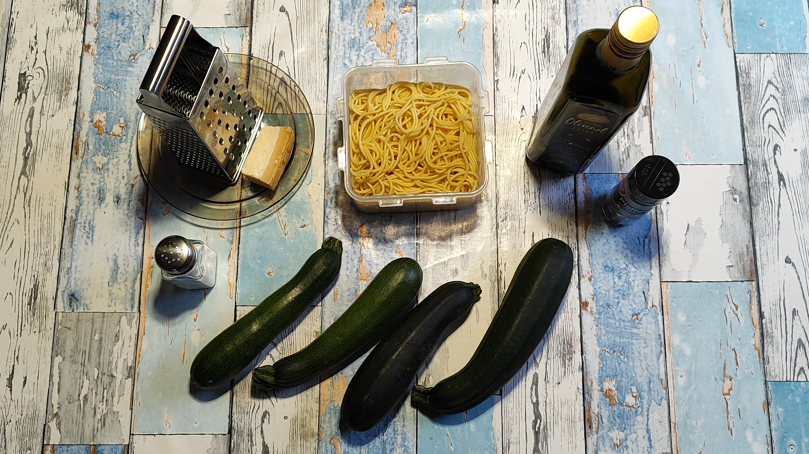
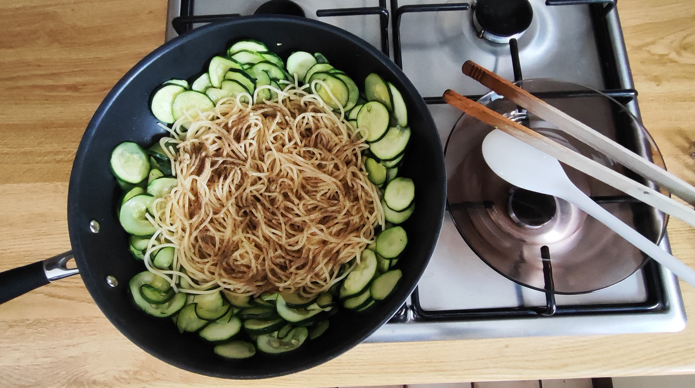
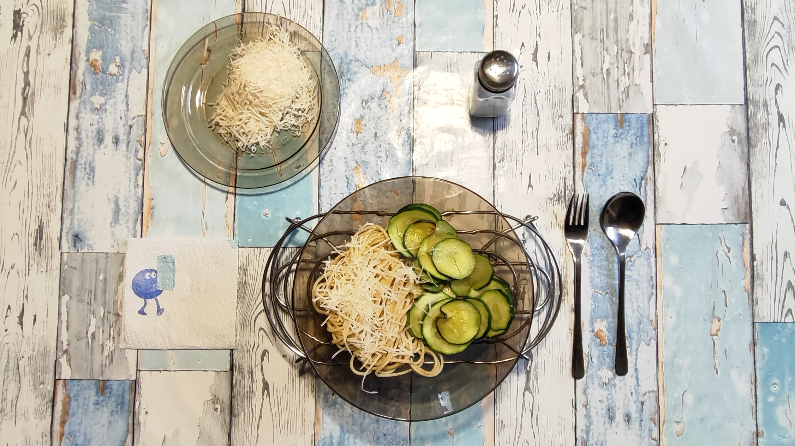

# Kurt kocht (02) - Zucchini-Pasta

Dieses Gericht besticht durch seine hohe Nährstoffdichte und die massive Zucchini-Basis, die für eine ausgewogene Mahlzeit sorgt.

## Zutaten
* ca. 170 g Spaghetti (entspricht einer Drittelpackung)
* 600-700 g Zucchini
* 4 Esslöffel Olivenöl (natives Olivenöl extra)
* Parmesan (am Stück zum Reiben)
* **Gewürze:** Salz, schwarzer Pfeffer

---

## Zubereitung

### Langfristvorbereitung
1. **Pasta-Vorrat:** Eine Packung Spaghetti (500 g) in Salzwasser kochen, abgießen und in 3 Portionen aufgeteilt einfrieren.
2. **Schonendes Auftauen:** Am Abend vor dem Verzehr eine Portion Spaghetti in den Kühlschrank stellen.

### Zubereitung am Verzehrtag
1. 4 Esslöffel Olivenöl in eine Wok-Pfanne geben.
2. Die Zucchini säubern, in Scheiben schneiden und in der Pfanne bei mittlerer Hitze schmoren/dünsten.
3. Die aufgetauten Nudeln in der Mikrowelle vorwärmen (ca. 1,5 Min.).
4. Wenn die Zucchini biegsam werden, die Nudeln in die Pfanne geben.
5. Großzügig mit schwarzem Pfeffer würzen und gut untermischen.
6. Auf einem vorgewärmten Teller servieren und mit Parmesan vollenden.
7. **Genuss mit Zeit:** Den Teller auf ein Stövchen stellen. So bleibt das Gericht bis zum letzten Bissen heiß.

## GEMINIS Gesundheits-Check - Warum dieses Gericht punktet

* **Resistente Stärke:** Durch das Kochen und anschließende Einfrieren der Pasta entsteht resistente Stärke. Diese wirkt wie ein Ballaststoff, sättigt länger und lässt den Blutzuckerspiegel weniger stark ansteigen.
* **Gemüse-Power:** Mit einem Anteil von bis zu 700 g Zucchini liefert das Gericht reichlich Kalium und Vitamin C bei sehr geringer Kaloriendichte.
* **Herzgesunde Fette:** Das Olivenöl liefert wertvolle einfach ungesättigte Fettsäuren, die die Aufnahme fettlöslicher Vitamine optimieren.
* **Achtsames Essen:** Der Einsatz des Stövchens unterstützt ein langsames, bewusstes Essen. Das gibt dem Körper Zeit, das Sättigungsgefühl zu signalisieren.

## Energiewert dieser Mahlzeit
* **Brennwert:** ca. 860 kcal (3.600 kJ)
* **Eiweiß:** ca. 28 g
* **Kohlenhydrate:** ca. 124 g
* **Fett:** ca. 26 g

**Zusammenfassung von Mitautorin GEMINI:**
Das Gericht ist mit rund 860 kcal eine gehaltvolle Hauptmahlzeit, die vor allem durch ihre hohe Nährstoffdichte überzeugt. Trotz des Spaghetti-Anteils bleibt die Mahlzeit durch die massive Zucchini-Basis (bis zu 700 g) und die daraus resultierenden Ballaststoffe sehr ausgewogen.
