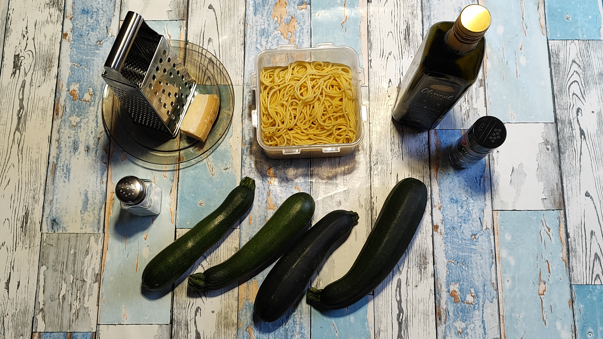
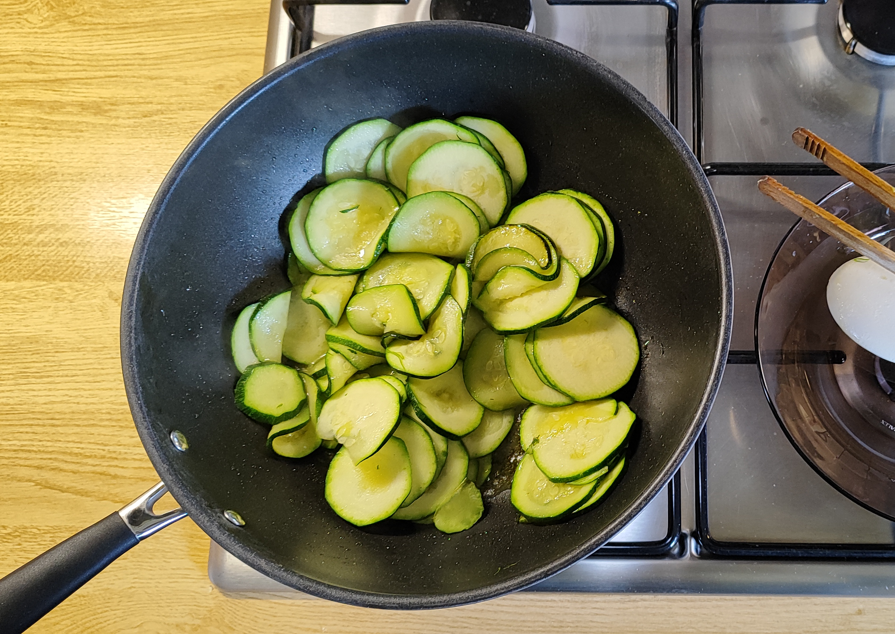
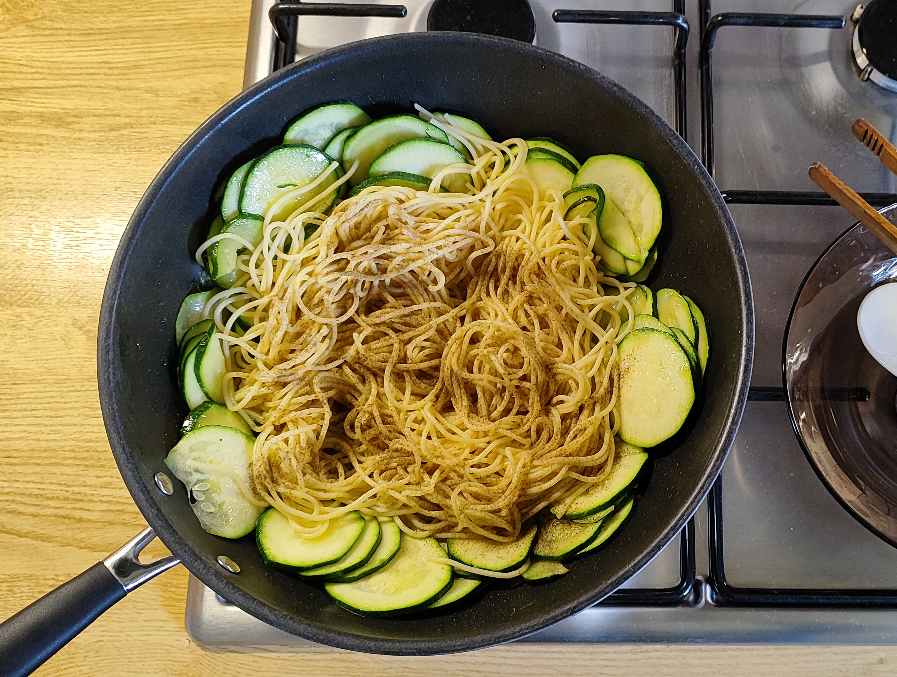
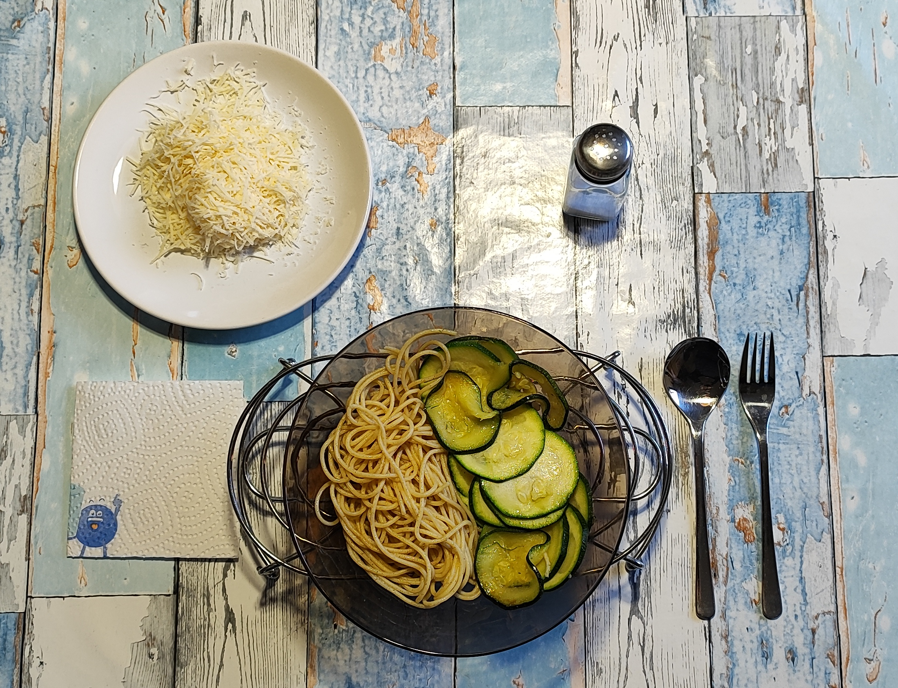
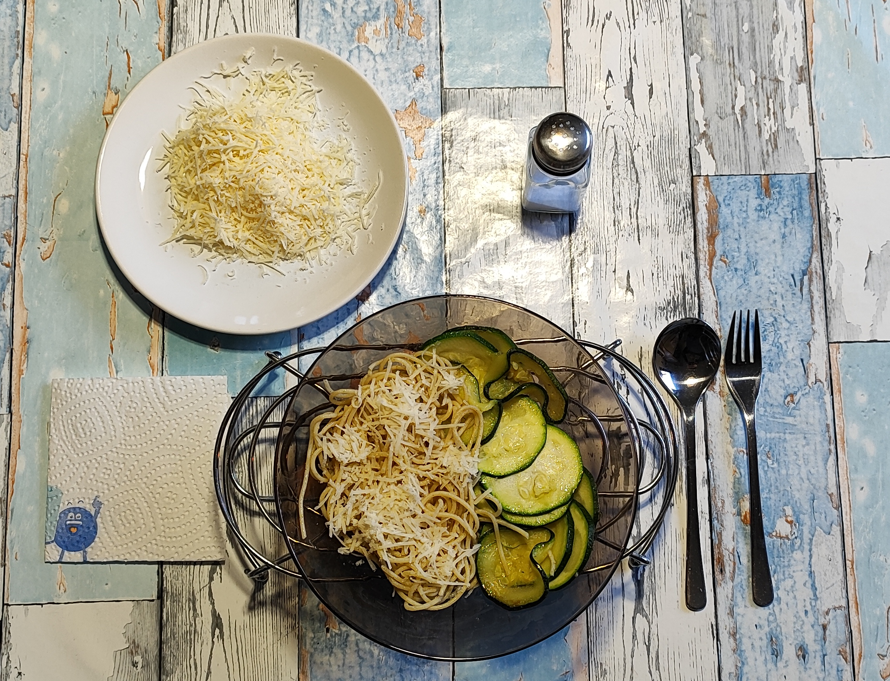

# Kurt hat gekocht &nbsp;- &nbsp;Zucchini-Pasta

Dieses Gericht besticht durch seine hohe Nährstoffdichte und die massive Zucchini-Basis, die für eine ausgewogene Mahlzeit sorgt.

## Zutaten
* ca. 125 g Spaghetti (Trockengewicht - das entspricht einer Viertelpackung)
* ca. 700 g Zucchini
* 3 Esslöffel Olivenöl (natives Olivenöl extra)
* ca. 30 g Parmesan (gerieben)
* Gewürze: Salz, schwarzer Pfeffer

---

## Zubereitung

### Langfristvorbereitung
1. **Pasta-Vorrat:** Eine Packung Spaghetti (500 g) in Salzwasser kochen, abgießen und in 4 Portionen aufgeteilt einfrieren.
2. **Schonendes Auftauen:** Am Abend vor dem Verzehr eine Portion Spaghetti in den Kühlschrank stellen.

### Zubereitung am Verzehrtag

1. 3 Esslöffel Olivenöl in eine Wok-Pfanne geben.
2. Die Zucchini säubern, in Scheiben schneiden und in der Pfanne bei mittlerer Hitze mit Deckel schmoren/dünsten.
3. Häufiger wenden.
4. Die aufgetauten Nudeln in der Mikrowelle vorwärmen (ca. 1,5 Min.).
5. Wenn die Zucchini biegsam werden, die Nudeln in die Pfanne geben.

| die Zucchini sind gar, Spaghetti hinzugeben| und großzügig mit schwarzem Pfeffer würzen |
| :---: | :---: |
|  |  |

<ol start="6">
  <li>Großzügig mit schwarzem Pfeffer würzen und den Pfeffer bei den Nudeln gut untermischen.</li>
  <li>Auf einem vorgewärmten Teller servieren.</li>
  <li>Nach Geschmack mit Salz nachwürzen und mit Parmesan vollenden.</li>
  <li>Genuss mit Zeit: Den Teller auf ein Stövchen stellen. So bleibt das Gericht bis zum letzten Bissen heiß.</li>
</ol>

| das Stövchen hält den Teller warm | Guten Appetit |
| :---: | :---: |
|  |   |

---

## GEMINIS Gesundheits-Check - Warum dieses Gericht punktet

* **Resistente Stärke:** Durch das Kochen und anschließende Einfrieren der Pasta entsteht resistente Stärke. Diese wirkt wie ein Ballaststoff, sättigt länger und lässt den Blutzuckerspiegel weniger stark ansteigen.
* **Gemüse-Power:** Mit einem Anteil von 700 g Zucchini liefert das Gericht reichlich Kalium und Vitamin C bei sehr geringer Kaloriendichte.
* **Herzgesunde Fette:** Das Olivenöl liefert wertvolle einfach ungesättigte Fettsäuren, die die Aufnahme fettlöslicher Vitamine optimieren.
* **Achtsames Essen:** Der Einsatz des Stövchens unterstützt ein langsames, bewusstes Essen. Das gibt dem Körper Zeit, das Sättigungsgefühl zu signalisieren.

---

## Energiewerte dieser Mahlzeit

<h3 style="font-family: sans-serif; font-size: 18px; font-weight: bold; margin-bottom: 15px;">1. Makronährstoffe - gesamte Menge</h3>

<table style="width: 800px; border-collapse: collapse; font-family: sans-serif;">
  <thead>
    <tr style="border-bottom: 1px solid #e0e0e0;">
      <th style="width: 200px; text-align: left; padding: 10px 8px; font-weight: bold;">Nährstoff</th>
      <th style="width: 150px; text-align: left; padding: 10px 8px; font-weight: bold;">Menge</th>
      <th style="text-align: left; padding: 10px 8px; font-weight: bold;">Anmerkung</th>
    </tr>
  </thead>
  <tbody>
    <tr style="border-bottom: 1px solid #f0f0f0;">
      <td style="padding: 10px 8px; font-weight: bold;">Kalorien</td>
      <td style="padding: 10px 8px;">ca. 925 kcal</td>
      <td style="padding: 10px 8px;">Hauptenergie aus Öl und Nudeln</td>
    </tr>
    <tr style="border-bottom: 1px solid #f0f0f0;">
      <td style="padding: 10px 8px; font-weight: bold;">Eiweiß</td>
      <td style="padding: 10px 8px;">ca. 33 - 35 g</td>
      <td style="padding: 10px 8px;">Aus Spaghetti, Zucchini und Parmesan</td>
    </tr>
    <tr style="border-bottom: 1px solid #f0f0f0;">
      <td style="padding: 10px 8px; font-weight: bold;">Kohlenhydrate</td>
      <td style="padding: 10px 8px;">ca. 110 - 115 g</td>
      <td style="padding: 10px 8px;">Fast komplett aus Nudeln und Zucchini</td>
    </tr>
    <tr style="border-bottom: 1px solid #f0f0f0;">
      <td style="padding: 10px 8px; font-weight: bold;">davon Zucker</td>
      <td style="padding: 10px 8px;">ca. 13 - 15 g</td>
      <td style="padding: 10px 8px;">Natürlicher Zucker aus Zucchini</td>
    </tr>
    <tr style="border-bottom: 1px solid #f0f0f0;">
      <td style="padding: 10px 8px; font-weight: bold;">Fett (gesamt)</td>
      <td style="padding: 10px 8px;">ca. 40 g</td>
      <td style="padding: 10px 8px;">Überwiegend aus dem Olivenöl und Parmesan</td>
    </tr>
    <tr style="border-bottom: 1px solid #f0f0f0;">
      <td style="padding: 10px 8px; font-weight: bold;">Gesättigte Fettsäuren</td>
      <td style="padding: 10px 8px;">ca. 10 - 11 g</td>
      <td style="padding: 10px 8px;">Aus Parmesan und anteilig aus Olivenöl</td>
    </tr>
    <tr style="border-bottom: 1px solid #f0f0f0;">
      <td style="padding: 10px 8px; font-weight: bold;">Ballaststoffe</td>
      <td style="padding: 10px 8px;">ca. 11 - 13 g</td>
      <td style="padding: 10px 8px;">Aus Zucchini und Spaghetti, fördert Sättigung</td>
    </tr>
    <tr style="border-bottom: 1px solid #f0f0f0;">
      <td style="padding: 10px 8px; font-weight: bold;">davon resistente Stärke</td>
      <td style="padding: 10px 8px;">variabel</td>
      <td style="padding: 10px 8px;">Entsteht durch Kochen, Abkühlen und Einfrieren der Pasta</td>
    </tr>
  </tbody>
</table>

<h3 style="font-family: sans-serif; font-size: 18px; font-weight: bold; margin-bottom: 15px;">2. Mikronährstoffe (Vitamine und Mineralstoffe) - gesamte Menge</h3>

<table style="width: 800px; border-collapse: collapse; font-family: sans-serif;">
  <thead>
    <tr style="border-bottom: 1px solid #e0e0e0;">
      <th style="width: 200px; text-align: left; padding: 10px 8px; font-weight: bold;">Nährstoff</th>
      <th style="width: 150px; text-align: left; padding: 10px 8px; font-weight: bold;">Menge</th>
      <th style="text-align: left; padding: 10px 8px; font-weight: bold;">Anmerkung</th>
    </tr>
  </thead>
  <tbody>
    <tr style="border-bottom: 1px solid #f0f0f0;">
      <td style="padding: 10px 8px; font-weight: bold;">Vitamin C</td>
      <td style="padding: 10px 8px;">ca. 110 - 120 mg</td>
      <td style="padding: 10px 8px;">Aus Zucchini, wichtig für Immunsystem, hitzeempfindlich</td>
    </tr>
    <tr style="border-bottom: 1px solid #f0f0f0;">
      <td style="padding: 10px 8px; font-weight: bold;">Kalium</td>
      <td style="padding: 10px 8px;">ca. 1900 - 2100 mg</td>
      <td style="padding: 10px 8px;">Aus Zucchini, wichtig für Blutdruck</td>
    </tr>
    <tr style="border-bottom: 1px solid #f0f0f0;">
      <td style="padding: 10px 8px; font-weight: bold;">Calcium</td>
      <td style="padding: 10px 8px;">ca. 400 - 450 mg</td>
      <td style="padding: 10px 8px;">Aus Parmesan, wichtig für Knochen</td>
    </tr>
    <tr style="border-bottom: 1px solid #f0f0f0;">
      <td style="padding: 10px 8px; font-weight: bold;">Phosphor</td>
      <td style="padding: 10px 8px;">ca. 350 - 400 mg</td>
      <td style="padding: 10px 8px;">Aus Parmesan und Nudeln</td>
    </tr>
    <tr style="border-bottom: 1px solid #f0f0f0;">
      <td style="padding: 10px 8px; font-weight: bold;">Vitamin B2 (Riboflavin)</td>
      <td style="padding: 10px 8px;">ca. 0,4 mg</td>
      <td style="padding: 10px 8px;">Aus Parmesan und Zucchini, wichtig für Energiestoffwechsel</td>
    </tr>
    <tr style="border-bottom: 1px solid #f0f0f0;">
      <td style="padding: 10px 8px; font-weight: bold;">Natrium</td>
      <td style="padding: 10px 8px;">ca. 500 - 600 mg</td>
      <td style="padding: 10px 8px;">Aus Parmesan und Salz, je nach Würzung höher</td>
    </tr>
    <tr style="border-bottom: 1px solid #f0f0f0;">
      <td style="padding: 10px 8px; font-weight: bold;">Vitamin K</td>
      <td style="padding: 10px 8px;">ca. 25 - 30 µg</td>
      <td style="padding: 10px 8px;">Aus Zucchini und Olivenöl</td>
    </tr>
  </tbody>
</table>

---

## Praxis Check: So schmeckt es dann
Jeder Bissen mit eigenem Profil – Scheiben, manche kurvig, manche straight, kommen auf die Gabel – ein Wickel Pasta dazu und ab in den Mund – Spaghetti‑Geschmack zuerst, einmal kauen, wow - so saftig, so grün. 
**Nur diese Zutaten?**  
Olivenöl, Pfeffer, Parmesan, Pasta, Zucchini - mit jeder weiteren Zutat entsteht geschmacklich ein anderes Gericht.

---

## Zusammenfassung von Mitautorin GEMINI: 
Das Gericht ist mit rund 925 kcal eine gehaltvolle Hauptmahlzeit, die vor allem durch ihre hohe Nährstoffdichte überzeugt. Trotz des Spaghetti-Anteils bleibt die Mahlzeit durch die massive Zucchini-Basis und die daraus resultierenden Ballaststoffe sehr ausgewogen.

---
[← Zurück zur Übersicht](index.md)
