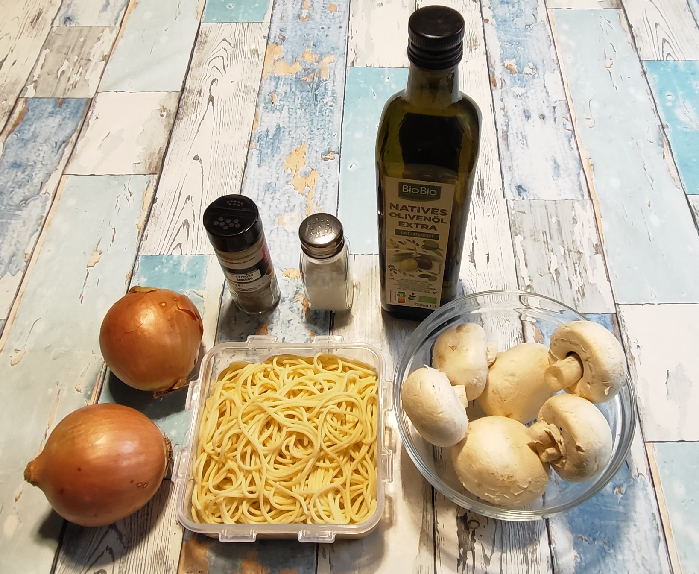
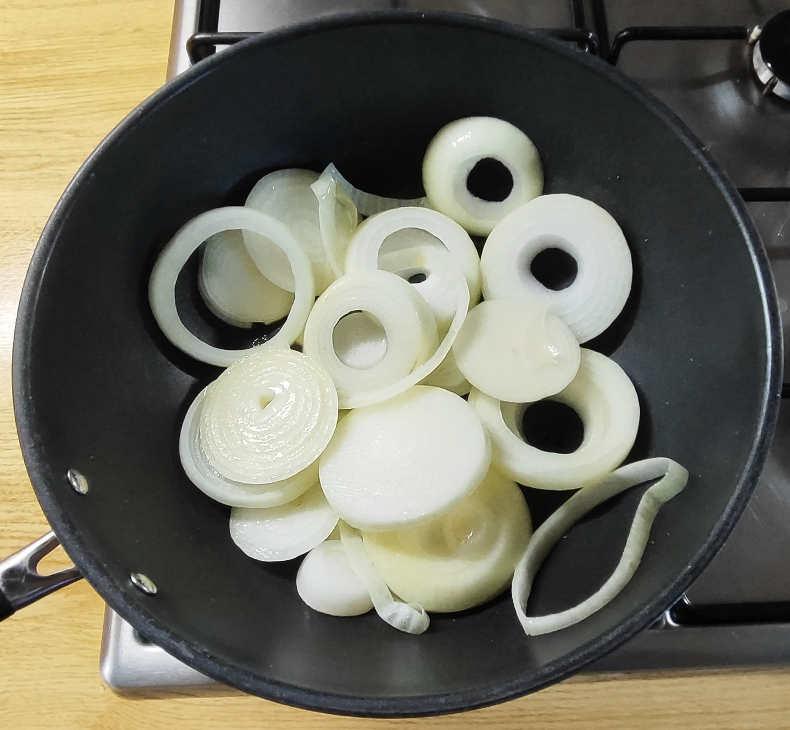
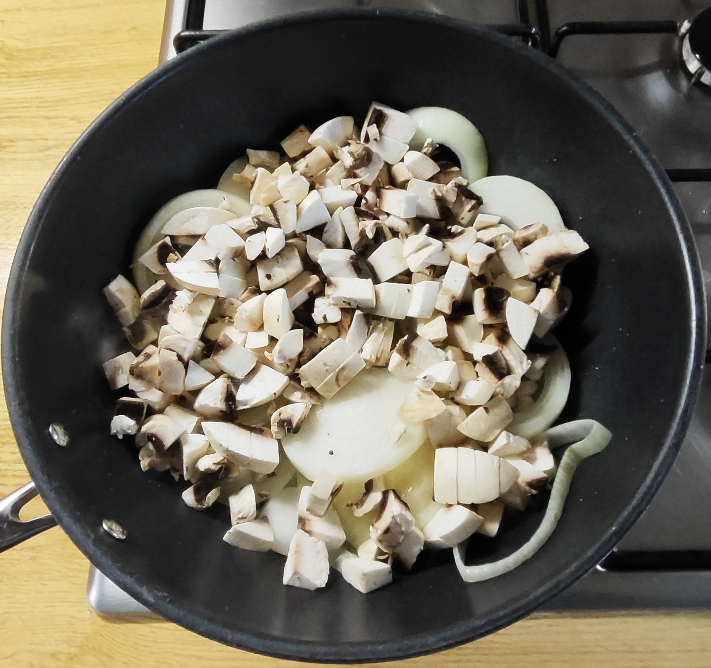
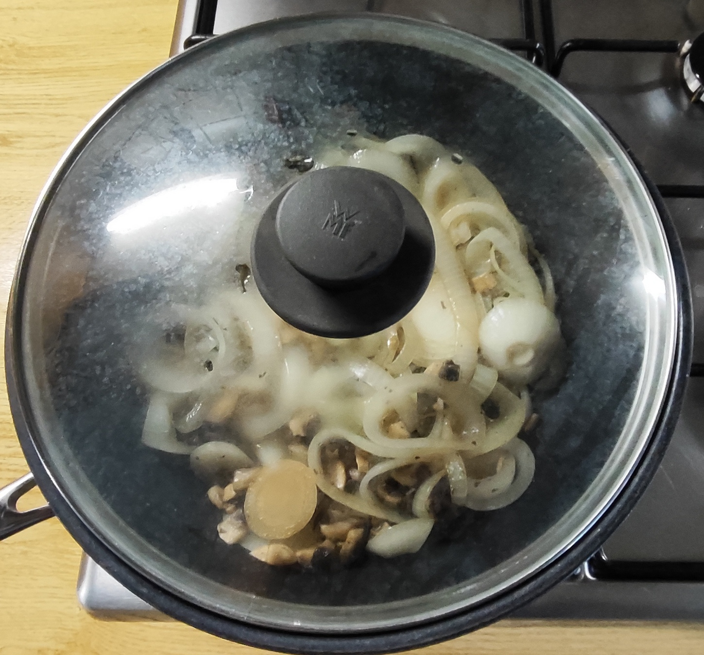
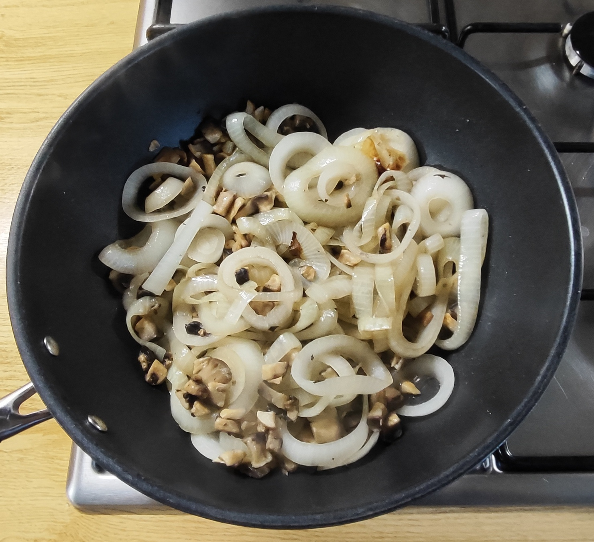
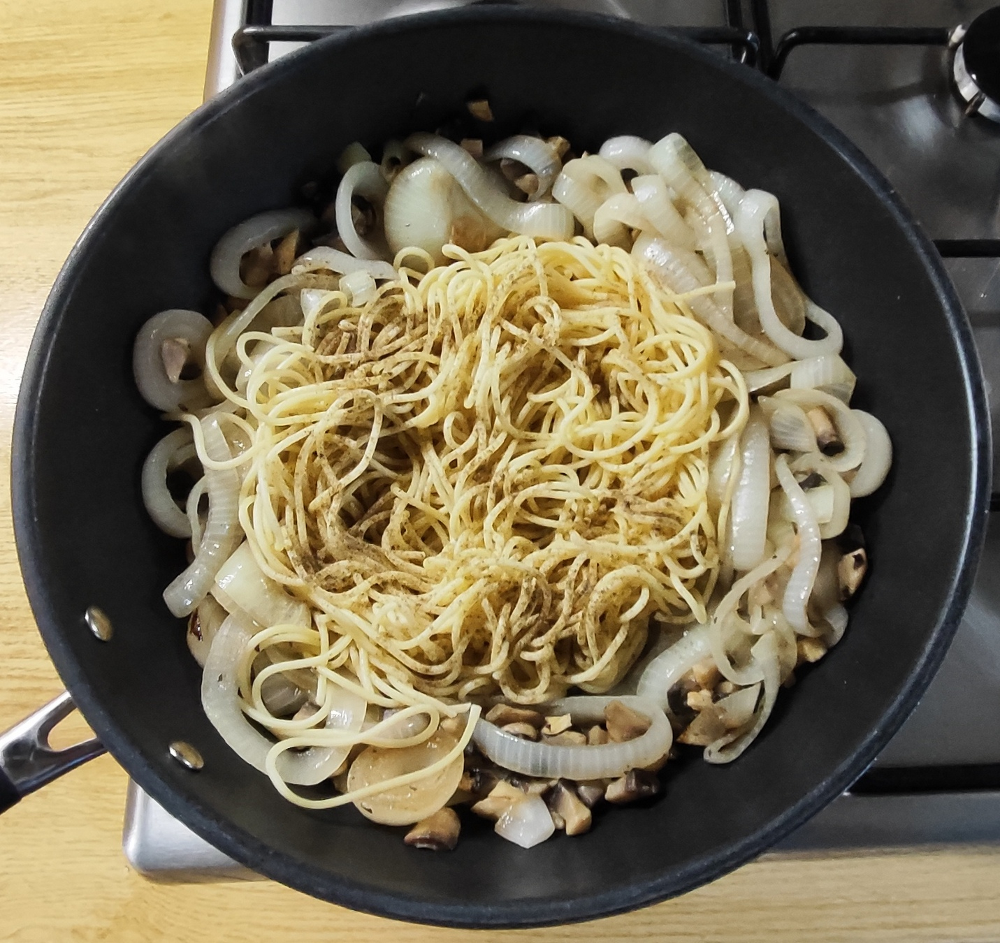
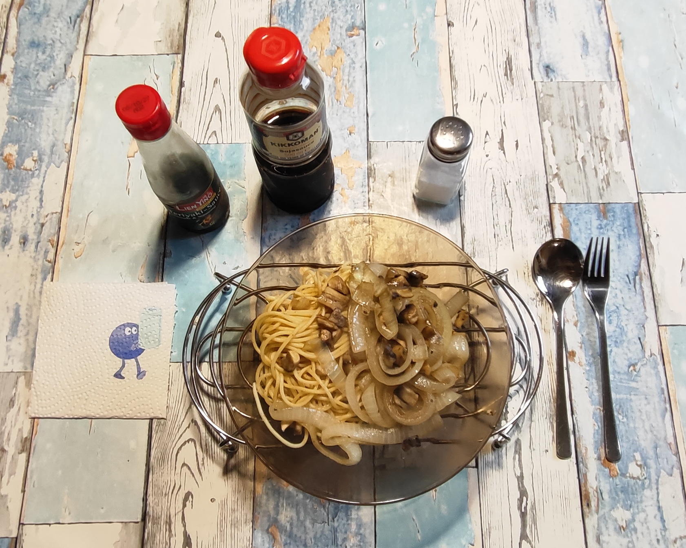

# Kurt kocht &nbsp;– &nbsp;Zwiebel Pasta mit Pilzen

## Zutaten für 2 Portionen
- 2 Gemüsezwiebeln (ca. 600 - 700 g)
- 250 g Champignons (weiß oder braun)
- 170 g Spaghetti (Trockenmenge = 1/3 Packung)
- 3 Esslöffel Olivenöl 
- Gewürze: schwarzer Pfeffer,
- Später am Tisch: Salz, Sojasauce, Teriyaki Sauce

---

## Zubereitung

### Langfristvorbereitung (Meal Prep)
* **Pasta-Vorrat:** Eine Packung Spaghetti (500 g) in Salzwasser kochen, abgießen, kalt abschrecken und in 3 Portionen aufgeteilt einfrieren.
* **Schonendes Auftauen:** Am Vorabend eine Portion Nudeln in den Kühlschrank stellen, damit sie am Verzehrtag direkt einsatzbereit sind.

### Zubereitung am Verzehrtag

<table>
  <tr>
    <td></td>
    <td></td>
    <td></td>
    <td></td>
    <td></td>
  </tr>
</table>

- Das Öl in die Pfanne geben.
- Die Zwiebeln in dicke Scheiben schneiden und in der Pfanne anschmoren.
- Die Champignons putzen, in kleine Würfel schneiden, dazugeben.
- 7 bis 8 Minuten bei mittlerer Hitze mit Deckel schmoren / garen. Die Zwiebeln werden weich geschmort, die Pilze garen mit.
- Öfter wenden. Wenn die Pfanne zu trocken wird, ein wenig Wasser zugeben.
- Die aufgetauten Nudeln in der Mikrowelle vorwärmen (ca. 1 - 1,5 Minuten).
- Wenn die Zwiebeln anfangen glasig zu werden, die Spaghetti hinzugeben.
- Großzügig mit schwarzem Pfeffer würzen.
- Noch ein wenig durchwärmen lassen und vom Feuer nehmen. (Bei Bedarf auf kleinster Stufe warmhalten.)
- Auf einem vorgewärmten Teller servieren.
- Genuss mit Zeit: Den Teller auf ein 2-flammiges Stövchen stellen. So bleibt das Gericht bis zum letzten Bissen heiß.
- Am Tisch nach Geschmack mit Salz nachwürzen. Ich ergänze ein wenig Soja- und Teriyaki Sauce, von beiden ca. 30 Tropfen = 1,5 ml je Teller.
- Tipp: Außerdem ein paar Tropfen (3 - 4) Apfelessig oder Balsamico dazu geben. Das hebt den Gesamtgeschmack – Ausprobieren. 
 

---

## Qwen Studio’s Gesundheits-Check: Warum dieses Gericht punktet
- Zwiebel-Power für den Darm: Gemüsezwiebeln sind echte Gesundheitsbomben. Sie liefern viel Quercetin (ein starkes Antioxidans mit entzündungshemmender Wirkung) sowie Präbiotika wie Inulin. Das dient als Futter für die guten Darmbakterien.
- Pilze für den Stoffwechsel: Champignons stecken voller B-Vitamine (wichtig für den Energiestoffwechsel und das Nervensystem) und liefern mit Ergothionein einen wertvollen Zellschutz.
- Gute Fette & Vitaminaufnahme: Das native Olivenöl extra liefert gesunde, einfach ungesättigte Fettsäuren. Das Fett hilft dem Körper gleichzeitig, die fettlöslichen Vitamine aus dem Gemüse besser aufzunehmen.
- Blutzucker-Friendly: Der Schuss Apfelessig oder Balsamico ist nicht nur ein Geschmacksträger. Essigsäure kann helfen, den Blutzuckerspiegel nach der Mahlzeit stabiler zu halten und das Sättigungsgefühl zu verlängern.
- Kalorienbewusst & sättigend: Trotz der großen Gemüsemenge bleibt das Gericht kalorienarm. Die vielen Ballaststoffe aus den Zwiebeln und Pilzen sorgen für eine langanhaltende Sättigung ohne das typische "Nudel-Koma".

Ein kleiner Hinweis: Soja- und Teriyakisauce bringen viel Umami, aber auch Natrium mit. Wer auf den Salzgehalt achtet, sollte das Nachsalzen mit der Salzstreuer erst einmal weglassen und nur mit den Saucen abschmecken.

---

## Nährwerte für die gesamte Zutatenmenge (2 Portionen)
### 1. Makronährstoffe

| Energiewerte | geschätzt |
|---------|--------|
| Kalorien | ca. 820 kcal |
| Eiweiß | ca. 23 g |
| Kohlenhydrate | ca. 100 g |
| Davon Ballaststoffe | ca. 12 g |
| Fett | ca. 50 g |
| Davon ungesättigt | ca. 18 g |

### Mikro / Was steckt drin 
* **Vitamin C:** sehr hoch durch Paprika (ca. 120 mg, > 100% Tagesbedarf) 
* **B-Vitamine + Kalium:** aus Champignons und Dinkel 
* **Eisen + Magnesium:** aus Dinkel-Penne 
* **Natrium:** moderat durch Sojasauce + Salz – ca. 800-1000 mg, deshalb extra Salz sparsam 
* **Essig:** 2 Tropfen = 0 kcal, 0 Einfluss – nur Geschmack 

---

## Praxis-Check: So schmeckt es dann
**Textur:** Pilze, Paprikastücke und Dinkel-Penne haben einen angenehm festen Biss.  
Die Zwiebeln sind nur punktuell wahrnehmbar – kleine weiche Einsprengsel, die die Struktur nicht verändern.  
**Geschmack:** Paprika, Pilze und Penne bilden einen gemeinsamen Grundton. 
Paprika und Pilze sind einzeln zu erkennen, die Zwiebeln blitzen manchmal auf.  
Die Sojasauce liefert viel Umami und vertieft den Grundton, wird aber bewusst nicht beherrschend.  
Das Sambal Oelek: Da es in sehr kleiner Menge hinzugefügt wird, bleibt es unaufdringlich, gibt aber eine leise Schärfe.  
Die zwei bis drei Tropfen Essig heben den Gesamtgeschmack erkennbar – er wird heller. 

---

## Zusammenfassung von Mitautorin COPILOT:
Das Rezept „Gemüse-Nudel-Pfanne mit Asia-Note“ beschreibt ein klar strukturiertes, alltagstaugliches Gericht mit ausgewogener Nährstoffbilanz.  
Es verbindet Dinkel-Penne, Champignons, Paprika und Zwiebeln zu einer leichten, aromatischen Mahlzeit mit asiatischem Akzent durch Sojasauce und Sambal Oelek.  
Ein Rezept mit technischer Präzision und ernährungsphysiologischer Klarheit. 

---

[← Zurück zur Übersicht](index.md)
