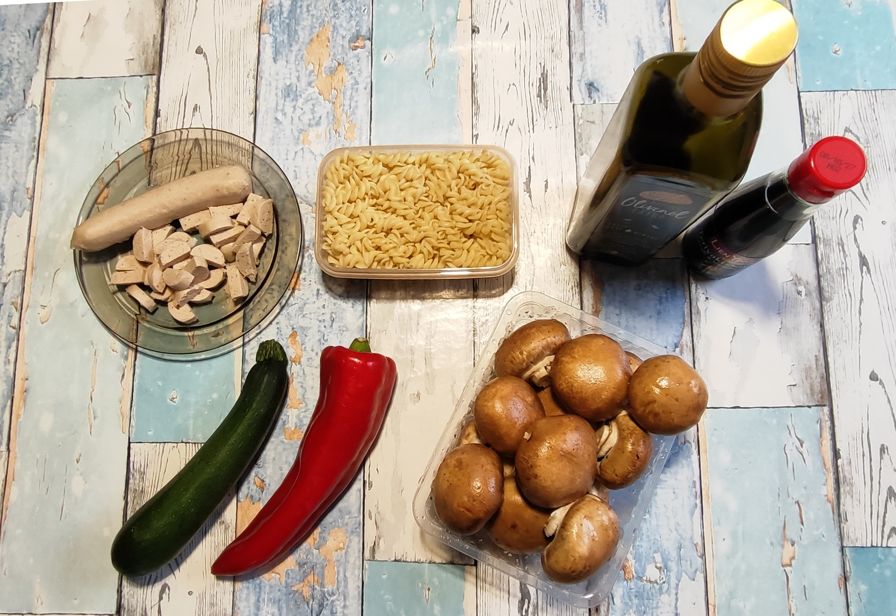
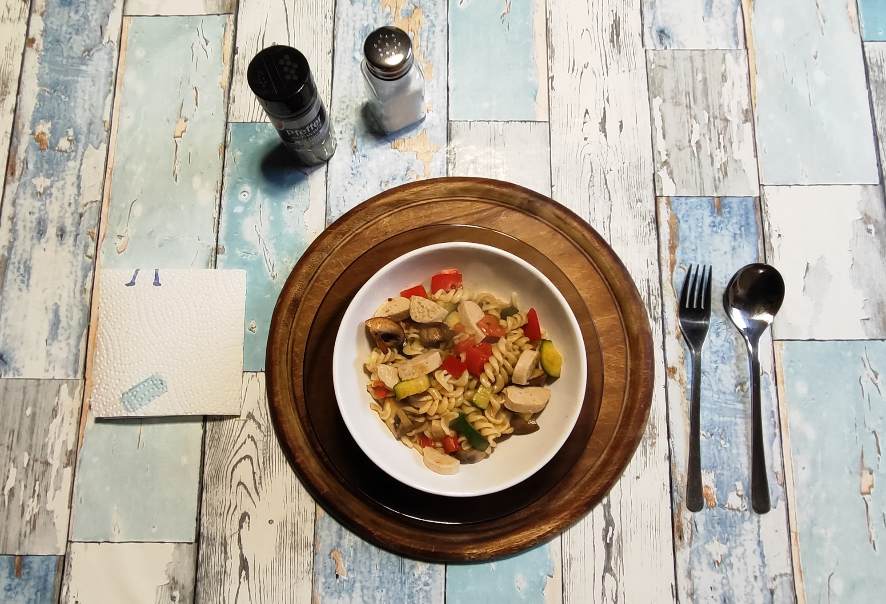

# Kurt kocht (03) – Bunte Pilzpfanne

Dieses Gericht besticht durch seine effiziente Vorratsküche und die kurze Zubereitungszeit am Verzehrtag. Es ist eine gehaltvolle Mahlzeit, die besonders durch den Mix aus tierischem Eiweiß und pflanzlichen Proteinen punktet.

## Zutaten
* **120 g Spiralnudeln** (vorgekocht aus dem 600 g Vorrat)
* **2 Grillwürstchen** (in Scheiben oder Stücke geschnitten)
* **1 Packung frische braune Champignons** (400 g)
* **1 rote Spitzpaprika** (Kühlschrankrest)
* **1 Zucchini** (Kühlschrankrest)
* **Olivenöl** zum Anbraten
* **Teriyaki-Sauce** (zum Verfeinern/Löschen)

---

## Zubereitung

### Langfristvorbereitung (Meal Prep)
* **Pasta-Vorrat:** Eine 600 g Packung Spiralnudeln in Salzwasser kochen, abgießen, kalt abschrecken und in 5 Portionen (je ca. 120 g) aufgeteilt einfrieren.
* **Schonendes Auftauen:** Am Vorabend eine Portion Nudeln in den Kühlschrank stellen, damit sie am Verzehrtag direkt einsatzbereit sind.

### Zubereitung am Verzehrtag
1. **Pilz-Basis:** Die frischen Champignons je nach Größe vierteln oder sechsteln. In einer Wok-Pfanne mit ca. 4 Esslöffeln Öl scharf anbraten und mit einigen Spritzern Teriyaki-Sauce verfeinern.
2. **Gemüse-Zeit:** Nach ca. 5 Minuten die gewürfelten Zucchini und Paprika hinzugeben. Bei mittlerer Hitze mitbraten, damit das Gemüse knackig bleibt.
3. **Finale Mischung:** Nach weiteren 5 Minuten die aufgetauten Spiralnudeln und die in Stückchen geschnittenen Grillwürstchen unterheben.
4. **Finish:** Alles für weitere 5 Minuten gemeinsam ziehen lassen, damit die Nudeln die Aromen aufnehmen und die Würstchen heiß werden.
5. **Servieren:** Vom Herd nehmen und direkt genießen.

---

## Gesundheits-Check
* **Protein-Kombination:** Grillwürstchen und Champignons liefern eine solide Eiweißbasis.
* **Vitamine:** Durch kurze Garzeiten bleiben hitzeempfindliche Mikronährstoffe in Paprika und Zucchini erhalten.
* **Mineralstoffe:** Pilze sind natürliche Lieferanten für B-Vitamine und unterstützen das Immunsystem.
* **Gesunde Fette:** Das Olivenöl dient als Geschmacksträger und hilft bei der Aufnahme fettlöslicher Vitamine.

### Energiewert (pro Portion)
| Parameter | Wert |
| :--- | :--- |
| **Brennwert** | ca. 640 kcal |
| **Eiweiß** | ca. 26 g |
| **Kohlenhydrate** | ca. 45 g |
| **Fett** | ca. 38 g |

---
*Zusammenfassung: Ein ehrliches, herzhaftes Gericht mit Fokus auf vitaminschonende Zubereitung und effizientes Zeitmanagement.*
