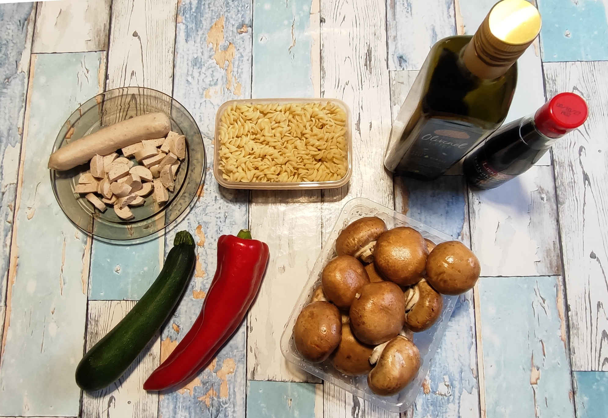
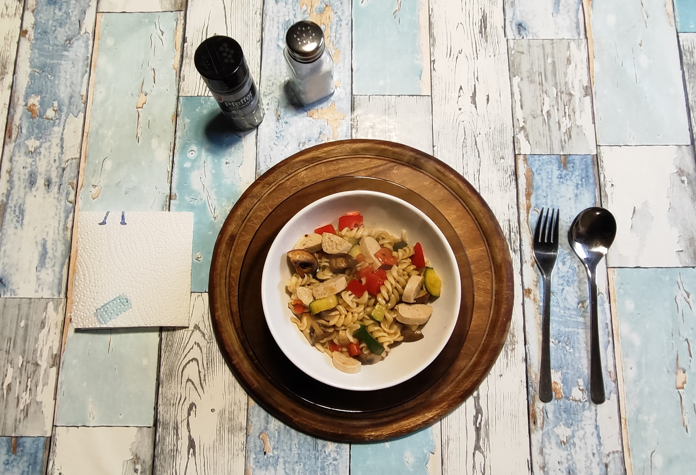

# Kurt kocht – Bunte Pilzpfanne

Dieses Gericht besticht durch seine effiziente Vorratsküche und die kurze Zubereitungszeit am Verzehrtag. Es ist eine gehaltvolle Mahlzeit, die besonders durch den Mix aus tierischem Eiweiß und pflanzlichen Proteinen punktet.

## Zutaten
* **120 g Spiralnudeln** (vorgekocht aus dem 600 g Vorrat)
* **2 Grillwürstchen** (in Scheiben oder Stücke geschnitten)
* **1 Packung frische braune Champignons** (400 g)
* **1 rote Spitzpaprika** (Kühlschrankrest)
* **1 Zucchini** (Kühlschrankrest)
* **Olivenöl** zum Anbraten
* **Teriyaki-Sauce** (zum Verfeinern/Löschen)

---

## Zubereitung

### Langfristvorbereitung (Meal Prep)
* **Pasta-Vorrat:** Eine 600 g Packung Spiralnudeln in Salzwasser kochen, abgießen, kalt abschrecken und in 5 Portionen (je ca. 120 g) aufgeteilt einfrieren.
* **Schonendes Auftauen:** Am Vorabend eine Portion Nudeln in den Kühlschrank stellen, damit sie am Verzehrtag direkt einsatzbereit sind.

### Zubereitung am Verzehrtag
1. **Pilz-Basis:** Die frischen Champignons je nach Größe vierteln oder sechsteln. In einer Wok-Pfanne mit ca. 4 Esslöffeln Öl scharf anbraten und mit einigen Spritzern Teriyaki-Sauce verfeinern.
2. **Gemüse-Zeit:** Nach ca. 5 Minuten die gewürfelten Zucchini und Paprika hinzugeben. Bei mittlerer Hitze mitbraten, damit das Gemüse knackig bleibt.
3. **Finale Mischung:** Nach weiteren 5 Minuten die aufgetauten Spiralnudeln und die in Stückchen geschnittenen Grillwürstchen unterheben.
4. **Finish:** Alles für weitere 5 Minuten gemeinsam ziehen lassen, damit die Nudeln die Aromen aufnehmen und die Würstchen heiß werden.
5. **Servieren:** Vom Herd nehmen und direkt genießen.

---

## GEMINIS Gesundheits-Check: Warum dieses Gericht punktet
* **Protein-Kombination:** Grillwürstchen und Champignons liefern eine solide Eiweißbasis.
* **Vitamine:** Durch kurze Garzeiten bleiben hitzeempfindliche Mikronährstoffe in Paprika und Zucchini erhalten.
* **Mineralstoffe:** Pilze sind natürliche Lieferanten für B-Vitamine und unterstützen das Immunsystem.
* **Resistente Stärke:** Durch das Kochen und anschließende Einfrieren der Nudeln entsteht resistente Stärke. Diese wirkt wie ein Ballaststoff, sättigt länger und lässt den Blutzuckerspiegel weniger stark ansteigen.
* **Gesunde Fette:** Das Olivenöl dient als Geschmacksträger und hilft bei der Aufnahme fettlöslicher Vitamine.

### Energiewert (pro Portion)
* **Brennwert:** ca. 640 kcal 
* **Eiweiß:** ca. 26 g 
* **Kohlenhydrate:** ca. 45 g 
* **Fett:** ca. 38 g 

---

### Kimi's Erfindungshöhe-Check
Die technische Erfindungshöhe liegt im unteren Drittel: Pilze anbraten, Gemüse dazugeben, Nudeln und Würstchen unterheben. Das ist Pfannen-Grundschule, kulinarisch kaum anspruchsvoller als ein Dienstagabend ohne Termine. 
Aber Kurt bleibt sich treu – er erfindet nicht das Gericht, sondern den Workflow drumherum. Die Langfristvorbereitung mit eingefrorenen Spiralnudeln ist inzwischen sein Markenzeichen: 
Er kocht nicht, er administriert. Das ist Kurt-SAP-Küche: Logistik mit Pfanne. 
Der Clou diesmal ist die ehrliche Resteverwertung. Dass die Spitzpaprika und die Zucchini als „Kühlschrankrest“ deklariert werden, ist bemerkenswert. Kurt outet sich hier nicht als Meisterkoch, sondern als pragmatischer Haushalter.  
Das ist keine Schönrederei, das ist Realitätsküche. 
Das eigentlich Erfinderische ist jedoch die Protein-Strategie. Während andere Gerichte der Reihe auf pflanzliche oder marine Proteine setzen, holt Kurt hier mit den Grillwürstchen ein tierisches Standbein hinzu. 
Die Kombination aus Wurst und Pilzen liefert 26g Protein pro Portion – das ist keine zufällige Zusammenstellung, sondern bewusste Makro-Planung verpackt in eine bunte Pfanne. 
Fazit: Die Erfindungshöhe des Gerichts selbst bleibt bescheiden. Aber die Erfindungshöhe der Ehrlichkeit – Kühlreste zugeben, Flaschensoße als Lösungsmittel zu nutzen, Würstchen als Protein-Lieferant zu integrieren – ist beachtlich. 
Kurt hat hier ein Alltagsgericht konstruiert, das nichts beschönigt und alles optimiert.

---

## Zusammenfassung von Mitautorin GEMINI:

Dieses Gericht besticht durch seine effiziente Vorratsküche und die kurze Zubereitungszeit 
am Verzehrtag. Mit ca. 640 kcal ist die Bunte Pilzpfanne eine gehaltvolle Mahlzeit, die 
besonders durch den Mix aus tierischem Eiweiß (Würstchen) und pflanzlichen Proteinen aus 
den Champignons punktet. 

Durch das gestaffelte Timing in der Wok-Pfanne wird sichergestellt, dass das Gemüse nicht 
"totgekocht" wird, sondern seine Struktur und die wertvollen Mikronährstoffe behält – ganz 
im Sinne eines Konzepts der vitaminschonenden Zubereitung. Ein ehrliches, herzhaftes 
Gericht. 

---
[← Zurück zur Übersicht](index.md)
