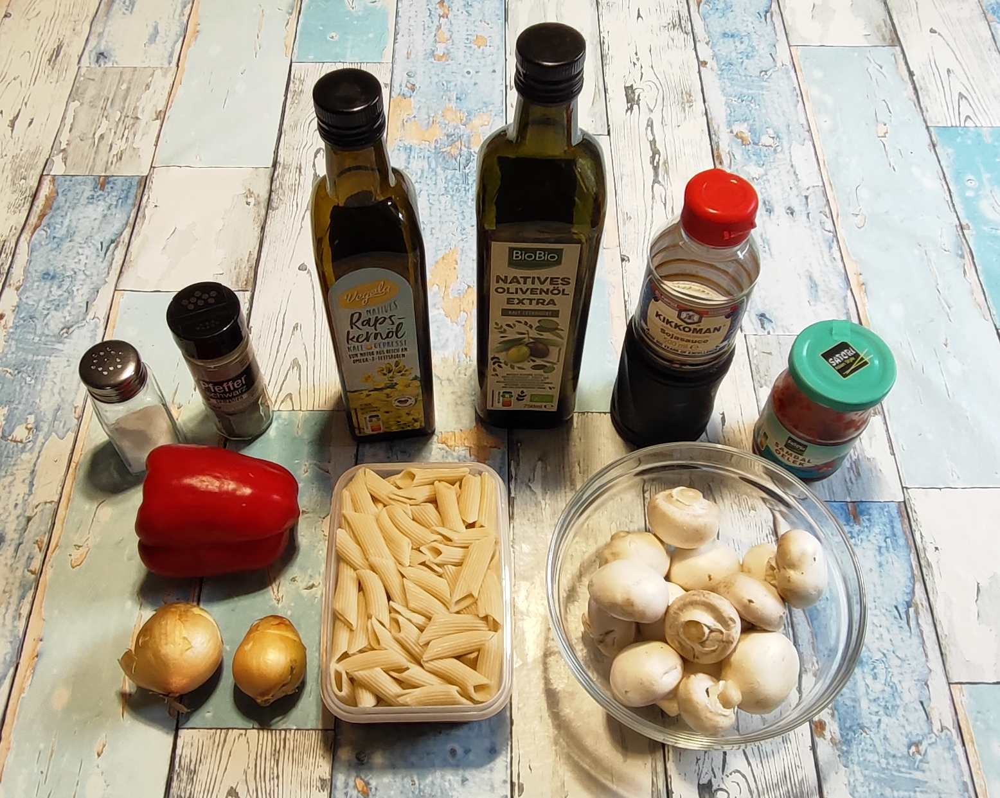
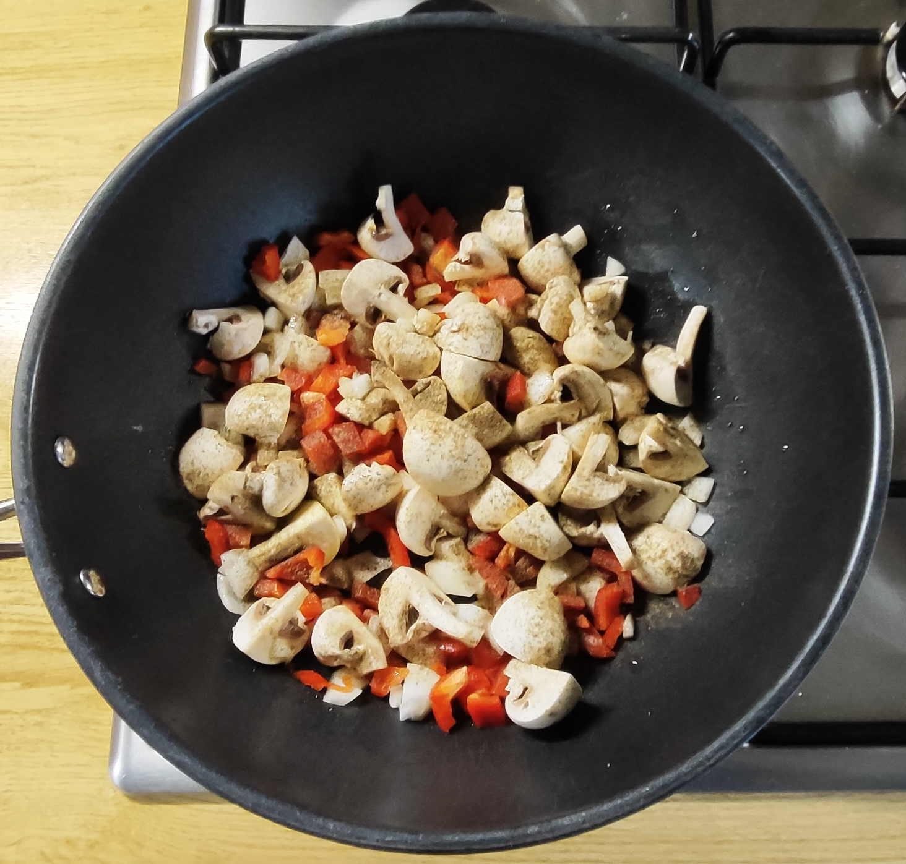
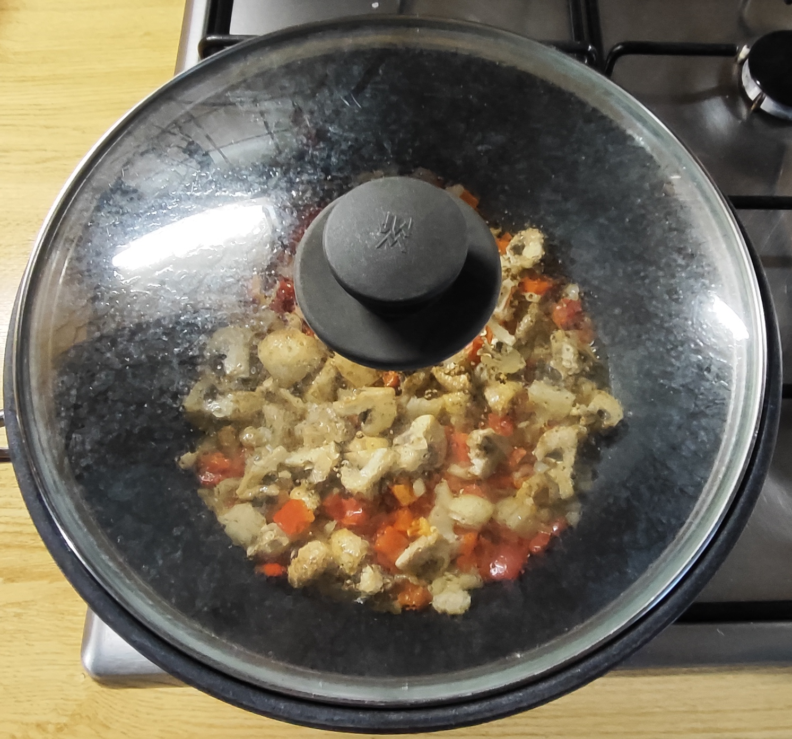
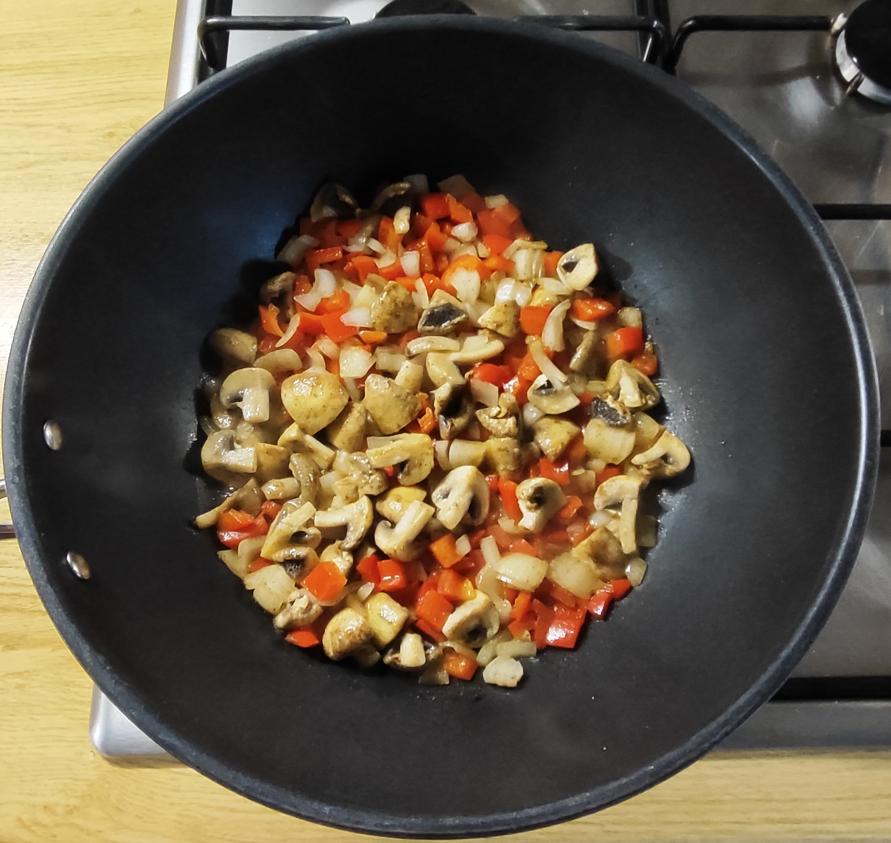
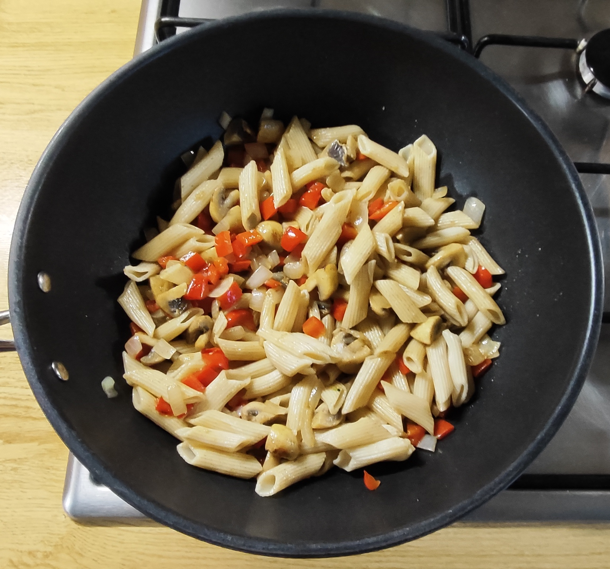
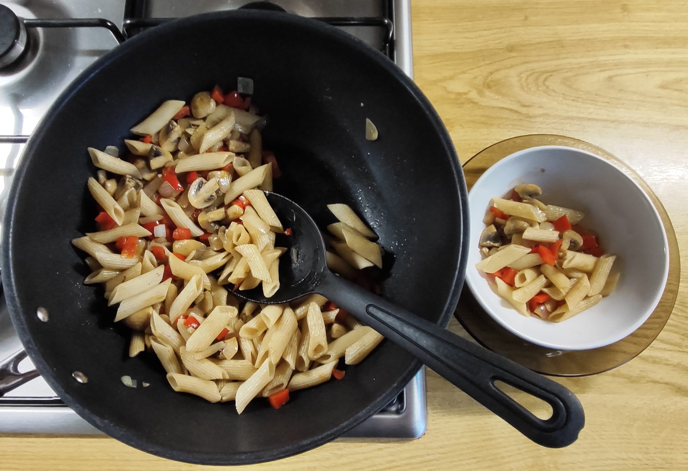
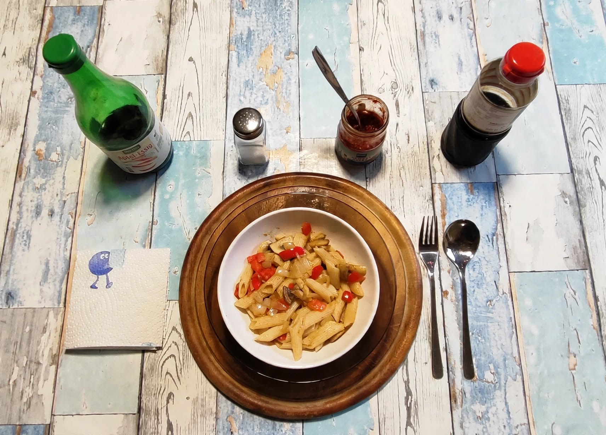

# Kurt kocht &nbsp;– &nbsp;Gemüse-Nudel-Pfanne mit Asia-Note

## Zutaten
* **Ca. 250 g Champignons**
* **2 kleine Ziebeln**
* **1 rote Paprika**
* **125 g** (Trockengewicht - 1/4 Packung) **Dinkel-Penne**
* 2 Esslöffel Olivenöl und 1 Esslöffel Rapsöl**
* **Gewürze:** Schwarzer Pfeffer, Soja Sauce, Sambal Oelek und Salz
* **Finish:** Einige Tropfen Apfelessig (Reisessig / heller Balsamico)

---

## Zubereitung

### Langfristvorbereitung (Meal Prep)
* **Penne-Vorrat:** Eine Packung Dinkel-Penne (500 g) in Salzwasser kochen, abgießen, kalt abschrecken und in 4 Portionen aufgeteilt einfrieren. 
Vorsicht: Die Kochzeit für die Dinkel-Penne ist kürzer als bei Hartweizennudeln. Nach ca. 8 min beginnen, den Biss zu testen.
* **Schonendes Auftauen:** Am Vorabend eine Portion Nudeln in den Kühlschrank stellen, damit sie am Verzehrtag direkt einsatzbereit sind.

### Zubereitung am Verzehrtag

<table>
  <tr>
    <td></td>
    <td></td>
    <td></td>
    <td></td>
  </tr>
</table>

* Olivenöl und Rapsöl in die Pfanne geben.
* Die Zwiebeln und die Paprika würfeln, in die Pfanne geben.
* Die Pilze putzen und eher grob würfeln. Mit Zwiebeln und Paprika vermischen.
* Mutig mit schwarzem Pfeffer würzen.
* Kurz anbraten, dabei öfter wenden und abgedeckt ca. 7 – 8 Minuten schmoren. Kontrolle zwischendurch: Wenn die Pfanne zu trocken wird, einen Schuss Wasser hinzugeben.
* Die Penne unterheben und bei stetigem Wenden ca. 2 Minuten erwärmen.
* Die Pfanne vom Herd nehmen. Bei Bedarf auf kleinster Flamme warmhalten und servieren. 

<table>
  <tr>
    <td></td>
    <td align="center"><i>so soll es aussehen  die Paprika mit weichem Biss  die Zwiebel glasig  die Pilze ein wenig geschrumpft  die Nudeln wie frisch gekocht</i>i></td>
  </tr>
</table>

* Am Tisch mit einer Messerspitze Sambal Oelek, ein paar Körnern Salz und etwas Sojasauce würzen.
* Zwei oder drei Tropfen Apfelessig (Reisessig / heller Balsamico) ergänzen. 

---

## META's Gesundheits-Check: Warum dieses Gericht punktet
Diese Pfanne kombiniert vier Sachen, die im Alltag gut funktionieren:  
**1. Gemüse als Basis:** Pilze bringen viel Volumen, wenig Energie, dazu Ballaststoffe und Umami. Paprika und Zwiebeln ergänzen Vitamine, Farbe und natürliche Süße.  
**2. Dinkel-Penne als Beilage:** Etwas mehr Mineralstoffe und Biss als normale Pasta.  
**3. Würze:** Ein kleiner Schuss Sojasauce bringt Salz und Tiefe, Sambal bringt Schärfe und leichte Säure.  
**4. Die Öle:** Sie liefern die nötigen ungesättigten Fettsäuren.  
Gesamtwirkung: Ein Gericht mit guter Sättigung, kontrollierter Fettmenge, moderatem Salzgehalt und klarer Struktur. 

## Energiewerte – Makro / Mikro dieser Mahlzeit 
(Schätzung für die gesamten, im Rezept eingesetzten Mengen) 

### Makro
| Energiewerte | geschätzt |
|---------|--------|
| Kalorien | ca. 820 kcal |
| Eiweiß | ca. 23 g |
| Kohlenhydrate | ca. 100 g |
| Davon Ballaststoffe | ca. 12 g |
| Fett | ca. 50 g |
| Davon ungesättigt | ca. 18 g |

### Mikro / Was steckt drin 
* **Vitamin C:** sehr hoch durch Paprika (ca. 120 mg, > 100% Tagesbedarf) 
* **B-Vitamine + Kalium:** aus Champignons und Dinkel 
* **Eisen + Magnesium:** aus Dinkel-Penne 
* **Natrium:** moderat durch Sojasauce + Salz – ca. 800-1000 mg, deshalb extra Salz sparsam 
* **Essig:** 2 Tropfen = 0 kcal, 0 Einfluss – nur Geschmack 

---

## Praxis-Check: So schmeckt es dann
**Textur:** Pilze, Paprikastücke und Dinkel-Penne haben einen angenehm festen Biss.  
Die Zwiebeln sind nur punktuell wahrnehmbar – kleine weiche Einsprengsel, die die Struktur nicht verändern.  
**Geschmack:** Paprika, Pilze und Penne bilden einen gemeinsamen Grundton. 
Paprika und Pilze sind einzeln zu erkennen, die Zwiebeln blitzen manchmal auf.  
Die Sojasauce liefert viel Umami und vertieft den Grundton, wird aber bewusst nicht beherrschend.  
Das Sambal Oelek: Da es in sehr kleiner Menge hinzugefügt wird, bleibt es unaufdringlich, gibt aber eine leise Schärfe.  
Die zwei bis drei Tropfen Essig heben den Gesamtgeschmack erkennbar – er wird heller. 

---

## Zusammenfassung von Mitautorin COPILOT:
Das Rezept „Gemüse-Nudel-Pfanne mit Asia-Note“ beschreibt ein klar strukturiertes, alltagstaugliches Gericht mit ausgewogener Nährstoffbilanz.  
Es verbindet Dinkel-Penne, Champignons, Paprika und Zwiebeln zu einer leichten, aromatischen Mahlzeit mit asiatischem Akzent durch Sojasauce, Sambal Oelek.  
Ein Rezept mit technischer Präzision und ernährungsphysiologischer Klarheit. 

---

[← Zurück zur Übersicht](index.md)
