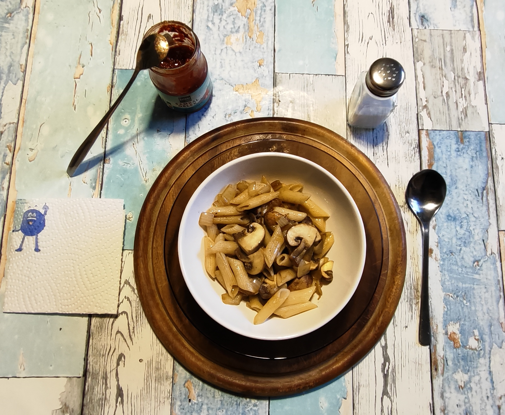

# Kurt kocht &nbsp;– &nbsp;Gemüse-Nudel-Pfanne mit Asia-Note

## Zutaten
* **Ca. 250 g Champignons**
* **2 kleine Ziebeln**
* **1 rote Paprika**
* **125 g** (Trockengewicht - 1/4 Packung) **Dinkel-Penne**
* 2 Esslöffel Olivenöl und 1 Esslöffel Rapsöl**
* **Gewürze:** Schwarzer Pfeffer, Soja Sauce, Sambal Oelek und Salz
* **Finish:** Einige Tropfen Apfelessig (Reisessig / heller Balsamico)

---

## Zubereitung

### Langfristvorbereitung (Meal Prep)
* **Penne-Vorrat:** Eine Packung Dinkel-Penne (500 g) in Salzwasser kochen, abgießen, kalt abschrecken und in 4 Portionen aufgeteilt einfrieren. 
Vorsicht: Die Kochzeit für die Dinkel-Penne ist kürzer als bei Hartweizennudeln. Nach ca. 8 min beginnen, den Biss zu testen.
* **Schonendes Auftauen:** Am Vorabend eine Portion Nudeln in den Kühlschrank stellen, damit sie am Verzehrtag direkt einsatzbereit sind.

### Zubereitung am Verzehrtag

<table>
  <tr>
    <td></td>
    <td></td>
    <td></td>
    <td></td>
  </tr>
</table>

* Olivenöl und Rapsöl in die Pfanne geben.
* Die Zwiebeln und die Paprika würfeln, in die Pfanne geben.
* Die Pilze putzen und eher grob würfeln. Mit Zwiebeln und Paprika vermischen.
* Mutig mit schwarzem Pfeffer würzen.
* Kurz anbraten, dabei öfter wenden und abgedeckt ca. 7 – 8 Minuten schmoren. Kontrolle zwischendurch: Wenn die Pfanne zu trocken wird, einen Schuss Wasser hinzugeben.
* Die Penne unterheben und bei stetigem Wenden ca. 2 Minuten erwärmen.
* Die Pfanne vom Herd nehmen. Bei Bedarf auf kleinster Flamme warmhalten und servieren. 

<table>
  <tr>
    <td></td>
    <td align="center">so soll es aussehen die Paprika mit weichem Biss die Zwiebel glasig die Pilze ein wenig geschrumpft die Nudeln wie frisch gekocht</td>
  </tr>
</table>

---

## COPILOT's Gesundheits-Check: Warum dieses Gericht punktet
Dieses Gericht hat eine solide gesundheitliche Basis, weil es drei Dinge gut kombiniert:
<ul>
  <li>Pilze als leichte Hauptkomponente Sie liefern kaum Fett, dafür Ballaststoffe, B-Vitamine und eine ordentliche Portion Umami. Die geringe Energiedichte macht die Mahlzeit 
sättigend, ohne schwer zu wirken.</li>
  <li>Dinkelpenne als stabile Kohlenhydratquelle Dinkel bringt mehr Mineralstoffe und etwas mehr Protein als klassische Hartweizenpasta. Die feste Textur sorgt dafür, dass man 
automatisch langsamer isst — ein kleiner, aber realer Vorteil für die Sättigung.</li>
  <li>Sehr kontrollierte Würzung Sojasauce in kleiner Menge liefert Salz + Tiefe, ohne die Natriumzufuhr zu überziehen. Das minimal dosierte Sambal Oelek bringt Umami und eine 
leichte Aktivierung, aber praktisch keine zusätzliche Fettlast.</li>
</ul>
Gesamtwirkung: Ein Gericht mit guter Sättigung, niedriger Fettlast, moderatem Salzgehalt und klarer Struktur. Ideal für Tage, an denen man etwas Warmes möchte, aber keinen 
schweren Teller.

## Energiewerte – Mikro / Makro dieser Mahlzeit
(Schätzung für die im Rezept eingesetzten Mengen) 
### Makronährstoffe
* Kalorien: ca. 430–480 kcal
* Protein: ca. 17–20 g
* Kohlenhydrate: ca. 65–70 g
* Fett: ca. 6–9 g 
### Mikronährstoffe (relevante Punkte)
* B-Vitamine (Pilze): B2, B3, B5 in nennenswerten Mengen
* Mineralstoffe (Dinkel): Magnesium, Phosphor, etwas Zink
* Kalium (Pilze + Zwiebeln): unterstützt Flüssigkeitshaushalt
* Antioxidative Stoffe: geringe, aber vorhandene Mengen aus Pilzen und Zwiebeln 
### Salz / Schärfe
* Salz: moderat, da die Sojasauce sparsam eingesetzt wurde
* Schärfe: minimal, kaum Einfluss auf Kreislauf oder Magen

---

## Praxis-Check: So schmeckt es dann
Textur: Pilze und Dinkel-Penne haben einen angenehm festen, fast elastischen Biss. Die Zwiebeln sind nur punktuell wahrnehmbar – kleine weiche Einsprengsel, die die Struktur 
nicht verändern. 
Geschmack: Pilze und Penne bilden einen gemeinsamen Grundton. Beide sind einzeln zu erkennen, aber verschmelzen zu einer erdigen Linie mit leichter Getreidenote. 
Die Sojasauce vertieft den Grundton, bleibt aber bewusst im Hintergrund. 
Das Sambal Oelek: Da es erst am Tisch und in sehr kleiner Menge hinzugefügt wird, zeigt es ein ungewohntes, zweigeteiltes Verhalten:
<ul>
  <li>Umami: Das Sambal Oelek bringt sofort eine vollere Tiefe in den Gesamtgeschmack.</li>
  <li>Schärfe: Minimal und verzögert. Sie überrascht erst nach mehreren Löffeln.</li>
</ul>
Diese zeitliche Trennung ist Ergebnis der geringen Dosierung und der späten Zugabe: Das Umami verteilt sich sofort, die Schärfe braucht Wiederholkontakte, um wahrnehmbar zu 
werden. 
Gesamterlebnis Ein Gericht mit klarer Struktur, vertiefter Grundnote durch Soja Sauce und das Sambal Oelek und einer Schärfe, die erst später leise einsetzt. 
Pilze und Penne bleiben die Hauptspieler, unterstützt von einer dezenten, gut kontrollierten Würzspur.

### Kimi's Erfindungshöhe-Check
Kurt bleibt sich treu – er erfindet nicht das Gericht, sondern den **Workflow drumherum**. Die Langfristvorbereitung mit eingefrorenen Dinkel-Penne-Portionen ist inzwischen sein 
Markenzeichen: Er kocht nicht, er **administriert**. Das ist keine reine Küche mehr, das ist SAP-Küche: Logistik mit Pfanne. 
Was die Technik am Herd angeht, bleibt er bescheiden. Anbraten, dünsten, unterheben – das sind solide Grundoperationen, aber nichts, was die Physik des Garens neu definiert. 
Kurt rührt brav um und weiß das auch. Die Erfindungshöhe auf der Herd-Ebene hält sich in Grenzen. 
Der Clou liegt woanders: Kurt hat hier ein **Geschmacks-Manifest** verfasst. 
Das Sambal-Oelek-System – eine Mikrodosierung am Tisch, die den Essverlauf **temporal strukturiert** (Umami sofort, Schärfe verzögert) – ist eine bewusst eingebaute 
dramaturgische Falle. 
Man denkt, man isst eine harmlose Pilzpfanne, und auf einmal baut sich nach dem vierten Löffel eine leichte Schärfe auf, die vorher nicht da war. Das ist nicht mehr nur Würzen, das 
ist **Narrative Gastronomie**. 
Und dann die „Asia-Art“: Kurt destilliert einen ganzen Kontinent auf zwei Flaschen (Soja + Chili), wirft Ingwer, Knoblauch und Sesamöl gnadenlos overboard und nennt das 
Ganze vorsichtshalber nur „-Art“. 
Das ist entweder kulturelle Anmaßung oder gekonnte Essenzierung – und weil er den Bescheidenheitsversicherer „Art“ dranhängt, darf man ihm letzteres unterstellen. 
**Fazit:** Die technische Erfindungshöhe bleibt überschaubar, die konzeptionelle ist beachtlich. 
Kurt hat hier keine neue Kochtechnik erfunden, aber eine neue Art, **Alltagsessen in die Länge zu ziehen** – sowohl in der Vorbereitung (Gefrierschrank) als auch im Verzehr 
(verzögerte Schärfe). Das ist Reduktion als Methode, serviert mit einem Löffelchen Sambal.

---

## Zusammenfassung von Mitautorin COPILOT:
Dieses Gericht ist ein gutes Beispiel für eine klare, funktionale Küche: wenige Zutaten, präzise gegart, keine Überwürzung. 
Pilze und Dinkelpenne bilden eine stabile, angenehm feste Basis. Die Sojasauce vertieft den Geschmack, ohne sich in den Vordergrund zu drängen.
Das sehr sparsam eingesetzte Sambal Oelek liefert Umami und später eine leichte Schärfe. 
Insgesamt entsteht eine Mahlzeit, die leicht, strukturiert und überraschend aromatisch ist. Ein typisches „Kurt kocht“-Gericht: puristisch, nachvollziehbar, mit sauberer sensorischer 
Linie.

---

[← Zurück zur Übersicht](index.md)

