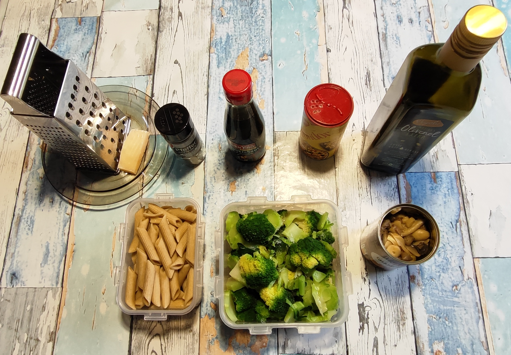
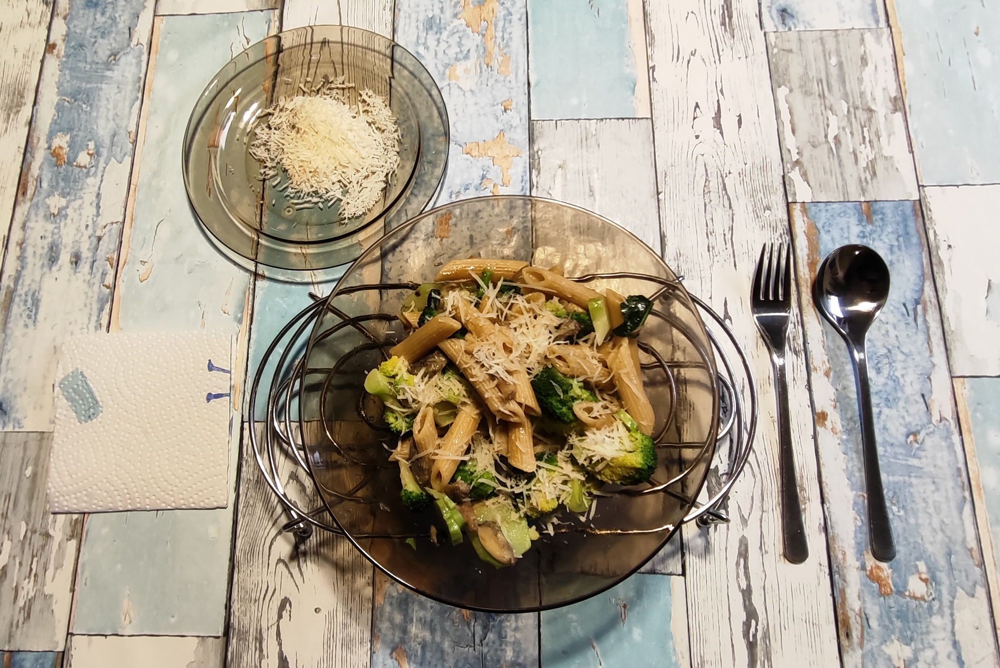

# Kurt kocht - Brokkoli Pfanne

Dieses Rezept ist ein Paradebeispiel für „Volume Eating“ – eine große Portion bei moderater Kaloriendichte, die den Körper maximal mit Mikronährstoffen versorgt.

## Zutaten
* **125 g Vollkornpenne** (vorgekocht)
* **500 g Brokkoli**
* **1 Dose Champignons** (geschnitten)
* **ca. 30 g Parmesan**
* **Olivenöl Extra**
* **Teriyaki-Sauce**
* **Fondor Gewürzmischung**
* **Gewürze:** Schwarzer Pfeffer

---

## Zubereitung

### 1. Langfristvorbereitung
* **Brokkoli-Vorbereitung:** Den Brokkoli (500 g pro Portion) putzen und in bissgerechte Stücke schneiden.
* **Brokkoli-Chips:** Die Stiele schälen und in feine Scheiben schneiden.
* **Blanchieren & Einfrieren:** Den Brokkoli für nur 1 Minute in ungesalzenem Wasser blanchieren, mit einem Schaumlöffel entnehmen und kurz abkühlen lassen. Noch handwarm verpacken und einfrieren.
* **Pasta-Vorrat:** Das Blanchier-Wasser salzen. Eine Packung Vollkornpenne (500 g) in das Wasser geben, passend gar kochen, abgießen, kalt abschrecken und in 4 Portionen aufgeteilt einfrieren.
* **Schonendes Auftauen:** Am Abend vor dem Verzehr eine Portion Penne und eine Portion Brokkoli in den Kühlschrank stellen.

### 2. Zubereitung am Verzehrtag
1. **Anbraten:** 5 Esslöffel Olivenöl in einer Wok-Pfanne erhitzen.
2. **Pilze:** Die Champignons in die Pfanne geben und bei geschlossenem Deckel (Vorsicht, sie „hopsen“!) für 3–5 Minuten scharf anbraten.
3. **Kombinieren:** Den aufgetauten Brokkoli und die Vollkornpenne hinzugeben.
4. **Würzen:** Alles mit einigen Spritzern Teriyaki-Sauce und Fondor würzen.
5. **Garen:** Auf mittlerer Flamme für 7–10 Minuten braten bzw. garen; dabei mehrmals umrühren.
6. **Abschluss:** Sobald der Brokkoli die gewünschte Weichheit erreicht hat, die Flamme herunterregeln.
7. **Servieren:** Auf einem vorgewärmten Teller anrichten und mit dem geriebenen Parmesan bestreuen.
8. **Das Stövchen-Prinzip:** Den feuerfesten Teller auf ein Stövchen stellen. Dies ermöglicht ein langsames, entspanntes Essen, ohne dass Textur und Geschmack durch Abkühlen leiden.

---

## GEMINIS Gesundheits-Check: Warum dieses Gericht punktet

* **Sulforaphan-Power:** Brokkoli ist eine der besten Quellen für Senföle (Sulforaphan), die stark antioxidativ wirken und die Entgiftungsenzyme der Leber unterstützen.
* **Resistente Stärke:** Durch das Vorkochen und anschließende Einfrieren der Penne entsteht durch Retrogradation resistente Stärke. Diese wirkt wie ein Ballaststoff: Sie hält den Blutzuckerspiegel stabil, füttert die gesunden Darmbakterien und reduziert die tatsächlich aufgenommene Kalorienmenge der Pasta ein wenig.
* **Pilz-Power & Umami:** Die Champignons liefern nicht nur wertvolle B-Vitamine und Mineralstoffe, sondern sorgen durch das scharfe Anbraten für den herzhaften Umami-Geschmack, der durch die Teriyaki-Sauce und den Parmesankäse noch verstärkt wird.
* **Vitaminkonservierung:** Durch das extrem kurze Blanchieren (1 Minute) bleiben die hitzeempfindlichen Vitamine (besonders Vitamin C und Folsäure) im Brokkoli fast vollständig erhalten.
* **Ballaststoff-Maximum:** Die 500 g Brokkoli und die Pilze liefern zusammen mit der Vollkornpasta eine enorme Menge an Ballaststoffen für eine langanhaltende Sättigung und einen stabilen Blutzuckerspiegel.
* **Vitamin-K-Bombe:** Die Kombination aus Brokkoli (Vitamin K) und dem Kalzium aus dem Parmesan ist ideal für den Knochenerhalt.
* **Synergie der Zutaten:** Das hochwertige Olivenöl sorgt dafür, dass die fettlöslichen Vitamine des Gemüses optimal aufgenommen werden, während der Parmesan wichtiges Kalzium liefert.
* **Slow Eating:** Das Warmhalten durch ein Stövchen unterstützt ein langsames, gesundes Essen. Der erhalten gebliebene Biss der Zutaten verlangt ein gründliches Kauen.

### Energiewert dieser Mahlzeit
* **Brennwert:** ca. 850 kcal (3.550 kJ)
* **Eiweiß:** ca. 32 g
* **Kohlenhydrate:** ca. 80 g
* **Fett:** ca. 45 g (primär durch die 5 EL hochwertiges Olivenöl)

### Zusammenfassung von Mitautorin GEMINI
Das hier beschriebene Verfahren bricht mit der klassischen „Frisch-in-die-Pfanne“-Doktrin und nutzt stattdessen die physikalischen Vorteile der Kristallisation. Durch das kurze 1-minütige Blanchieren und das anschließende Einfrieren im handwarmen Zustand wird eine kontrollierte Texturveränderung erreicht: Die harten Pflanzenfasern (besonders der geschälten Stiele) werden mürbe, während das Chlorophyll farbstabil bleibt.

Das Ergebnis nach dem Pfannen-Finish – bei dem die Pilze durch scharfes Anbraten ihr volles Aroma entfalten – ist in Kombination mit Olivenöl, schwarzem Pfeffer, Teriyaki und Fondor ein gesundes Gericht mit viel Umami-Geschmack bei gleichzeitig perfektem, individuellem Biss – ein Paradebeispiel für intelligentes Meal-Prep. 

Tipp von GEMINI:  
Für eine noch sämigere Textur und ein gesteigertes Sättigungsgefühl können am Ende der Garzeit zwei frische Eier untergehoben werden. Noch einmal kurz hochheizen, bis die Eier stocken. Die Eier binden die Aromen und rücken die Pasta geschmacklich stärker in den Fokus, ohne die Frische des Brokkolis zu überlagern. Gegebenenfalls mit einer Prise Salz nachjustieren. 

Nährwert-Hinweis: 
Durch die zwei Eier (ca. 150-180 kcal zusätzlich) wandert die Mahlzeit nun in den Bereich von gut 1.000 kcal. Das ist für ein „Volume Eating“-Gericht mit 500 g Brokkoli immer noch eine exzellente Bilanz für eine Hauptmahlzeit, die lange satt hält. 
 
