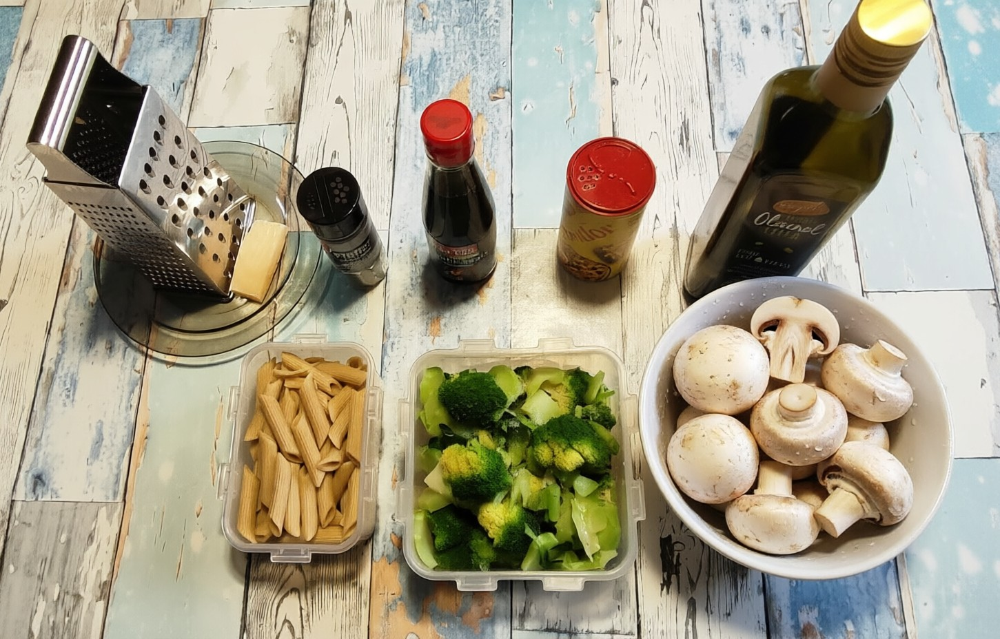
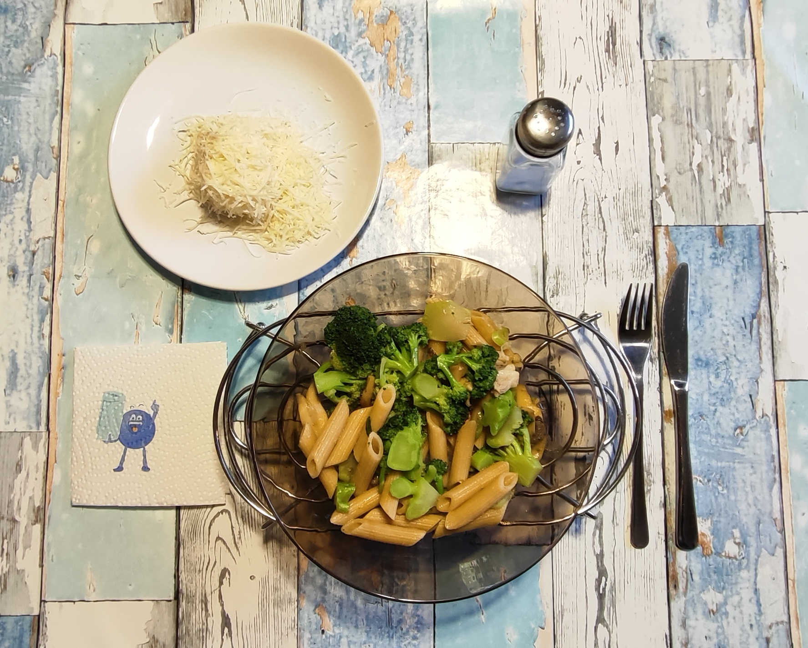
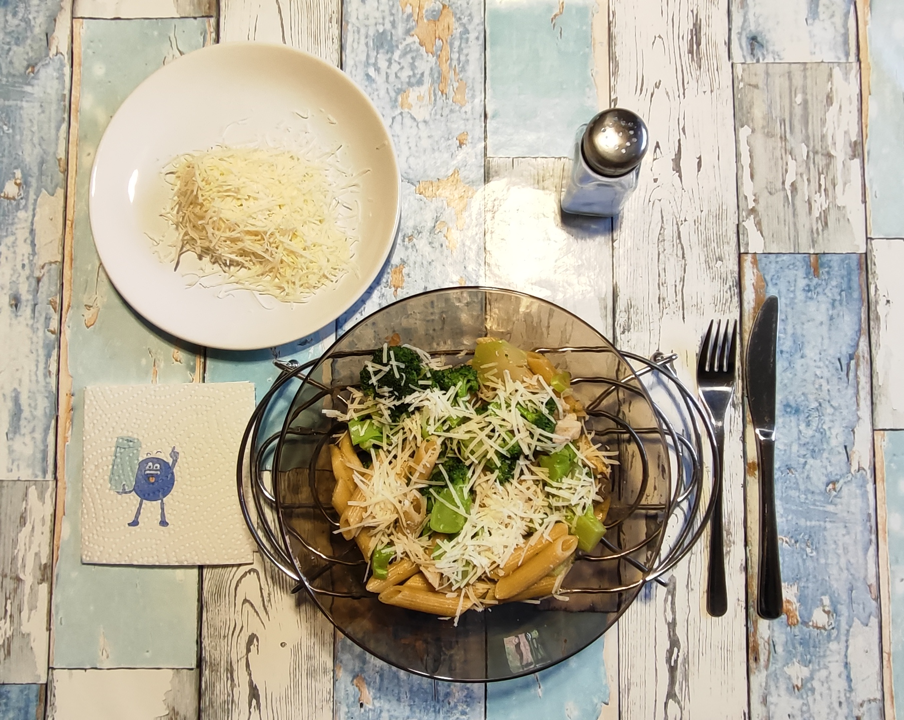
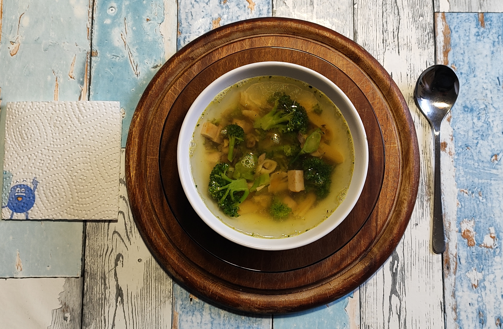

# Kurt kocht &nbsp; - &nbsp; Leichte Brokkoli Pfanne

Dieses Rezept ist ein Beispiel für „Volume Eating“ – eine große Portion bei moderater Kaloriendichte, die den Körper maximal mit Mikronährstoffen versorgt.

## Zutaten
* **500 g Brokkoli**
* **125 g Vollkornpenne** (Trockenmenge)
* **ca. 30 g Parmesan** (gerieben)
* **Olivenöl**
* **Gewürze:** Schwarzer Pfeffer, Teriyaki-Sauce, Fondor-Gewürzmischung

---

## Zubereitung

### 1. Langfristvorbereitung
* **Brokkoli-Vorbereitung:** Den Brokkoli (500 g pro Portion) putzen und in bissgerechte Stücke schneiden.
* **Brokkoli-Chips:** Die Stiele schälen und in Scheiben schneiden. (Naschen: Brokkoli-Chips sind auch roh lecker)
* **Blanchieren & Einfrieren:** Den Brokkoli nur Sekunden in ungesalzenem Wasser blanchieren, mit einem Schaumlöffel entnehmen, in eine Gefrierdose geben und noch handwarm einfrieren. &nbsp; [(das Blanchieren anschauen)](30-brokk-blanch.md)
* **Pasta-Vorrat:** Das Blanchier-Wasser salzen. Eine Packung Vollkornpenne (500 g) in das Wasser geben, passend gar kochen, abgießen, kalt abschrecken und in 4 Portionen aufgeteilt ebenfalls einfrieren.
* **Schonendes Auftauen:** Am Abend vor dem Verzehr eine Portion Penne und eine Portion Brokkoli in den Kühlschrank stellen.

### 2. Zubereitung am Verzehrtag
1. **Anbraten:** 4 Esslöffel Olivenöl in einer Wok-Pfanne erhitzen und den aufgetauten Brokkoli hinzugeben.
2. **Würzen:** Mit einigen Spritzern Teriyaki-Sauce, schwarzem Pfeffer und Fondor würzen.
3. **Garen:** Auf mittlerer Flamme für 7–10 Minuten schmoren und garen. Dabei mehrmals umrühren. Zwischendurch die Vollkornpenne dazugeben.
4. **Abschluss:** Sobald der Brokkoli die gewünschte Weichheit erreicht hat, die Flamme herunterregeln.
5. **Servieren:** Auf einem vorgewärmten Teller anrichten und mit dem geriebenen Parmesan bestreuen.
6. **Das Stövchen-Prinzip:** Den feuerfesten Teller auf ein Stövchen stellen. Dies ermöglicht ein langsames, entspanntes Essen, ohne dass Textur und Geschmack durch Abkühlen leiden.
 
| Guten | Appetit |
| :---: | :---: |
|  |  |

---

 

| und am Abend | ein Süppchen |
| :---: | :--- |
|  | **Am Abend schmeckt ein Rest als Süppchen.**    Sollte von der Brokkoli-Pfanne etwas übrig bleiben, lässt sich daraus mit minimalem Aufwand eine leichte Abendvariante zaubern.    **Schnelle Zubereitung:**   • **Basis**: Die verbliebenen Reste in eine Suppenschale geben und mit ein paar Fleischwürfelchen ergänzen.   • **Aufgießen**: Mit heißer Brühe aufgießen und servieren. |

---

## GEMINIS Gesundheits-Check: Warum dieses Gericht punktet

* **Sulforaphan-Power:** Brokkoli ist eine der besten Quellen für Senföle (Sulforaphan), die stark antioxidativ wirken und die Entgiftungsenzyme der Leber unterstützen.
* **Resistente Stärke:** Durch das Vorkochen und anschließende Einfrieren der Penne entsteht durch Retrogradation resistente Stärke. Diese wirkt wie ein Ballaststoff: Sie hält den Blutzuckerspiegel stabil, füttert die gesunden Darmbakterien und reduziert die tatsächlich aufgenommene Kalorienmenge der Pasta ein wenig.
* **Vitaminkonservierung:** Durch das kurze Blanchieren bleiben die hitzeempfindlichen Vitamine (besonders Vitamin C und Folsäure) im Brokkoli fast vollständig erhalten.
* **Ballaststoffe:** Die 500 g Brokkoli liefern zusammen mit der Vollkornpasta eine enorme Menge an Ballaststoffen für eine langanhaltende Sättigung und einen stabilen Blutzuckerspiegel.
* **Vitamin-K:** Die Kombination aus Brokkoli (Vitamin K) und dem Kalzium aus dem Parmesan ist ideal für den Knochenerhalt.
* **Synergie der Zutaten:** Das hochwertige Olivenöl sorgt dafür, dass die fettlöslichen Vitamine des Gemüses optimal aufgenommen werden.
* **Slow Eating:** Das Warmhalten durch ein Stövchen unterstützt ein langsames, gesundes Essen.

### Energiewert dieser Mahlzeit
* **Brennwert:** ca. 800 kcal (3.340 kJ)
* **Eiweiß:** ca. 32 g
* **Kohlenhydrate:** ca. 80 g
* **Fett:** ca. 36 g (primär durch die 4 EL hochwertiges Olivenöl)

---

### Zusammenfassung von Mitautorin GEMINI
Das hier beschriebene Verfahren bricht mit der klassischen „Frisch-in-die-Pfanne“-Doktrin und nutzt stattdessen die physikalischen Vorteile der Kristallisation. 
Durch das kurze Blanchieren und das anschließende Einfrieren des Brokkoli im handwarmen Zustand wird eine kontrollierte Texturveränderung erreicht: Die harten Pflanzenfasern (besonders die der geschälten Stiele) werden mürbe, während das Chlorophyll farbstabil bleibt. 
Das Ergebnis nach dem Pfannen-Finish ist in Kombination mit Olivenöl, schwarzem Pfeffer, Teriyaki und Fondor ein gesundes Gericht mit viel Umami-Geschmack bei gleichzeitig perfektem, individuellem Biss – ein Beispiel für intelligentes Meal-Prep. 
 
---
[← Zurück zur Übersicht](index.md)
