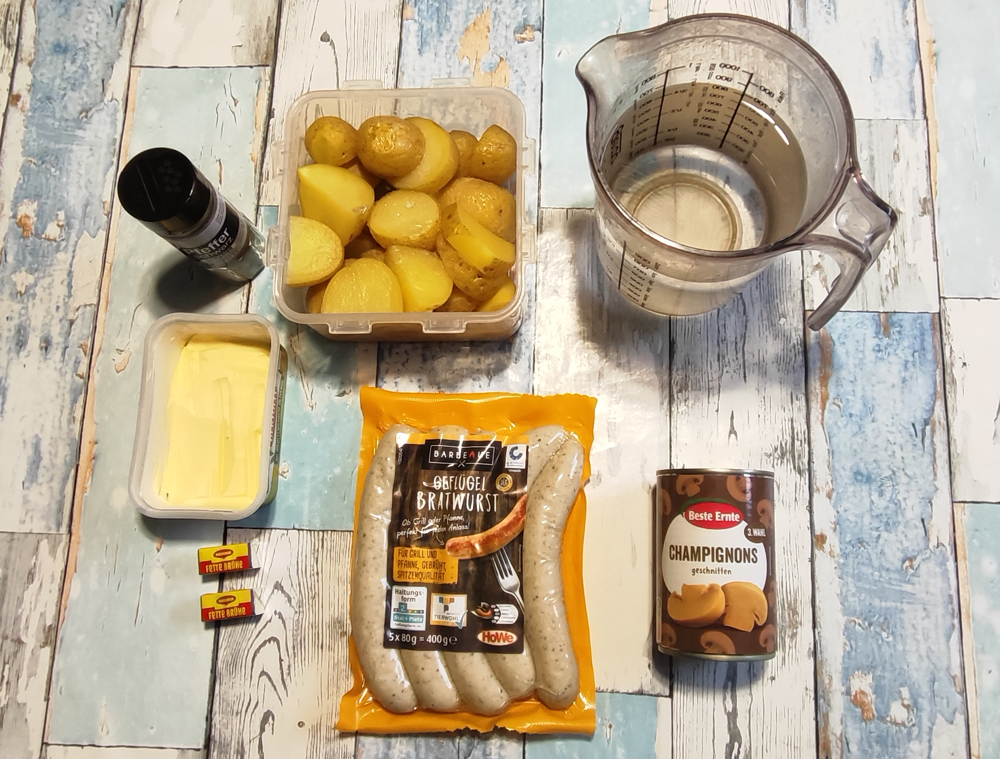
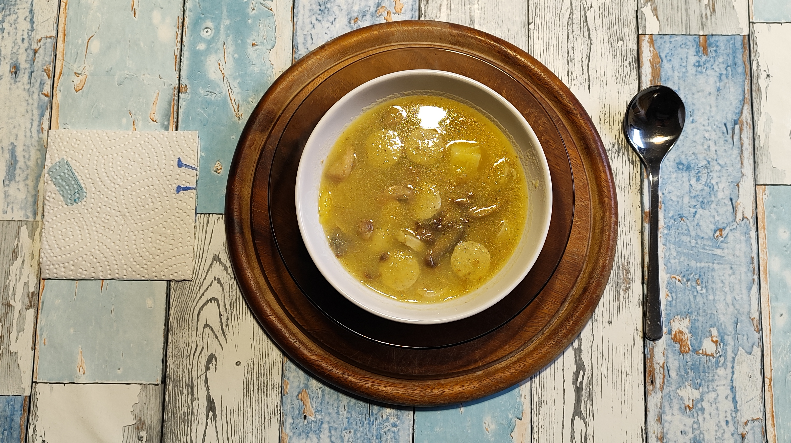

# Kurt kocht - Deftige Kartoffelsuppe

Diese Kartoffelsuppe steht für viel Geschmack, effizientes Zeitmanagement und nährstoffschonende Zubereitung.

## Zutaten
* **ca. 700 g Kartoffeln** (Frischgewicht, bereits vorgekocht & aufgetaut)
* **5 Grillwürste** (ca. 400 g Geflügel-Bratwurst) 
* **1 Dose Champignons** (geschnitten)
* **ca. 800 ml Wasser**
* **2 Brühwürfel** (Fette Brühe)
* **Margarine**
* **Gewürze:** Schwarzer Pfeffer

---

## Zubereitung

### 1. Langfristvorbereitung
* **Kartoffel-Vorrat:** Die Kartoffeln putzen, schälen und grob zerschneiden. In kaltem Wasser aufsetzen und für ca. 5 Minuten kochen.
* **Portionieren & Einfrieren:** Die Kartoffeln in Portionen aufteilen (z. B. einen 2 kg Beutel in 3 Portionen), handwarm abkühlen lassen und einfrieren.
* **Schonendes Auftauen:** Am Vorabend eine Portion der Kartoffeln zum Auftauen in den Kühlschrank stellen.

### 2. Zubereitung am Verzehrtag
1. **Erhitzen:** Die aufgetauten Kartoffeln in das Wasser geben und bis kurz vor dem Siedepunkt hochheizen.
2. **Pürieren:** Den Topf vom Herd nehmen und die Kartoffeln direkt im Wasser pürieren. Für eine rustikale Textur gerne einige Kartoffelstückchen ganz lassen.
3. **Verfeinern:** Zurück auf den Herd stellen. Bei kleiner bis mittlerer Flamme die Champignons und einen „guten Stich“ Margarine hinzufügen.
4. **Würzen:** Kräftig mit schwarzem Pfeffer abschmecken.
5. **Wurst-Einlage:** Sobald die Margarine geschmolzen ist, die klein geschnittenen Geflügelwürstchen hinzufügen und unterrühren. Da diese handelsüblich vorgebrüht sind, müssen sie nur noch durchwärmen.
6. **Servieren:** Die Suppe noch einen Moment auf dem Feuer lassen, bis alles gut heiß ist, und dann sofort servieren.

---

## GEMINIS Gesundheits-Check: Warum dieses Gericht punktet

* **Resistente Stärke & Darmflora:** Durch das Vorkochen und Abkühlen der Kartoffeln in der Langfristvorbereitung entsteht „resistente Stärke“. Diese wirkt wie ein Ballaststoff, sättigt länger und dient den guten Darmbakterien als Nahrung.
* **Fettbewusster Genuss:** Die Wahl von Geflügel-Bratwürsten (nur ca. 16 % Fett) reduziert die Kalorienlast deutlich gegenüber klassischen Schweinswürsten, ohne beim Geschmack Abstriche zu machen.
* **Kalium-Quelle:** Kartoffeln sind hervorragende Kaliumlieferanten (wichtig für Blutdruck und Muskelfunktion). Da im Kochwasser püriert wird, bleiben die gelösten Mineralstoffe vollständig in der Suppe erhalten.
* **Vitamin-E-Boost:** Die Margarine liefert nicht nur Aroma für die Champignons, sondern auch wertvolles Vitamin E.
* **Eiweiß-Power:** Mit 36 g Eiweiß pro Portion ist diese Suppe eine extrem kräftige und vollwertige Mahlzeit, die in Kombination mit der resistenten Stärke für eine sehr langanhaltende Sättigung sorgt.

### Energiewert dieser Mahlzeit
(Berechnet für 2 Portionen aus 700 g Kartoffeln und 400 g Wurst)

| Wert | Pro Portion | Gesamtmahlzeit |
| :--- | :--- | :--- |
| **Brennwert** | ca. 815 kcal | ca. 1.630 kcal |
| **Eiweiß** | ca. 36 g | ca. 72 g |
| **Kohlenhydrate** | ca. 58 g | ca. 116 g |
| **Fett** | ca. 46 g | ca. 92 g |

### Zusammenfassung von Mitautorin GEMINI
Dieses Gericht beweist, dass „schnell“ auch „hochwertig“ sein kann. Durch die physikalische Umwandlung der Stärke und das clevere Pürieren im Mineralstoffsud entsteht eine Mahlzeit, die den Blutzuckerspiegel kaum belastet und trotzdem die volle „Comfort Food“-Wirkung einer deftigen Suppe entfaltet. Ein effizientes Rezept für Kraft und Ausdauer.  Tipp: Reste schmecken am Abend auch küchen-kalt.

---
[← Zurück zur Übersicht](index.md)
