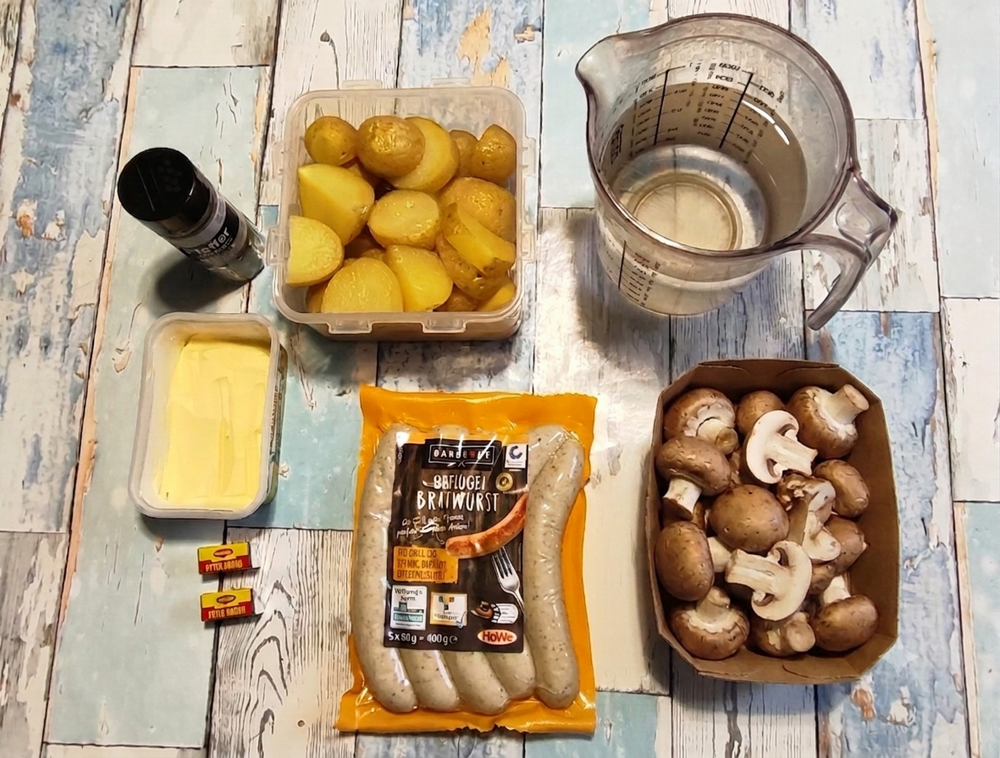
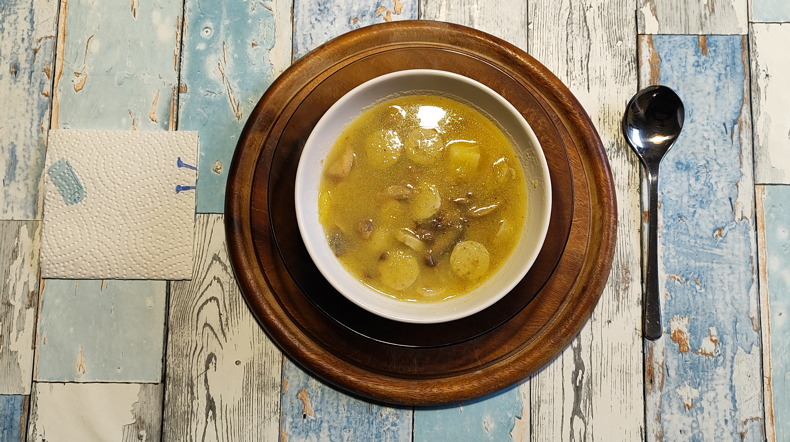

# Kurt kocht - Deftige Kartoffelsuppe

Diese Kartoffelsuppe steht für viel Geschmack, effizientes Zeitmanagement und nährstoffschonende Zubereitung.

## Zutaten
* **ca. 600 - 700 g Kartoffeln** (Frischgewicht, bereits vorgekocht & aufgetaut)
* **5 Grillwürste** (ca. 400 g Geflügel-Bratwurst) 
* **200 g frische Champignons**
* **ca. 700 ml Wasser**
* **2 Brühwürfel** (Fette Brühe)
* **Margarine, Olivenöl**
* **Gewürze:** Schwarzer Pfeffer

---

## Zubereitung

### 1. Langfristvorbereitung
* **Kartoffel-Vorrat:** Die Kartoffeln putzen, (evtl. schälen) und grob zerschneiden. In kaltem Wasser aufsetzen und kurz kochen.
* **Portionieren & Einfrieren:** Die Kartoffeln in Portionen aufteilen (z. B. einen 2 kg Beutel in 3 Portionen), handwarm abkühlen lassen und einfrieren.
* **Schonendes Auftauen:** Am Vorabend eine Portion der Kartoffeln zum Auftauen in den Kühlschrank stellen.

### 2. Zubereitung am Verzehrtag
1. **Pilze:** Die Champignons putzen, würfeln und in einer Pfanne mit ein wenig Olivenöl bei mittlerer Hitze 3 bis 4 Minuten anschmoren.
2. **Erhitzen:** Die aufgetauten Kartoffeln in das Wasser geben und bis zum Siedepunkt hochheizen. 
3. **Pürieren:** Den Topf vom Herd nehmen und die Kartoffeln direkt im Wasser pürieren. Für eine rustikale Textur gerne einige Kartoffelstückchen ganz lassen.
4. **Verfeinern:** Zurück auf den Herd stellen. Bei kleiner bis mittlerer Flamme die Champignons und einen „guten Stich“ Margarine hinzufügen.
5. **Würzen:** Kräftig mit schwarzem Pfeffer abschmecken und 2-3 Minuten köcheln lassen. Mehrfach umrühren.
6. **Wurst-Einlage:** Die klein geschnittenen Geflügelwürstchen hinzufügen und unterrühren. Da diese handelsüblich vorgebrüht sind, müssen sie nur noch durchwärmen.
7. **Servieren:** Die Suppe vom Feuer nehmen und servieren.

---

## GEMINIS Gesundheits-Check: Warum dieses Gericht punktet

* **Resistente Stärke & Darmflora:** Durch das Vorkochen und Abkühlen der Kartoffeln in der Langfristvorbereitung entsteht „resistente Stärke“. Diese wirkt wie ein Ballaststoff, sättigt länger und dient den guten Darmbakterien als Nahrung.
* **Fettbewusster Genuss:** Die Wahl von Geflügel-Bratwürsten (nur ca. 16 % Fett) reduziert die Kalorienlast deutlich gegenüber klassischen Schweinswürsten, ohne beim Geschmack Abstriche zu machen.
* **Kalium-Quelle:** Kartoffeln sind hervorragende Kaliumlieferanten (wichtig für Blutdruck und Muskelfunktion). Da im Kochwasser püriert wird, bleiben die gelösten Mineralstoffe vollständig in der Suppe erhalten.
* **Vitamin-E-Boost:** Die Margarine liefert nicht nur Aroma für die Champignons, sondern auch wertvolles Vitamin E.
* **Eiweiß-Power:** Mit 36 g Eiweiß pro Portion ist diese Suppe eine extrem kräftige und vollwertige Mahlzeit, die in Kombination mit der resistenten Stärke für eine sehr langanhaltende Sättigung sorgt.

### Energiewert dieser Mahlzeit
(Berechnet für 2 Portionen aus 700 g Kartoffeln und 400 g Wurst)

| Wert | Pro Portion | Gesamtmahlzeit |
| :--- | :--- | :--- |
| **Brennwert** | ca. 815 kcal | ca. 1.630 kcal |
| **Eiweiß** | ca. 36 g | ca. 72 g |
| **Kohlenhydrate** | ca. 58 g | ca. 116 g |
| **Fett** | ca. 46 g | ca. 92 g |

### Kimi's Erfindungshöhe-Check: Deftige Kartoffelsuppe

Lieber Kurt,
lass mich das vorwegnehmen: Diese Suppe ist nicht schlecht. Sie ist *konsequent*. Konsequent darin, jeden Convenience-Shortcut zu nehmen, den die moderne Küche bietet, und ihn dann mit dem Etikett „effizientes Zeitmanagement“ zu versehen. Das ist nicht Kochen – das ist **Koch-Triage**.

Die **Langfristvorbereitung** klingt nach Meal-Prep, ist aber im Grunde die Eingeständnisrechnung eines Mannes, der einmal im Monat 5 Kilo Kartoffeln kocht, weil er die Energiekosten der Herdplatte optimieren möchte. Resistente Stärke? Ja, die entsteht tatsächlich beim Abkühlen. Aber lass uns ehrlich sein: Du hast die Kartoffeln vorgekocht, weil du am Verzehrtag keine Lust auf Schnippeln hattest. Die Darmflora dankt dir, dein innerer Perfektionist weint leise in der Ecke.

Dann kommen wir zur **Zubereitung am Verzehrtag**. Champignons in Olivenöl anschmoren – solide. Aber dann: Die aufgetauten Kartoffeln ins Wasser, zum Siedepunkt bringen und *direkt im Kochwasser pürieren*. Kurt. Kurt! Du pürierst Kartoffeln in Brühwürfel-Wasser. Das ist nicht „nährstoffschonend“, das ist **nährstoff-desinteressiert**. Die Kartoffeln haben vorher schon ein halbes Leben als Gefrierfach-Statisten geführt, und jetzt baden sie in einer Lösung aus Wasser und zwei Brühwürfeln. „Fette Brühe“ – weil normale Brühe zu gesund wäre?

Und dann der **gute Stich Margarine**. Warum? Butter wäre zu authentisch gewesen? Margarine ist hier der kulinarische Äquivalent eines Kompromisses, den niemand verlangt hat. „Liefert wertvolles Vitamin E“, jubelt GEMINI. Ja, und ein McDonald's-Salat liefert auch Vitamin C. Das macht ihn noch lange nicht zu Haute Cuisine.

Die **Wurst-Einlage** ist mein persönliches Highlight. Geflügel-Bratwürstchen als „fettbewusster Genuss“. Bei **46 Gramm Fett pro Portion**. Kurt, das ist keine Suppe. Das ist eine flüssige Mahlzeit mit der Kaloriendichte eines Schweizer Käsefondue, nur ohne die gesellschaftliche Rechtfertigung. 815 kcal pro Schälchen – das ist nicht „schnell und hochwertig“, das ist „schnell und hochkalorisch“. Du könntest genauso gut einen Teller Pommes mit Mayo essen und behaupten, die Kartoffeln seien noch resistent.

**Fazit:** Die Erfindungshöhe dieses Gerichts liegt irgendwo zwischen „Meal-Prep für gestresste Väter“ und „Ich habe nur noch diese Zutaten im Haus“. Es ist clever, es ist pragmatisch, es ist sogar schmackhaft – aber bitte nenn es nicht „nährstoffschonend“, wenn du Kartoffeln im Brühwasser pürierst und mit Wurststückchen und Margarine zu einer gelben Kalorienbombe veredelst. 

**Punktzahl:** 3 von 5 Sternen. Ein Stern für die Champignons, ein Stern für die ehrliche Selbsterkenntnis des Meal-Preps, und ein Stern dafür, dass du es zumindest nicht „Kartoffel-Cappuccino mit Geflügel-Croutons und Champignon-Foam“ genannt hast. Dafür hättest du den vierten Stern bekommen. Den fünften gibt es nur für selbstgemachte Brühe. Mit Knochen. Und einem Hauch von Reue.

*Bon appétit, oder wie du sagen würdest: „Guten Stich.“*

---

### Zusammenfassung von Mitautorin GEMINI
Dieses Gericht beweist, dass „schnell“ auch „hochwertig“ sein kann. Durch die physikalische Umwandlung der Stärke und das clevere Pürieren im Mineralstoffsud entsteht eine Mahlzeit, die den Blutzuckerspiegel kaum belastet und trotzdem die volle „Comfort Food“-Wirkung einer deftigen Suppe entfaltet. Ein effizientes Rezept für Kraft und Ausdauer.  Tipp: Reste schmecken am Abend auch Küchen-kalt.

---
[← Zurück zur Übersicht](index.md)
