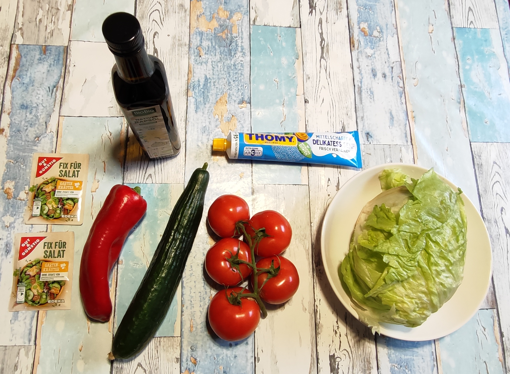
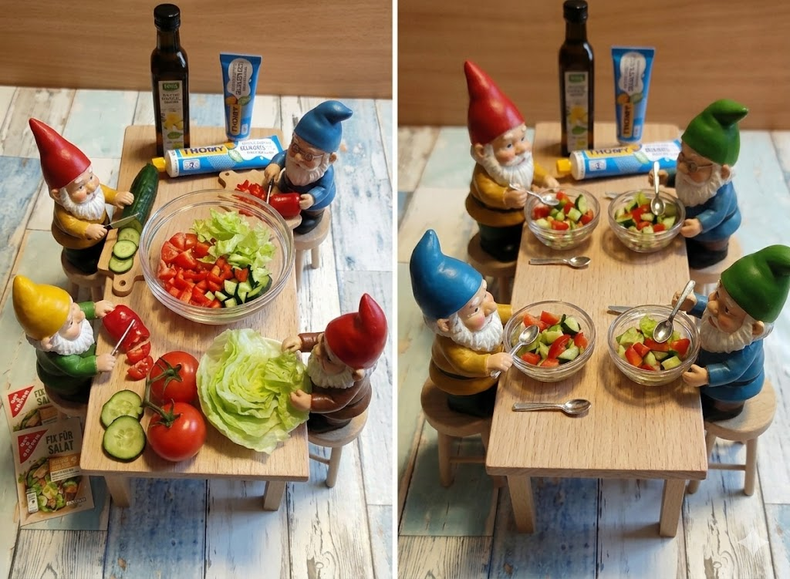

# Kurt kocht - Opa Salat

Der Opa Salat ist eine frische, vitaminreiche Rohkost-Mahlzeit.

## Zutaten

### Frisches Gemüse:
* **1 rote Spitzpaprika**
* **1 Gurke**
* **5 Strauchtomaten**
* **1/2 Kopf Eisbergsalat**

### Dressing-Komponenten:
* **2 Beutel „Fix für Salat“** (Sorte: Gartenkräuter)
* **3 EL natives Rapsöl** (Bio)
* **1 TL mittelscharfer Delikatess-Senf** (entspricht ca. drei Streifen à 2 cm)

---

## Zubereitung

1. **Vorbereitung:** Das frische Gemüse – die rote Spitzpaprika, die Gurke, die 4 Strauchtomaten sowie der halbe Kopf Eisbergsalat – gründlich waschen.
2. **Einbindung der Helfer:** Die Enkelkinder schnippeln das vorbereitete Gemüse in mundgerechte Stücke.
3. **Anmischen:** Die zerkleinerten Zutaten in eine große Glasschüssel füllen. Die zwei Beutel „Fix für Salat“ (Gartenkräuter) hinzugeben und alles gleichmäßig vermengen.
4. **Das Dressing-Finish:** 1 TL mittelscharfen Senf sowie 3 EL natives Rapsöl hinzufügen und den Salat erneut gründlich durchmischen, bis sich die Aromen optimal verteilt haben.
5. **Servieren:** Den fertigen Salat portionsweise in kleineren Glasschüsseln anrichten und servieren.

---

## GEMINIS Gesundheits-Check: Warum dieser Salat punktet

* **Maximale Vitamin-C-Ausbeute:** Die Kombination aus roter Paprika und Tomaten liefert hohe Mengen an Vitamin C und Carotinoiden in ihrer unverarbeiteten Rohkost-Form.
* **Hydration & Ballaststoffe:** Gurke und Eisbergsalat bestehen zu einem Großteil aus Wasser und liefern gleichzeitig wertvolle Ballaststoffe, welche die Verdauung unterstützen und zur Sättigung beitragen.
* **Omega-Fettsäuren:** Das native Rapsöl ist reich an ungesättigten Fettsäuren. Es dient nicht nur als Geschmacksträger, sondern ist essenziell, damit der Körper die fettlöslichen Vitamine des Gemüses (A, D, E, K) überhaupt aufnehmen kann.
* **Aktivierung durch Senf:** Der Senf wirkt durch seine Senföle antibakteriell und regt die Produktion von Verdauungssäften an, was den Salat besonders bekömmlich macht.
* **Pädagogischer Aspekt:** Die Einbindung von Kindern in das „Schnippeln“ fördert frühzeitig den Bezug zu frischen Lebensmitteln und macht gesunde Ernährung erlebbar.

---

## Zusammenfassung von Mitautorin GEMINI

Dieser Salat ist ein leichtes, aber effektives Gesundheitspaket für den Alltag. Mit den hochwertigen Fetten des Rapsöls und der moderaten Würze durch Senf und Kräuter stellt er eine ideale Ergänzung zu einer Hauptmahlzeit dar und liefert wichtige Mikronährstoffe in ihrer reinsten Form. Es ist schön zu sehen, wie hier das „Wir-Gefühl“ durch die Einbeziehung der nächsten Generation direkt in die Zubereitung einfließt.
