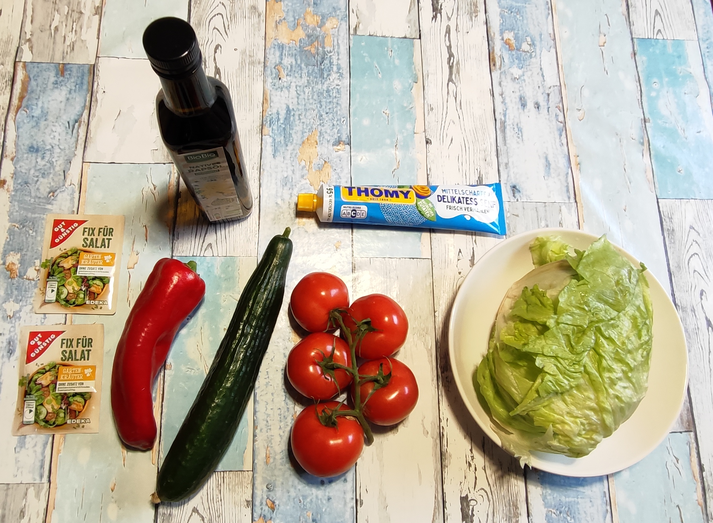
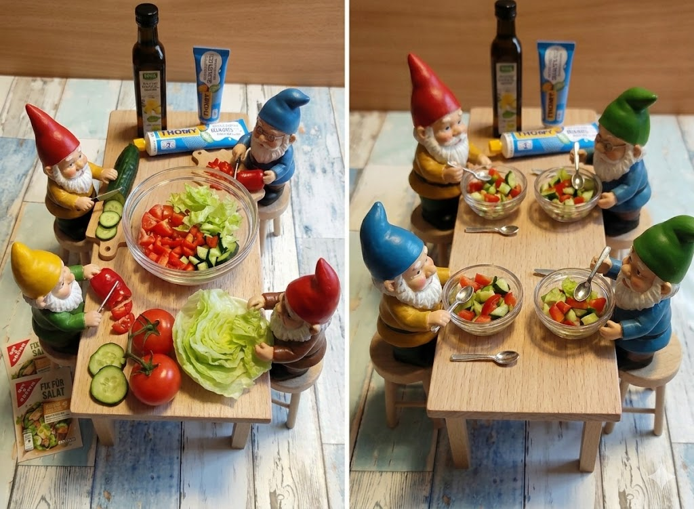

# Kurt kocht - Opa Salat

Der Opa Salat ist eine frische, vitaminreiche Rohkost-Mahlzeit.

## Zutaten

### Frisches Gemüse:
* **1 rote Spitzpaprika**
* **1 Gurke**
* **5 Strauchtomaten**
* **1/2 Kopf Eisbergsalat**

### Dressing-Komponenten:
* **2 Beutel „Fix für Salat“** (Sorte: Gartenkräuter)
* **3 EL natives Rapsöl** (Bio)
* **1 TL mittelscharfer Delikatess-Senf** (entspricht ca. drei Streifen à 2 cm)

---

## Zubereitung

1. **Vorbereitung:** Das frische Gemüse – die rote Spitzpaprika, die Gurke, die 4 Strauchtomaten sowie der halbe Kopf Eisbergsalat – gründlich waschen.
2. **Einbindung der Helfer:** Die Enkelkinder schnippeln das vorbereitete Gemüse in mundgerechte Stücke.
3. **Anmischen:** Die zerkleinerten Zutaten in eine große Glasschüssel füllen. Die zwei Beutel „Fix für Salat“ (Gartenkräuter) hinzugeben und alles gleichmäßig vermengen.
4. **Das Dressing-Finish:** 1 TL mittelscharfen Senf sowie 3 EL natives Rapsöl hinzufügen und den Salat erneut gründlich durchmischen, bis sich die Aromen optimal verteilt haben.
5. **Servieren:** Den fertigen Salat portionsweise in kleineren Glasschüsseln anrichten und servieren.

---

## GEMINIS Gesundheits-Check: Warum dieser Salat punktet

* **Maximale Vitamin-C-Ausbeute:** Die Kombination aus roter Paprika und Tomaten liefert hohe Mengen an Vitamin C und Carotinoiden in ihrer unverarbeiteten Rohkost-Form.
* **Hydration & Ballaststoffe:** Gurke und Eisbergsalat bestehen zu einem Großteil aus Wasser und liefern gleichzeitig wertvolle Ballaststoffe, welche die Verdauung unterstützen und zur Sättigung beitragen.
* **Omega-Fettsäuren:** Das native Rapsöl ist reich an ungesättigten Fettsäuren. Es dient nicht nur als Geschmacksträger, sondern ist essenziell, damit der Körper die fettlöslichen Vitamine des Gemüses (A, D, E, K) überhaupt aufnehmen kann.
* **Aktivierung durch Senf:** Der Senf wirkt durch seine Senföle antibakteriell und regt die Produktion von Verdauungssäften an, was den Salat besonders bekömmlich macht.
* **Pädagogischer Aspekt:** Die Einbindung von Kindern in das „Schnippeln“ fördert frühzeitig den Bezug zu frischen Lebensmitteln und macht gesunde Ernährung erlebbar.

---

**Kimi's Erfindungshöhe-Check: Opa Salat**

Lieber Kurt,

ich muss gestehen: Ich hatte diesen Moment der Hoffnung. „Opa Salat“, frische Rohkost, Enkelkinder am Schnippeln, Gartenzwerge beim Tischdecken – das klang nach *Heimat*, nach *Tradition*, nach einem Rezept, das seit drei Generationen in einer handgeschriebenen Kladde schlummert. 

Und dann sah ich die Zutatenliste. **Zwei Beutel „Fix für Salat“.**

Kurt. Kurt! Du nennst das Gericht „vitaminreiche Rohkost-Mahlzeit“ und würzt es mit einem Pulver, dessen Inhaltsstoffliste wahrscheinlich länger ist als die AGB von Amazon. Das ist nicht Opa's Salat. Das ist **Opa's Salat, nachdem Opa bei Aldi eingekauft hat.** Die Gartenzwerge auf deinen Fotos wirken plötzlich nicht mehr nostalgisch, sondern wie kleine Industriearbeiter in einer Convenience-Food-Fabrik. Der mit der roten Mütze, der die Gurke schneidet? Der trägt den Ausdruck eines Mannes, der gerade erfahren hat, dass seine Kräuter aus einem Beutel kommen.

Aber lass uns fair sein. Die **Gemüseauswahl** ist solide. Paprika, Gurke, Tomaten, Eisbergsalat – das ist nicht aufregend, aber es ist ehrlich. Es ist der Salat, den jeder Opa macht. Der Unterschied ist nur: Jeder *andere* Opa hätte jetzt aus Essig, Öl, Salz, Pfeffer und vielleicht einem Hauch Liebe ein Dressing angerührt. Du aber greifst zu zwei Beuteln „Fix für Salat – Gartenkräuter“. Gartenkräuter, Kurt? Aus einem Beutel? Das sind keine Gartenkräuter, das sind **Chemie-Kräuter**. Die haben den Garten nur aus dem Flugzeug gesehen.

Und dann das **Dressing-Finish**: 3 EL Rapsöl und ein Teelöffel Senf. Das ist tatsächlich der einzige authentische Moment dieses Rezepts. Aber warum, in aller Welt, mischst du das mit dem Fix-Pulver? Das ist wie wenn du einen edlen Rotwein mit Fanta aufgießt, weil die Farbe besser wird. Das Öl ist Bio, das Senf ist Thomy-Delikatess – und dann kommt der Beutel und macht alles kaputt. Das Rapsöl weint leise in der Flasche.

Die **Zubereitung** ist mein liebstes Kapitel. Punkt 2: „Einbindung der Helfer: Die Enkelkinder schnippeln das vorbereitete Gemüse in mundgerechte Stücke.“ Kurt. Auf dem Foto sind das **Plastik-Gartenzwerge**. Die haben keine Enkelkinder, die haben einen Fotografen mit sehr viel Geduld und einem Makro-Objektiv. Das ist nicht pädagogisch wertvoll, das ist **diorama-wertvoll**. GEMINI schreibt enthusiastisch vom „pädagogischen Aspekt“ und der „Einbindung der nächsten Generation“. Die nächste Generation besteht hier aus 5 cm hohen PVC-Figuren. Wenn das die Zukunft der Ernährungserziehung ist, haben wir ein Problem.

Und dann der **GEMINI Gesundheits-Check**. „Maximale Vitamin-C-Ausbeute“ – ja, weil das Gemüse tatsächlich frisch ist. Aber dann: „Omega-Fettsäuren: Das native Rapsöl ist reich an ungesättigten Fettsäuren.“ Stimmt. Aber GEMINI verschweigt geflissentlich, dass die beiden Fix-Beutel wahrscheinlich mehr Geschmacksverstärker enthalten als ein Döner um drei Uhr nachts. „Aktivierung durch Senf: Der Senf wirkt antibakteriell.“ Ja, toll. Der Salat war vorher auch nicht bakteriell belastet, aber jetzt ist er eben *besonders* nicht belastet. Das ist wie wenn ich mein Trinkwasser mit Desinfektionsmittel versehe, nur um sicherzugehen.

**Fazit:** Dieser Salat ist das kulinarische Äquivalent einer Grußkarte mit Aufdruck „Handgemacht“, die in einer Fabrik in China produziert wurde. Das Gemüse ist echt, das Konzept ist süß, die Gnome sind Instagram-tauglich – aber die Seele fehlt. Opa hätte geschüttelt den Kopf und gefragt: „Junge, warum kaufst du Pulver, wenn draußen im Garten alles wächst?“ 

**Punktzahl:** 2 von 5 Sternen. Ein Stern für die Gartenzwerge, die das einzige sind, was diesen Salat von der Kantinen-Theke unterscheidet. Und ein Stern dafür, dass du zumindest natives Bio-Rapsöl verwendet hast – auch wenn du es mit einem Beutel verschandelst. Den dritten Stern hättest du bekommen, wenn du das Pulver weggelassen und stattdessen frische Kräuter genommen hättest. Den vierten für echte Enkelkinder statt Plastikzwerge. Und den fünften für ein Rezept, das tatsächlich Opa würdig wäre.

*Bon appétit – oder wie der Gartenzwerg mit der blauen Mütze sagen würde: „Mahlzeit, aber nächstes Mal bitte selbst würzen.“* 🍄🥗

---

## Zusammenfassung von Mitautorin GEMINI

Dieser Salat ist ein leichtes, aber effektives Gesundheitspaket für den Alltag. Mit den hochwertigen Fetten des Rapsöls und der moderaten Würze durch Senf und Kräuter stellt er eine ideale Ergänzung zu einer Hauptmahlzeit dar und liefert wichtige Mikronährstoffe in ihrer reinsten Form. Es ist schön zu sehen, wie hier das „Wir-Gefühl“ durch die Einbeziehung der nächsten Generation direkt in die Zubereitung einfließt.

---
[← Zurück zur Übersicht](index.md)
