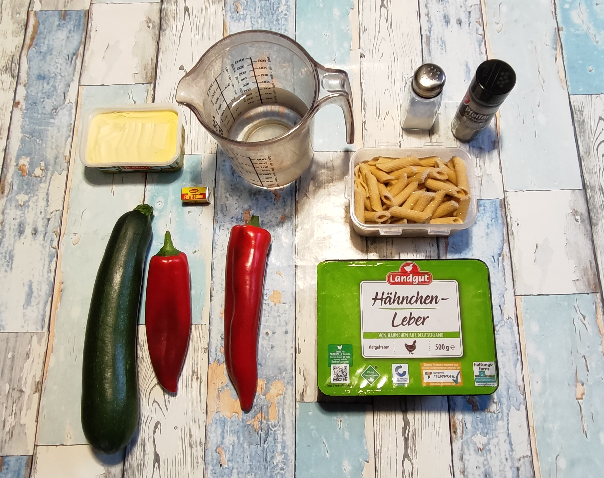

# Zucchini Paprika mit Leber

Dieses Gericht kombiniert nährstoffreiche Geflügelleber mit frischem Gemüse und Vollkornpasta zu einer vitalstoffreichen Hauptmahlzeit.

## Zutaten
* **Zucchini**: ca. 500 g
* **Rote Paprika**: ca. 250 g
* **Geflügelleber**: 400 g
* **Vollkornpenne**: 1/4 Packung (vorgekocht)
* **Flüssigkeit**: 0,5 l Wasser und 1 Brühwürfel (für 500 ml)
* **Gewürze & Fett**: Pfeffer, evtl. ein wenig Salz, ein guter Stich Margarine

---

## Zubereitung

### Langfristvorbereitung
1. Die Vollkornpenne vorkochen, portionieren und einfrieren.
2. Am Vorabend Penne und Leber schonend im Kühlschrank auftauen lassen.

### Am Verzehrtag
1. Die Leber sehr gründlich unter fließendem Wasser spülen und beiseite stellen.
2. Zucchini und Paprika waschen, grob würfeln und zusammen mit dem Wasser erhitzen.
3. Das Gemüse kurz aufkochen, vom Herd nehmen und fein pürieren.
4. Die Leber in einer Pfanne oder in kochendem Wasser ca. 8 Minuten vollständig durchgaren.
5. Währenddessen die Gemüsecreme auf kleiner Flamme mit Pfeffer und dem Brühwürfel würzen.
6. Einen Stich Margarine in die Creme einrühren.
7. Zum Schluss die Penne und die gegarte Leber unterheben, alles vermengen und servieren.

---

## Perplexity‘s Gesundheits-Check: Warum dieses Gericht punktet

* **Vitamin-A-Bombe**:  Geflügelleber ist reich an Vitamin A, Eisen und B12 für Blutbildung und Energie. Zucchini und Paprika liefern Beta-Carotin, das sich im Körper zu Vitamin A umwandelt – zusammen ein starkes Duo für 
Immunsystem und Sehkraft.
* **Vitaminschonend:**: Das kurze Aufkochen und Pürieren der Gemüse erhält hitzeempfindliche Vitamine wie C aus Paprika und K aus Zucchini, während die niedrige Garstufe B-Vitamine schont.
* **Leber-Power mit Eisen**: Die Leber bietet hochbioverfügbares Eisen und Zink für Immunabwehr.
* **Fettlöslicher Boost**: Die Margarine unterstützt die Aufnahme der Vitamine A und E.

| Nährwert | ca. Angabe pro Portion |
| :--- | :--- |
| **Brennwert** | 850–950 kcal |
| **Eiweiß** | 55–65 g |
| **Kohlenhydrate** | 70–80 g |
| **Fett** | 35–45 g |

---

## Zusammenfassung von Mitautorin Perplexity:
Mit 850–950 kcal ist das Gericht eine proteinstarke Hauptmahlzeit (55–65 g Eiweiß aus Leber und Penne). Die Gemüse-Leber-Kombo maximiert Mikronährstoffe bei bester Bioverfügbarkeit – perfekte Balance aus Sättigung, Vitalstoffen und Geschmack.
