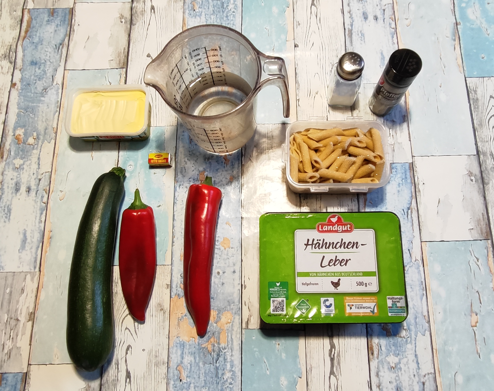
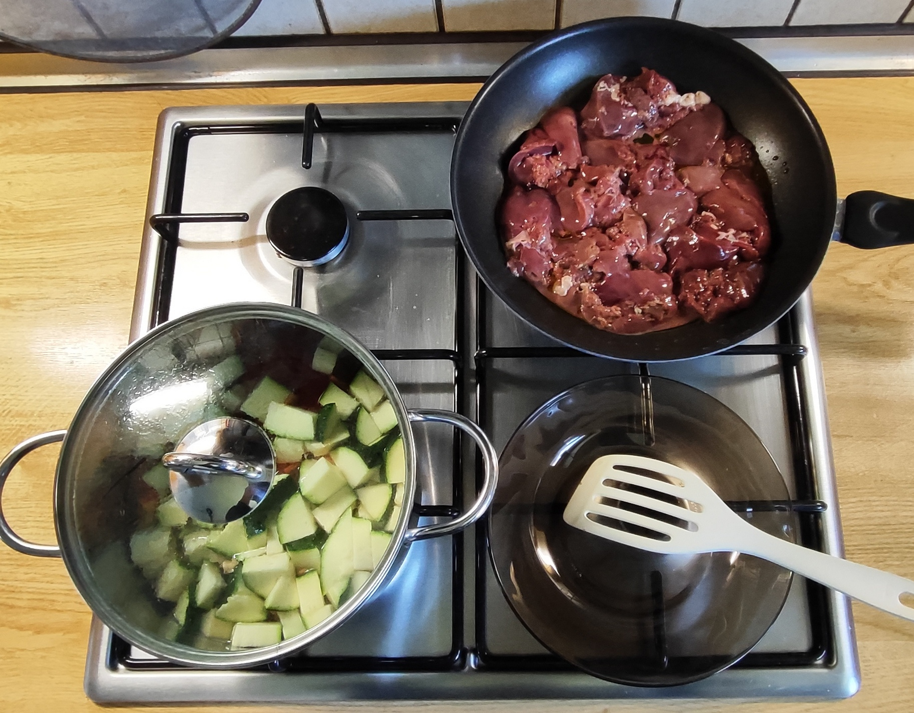
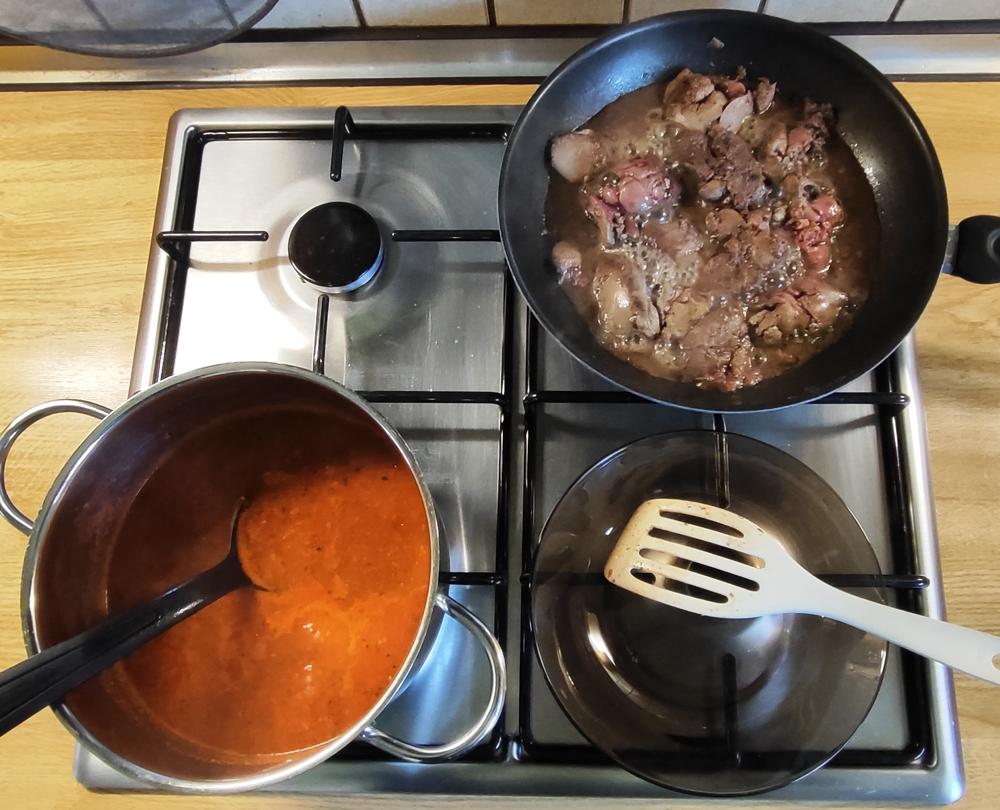
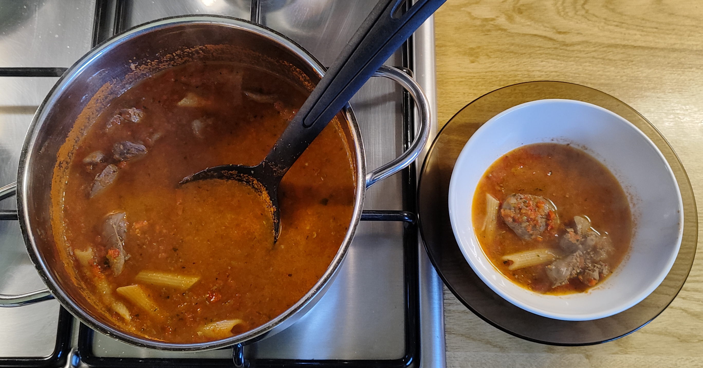
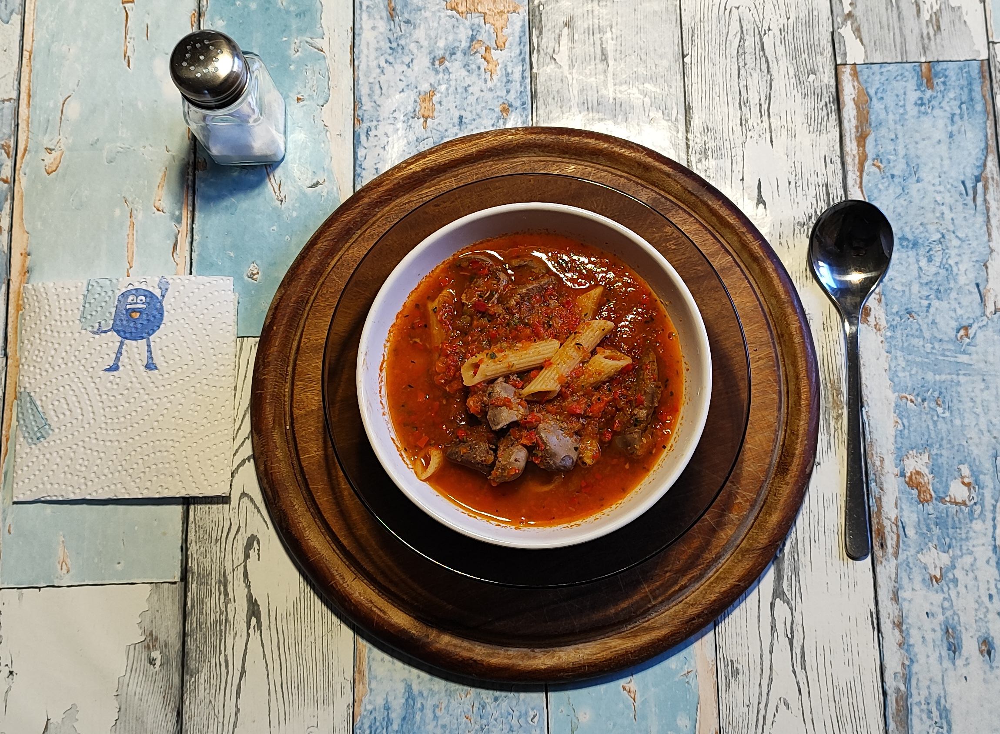

# Kurt kocht
## Zucchini-Paprika-Creme mit Leber

### Zutaten
* Zucchini ca. 400 g
* Rote Paprika ca. 300 g
* Geflügelleber 400 g
* 1/4 Packung Vollkornpenne (vorgekocht)
* 0,5 l Wasser
* 1 Brühwürfel (für 500 ml)
* Schwarzer Pfeffer
* Margarine

---

### Zubereitung

#### Langfristvorbereitung
1. Die Vollkornpenne vorkochen, portionieren und einfrieren.
2. Am Abend vor dem Verzehr Penne und Leber schonend im Kühlschrank auftauen.  

#### Zubereitung am Verzehrtag

| gerade auf dem Herd | die Leber ist jetzt gar |
| :---: | :---: |
|  |  |

1. Leber sehr gründlich mit Wasser spülen, beiseite stellen.
2. Zucchini und Paprika waschen, grob würfeln und mit dem Wasser erhitzen.
3. Kurz aufkochen, vom Herd nehmen und pürieren.
4. Die Leber in einer Pfanne mit Deckel auf kleiner Flamme ca. 10 min durchgaren. Öfter wenden.
5. Währenddessen die Creme auf kleiner Flamme köcheln. Mehrmals rühren.
6. Pfeffer und Brühwürfel einrühren und einen guten Stich Margarine zugeben.
7. Die Vollkornpenne und die gegarte Leber in die Creme geben.
8. Alles vermengen, vom Feuer nehmen und servieren.

| Leber und Penne sind eingerührt | Guten Appetit |
| :---: | :---: |
|  |  |

### Perplexity's Gesundheits-Check: Warum dieses Gericht punktet
Dieses Rezept kombiniert Gemüse, Leber und Vollkorn für eine nährstoffreiche Mahlzeit, die den Körper optimal versorgt.

* **Vitamin-A-Bombe durch Leber und Gemüse:** Geflügelleber ist reich an Vitamin A, Eisen und B12 für Blutbildung und Energie.
* **Zucchini und Paprika** liefern Beta-Carotin, das sich im Körper zu Vitamin A umwandelt – zusammen ein starkes Duo für Immunsystem und Sehkraft.
* **Vitaminschonendes Pürieren:** Das kurze Aufkochen und Pürieren der Gemüse erhält hitzeempfindliche Vitamine wie C aus Paprika und K aus Zucchini, während die niedrige Garstufe B-Vitamine schont.
* **Leber-Power mit Eisen:** Die Leber bietet hochbioverfügbares Eisen gegen Müdigkeit, kombiniert mit Zink für Immunabwehr - ideal bei kalten Tagen.
* **Fettlöslicher Boost:** Margarine sorgt dafür, dass fettlösliche Vitamine (A, E) aus Gemüse und Leber optimal aufgenommen werden.
* **Vollkorn-Sättigung:** Die Penne bringen Ballaststoffe und komplexe Kohlenhydrate für stabilen Blutzucker und langanhaltende Energie, ergänzt durch Lebereiweiß für Muskelaufbau.

### Energiewert dieser Mahlzeit
* **Brennwert:** ca. 850-950 kcal
* **Eiweiß:** ca. 55-65 g
* **Kohlenhydrate:** ca. 70-80 g
* **Fett:** ca. 35-45 g

---

### Zusammenfassung von Mitautorin Perplexity:
Mit 850-950 kcal ist das Gericht eine proteinstarke Hauptmahlzeit (55-65 g Eiweiß aus Leber und Penne). Die Gemüse-Leber-Kombo maximiert Mikronährstoffe bei bester Bioverfügbarkeit.

> **Tipp für Leberskeptiker:**
> Durch das Garen bei kleiner Flamme bleibt die Geflügelleber in ihrem Aroma zurückhaltend. Während die Zucchini-Paprika-Creme den ersten Moment am Gaumen bestimmt, tritt die sanfte, braun‑raue Lebernote erst beim Kauen hervor. Ein besonderes Geschmackserlebnis - perfekt für alle, die sich behutsam an Innereien herantasten möchten.

---

[← Zurück zur Übersicht](index.md)
