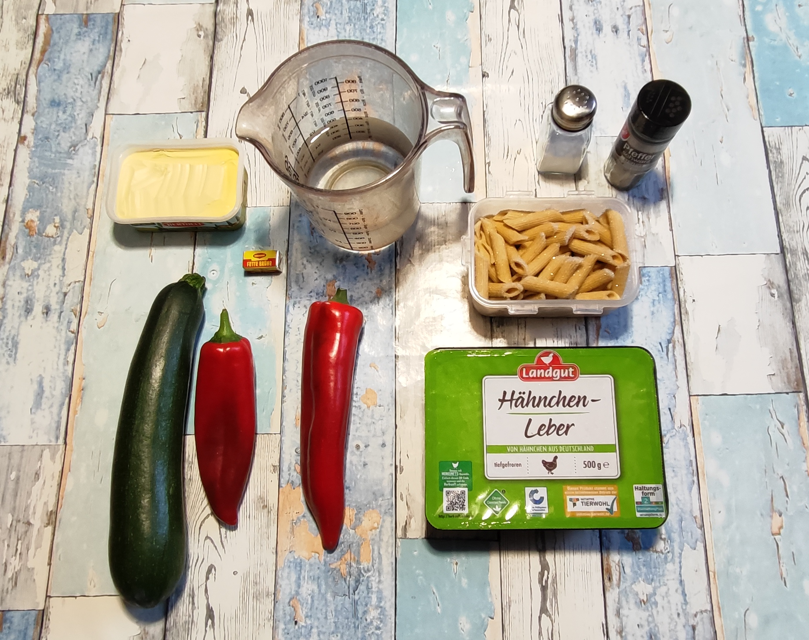
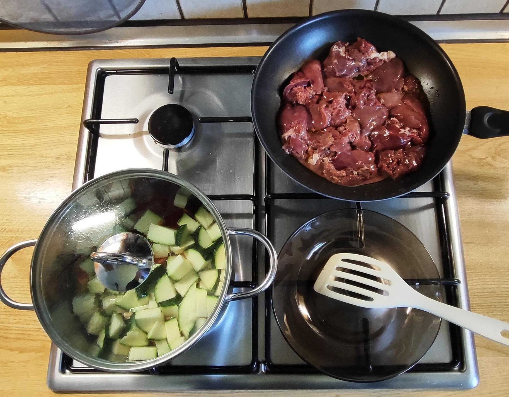
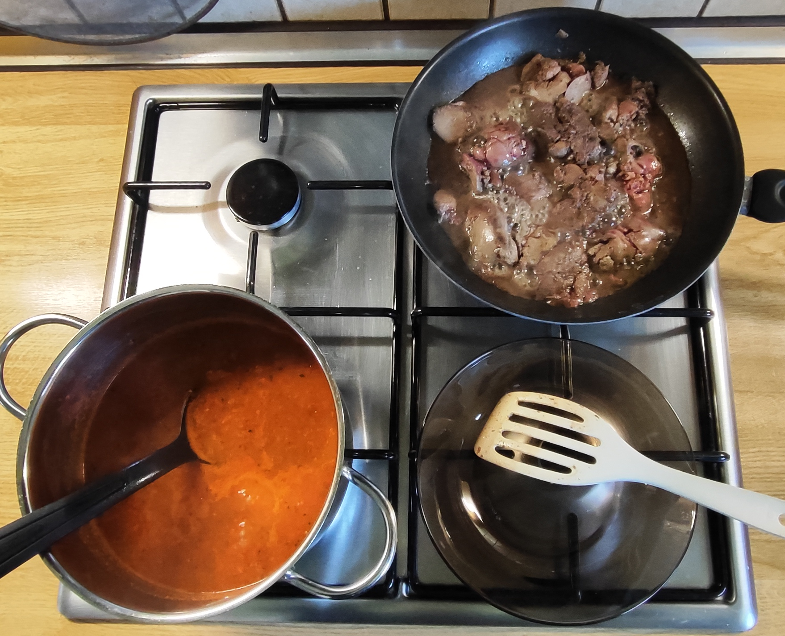
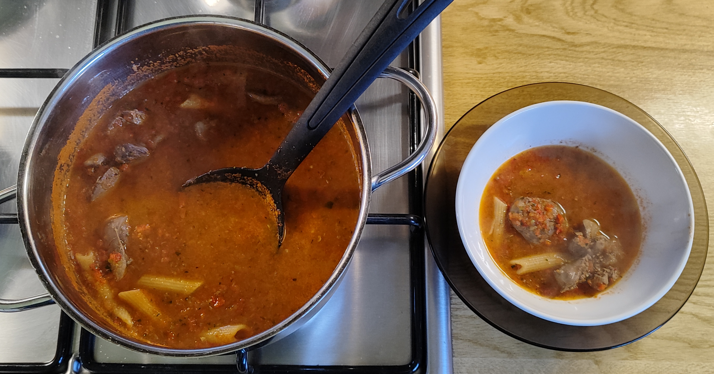
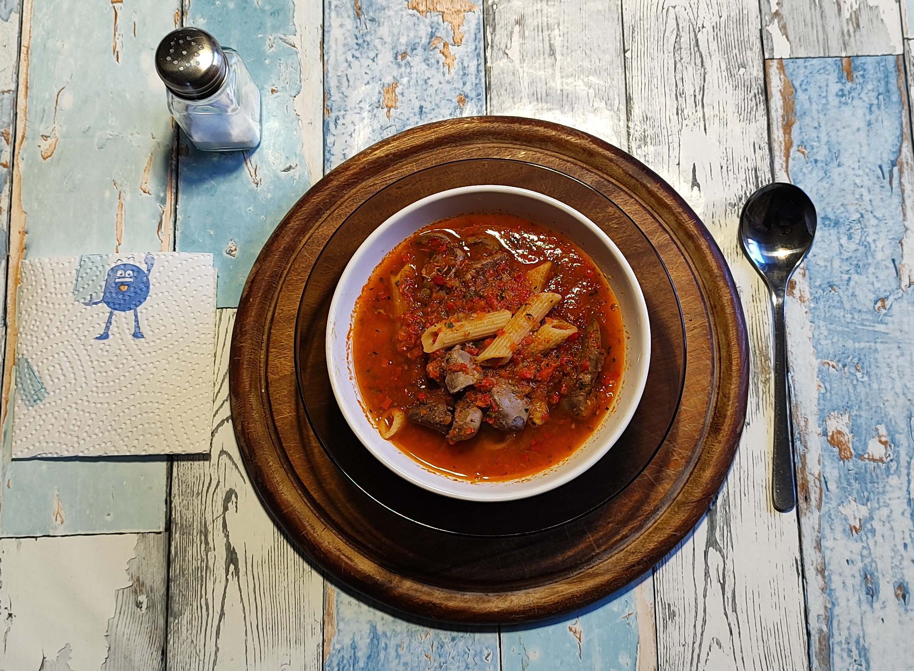

# Kurt kocht
## Zucchini-Paprika-Creme mit Leber

### Zutaten
* Zucchini ca. 400 g
* Rote Paprika ca. 300 g
* Geflügelleber 500 g
* 1/4 Packung Vollkornpenne (vorgekocht)
* 0,5 l Wasser
* 1 Brühwürfel (für 500 ml)
* Schwarzer Pfeffer
* Margarine

---

### Zubereitung

#### Langfristvorbereitung
1. Die Vollkornpenne vorkochen, portionieren und einfrieren.
2. Am Abend vor dem Verzehr Penne und Leber schonend im Kühlschrank auftauen.  

#### Zubereitung am Verzehrtag

| gerade auf dem Herd | die Leber ist jetzt gar |
| :---: | :---: |
|  |  |

1. Leber sehr gründlich mit Wasser spülen, beiseite stellen.
2. Zucchini und Paprika waschen, grob würfeln und mit dem Wasser erhitzen.
3. Kurz aufkochen, vom Herd nehmen und pürieren.
4. Die Leber in einer Pfanne mit Deckel auf kleiner Flamme ca. 10 min durchgaren. Öfter wenden.
5. Währenddessen die Creme auf kleiner Flamme köcheln. Mehrmals rühren.
6. Pfeffer und Brühwürfel einrühren und einen guten Stich Margarine zugeben.
7. Die Vollkornpenne und die gegarte Leber in die Creme geben.
8. Alles vermengen, vom Feuer nehmen und servieren.

| Leber und Penne sind eingerührt | Guten Appetit |
| :---: | :---: |
|  |  |

### Perplexity's Gesundheits-Check: Warum dieses Gericht punktet
Dieses Rezept kombiniert Gemüse, Leber und Vollkorn für eine nährstoffreiche Mahlzeit, die den Körper optimal versorgt.
* **Vitamin A, Eisen, B12 durch Leber:** Geflügelleber liefert sehr viel Vitamin A (Retinol), Eisen und B12. Wegen des hohen Vitamin A Gehaltes gilt für Schwangere: Leber nur selten und in kleinen Mengen, ärztlich abklären. Für alle anderen als gelegentliche Hauptmahlzeit, nicht täglich.
* **Zucchini und Paprika liefern Beta-Carotin und Vitamin C:** Beta-Carotin kann im Körper zu Vitamin A umgewandelt werden, Vitamin C bleibt durch kurzes Aufkochen weitgehend erhalten.
* **Schonendes Garen ohne Röstaromen:** Gemüse wird nur kurz aufgekocht und püriert, Leber bei kleiner Flamme mit Deckel gegart. Keine Röstaromen, bewusst zart.
* **Eisen und Zink aus Leber:** Hochbioverfügbares Eisen und Zink.
* **Fettlösliche Vitamine:** Ein Stich Margarine hilft, fettlösliche Vitamine (A, E, K) aufzunehmen.
* **Vollkorn-Sättigung:** Penne bringen Ballaststoffe und komplexe Kohlenhydrate.  

---

<h2 style="font-family: sans-serif; font-size: 18px; font-weight: bold; margin-bottom: 5px;">Nährwerte für die gesamte Zutatenmenge</h2>

<h3 style="font-family: sans-serif; font-size: 16px; font-weight: bold; margin-bottom: 10px;">1. Makronährstoffe</h3>

<table style="width: 800px; border-collapse: collapse; font-family: sans-serif; margin-bottom: 30px;">
  <thead>
    <tr style="background-color: #e6e6e6;">
      <th style="width: 170px; text-align: left; padding: 8px; border: 1px solid #000; font-weight: bold;">Nährstoff</th>
      <th style="width: 170px; text-align: left; padding: 8px; border: 1px solid #000; font-weight: bold;">Menge gesamt (2 Port.)</th>
      <th style="text-align: left; padding: 8px; border: 1px solid #000; font-weight: bold;">Anmerkung</th>
    </tr>
  </thead>
  <tbody>
    <tr>
      <td style="padding: 8px; border: 1px solid #000; font-weight: bold;">Kalorien</td>
      <td style="padding: 8px; border: 1px solid #000;">ca. 1.250 kcal</td>
      <td style="padding: 8px; border: 1px solid #000;">ca. 595 kcal Leber + 435 kcal Penne (125g trocken) + 146 kcal Gemüse/Margarine/Brühe</td>
    </tr>
    <tr>
      <td style="padding: 8px; border: 1px solid #000; font-weight: bold;">Eiweiß</td>
      <td style="padding: 8px; border: 1px solid #000;">ca. 102 - 105 g</td>
      <td style="padding: 8px; border: 1px solid #000;">Hauptsächlich Hähnchenleber (ca. 85g) + Vollkornpenne + wenig Gemüse</td>
    </tr>
    <tr>
      <td style="padding: 8px; border: 1px solid #000; font-weight: bold;">Kohlenhydrate</td>
      <td style="padding: 8px; border: 1px solid #000;">ca. 100 - 105 g</td>
      <td style="padding: 8px; border: 1px solid #000;">Fast nur aus 125g Vollkornpenne (ca. 72g) + Paprika + Zucchini</td>
    </tr>
    <tr>
      <td style="padding: 8px; border: 1px solid #000; font-weight: bold;">davon Zucker</td>
      <td style="padding: 8px; border: 1px solid #000;">ca. 16 - 19 g</td>
      <td style="padding: 8px; border: 1px solid #000;">Natürlich aus Paprika und Zucchini</td>
    </tr>
    <tr>
      <td style="padding: 8px; border: 1px solid #000; font-weight: bold;">Fett (gesamt)</td>
      <td style="padding: 8px; border: 1px solid #000;">ca. 34 - 38 g</td>
      <td style="padding: 8px; border: 1px solid #000;">ca. 24g aus Leber + ca. 8g aus Margarine + Rest aus Penne</td>
    </tr>
    <tr>
      <td style="padding: 8px; border: 1px solid #000; font-weight: bold;">Gesättigte Fettsäuren</td>
      <td style="padding: 8px; border: 1px solid #000;">ca. 10 - 12 g</td>
      <td style="padding: 8px; border: 1px solid #000;">Überwiegend aus Leber und Margarine</td>
    </tr>
    <tr>
      <td style="padding: 8px; border: 1px solid #000; font-weight: bold;">Ballaststoffe</td>
      <td style="padding: 8px; border: 1px solid #000;">ca. 14 - 16 g</td>
      <td style="padding: 8px; border: 1px solid #000;">Vollkornpenne + Zucchini + Paprika</td>
    </tr>
  </tbody>
</table>

<h3 style="font-family: sans-serif; font-size: 16px; font-weight: bold; margin-bottom: 10px;">2. Mikronährstoffe</h3>

<table style="width: 800px; border-collapse: collapse; font-family: sans-serif;">
  <thead>
    <tr style="background-color: #e6e6e6;">
      <th style="width: 170px; text-align: left; padding: 8px; border: 1px solid #000; font-weight: bold;">Nährstoffe</th>
      <th style="width: 150px; text-align: left; padding: 8px; border: 1px solid #000; font-weight: bold;">Menge gesamt</th>
      <th style="width: 180px; text-align: left; padding: 8px; border: 1px solid #000; font-weight: bold;">Deckungsbeitrag / Tag (Erwachsener)</th>
      <th style="text-align: left; padding: 8px; border: 1px solid #000; font-weight: bold;">Quelle / Hinweis</th>
    </tr>
  </thead>
  <tbody>
    <tr>
      <td style="padding: 8px; border: 1px solid #000; font-weight: bold;">Vitamin A (Retinol)</td>
      <td style="padding: 8px; border: 1px solid #000;">ca. 45.000 - 60.000 µg RE</td>
      <td style="padding: 8px; border: 1px solid #000;">ca. 5.600 - 7.500 %</td>
      <td style="padding: 8px; border: 1px solid #000;">Aus 500g Hähnchenleber, extrem hoch - Hinweis Schwangerschaft</td>
    </tr>
    <tr>
      <td style="padding: 8px; border: 1px solid #000; font-weight: bold;">Vitamin B12</td>
      <td style="padding: 8px; border: 1px solid #000;">ca. 85 - 130 µg</td>
      <td style="padding: 8px; border: 1px solid #000;">ca. 2.100 - 3.250 %</td>
      <td style="padding: 8px; border: 1px solid #000;">Nur aus Hähnchenleber</td>
    </tr>
    <tr>
      <td style="padding: 8px; border: 1px solid #000; font-weight: bold;">Eisen</td>
      <td style="padding: 8px; border: 1px solid #000;">ca. 50 - 58 mg</td>
      <td style="padding: 8px; border: 1px solid #000;">ca. 350 - 415 % (Mann) / 330% (Frau)</td>
      <td style="padding: 8px; border: 1px solid #000;">Hochbioverfügbar aus Hähnchenleber, Vitamin C aus Paprika fördert Aufnahme</td>
    </tr>
    <tr>
      <td style="padding: 8px; border: 1px solid #000; font-weight: bold;">Zink</td>
      <td style="padding: 8px; border: 1px solid #000;">ca. 18 - 22 mg</td>
      <td style="padding: 8px; border: 1px solid #000;">ca. 180 - 220 %</td>
      <td style="padding: 8px; border: 1px solid #000;">Hauptsächlich Leber</td>
    </tr>
    <tr>
      <td style="padding: 8px; border: 1px solid #000; font-weight: bold;">Folat (B9)</td>
      <td style="padding: 8px; border: 1px solid #000;">ca. 1.800 - 2.200 µg</td>
      <td style="padding: 8px; border: 1px solid #000;">ca. 600 - 730 %</td>
      <td style="padding: 8px; border: 1px solid #000;">Überwiegend Leber, Rest Paprika/Zucchini/Penne</td>
    </tr>
    <tr>
      <td style="padding: 8px; border: 1px solid #000; font-weight: bold;">Vitamin C</td>
      <td style="padding: 8px; border: 1px solid #000;">ca. 240 - 300 mg</td>
      <td style="padding: 8px; border: 1px solid #000;">ca. 220 - 270 %</td>
      <td style="padding: 8px; border: 1px solid #000;">Fast roh püriert, aus 300g roter Paprika + Zucchini</td>
    </tr>
    <tr>
      <td style="padding: 8px; border: 1px solid #000; font-weight: bold;">Vitamin B6</td>
      <td style="padding: 8px; border: 1px solid #000;">ca. 3,0 - 3,8 mg</td>
      <td style="padding: 8px; border: 1px solid #000;">ca. 190 - 240 %</td>
      <td style="padding: 8px; border: 1px solid #000;">Leber + Paprika + Vollkornpenne</td>
    </tr>
    <tr>
      <td style="padding: 8px; border: 1px solid #000; font-weight: bold;">Kalium</td>
      <td style="padding: 8px; border: 1px solid #000;">ca. 2.200 - 2.500 mg</td>
      <td style="padding: 8px; border: 1px solid #000;">ca. 55 - 63 %</td>
      <td style="padding: 8px; border: 1px solid #000;">Zucchini + Paprika + Leber + Brühe</td>
    </tr>
    <tr>
      <td style="padding: 8px; border: 1px solid #000; font-weight: bold;">Magnesium</td>
      <td style="padding: 8px; border: 1px solid #000;">ca. 180 - 210 mg</td>
      <td style="padding: 8px; border: 1px solid #000;">ca. 50 - 60 %</td>
      <td style="padding: 8px; border: 1px solid #000;">Vollkornpenne + Leber + Gemüse</td>
    </tr>
    <tr>
      <td style="padding: 8px; border: 1px solid #000; font-weight: bold;">Beta-Carotin</td>
      <td style="padding: 8px; border: 1px solid #000;">ca. 2.500 - 3.000 µg</td>
      <td style="padding: 8px; border: 1px solid #000;">ca. 50 % als Vorstufe für Vitamin A</td>
      <td style="padding: 8px; border: 1px solid #000;">Aus Paprika und Zucchini</td>
    </tr>
  </tbody>
</table>

---

### Zusammenfassung von Mitautorin Perplexity:
Mit 850-950 kcal ist das Gericht eine proteinstarke Hauptmahlzeit (55-65 g Eiweiß aus Leber und Penne). Die Gemüse-Leber-Kombo maximiert Mikronährstoffe bei bester Bioverfügbarkeit.

> **Tipp für Leberskeptiker:**
> Durch das Garen bei kleiner Flamme bleibt die Geflügelleber in ihrem Aroma zurückhaltend.   Während die Zucchini-Paprika-Creme den ersten Moment am Gaumen bestimmt, tritt die sanfte, braun‑raue Lebernote erst beim Kauen hervor. Ein besonderes Geschmackserlebnis - perfekt für alle, die sich behutsam an Innereien herantasten möchten.

---

[← Zurück zur Übersicht](index.md)
