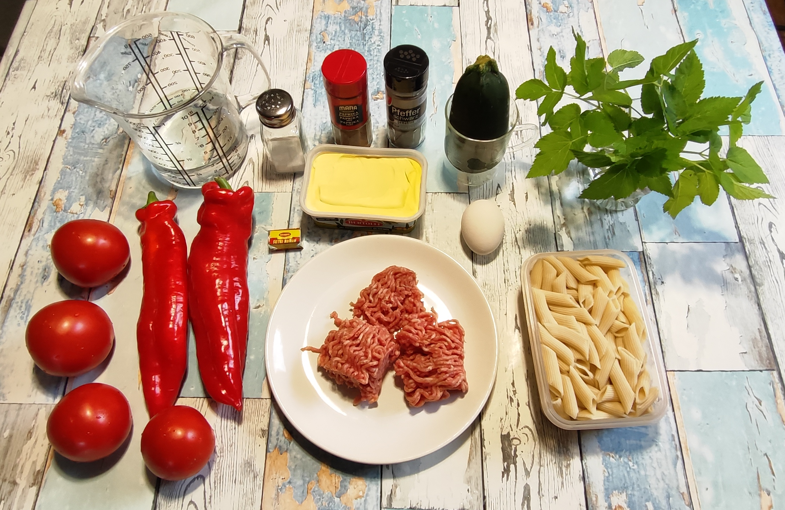
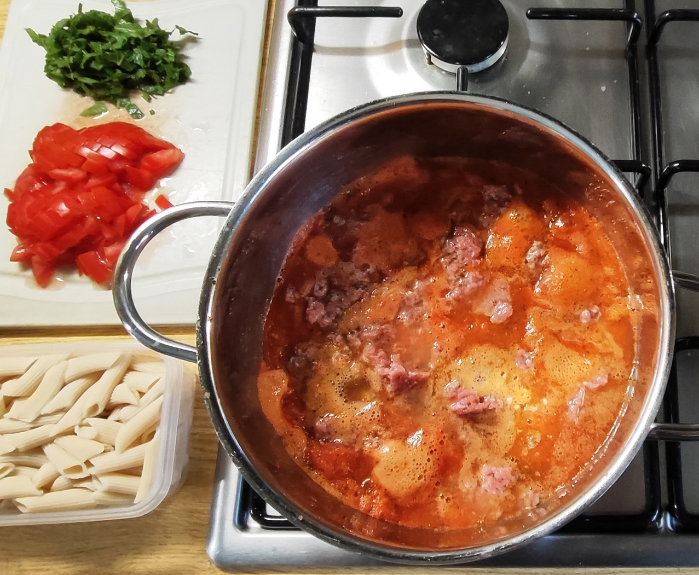
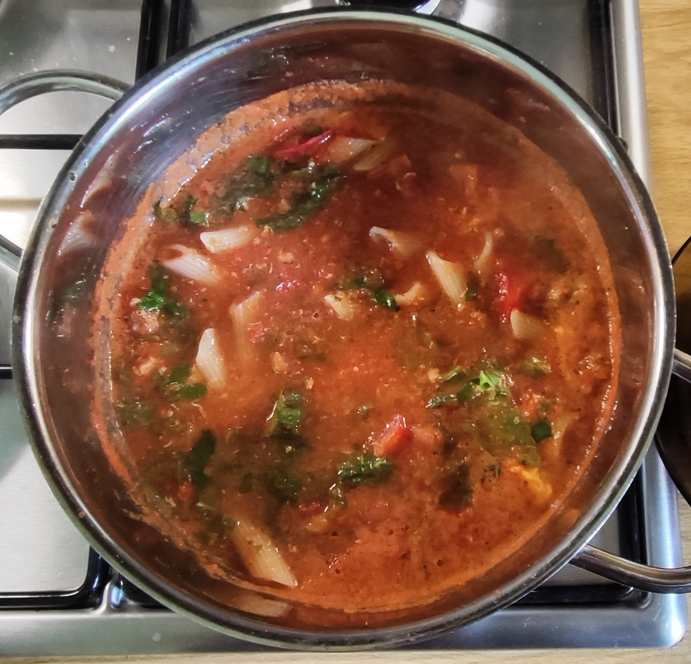
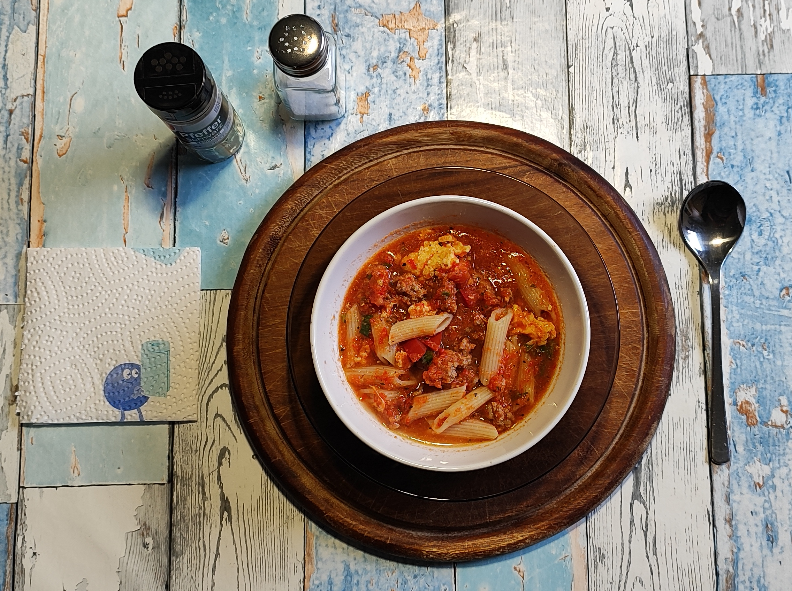

# Kurt kocht &nbsp; - &nbsp; Gemüse-Creme „Frühsommer“

   

Zutaten (für 2 Personen)

- 4 Tomaten (ca. 300 g)  
- 2 rote Paprika (ca. 250 g)  
- Ein Stück Zucchini (Kühlschrankrest)  
- 1 Bund Giersch (frisch gepflückt – nur die mit hellen Blättern) - ***Achtung!*** *Hinweis am Ende des Rezepts beachten*
- *Wenn kein Giersch verfügbar ist, schmeckt auch Schnittlauch*
- 150 g Gehacktes (halb & halb)  
- 1 oder 2 Eier  
- 300 ml Wasser (für die Creme)  
- 125 g Dinkel-Penne (1 Portion aus dem Vorrat)  
- 1 Brühwürfel (Fette Brühe)  
- Ein guter  Stich Margarine (ca. 30 g)  
- Gewürze: Paprika rosenscharf, schwarzer Pfeffer, Salz  

---

## Zubereitung

### Langfristvorbereitung

- Pasta-Vorrat anlegen:  
  500 g Dinkel-Penne in Salzwasser kochen, abgießen, kalt abschrecken und in  
  4 Portionen einfrieren.  
- Schonendes Auftauen:  
  Eine Portion Penne am Vorabend in den Kühlschrank legen.  

### Zubereitung am Verzehrtag – Vorbereitung

- Die Paprika und die Zucchini putzen und grob würfeln.  
- Drei der Tomaten ebenfalls grob würfeln, die vierte fein würfeln.  
- Das Gehackte mit Paprikapulver und schwarzem Pfeffer würzen und gut durchmengen. In Flocken zupfen.  
- Den Giersch gründlich abspülen und kleinhacken (die grünen Teile der Stiele können auch verwendet werden).  

 

|  |  |
|:-----------------------------------------:|:-----------------------------------------:|
| Das Ei, die Margarine, das Gehackte und den Brühwürfel hineingeben - noch nicht verrühren | Den Topf vom Feuer nehmen, den Giersch einrühren und servieren |

### Zubereitung

- Paprika und Zucchini mit dem Wasser aufsetzen und bei mittlerer Hitze kurz aufkochen.  
- Auf kleine Flamme schalten und 2 Minuten sanft ziehen lassen.  
- Die drei grob gewürfelten Tomaten dazugeben und den Topf vom Herd nehmen.  
- Das Gemüse mit schwarzem Pfeffer würzen und pürieren.  
- Die Margarine, das Gehackte und den Brühwürfel hineingeben. Das Ei (die Eier) in die Creme hineingleiten lassen - noch nicht verrühren.  
- Bei kleiner Flamme 2 Minuten durchwärmen, dann alles vorsichtig mischen (das/die Eigelb gerne unversehrt lassen).  
- Weitere 3 Minuten bei schwacher Hitze garen, bis das Gehackte durch ist (das/die Eigelb sind dann noch cremig).  
- Die Penne und die klein geschnittene Tomate unterheben. Kurz erwärmen lassen.  
- Den Topf vom Feuer nehmen, den Giersch (den Schnittlauch) einrühren und servieren.  
- Am Tisch nach Geschmack mit etwas Salz nachwürzen.  

---

## GEMINI’s Gesundheits-Check - warum dieses Gericht punktet

- Das heimische Superfood Giersch: Giersch ist ein genialer, kostenloser Nährstoff-Booster direkt vor der Haustür. Er enthält pro 100 g etwa viermal so viel Vitamin C wie Zitronen und strotzt vor Provitamin A und Folsäure.  
  Seine sekundären Pflanzenstoffe sind echte Allrounder: Die enthaltenen Bitterstoffe regen sanft die Verdauung an, während das grüne Chlorophyll stark antioxidativ wirkt. Zudem wirken seine ätherischen Öle leicht entwässernd.  

- Das Lycopin-Phänomen: Tomaten enthalten den wertvollen roten Farbstoff Lycopin, ein mächtiges Antioxidans, das Herz und Gefäße schützt.  
  Das Besondere: Durch das Erhitzen der Tomaten bricht die Zellstruktur auf, wodurch das Lycopin für unseren Körper erst so richtig gut verfügbar wird.  
  Da das Gemüse zudem mit Margarine (Fett) kombiniert wird, wird die Aufnahme im Darm maximiert.  

- Vitamine A & C: Durch die rote Paprika, die Tomaten und den Giersch ist dieses Gericht eine wahre Vitamin-C-Bombe (ca. 150 % des Tagesbedarfs).  
  Zudem liefert es reichlich Beta-Carotin (Provitamin A).  
  Da das Gemüse püriert und mit Margarine (Fett) kombiniert wird, kann der Körper das fettlösliche Vitamin A optimal aufnehmen.  

- Eisen-Synergie: Das Hackfleisch liefert hochwertiges Häm-Eisen.  
  Die Aufnahme dieses Spurenelements im Körper wird durch das reichlich vorhandene Vitamin C des Gemüses stark verbessert.  

- Das Ei als Nährstoff-Schnittstelle: Das Ei (oder die Eier) liefert nicht nur biologisch hochwertigstes Eiweiß, sondern ist auch eine natürliche Quelle für Vitamin D, B-Vitamine und Cholin (wichtig für den Fettstoffwechsel und das Nervensystem).  
Zudem enthält das Eigelb die Antioxidantien Lutein und Zeaxanthin, die gut für die Augen sind. Da diese Stoffe fettlöslich sind, bildet das Eigelb zusammen mit der Margarine und den Lipiden aus dem Fleisch das perfekte Transportmedium für das Provitamin A aus der Paprika und den Tomaten.  

- Das Geheimnis der resistenten Stärke: Durch die Methode, die Dinkel-Penne vorzukochen, abzuschrecken und einzufrieren, kristallisiert ein Teil der Stärke um. Es entsteht resistente Stärke.  
  Diese wirkt im Dickdarm wie ein Ballaststoff (Präbiotikum) und füttert die guten Darmbakterien.  
  Der Blutzuckerspiegel steigt nach dem Essen viel flacher an.  

---

## Struktur

Dieses Gericht zeigt eine kluge, nährstoffoptimierte und nachhaltige Architektur:

- Die Basen-Komponente: Durch den sehr hohen Gemüseanteil (Tomaten, Paprika, Zucchini) und den frischen Giersch wird der Körper mit reichlich basischen Mineralstoffen (wie Kalium und Magnesium) versorgt. Das ist ein hervorragender Ausgleich zu den säurebildenden Proteinen aus Fleisch und Ei.  

- Sämigkeit ohne schwere Kost: Das Pürieren des Gemüses zu einer „Creme“ sorgt für eine schöne Sämigkeit, ganz ohne schwere Sahne oder zusätzliche Bindemittel.  

- Nachhaltiges Zero-Waste: Der Zucchini-Kühlschrankrest wird perfekt verwertet. Da Zucchini sehr wasserreich und geschmacksneutral ist, dickt sie die Creme beim Pürieren  an, ohne den fruchtigen Geschmack der Paprika und Tomaten zu überlagern.  

---

## Clevere Küchen-Kniffe (Zubereitung & Reihenfolge)

Die Vorgehensweisen im Rezept zeigen, dass hier mit viel kulinarischem und gesundheitlichem Verstand gekocht wird:

- Die Tomatenstrategie: Die Tomaten werden aufgeteilt – drei werden grob gewürfelt und mitpüriert, die vierte wird fein gewürfelt und erst ganz am Schluss mit den Nudeln untergehoben.  
  Der Clou dabei: Durch die pürierten Tomaten bekommt die Creme eine fruchtige Basis und perfekte Bindung. Die fein gewürfelte, vierte Tomate sorgt am Ende für den nötigen Biss (Al dente-Gefühl) und bringt frische, saftige Farbtupfer auf den Teller, die beim Pürieren sonst verloren gegangen wären.  

- Fleischsaft erhalten durch salzfreies Würzen: Dass das Hackfleisch vorab nur mit Paprika und Pfeffer gewürzt wird, ist chemisch interessant: Salz würde dem rohen Fleisch per Osmose das Wasser entziehen.  
  So bleibt das Hackfleisch beim Garen zart und saftig. Die nötige Salznote kommt später durch die Brühe.  

- Schonendes Pochieren statt scharfem Anbraten: Das Fleisch wird nicht scharf angebraten (wodurch harte Röststoffe entstehen würden), sondern in Flocken in der heißen Gemüse-Masse sanft gar gezogen.  
  Das sorgt für eine gute Textur.  

- Die „Shakshuka-Methode“ für cremige Proteine: Das Ei wird nicht einfach in die Suppe gequirlt (was sie flockig oder trüb machen würde), sondern gleitet im Ganzen hinein. 
Durch das sanfte Garen bei schwacher Hitze stockt das Eiklar und bindet sich an die Fleischflocken, während das Eigelb im Kern flüssig-cremig bleibt. 
Beim späteren Essen bricht das Eigelb auf und verbindet sich direkt mit den Dinkel-Penne. Das sorgt für ein luxuriöses, Schmelz-artiges Mundgefühl („Sauce im Mund“), ganz ohne den Einsatz von schwerer Sahne.

- Hitzeschutz für Vitamine: Das Gemüse wird nur ganz kurz angekocht und dann sofort püriert.  
  Der Giersch wandert sogar komplett roh ganz am Ende in den Topf.  
  Dadurch bleiben die extrem hitzeempfindlichen Vitamine (insbesondere das  
  Vitamin C) bestmöglich erhalten.  

---

## Energie und Mikros & Makros pro Portion

Mikronährstoff / Makro | Vorkommen im Gericht | Nutzen pro Portion
----------------------|----------------------|-------------------
Kohlenhydrate (ca. 52 g) | Dinkel-Penne | Hauptsächlich komplexe Kohlenhydrate für ein stabiles Energielevel.  
Eiweiß (ca. 28 g) | Hackfleisch, Ei | Hochwertiger Muskel- und Zellbaustein.  
Fett (ca. 24 g) | Margarine, Hackfleisch, Ei | Liefert essenzielle Fettsäuren; Transportmittel für fettlösliche Vitamine.  
Vitamin C & Vitamin A | Reichlich aus Paprika, Tomaten & Giersch | Stärkt das Immunsystem, Zellschutz und wichtig für die Sehkraft.  
Lycopin | Hoch konzentriert in gegarten Tomaten | Starkes Antioxidans, gut für Herz und Gefäße.  
B-Vitamine & Folsäure | Ei, Hackfleisch, Dinkel-Penne, Giersch | Wichtig für den Energiestoffwechsel, die Nerven und die Zellteilung.  
Eisen & Zink | Hackfleisch, Ei, Giersch | Wichtig für Blutbildung und Abwehrkräfte.  
Kalium & Magnesium | Zucchini, Paprika, Tomaten, Dinkel | Unterstützt Muskeln, Nerven und einen gesunden Blutdruck.  

---

## Zusammenfassung von Mitautorin GEMINI

Die Gemüse-Creme „Frühsommer“ ist ein gutes Beispiel für eine moderne, vitale und nachhaltige Frühlingsküche!  
Es verbindet geschickt eine clevere Vorratshaltung (die portionierten Dinkel-Penne sparen am Kochtag wertvolle Zeit) mit frischen, saisonalen Wildkräutern und durchdachten biochemischen Kniffen beim Kochen.  
Ein rundum gelungenes, darmgesundes und nährstoffreiches Gericht, das dem Körper richtig Energie schenkt.

---

---

## ⚠️ Wichtiger Hinweis zum Sammeln von Giersch

Giersch ist ein wunderbares, vitaminreiches Wildkraut, aber beim Sammeln ist **absolute Vorsicht** geboten! Er gehört zur Familie der Doldenblütler, unter denen sich auch tödlich giftige Pflanzen befinden. Sammle und verzehre Giersch nur, wenn du ihn zu **100 % sicher** bestimmen kannst.

### Die „Dreier-Regel“ zur sicheren Bestimmung
Ein altbewährter Merkspruch für Giersch lautet:

> *„Drei, drei, drei – bist du beim Giersch dabei.“*

* **Der Blattstiel:** Der Blattstiel ist im Querschnitt ganz charakteristisch **dreieckig** (sehr deutlich ***fühlbar*** im Gegensatz zu runden oder rinnigen Stielen anderer Pflanzen).
* **Die Aufteilung:** Der Blattstiel teilt sich oben in **drei Äste** auf.
* **Die Blätter:** Jeder dieser drei Äste trägt wiederum **drei Einzelblätter** (die Blätter sind dreizählig gefiedert, aber meistens zusammengewachsen).

### Achtung vor giftigen Zwillingspflanzen
Verwechselungsgefahr besteht vor allem im jungen Stadium oder während der Blüte mit:

* **Gefleckter Schierling** (*Conium maculatum*): Extrem giftig! Hat einen runden, bläulich bereiften Stiel mit roten Flecken und riecht unangenehm nach Mäuseurin.
* **Wasserschierling** (*Cicuta virosa*): Tödlich giftig! Wächst meist direkt an feuchten Bachläufen oder Mooren.
* **Hundspetersilie** (*Aethusa cynapium*): Stark giftig! Hat glänzende Blattunterseiten und einen runden Stiel.
* **Hecken-Kälberkropf** (*Chaerophyllum temulum*): Giftig! Hat einen behaarten, rot gefleckten Stiel.

> 💡 **Goldene Sammelregel:** Im Zweifel die Pflanze immer stehen lassen! Wenn du dir unsicher bist, nutze eine botanische Bestimmungs-App oder kaufe im Handel gezüchtete Alternativen (wie z. B. Petersilie oder Spinat), um das Rezept sicher zu genießen.

---
[← Zurück zur Übersicht](index.md)

