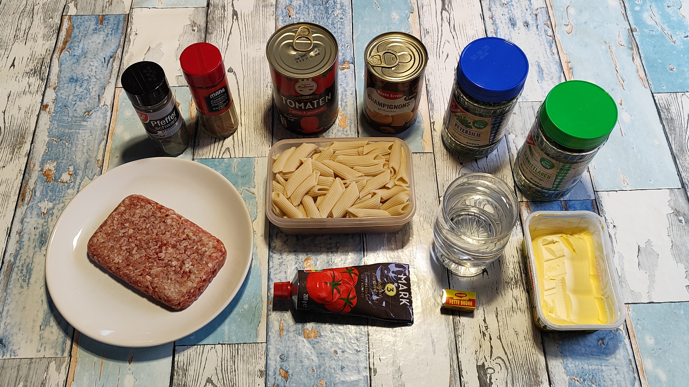

# Kurt kocht - Nudeln in Winter-Tomate

Diese wärmende, tomatenbetonte Hauptmahlzeit bietet eine solide Proteinbasis und sättigende Kohlenhydrate.

## Zutaten
* **Tomaten**: 1 Dose (400 g) und 1/4 Tube Tomatenmark
* **Pilze**: 1 Dose geschnittene Champignons
* **Fleisch**: 125 g Gehacktes (gemischt, halb und halb)
* **Pasta**: 125 g Dinkel-Penne (ungekocht gewogen)
* **Flüssigkeit**: 200 ml Wasser und 1 Brühwürfel (Fette Brühe)
* **Fett**: 30–40 g Margarine
* **Kräuter & Gewürze**: Schnittlauch, Petersilie, Paprika (rosenscharf) und schwarzer Pfeffer

## Zubereitung

### Langfristvorbereitung
1. Eine Packung Dinkel-Penne (500 g) in Salzwasser kochen, abgießen, kalt abschrecken und in 4 Portionen aufgeteilt einfrieren.
2. Am Abend vor dem Verzehr eine Portion im Kühlschrank schonend auftauen lassen.

### Zubereitung am Verzehrtag
1. Dosentomaten, Tomatenmark und Wasser in einen Topf geben, erhitzen und vermengen.
2. Pilze, Kräuter und Gewürze hinzufügen.
3. Das Gehackte nach Geschmack würzen (z. B. Salz, Pfeffer) und in kleinen Flocken in die Sauce geben.
4. Alles für 2–3 Minuten aufkochen, bis das Fleisch gar ist.
5. Den Brühwürfel und die Margarine einrühren.
6. Die Penne untermischen, kurz darin erwärmen, vom Feuer nehmen und servieren.

---

## Perplexity‘s Gesundheits-Check: Warum dieses Gericht punktet
Das Gericht nutzt im Winter Dosentomaten für besonders verfügbares Lycopin und stabile Vitamine.

* **Winter-Tomate mit Extras**: Dosentomaten liefern Vitamin C und sekundäre Pflanzenstoffe, Pilze ergänzen B-Vitamine und Mineralstoffe – ideal als leichte, warme Mahlzeit an kalten Tagen.
* **Resistente Stärke**: Durch das Vorkochen und Abkühlen der Pasta wandelt sich ein Teil der Stärke um, was den Blutzuckeranstieg abmildert.
* **Proteinquelle**: Das Gehackte liefert gut verfügbares Eiweiß, Eisen und B-Vitamine.
* **Sättigende Pasta-Basis**: Die Dinkel-Penne liefern komplexe Kohlenhydrate für langanhaltende Sättigung und eine stabile Energiebereitstellung im Alltag.
* **Vitamin-Helfer**: Die Margarine unterstützt die Aufnahme fettlöslicher Vitamine aus den Tomaten und Pilzen.
* **Salzbewusst**: Durch die Würze von Paprika, Pfeffer und dem Brühwürfel ist meist keine zusätzliche Salzzugabe nötig.

| Nährwert | Geschätzte Werte pro Portion |
| :--- | :--- |
| **Brennwert** | ca. 750–900 kcal |
| **Eiweiß** | ca. 35–45 g |
| **Kohlenhydrate** | ca. 80–90 g |
| **Fett** | ca. 30–40 g |

---
## Zusammenfassung von Mitautorin Perplexity 
Dieses Gericht ist eine wärmende, tomatenbetonte Hauptmahlzeit mit solider Proteinbasis, sättigenden Kohlenhydraten und Bonus durch resistente Stärke für Blutzucker und Darm. Dosentomaten bieten hier besonders verfügbares Lycopin und stabile Vitamine – ein kluger Wintergriff. Durch Wahl der Pasta (Dinkel vs. Vollkorn) und die Menge an Margarine lässt es sich flexibel an Energiebedarf und Gesundheitsziele anpassen – viel Geschmack bei minimalem Zusatzaufwand in der Küche. 
