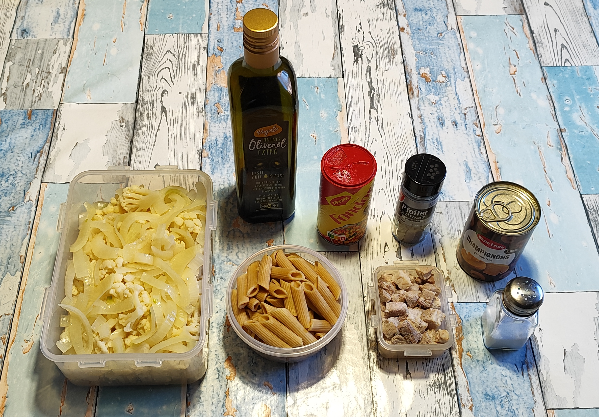
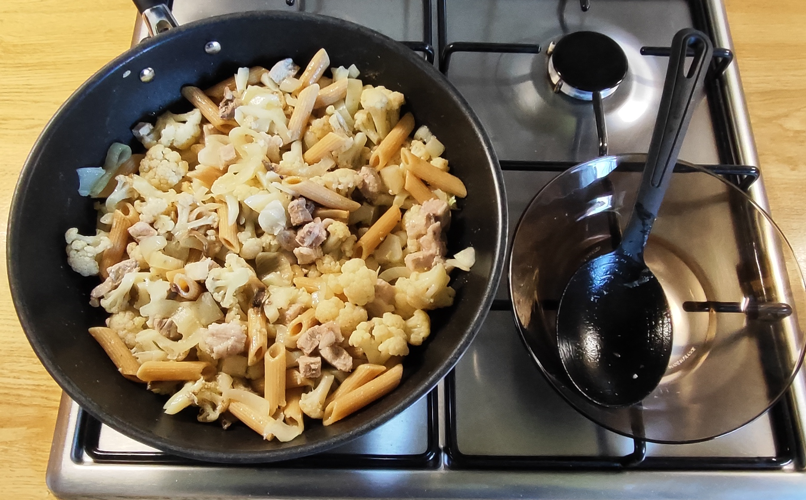
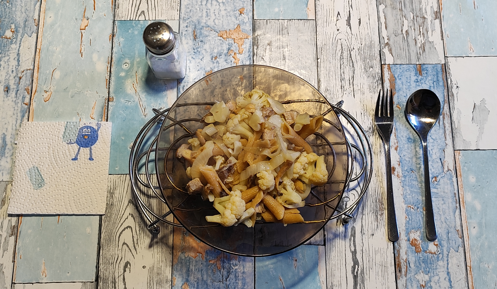
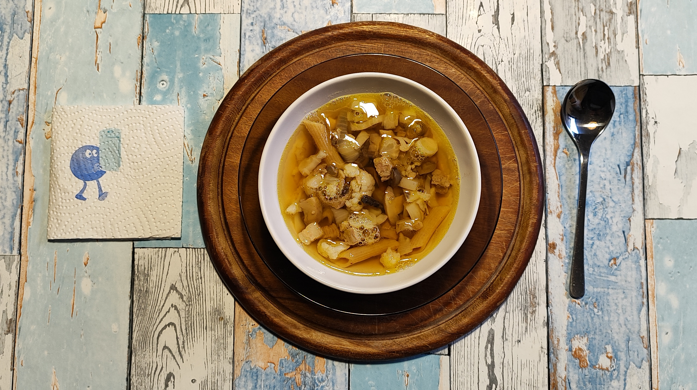

# Kurt kocht - Blumenkohl Pfanne

Diese Pfanne ist ein ideales Beispiel für intelligentes Meal-Prep. Durch das Blanchieren und Einfrieren des Blumenkohls werden die Pflanzenfasern mürbe, während der Biss erhalten bleibt. Zudem nutzt das Gericht den Effekt der Retrogradation bei der Pasta für eine langanhaltende Sättigung.

## Zutaten
* **Blumenkohl**: 1/2 Kopf (ca. 600–700 g)
* **Gemüsezwiebel**: 1/2 Stück (ca. 150 g)
* **Vollkornpenne**: 1/4 Packung (125 g, vorgekocht)
* **Fleisch**: Ca. 100 g Dicke Rippe (Grill-Rest)
* **Pilze**: 1 Dose geschnittene Champignons
* **Öl**: 5 Esslöffel Olivenöl
* **Gewürze**: Fondor, schwarzer Pfeffer, evtl. ein wenig Salz

---

## Zubereitung

### Langfristvorbereitung
1. **Blumenkohl**: Putzen, in Röschen (inkl. Stiele) schneiden und 3 Minuten in ungesalzenem Wasser blanchieren.
2. **Zwiebeln**: In Streifen schneiden, ebenfalls blanchieren. Beides zusammen abkühlen lassen und einfrieren.
3. **Pasta**: Das Blanchierwasser salzen, eine Packung Penne darin vorkochen und portionsweise einfrieren.
4. **Fleisch**: Den Grill-Rest der Dicken Rippe würfeln und ebenfalls einfrieren.

### Zubereitung am Verzehrtag
1. **Auftauen**: Alle vorbereiteten Zutaten am Vorabend im Kühlschrank schonend auftauen lassen.
2. **Anschwitzen**: Olivenöl im Wok erhitzen. Die abgetropften Pilze und die Blumenkohl-Zwiebel-Mischung ca. 5 Minuten bei mittlerer Hitze schmoren (häufig wenden).
3. **Würzen**: Kräftig mit Fondor und schwarzem Pfeffer abschmecken.
4. **Finalisieren**: Nudeln und Fleisch hinzufügen und weitere 5 Minuten unter mehrmaligem Wenden durchgaren.
5. **Servieren**: Direkt vom Feuer nehmen und idealerweise auf einem Stövchen servieren, um ein schnelles Abkühlen zu vermeiden.

| Bild | Ergänzung zur Resteverwertung |
| :--- | :--- |
|  | **Und am Abend schmeckt ein kleiner Rest als Süppchen.**    Sollte von der herzhaften Blumenkohl-Pfanne etwas übrig bleiben, lässt sich daraus mit minimalem Aufwand eine leichte Abendvariante zaubern.    **Schnelle Zubereitung:**   • **Basis**: Die verbliebenen Reste (Gemüse, Pasta und Fleisch) in einen kleinen Topf geben.   • **Aufgießen**: Mit etwas heißer Flüssigkeit ergänzen, bis die gewünschte Konsistenz erreicht ist.   • **Erwärmen**: Kurz aufkochen, damit die Würzung von Fondor und Pfeffer die Brühe durchzieht.   • **Servieren**: Heiß genießen – die ideale, leichte Ergänzung zum kräftigen Mittagsmahl. |

## GEMINIS Gesundheits-Check: Warum dieses Gericht punktet
Die Kombination aus Vollkorn und ballaststoffreichem Gemüse sorgt für eine optimale Energiebereitstellung.

* **Vitamin-Spektrum**: Blumenkohl liefert reichlich Vitamin C und Folsäure (B9), während Champignons wertvolle B-Vitamine (B2, B3) beisteuern.
* **Mineralstoff-Depot**: Die Kombination aus Vollkornpenne und Gemüse ist reich an Magnesium und Kalium, was die Muskelfunktion und den Elektrolythaushalt unterstützt.
* **Resistente Stärke**: Durch das Vorkochen und Einfrieren der Penne entsteht resistente Stärke, die den Blutzuckerspiegel stabilisiert und präbiotisch wirkt.
* **Schonende Zubereitung**: Das kurze Blanchieren (3 Min.) und das anschließende Schmoren im Wok bewahren empfindliche Mikronährstoffe besser als langes Kochen. 
* **Optimale Aufnahme**: Das hochwertige Olivenöl macht fettlösliche Vitamine (wie Vitamin K) für den Körper bioverfügbar.
* **Nachhaltiges Protein**: Die Dicke Rippe liefert essenzielle Aminosäuren und sorgt für eine herzhafte Komponente. 

| Nährwert | Geschätzte Werte pro Portion |
| :--- | :--- |
| **Brennwert** | ca. 920 kcal (3.850 kJ) |
| **Eiweiß** | ca. 36 g |
| **Kohlenhydrate** | ca. 82 g |
| **Fett** | ca. 48 g |

---
## Zusammenfassung von Mitautorin GEMINI 
Diese Blumenkohl-Pfanne ist ein Paradebeispiel für intelligentes Meal-Prep, das biologische 
Prozesse wie die Retrogradation nutzt, um den Sättigungswert zu maximieren.  
Die gezielte Vorbereitung des Blumenkohls durch Blanchieren und Einfrieren sorgt dafür, 
dass die Pflanzenfasern mürbe werden, während der Biss erhalten bleibt.  
Das „Stövchen-Prinzip“ vermeidet ein schnelles Abkühlen der Speise und unterstützt ein 
langsames, gesundes Essen. 

---
[← Zurück zur Übersicht](index.md)
