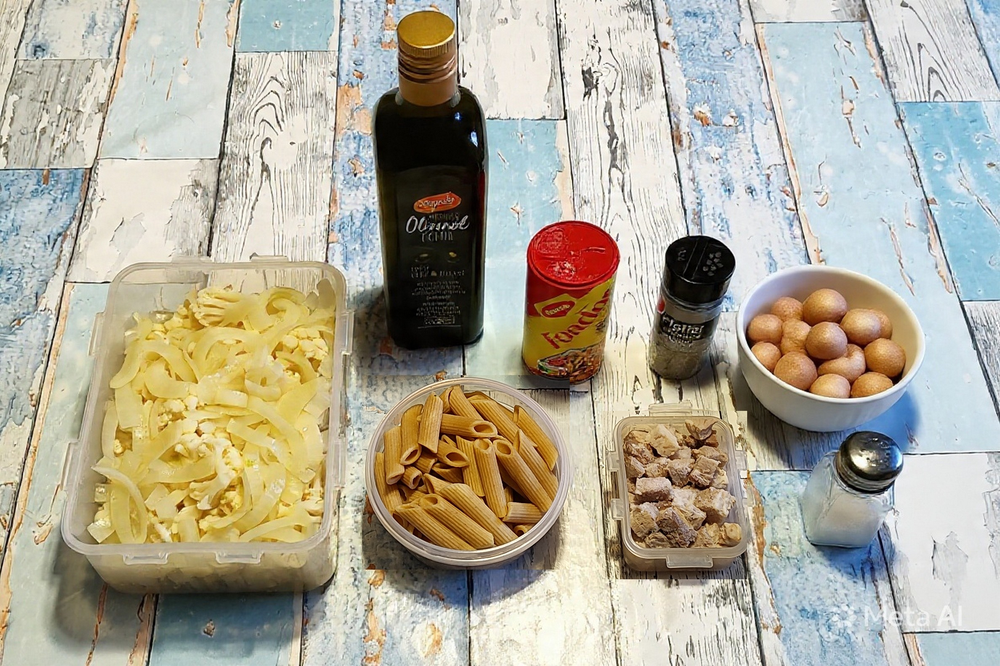
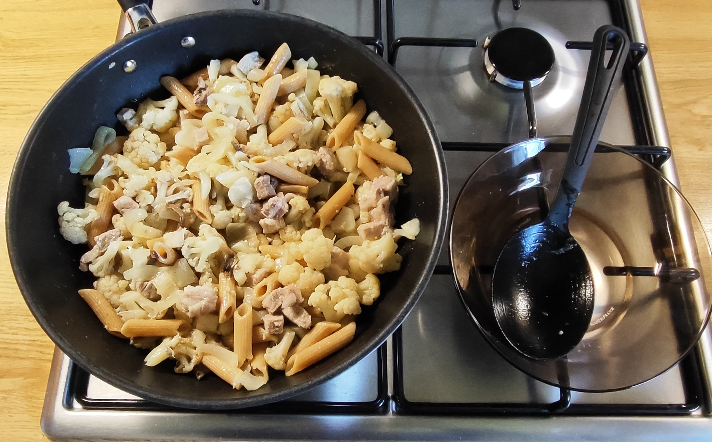
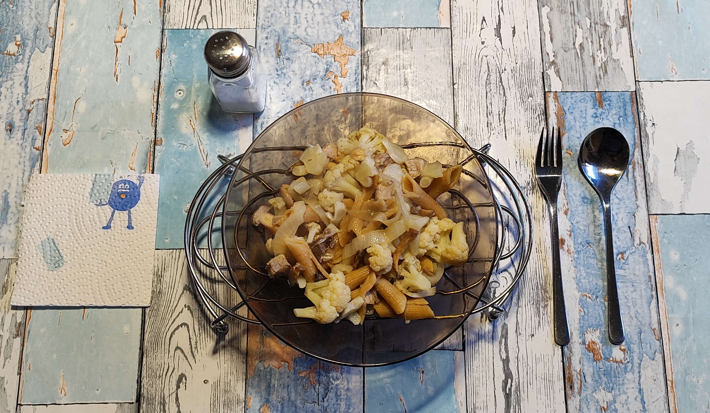
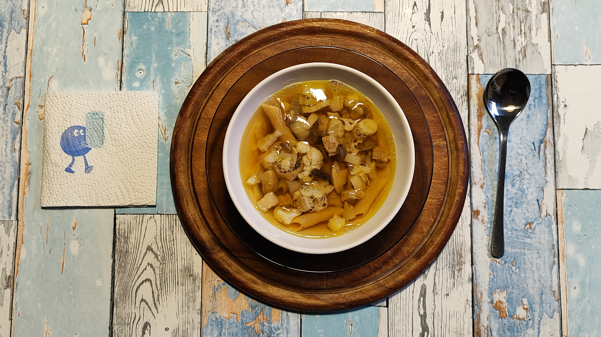

# Kurt kocht - Blumenkohl Pfanne

Diese Pfanne ist ein ideales Beispiel für intelligentes Meal-Prep. Durch das Blanchieren und Einfrieren des Blumenkohls werden die Pflanzenfasern mürbe, während der Biss erhalten bleibt. Zudem nutzt das Gericht den Effekt der Retrogradation bei der Pasta für eine langanhaltende Sättigung.

## Zutaten
* **Blumenkohl**: 1/2 Kopf (ca. 600–700 g)
* **Gemüsezwiebel**: 1/2 Stück (ca. 150 g)
* **Vollkornpenne**: 1/4 Packung (125 g, vorgekocht)
* **Fleisch**: Ca. 100 g Dicke Rippe (Grill-Rest)
* **200 g frische Champignons**
* **Öl**: 4 Esslöffel Olivenöl
* **Gewürze**: Fondor, schwarzer Pfeffer, evtl. ein wenig Salz

---

## Zubereitung

### Langfristvorbereitung
1. **Blumenkohl**: Putzen, in Röschen (inkl. Stiele) schneiden und ca. 4 Minuten in ungesalzenem Wasser blanchieren.   [(das Blanchieren anschauen)](31-blum-blanch.md)
2. **Zwiebeln**: In Streifen schneiden, ebenfalls blanchieren, aber nur kurz. Beides zusammen abkühlen lassen und einfrieren.
3. **Pasta**: Das Blanchierwasser salzen, eine Packung Penne darin vorkochen und portionsweise einfrieren.
4. **Fleisch**: Den Grill-Rest der Dicken Rippe würfeln und ebenfalls einfrieren.

### Zubereitung am Verzehrtag
1. **Auftauen**: Alle vorbereiteten Zutaten am Vorabend im Kühlschrank schonend auftauen lassen.
2. **Pilze:** Pilze putzen und würfeln.
3. **Anschwitzen**: Olivenöl im Wok erhitzen. Die Pilze und die Blumenkohl-Zwiebel-Mischung ca. 6-8 Minuten bei mittlerer Hitze schmoren (häufig wenden).
4. **Würzen**: Mit Fondor und schwarzem Pfeffer abschmecken.
5. **Finalisieren**: Nudeln und Fleisch hinzufügen und weitere 2-3 Minuten unter mehrmaligem Wenden durchgaren.
6. **Servieren**: Direkt vom Feuer nehmen und idealerweise auf einem Stövchen servieren, um ein schnelles Abkühlen zu vermeiden.

 

| und am Abend | ein Süppchen |
| :---: | :--- |
|  | **Am Abend schmeckt ein Rest als Süppchen.**    Sollte von der herzhaften Blumenkohl-Pfanne etwas übrig bleiben, lässt sich daraus mit minimalem Aufwand eine leichte Abendvariante zaubern.    **Schnelle Zubereitung:**   • **Basis**: Die verbliebenen Reste in eine Suppenschale geben.   • **Aufgießen**: Mit heißer Brühe aufgießen und servieren. |

---

## GEMINIS Gesundheits-Check: Warum dieses Gericht punktet
Die Kombination aus Vollkorn und ballaststoffreichem Gemüse sorgt für eine optimale Energiebereitstellung.

* **Vitamin-Spektrum**: Blumenkohl liefert reichlich Vitamin C und Folsäure (B9), während Champignons wertvolle B-Vitamine (B2, B3) beisteuern.
* **Mineralstoff-Depot**: Die Kombination aus Vollkornpenne und Gemüse ist reich an Magnesium und Kalium, was die Muskelfunktion und den Elektrolythaushalt unterstützt.
* **Resistente Stärke**: Durch das Vorkochen und Einfrieren der Penne entsteht resistente Stärke, die den Blutzuckerspiegel stabilisiert und präbiotisch wirkt.
* **Schonende Zubereitung**: Das kurze Blanchieren (3 Min.) und das anschließende Schmoren im Wok bewahren empfindliche Mikronährstoffe besser als langes Kochen. 
* **Optimale Aufnahme**: Das hochwertige Olivenöl macht fettlösliche Vitamine (wie Vitamin K) für den Körper bioverfügbar.
* **Nachhaltiges Protein**: Die Dicke Rippe liefert essenzielle Aminosäuren und sorgt für eine herzhafte Komponente. 

| Nährwert | Geschätzte Werte pro Portion |
| :--- | :--- |
| **Brennwert** | ca. 900 kcal (3750 kJ) |
| **Eiweiß** | ca. 36 g |
| **Kohlenhydrate** | ca. 82 g |
| **Fett** | ca. 48 g |

---

## Zusammenfassung von Mitautorin GEMINI 
Diese Blumenkohl-Pfanne ist ein gutes Beispiel für intelligentes Meal-Prep, das biologische 
Prozesse wie die Retrogradation nutzt, um den Sättigungswert zu maximieren.  
Die gezielte Vorbereitung des Blumenkohls durch Blanchieren und Einfrieren sorgt dafür, 
dass die Pflanzenfasern mürbe werden, während der Biss erhalten bleibt.  
Das „Stövchen-Prinzip“ vermeidet ein schnelles Abkühlen der Speise und unterstützt ein 
langsames, gesundes Essen. 

---
[← Zurück zur Übersicht](index.md)
