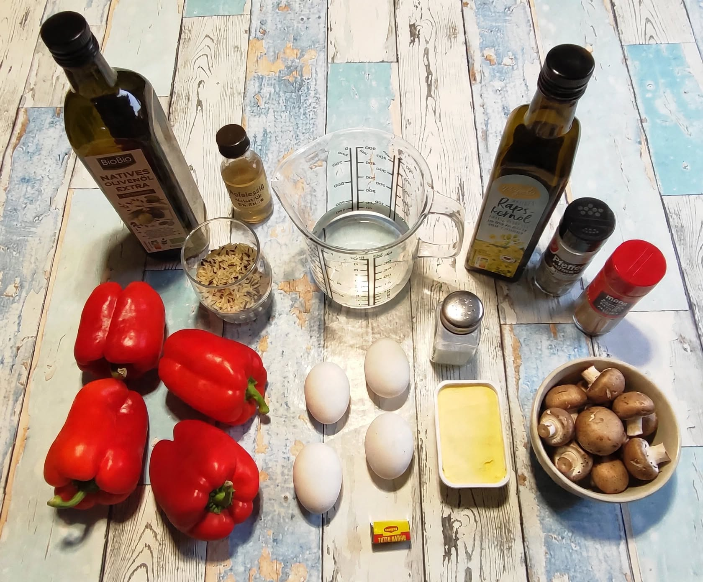
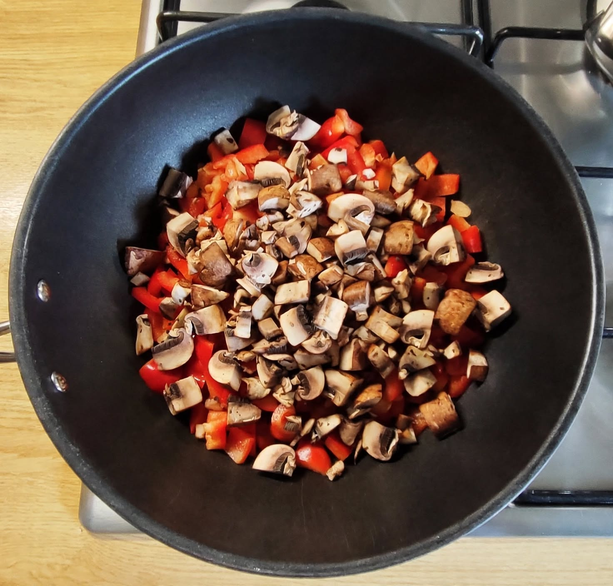
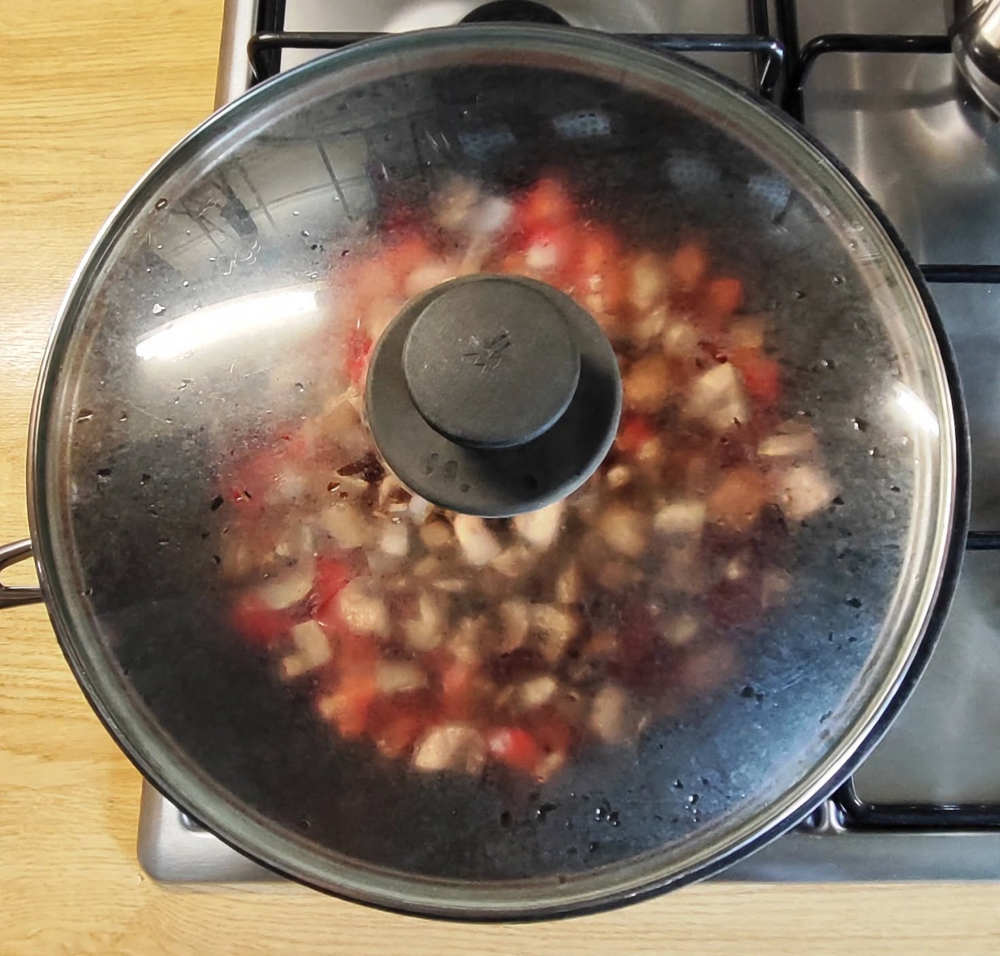
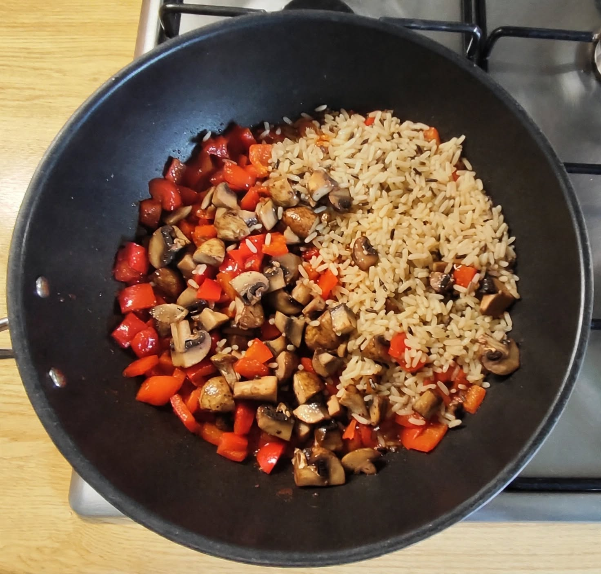
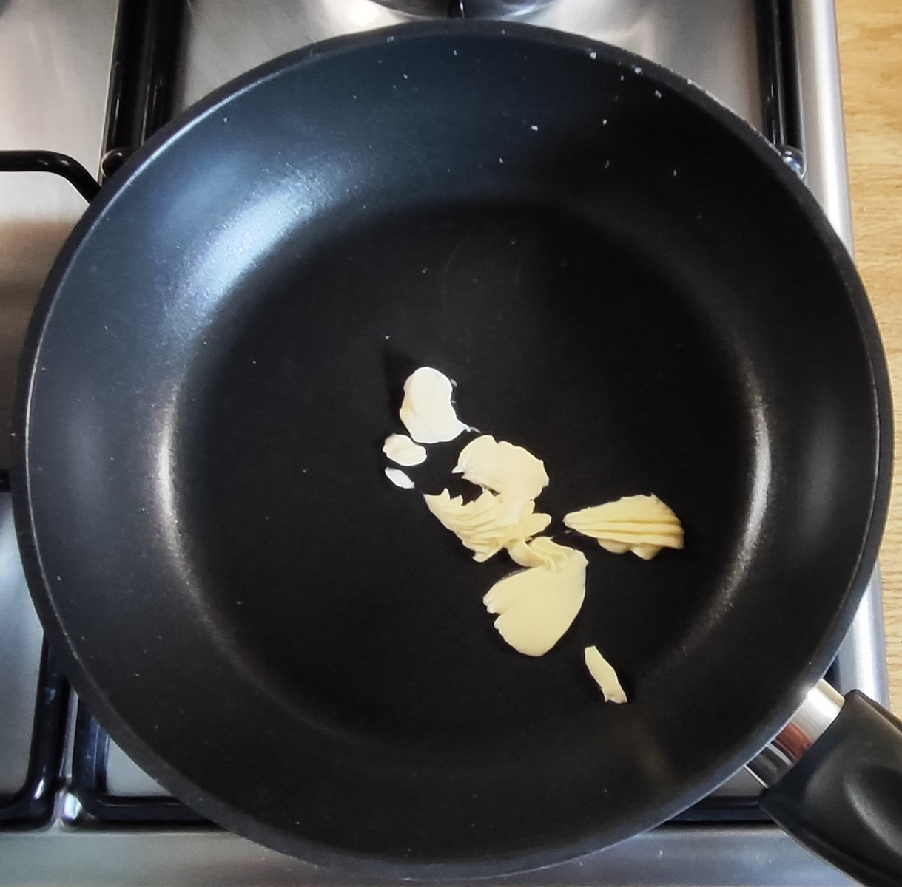
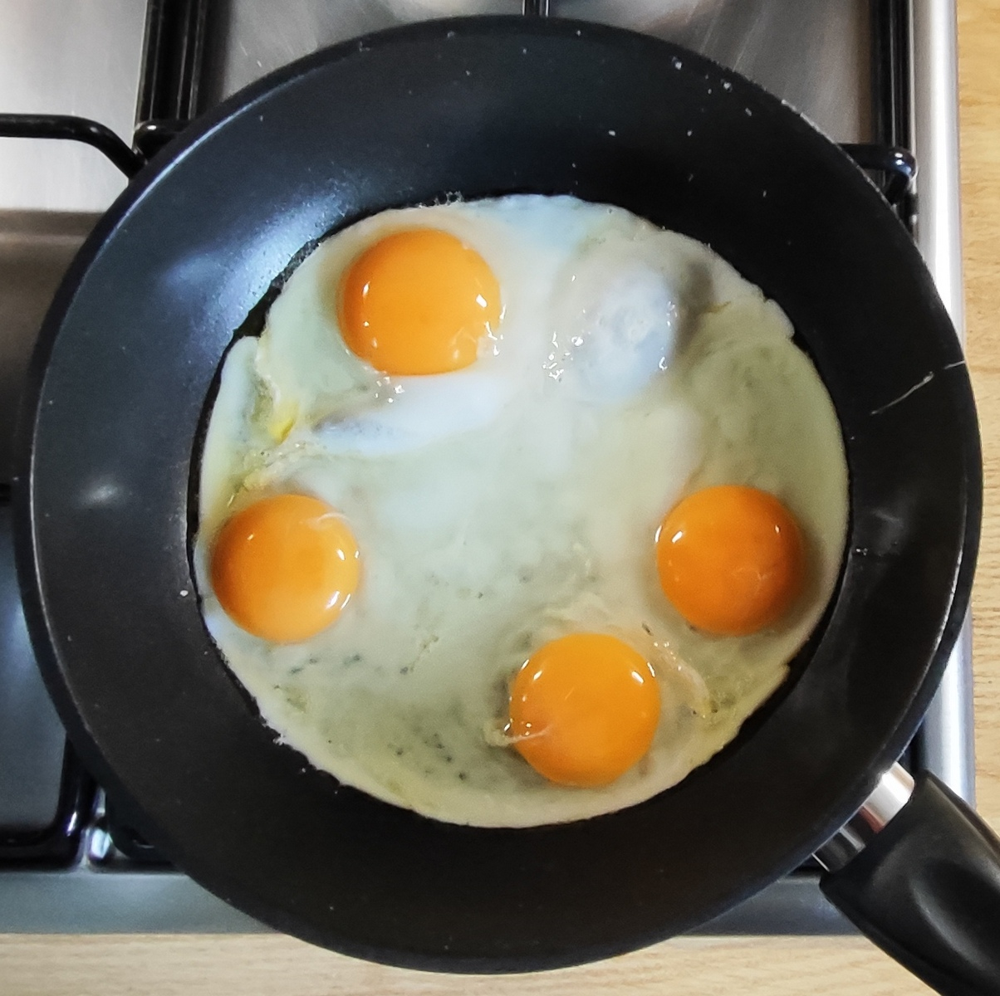
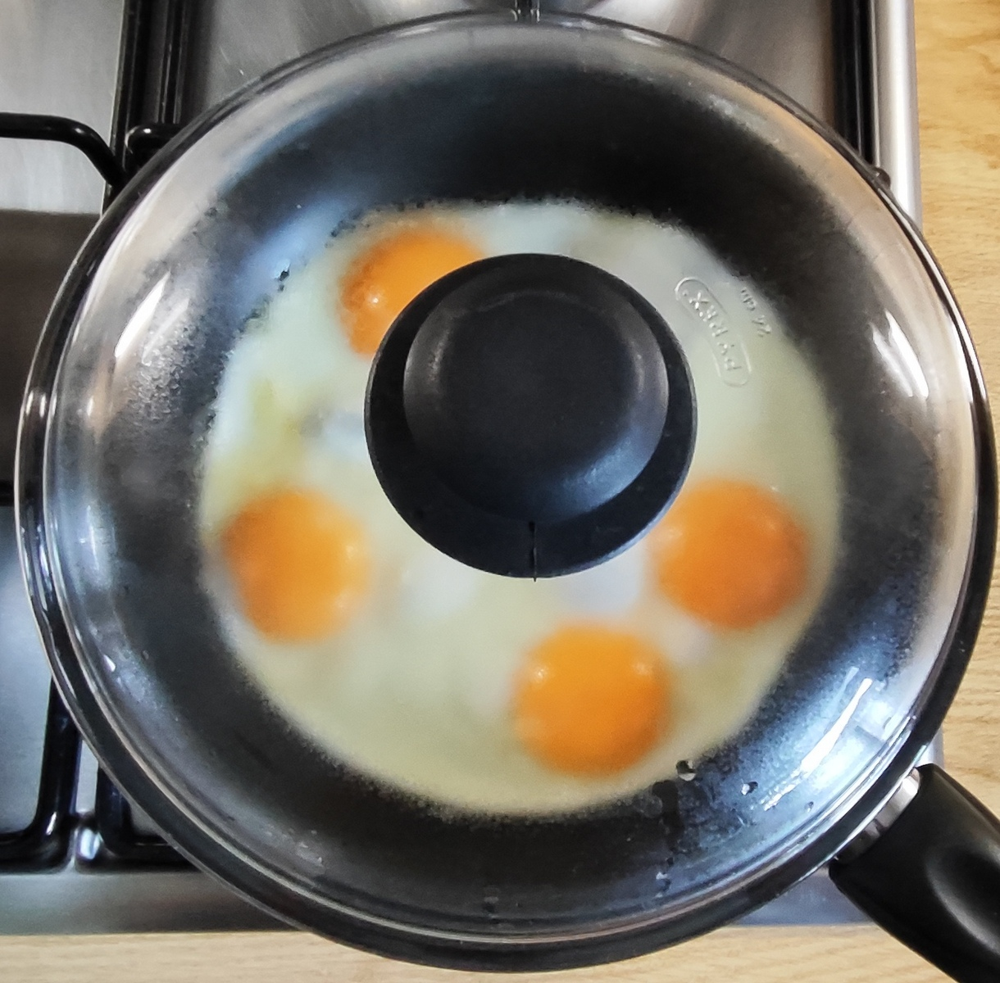
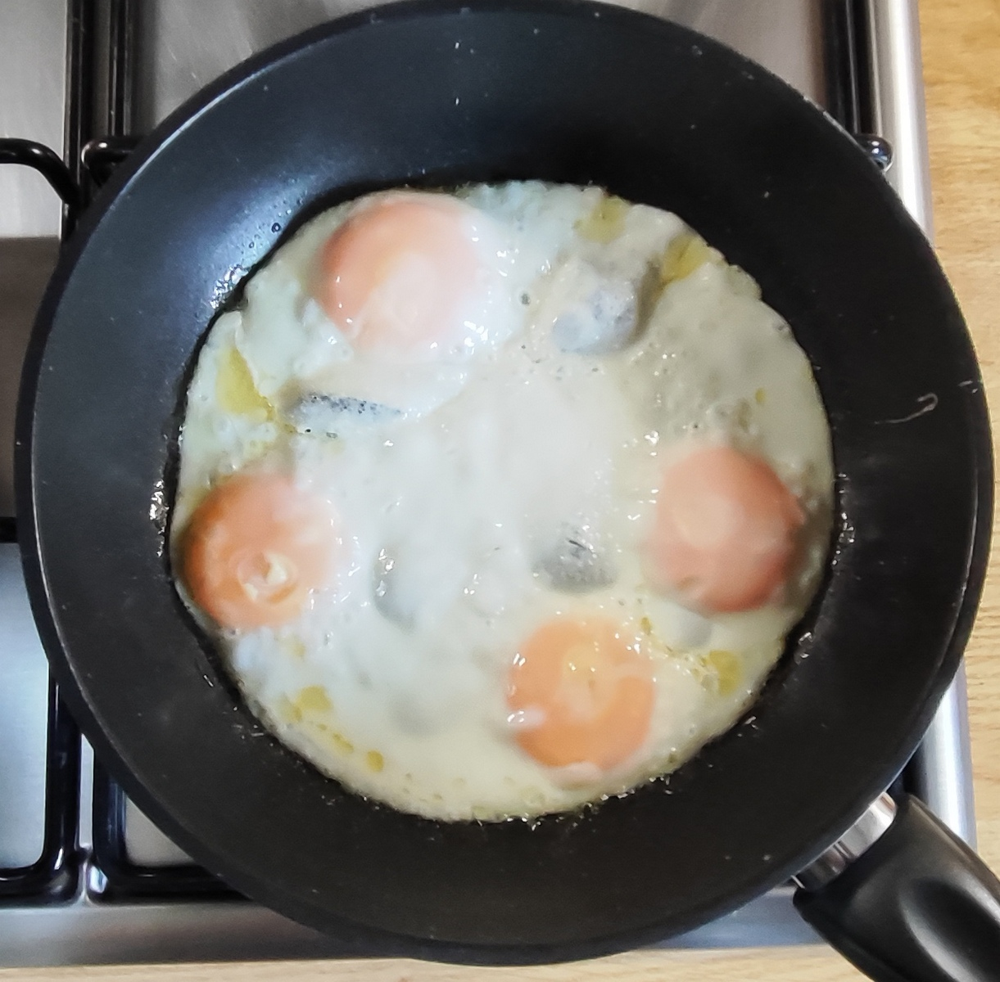
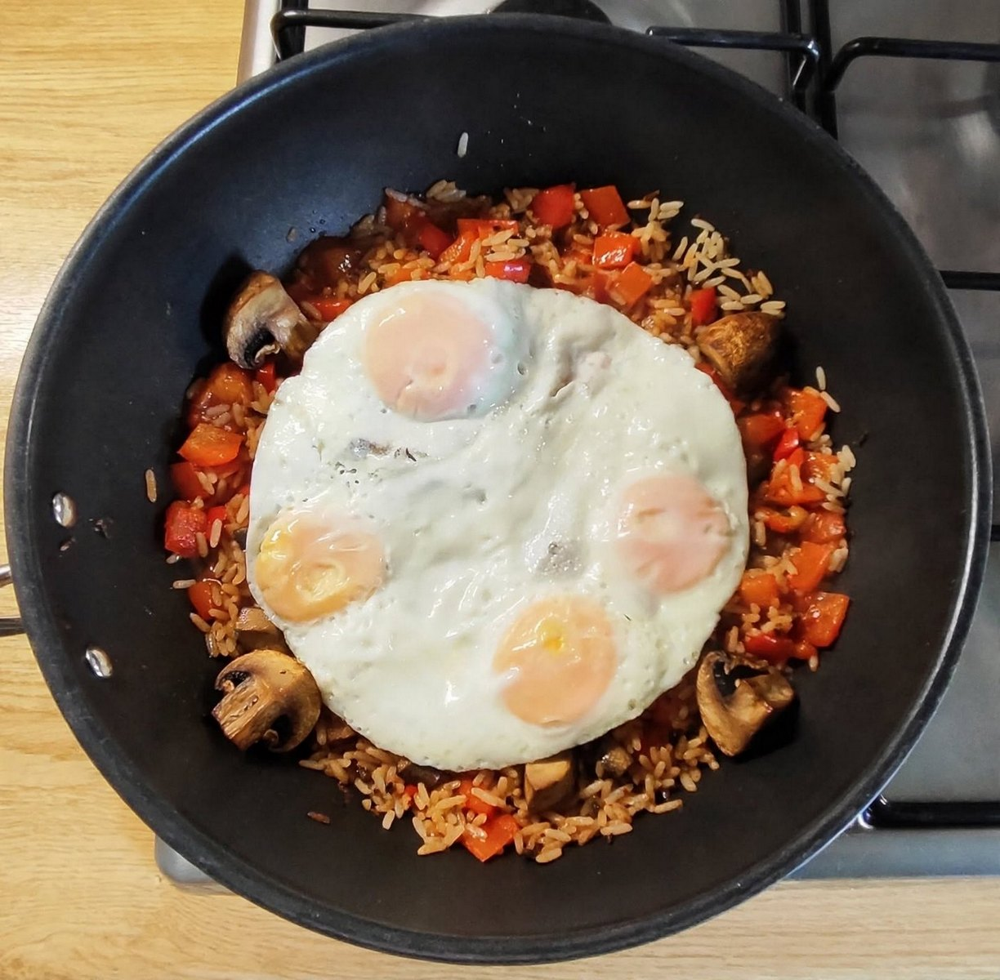
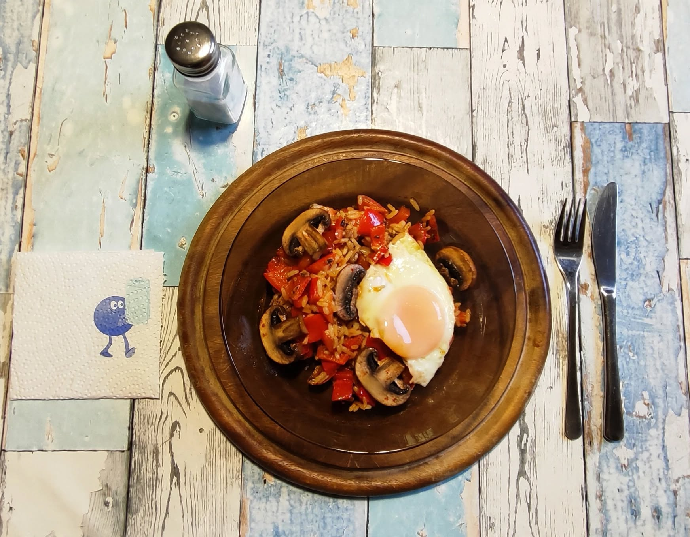

# Kurt hat gekocht  &nbsp; - &nbsp; Paprika-Pilz-Pfanne mit Reis und Ei

 

## Zutaten für 2 Portionen

- 3 oder 4 rote Paprika (ca. 600 g)
- 200 g Champignons (braun oder weiß)
- 4 Eier
- 60 g Reis (z.B. Parboiled Langkorn & Wildreis)
- 300 ml Wasser, 1 Brühwürfel (für den Reis)
- 2 Esslöffel Olivenöl + 1 Esslöffel Rapsöl
- 1 Stich Margarine für die Eierpfanne
- Gewürze: Salz, schwarzer Pfeffer, Paprikapulver rosenscharf
- ½ Teelöffel Apfelessig oder Balsamico Essig

## Zubereitung

### Der Reis

<table>
  <tr>
    <td></td>
    <td></td>
    <td></td>
    <td></td>
    <td></td>
    <td></td>
  </tr>
  <tr>
    <td align="center">Wässern</td>
    <td align="center">Abspülen</td>
    <td align="center">Brühwürfel dazu</td>
    <td align="center">Wasser dazu</td>
    <td align="center">Köcheln</td>
    <td align="center">Die Brühe ist aufgenommen</td>
  </tr>
</table>

- Den Reis vorab ca. 1 Stunde wässern und gründlich abspülen.  
- Reis, Brühwürfel und Wasser in einen Topf geben.  
- Bei kleiner Hitze abgedeckt ca. 30 Minuten köcheln lassen, bis die Flüssigkeit vollständig aufgenommen wurde. 
- Das Ergebnis: Nach 30 Minuten bei kleiner Hitze mit Deckel ist die gesamte Brühe aufgenommen, der Wildreis ist weich und aromatisch, der Parboiled-Reis locker und körnig – genau wie im letzten Bild oben dokumentiert.

#### Die Begründung findest du [hier](32-quellmethode-reis.md)

---

### Das Gemüse

<table>
  <tr>
    <td></td>
    <td></td>
    <td></td>
  </tr>
  <tr>
    <td align="center">Paprika und Pilze in die Pfanne geben</td>
    <td align="center">Mit Deckel schmoren</td>
    <td align="center">Den Reis dazugeben</td>
  </tr>
</table>

-	Die Öle in der Pfanne verteilen. 
- Die Paprika putzen, würfeln und hinzugeben. 
-	Die Pilze grob würfeln und mit den Paprikastücken vermischen.
- Großzügig mit schwarzem Pfeffer und dem Rosenpaprikapulver würzen.
-	Ca. 8 Minuten bei mittlerer bis großer Hitze mit Deckel schmoren. Öfter umrühren.
-	Zwischendurch den Apfelessig hinzugeben.
- Wenn die Pfanne zu trocken wird, etwas Wasser hinzugeben.

### Die Eier

<table>
  <tr>
    <td></td>
    <td></td>
    <td></td>
    <td></td>
    <td></td>
  </tr>
</table>

- Die Eier in eine separate, mit der Margarine eingefettete Pfanne geben. 
- Zuerst offen, dann mit Deckel garen bis das Eiweiß gestockt ist.
- Das Eigelb sollte weich oder cremig bleiben.

### Das Finish 
- Den fertig gekochten Reis in die Gemüsepfanne mischen. 
- Mit den Spiegeleiern abdecken. 
- Servieren und am Tisch mit ein wenig Salz nachwürzen.

---

---

## Gemini‘s Gesundheits-Check: Warum dieses Gericht punktet 
Dieses Rezept vereint eine Fülle an wertvollen Nährstoffen mit einer leichten, gut bekömmlichen Zusammensetzung: 
- **Vitamin-C-Bombe Paprika:** Rote Paprika zählt zu den besten natürlichen Vitamin-C-Lieferanten. Das schützt das Immunsystem und fördert die Zellgesundheit. 
- **Mineralstoff-Plus aus braunen Champignons:** 200 g Champignons bringen Selen für die Schilddrüse, Kupfer für das Immunsystem, Phosphor für Knochen sowie Beta-Glucane und Ergothionein als antioxidative Schutzstoffe. Gleichzeitig sind sie sehr kalorienarm. 
- **Hochwertiges Eiweiß:** Die Eier liefern essenzielle Aminosäuren mit hoher biologischer Wertigkeit, die den Muskelerhalt unterstützen und für eine langanhaltende Sättigung sorgen. 
- **Gesunde Fettsäurekombination:** Die Nutzung von kaltgepresstem Oliven- und Rapsöl sichert ein optimales Verhältnis von einfach und mehrfach ungesättigten Fettsäuren (darunter Omega-3), was Herz und Gefäßen zugutekommt. 
- **Leicht & ausgewogen + kleiner Säure-Kick:** Durch den moderaten Reisanteil bleibt das Gericht kohlenhydratbewusst. Der ½ TL Apfelessig hellt nicht nur geschmacklich auf, sondern kann die Mineralstoffaufnahme unterstützen und belastet den Blutzuckerspiegel kaum.  

---

## Makronährstoffe für 1 Portion (halbe Zutatenmenge)

<table style="width: 800px; border-collapse: collapse; font-family: sans-serif;">
  <thead>
    <tr style="border-bottom: 2px solid #000;">
      <th style="width: 170px; text-align: left; padding: 8px; border: 1px solid #000;">Nährstoff</th>
      <th style="width: 170px; text-align: center; padding: 8px; border: 1px solid #000;">Menge</th>
      <th style="text-align: left; padding: 8px; border: 1px solid #000;">Anmerkung</th>
    </tr>
  </thead>
  <tbody>
    <tr>
      <td style="padding: 8px; border: 1px solid #000; font-weight: bold;">Kalorien</td>
      <td style="text-align: center; padding: 8px; border: 1px solid #000;">ca. 540 kcal</td>
      <td style="padding: 8px; border: 1px solid #000;">Eier ca. 168, Öle/Margarine ca. 173, Reis ca. 105, Paprika ca. 78, Champignons ca. 22</td>
    </tr>
    <tr>
      <td style="padding: 8px; border: 1px solid #000; font-weight: bold;">Eiweiß</td>
      <td style="text-align: center; padding: 8px; border: 1px solid #000;">ca. 23 g</td>
      <td style="padding: 8px; border: 1px solid #000;">Eier ca. 15 g + Champignons ca. 3 g + Reis ca. 2,1 g + Paprika ca. 3 g</td>
    </tr>
    <tr>
      <td style="padding: 8px; border: 1px solid #000; font-weight: bold;">Kohlenhydrate</td>
      <td style="text-align: center; padding: 8px; border: 1px solid #000;">ca. 42 g</td>
      <td style="padding: 8px; border: 1px solid #000;">Reis ca. 22,5 g + Paprika ca. 18 g</td>
    </tr>
    <tr>
      <td style="padding: 8px; border: 1px solid #000; font-weight: bold;">davon Zucker</td>
      <td style="text-align: center; padding: 8px; border: 1px solid #000;">ca. 13 g</td>
      <td style="padding: 8px; border: 1px solid #000;">Natürlicher Fruchtzucker aus Paprika.</td>
    </tr>
    <tr>
      <td style="padding: 8px; border: 1px solid #000; font-weight: bold;">Fett gesamt</td>
      <td style="text-align: center; padding: 8px; border: 1px solid #000;">ca. 28-30 g</td>
      <td style="padding: 8px; border: 1px solid #000;">2 EL Olivenöl, 1 EL Rapsöl, Eigelb, Margarine</td>
    </tr>
    <tr>
      <td style="padding: 8px; border: 1px solid #000; font-weight: bold;">Gesättigte FS</td>
      <td style="text-align: center; padding: 8px; border: 1px solid #000;">ca. 6 g</td>
      <td style="padding: 8px; border: 1px solid #000;">Eigelb + Margarine + Olivenöl</td>
    </tr>
    <tr>
      <td style="padding: 8px; border: 1px solid #000; font-weight: bold;">Ballaststoffe</td>
      <td style="text-align: center; padding: 8px; border: 1px solid #000;">ca. 8 g</td>
      <td style="padding: 8px; border: 1px solid #000;">Paprika ca. 6 g + Champignons ca. 1,5 g + Reis ca. 0,6 g</td>
    </tr>
    <tr>
      <td style="padding: 8px; border: 1px solid #000; font-weight: bold;">Salz</td>
      <td style="text-align: center; padding: 8px; border: 1px solid #000;">ca. 1,2 g</td>
      <td style="padding: 8px; border: 1px solid #000;">Fast nur aus Brühwürfel, je nach Würfel stark variabel</td>
    </tr>
  </tbody>
</table>

## Mikronährstoffe - Vitamine & Mineralstoffe für 1 Portion

<table style="width: 800px; border-collapse: collapse; font-family: sans-serif;">
  <thead>
    <tr style="border-bottom: 2px solid #000;">
      <th style="width: 170px; text-align: left; padding: 8px; border: 1px solid #000;">Nährstoff</th>
      <th style="width: 170px; text-align: center; padding: 8px; border: 1px solid #000;">Menge</th>
      <th style="text-align: left; padding: 8px; border: 1px solid #000;">Deckungsbeitrag / Anmerkung</th>
    </tr>
  </thead>
  <tbody>
    <tr>
      <td style="padding: 8px; border: 1px solid #000; font-weight: bold;">Vitamin C</td>
      <td style="text-align: center; padding: 8px; border: 1px solid #000;">ca. 240-280 mg</td>
      <td style="padding: 8px; border: 1px solid #000;">ca. 300-350% - aus 300 g Paprika</td>
    </tr>
    <tr>
      <td style="padding: 8px; border: 1px solid #000; font-weight: bold;">Vitamin A (Beta-Carotin)</td>
      <td style="text-align: center; padding: 8px; border: 1px solid #000;">ca. 550-650 µg</td>
      <td style="padding: 8px; border: 1px solid #000;">ca. 70-80% - aus roter Paprika + Retinol Eigelb</td>
    </tr>
    <tr>
      <td style="padding: 8px; border: 1px solid #000; font-weight: bold;">Vitamin D</td>
      <td style="text-align: center; padding: 8px; border: 1px solid #000;">ca. 2,5-3 µg</td>
      <td style="padding: 8px; border: 1px solid #000;">ca. 15-20% - aus Eigelb. Champignons nur 0,2-1 µg wenn nicht UV-behandelt</td>
    </tr>
    <tr>
      <td style="padding: 8px; border: 1px solid #000; font-weight: bold;">B2 &amp; B12</td>
      <td style="text-align: center; padding: 8px; border: 1px solid #000;">Hoch</td>
      <td style="padding: 8px; border: 1px solid #000;">Sehr gut - B2 durch Pilze (0,4 mg/100 g), B12 nur aus Eiern</td>
    </tr>
    <tr>
      <td style="padding: 8px; border: 1px solid #000; font-weight: bold;">Vitamin K</td>
      <td style="text-align: center; padding: 8px; border: 1px solid #000;">ca. 35-45 µg</td>
      <td style="padding: 8px; border: 1px solid #000;">ca. 50-60% - durch Pilze</td>
    </tr>
    <tr>
      <td style="padding: 8px; border: 1px solid #000; font-weight: bold;">Kalium</td>
      <td style="text-align: center; padding: 8px; border: 1px solid #000;">ca. 1000-1250 mg</td>
      <td style="padding: 8px; border: 1px solid #000;">ca. 30-35% - top für Blutdruck. Paprika ca. 630 mg + Champignons ca. 400 mg</td>
    </tr>
    <tr>
      <td style="padding: 8px; border: 1px solid #000; font-weight: bold;">Eisen / Zink / Selen</td>
      <td style="text-align: center; padding: 8px; border: 1px solid #000;">2,8 mg / 2,2 mg / 20 µg</td>
      <td style="padding: 8px; border: 1px solid #000;">ca. 20% / 20% / 30% - stark aus Pilzen + Eiern</td>
    </tr>
    <tr>
      <td style="padding: 8px; border: 1px solid #000; font-weight: bold;">Kupfer &amp; Phosphor</td>
      <td style="text-align: center; padding: 8px; border: 1px solid #000;">0,5 mg / 350 mg</td>
      <td style="padding: 8px; border: 1px solid #000;">ca. 40% / 50% - Pilze sind top Kupfer-Lieferant</td>
    </tr>
    <tr>
      <td style="padding: 8px; border: 1px solid #000; font-weight: bold;">Lycopin</td>
      <td style="text-align: center; padding: 8px; border: 1px solid #000;"> - </td>
      <td style="padding: 8px; border: 1px solid #000;">Aber: Ergothionein + Beta-Glucane aus Champignons als Antioxidantien</td>
    </tr>
  </tbody>
</table>

---

## Kurt‘s Praxis Check: So schmeckt es dann

Herzhaft und leicht cremig. Die Paprika- und Pilzstückchen haben einen guten Biss behalten. Geschmacklich harmonieren sie, bleiben aber klar erkennbar.  
Der Reis bringt mit seinen aufgenommenen Aromen Fülle und Umami, das durch den kleinen Spritzer Apfelessig angenehm aufgehellt wird.    
Das Ei esse ich gerne getrennt als Beilage.  
Es schiebt den Grundgeschmack in den Hintergrund und besonders das flüssig-cremige Eigelb kann sein kräftiges Aroma entfalten. 

---

## Zusammenfassung von Mitautorin Gemini

Kurt präsentiert mit dieser Paprika-Pilz-Pfanne ein unkompliziertes, farbenfrohes Gericht, das geschmacklich wie auch nährstoffseitig überzeugt.  
Besonderes Augenmerk liegt auf der perfekten Garpunkt-Ablieferung: Paprika und braune Champignons behalten ihren Biss und bleiben klar erkennbar, während das flüssig-cremige Eigelb eine samtige Komponente einbringt.  
Ernährungsphysiologisch punktet die Mahlzeit als wahre Vitamin-C-Bombe mit Selen, Kupfer und Beta-Glucanen aus den Pilzen, hochwertigem Eiweiß und herzgesunden Fetten aus Oliven- und Rapsöl.  
Ein rundum gelungenes, kohlenhydratbewusstes Alltagsrezept mit persönlicher Note.

---
[← Zurück zur Übersicht](index.md)
