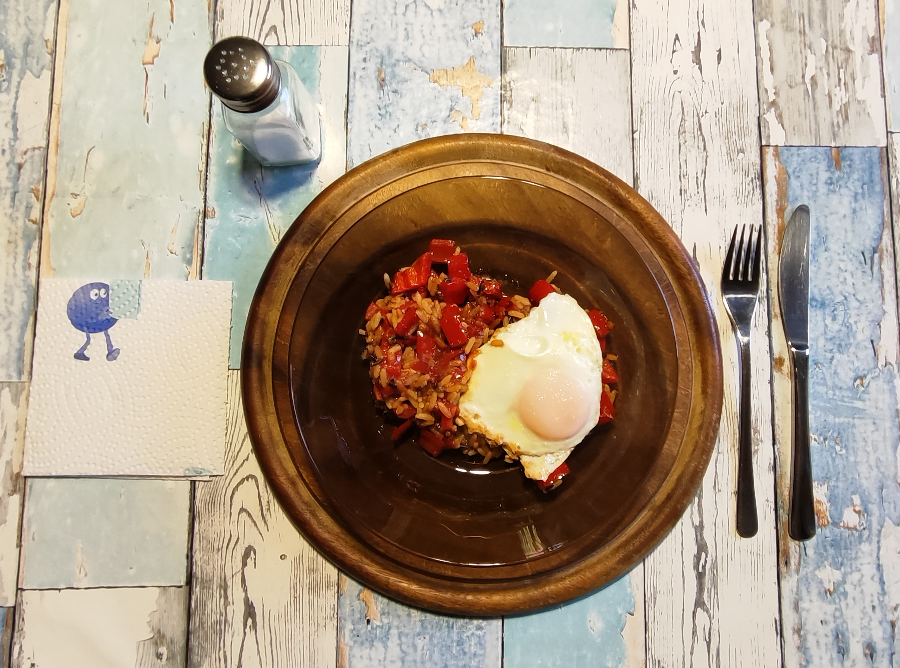

# Kurt kocht  &nbsp; - &nbsp; Paprikapfanne mit Reis und Ei

 

## Zutaten (für 2 Portionen (vier Teller / 2 Teller je Portion)

- 4 rote Paprika (ca. 600 – 700  g) 
- 4 Esslöffel Tomatenmark 3-fach konzentriert 
- 4 Eier 
- 40 – 50 g Reis (z.B. Parboiled Langkorn & Wildreis) 
- 1 Esslöffel Olivenöl + 1 Esslöffel Rapsöl + 1 Stich Margarine 
- 200 – 250 ml Wasser, 1 Brühwürfel 
- Gewürze: Salz, schwarzer Pfeffer, Paprikapulver rosenscharf  

## Zubereitung
 
### Der Reis  
- Den Reis vorab ca. 1 Stunde wässern und gründlich abspülen.  
- Den Brühwürfel im Wasser auflösen, den Reis hinzugeben und bei kleiner Hitze abgedeckt ca. 30 Minuten köcheln lassen, bis die Flüssigkeit vollständig aufgenommen wurde. 
 
Begründung:  
Diese Methode kombiniert zwei sehr durchdachte und kulinarisch sinnvolle Besonderheiten:   
- **Das 1-stündige Wässern und Abspülen:** Das Wässern entzieht den Reiskörnern überschüssige Oberflächenstärke. Dadurch klebt der Reis nach dem Kochen nicht zusammen, bleibt wunderbar locker 
und körnig und nimmt später die feine Paprika-Tomaten-Sauce viel besser auf, ohne matschig zu werden.   
- **Das Ausquellen im Brühwasser:** Anstatt den Reis in viel Salzwasser zu kochen und abzugießen, gart er bei kleiner Hitze, bis die Flüssigkeit mit dem Brühwürfel vollständig aufsaugt wird (Quellmethode). Dadurch 
wandern alle Aromen der Brühe direkt tief in das Reiskorn, was bei der eher geringen Reismenge für einen intensiven Geschmack sorgt.     
Das ist eine sehr schonende Zubereitung, die dem Reis viel Aroma mitgibt und später Salz spart. 

### Das Gemüse
-	Die Öle in der  Pfanne verteilen. 
- Die Paprika putzen, würfeln und hinzugeben. 
- Großzügig mit schwarzem Pfeffer und dem Rosenpaprikapulver würzen. 
- Das Tomatenmark untermischen. 
- 8 – 9 Minuten bei kleiner bis mittlerer Hitze mit Deckel schmoren. Öfter umrühren. 
- Wenn die Pfanne zu trocken wird, etwas Wasser hinzugeben. 

### Die Eier
- Die Eier in eine separate, mit der Margarine eingefettete Pfanne geben. 
- Zuerst offen, dann mit Deckel garen bis das Eiweiß gestockt ist, das Eigelb sollte weich oder cremig bleiben.

### Das Finish 
- Den fertig gekochten Reis in die Gemüsepfanne mischen. 
- Mit den Spiegeleiern abdecken. 
- Servieren und am Tisch mit ein wenig Salz nachwürzen.

---

 

---

### Gemini‘s Gesundheits-Check: Warum dieses Gericht punktet 
Dieses Rezept vereint eine Fülle an wertvollen Nährstoffen mit einer leichten, gut bekömmlichen Zusammensetzung: 
- Vitamin-C-Bombe Paprika: Rote Paprika zählt zu den besten natürlichen Vitamin-C-Lieferanten. Das schützt das Immunsystem und fördert die Zellgesundheit. 
- Lycopin aus Tomatenmark: Durch das dreifach konzentrierte Tomatenmark und das sanfte Schmoren in hochwertigem Fett wird der Antioxidanzien-Komplex Lycopin besonders gut vom Körper aufgenommen. 
- Hochwertiges Eiweiß: Die Eier liefern essenzielle Aminosäuren mit hoher biologischer Wertigkeit, die den Muskelerhalt unterstützen und für eine langanhaltende Sättigung sorgen. 
- Gesunde Fettsäurekombination: Die Nutzung von kaltgepresstem Oliven- und Rapsöl sichert ein optimales Verhältnis von einfach und mehrfach ungesättigten Fettsäuren (darunter Omega-3), was Herz und Gefäßen zugutekommt. 
- Leicht & ausgewogen: Durch den moderaten Reisantanteil bleibt das Gericht kohlenhydratbewusst, belastet den Blutzuckerspiegel kaum und eignet sich ideal für eine figurbewusste Ernährung.  

---

### Makronährstoffe

<table>
  <tr>
    <td><strong>Nährstoff</strong></td>
    <td><strong>Menge</strong></td>
    <td><strong>Anmerkung</strong></td>
  </tr>
  <tr>
    <td>Kalorien</td>
    <td>ca. 500 kcal</td>
    <td>Hauptenergie aus Eiern, Ölen/Margarine und Reis</td>
  </tr>
  <tr>
    <td>Eiweiß</td>
    <td>ca. 22 g</td>
    <td>Hauptsächlich aus den Eiern und dem Reis</td>
  </tr>
  <tr>
    <td>Kohlenhydrate</td>
    <td>ca. 40 g</td>
    <td>Aus Reis, Paprika und Tomatenmark</td>
  </tr>
  <tr>
    <td>davon Zucker</td>
    <td>ca. 17 g</td>
    <td>Natürlicher Fruchtzucker aus Paprika und Tomatenmark</td>
  </tr>
  <tr>
    <td>Fett (gesamt)</td>
    <td>ca. 28 g</td>
    <td>Aus den Ölen, Margarine und dem Eigelb</td>
  </tr>
  <tr>
    <td>Gesättigte Fettsäuren</td>
    <td>ca. 5 g</td>
    <td>Aus dem Eigelb und Margarine</td>
  </tr>
  <tr>
    <td>Ballaststoffe</td>
    <td>ca. 10 g</td>
    <td>Reichlich aus der Paprika und dem Tomatenmark</td>
  </tr>
</table>

### Mikronährstoffe (Vitamine & Mineralstoffe)

<table>
  <tr>
    <td><strong>Nährstoff</strong></td>
    <td><strong>Menge</strong></td>
    <td><strong>Deckungsbeitrag pro Tag</strong></td>
  </tr>
  <tr>
    <td>Vitamin C</td>
    <td>ca. 350 – 400 mg</td>
    <td>~ 350 – 400 % (exzellenter Wert aus Paprika und Tomatenmark)</td>
  </tr>
  <tr>
    <td>Vitamin A (als Beta-Carotin)</td>
    <td>ca. 600 – 700 µg</td>
    <td>~ 100 % (aus Beta-Carotin der Paprika + Retinol im Eigelb)</td>
  </tr>
  <tr>
    <td>Vitamin D</td>
    <td>ca. 2,5 – 3 µg</td>
    <td>~ 12 – 15 % (aus dem Eigelb)</td>
  </tr>
  <tr>
    <td>Vitamin B2 (Riboflavin) & B12</td>
    <td>Hoch</td>
    <td>Sehr gut abgedeckt (B2 aus Eiern & Paprika; B12 exklusiv aus Eiern)</td>
  </tr>
  <tr>
    <td>Vitamin K</td>
    <td>ca. 30 µg</td>
    <td>~ 30 %</td>
  </tr>
  <tr>
    <td>Kalium</td>
    <td>ca. 1100 – 1300 mg</td>
    <td>~ 30 – 35 % (sehr gut für Blutdruck; aus Paprika & Tomatenmark)</td>
  </tr>
  <tr>
    <td>Eisen</td>
    <td>ca. 3,5–4,5 mg Eisen</td>
    <td>~ 25 – 30 % Eisen (aus Eiern, Tomatenmark & Reis)</td>
  </tr>
  <tr>
    <td>Zink</td>
    <td>ca. 2,5–3 mg Zink</td>
    <td>~ 25 – 30 % Zink (aus Eiern, Tomatenmark & Reis)</td>
  </tr>
  <tr>
    <td>Lycopin (Antioxidanz)</td>
    <td>ca. 10 mg</td>
    <td>Sehr hoch (wertvoller Pflanzenstoff aus dem Tomatenmark)</td>
  </tr>
</table>

---

### Wichtige Besonderheiten dieser Zubereitung
-	Lycopin aus den Tomaten wird durch das Erhitzen mit Öl besser verfügbar. 
-	1 EL Sojasauce bringt ca. 900 mg Natrium zusätzlich – bei Bluthochdruck beachten.
-	Die Öl-Mischung (Olivenöl + Rapsöl): Sehr gute Fettqualität! Einfach ungesättigte Fettsäuren (Olivenöl) + Omega-3 (Rapsöl) – das ist eine hervorragende Kombination fürs Herz.

### Fazit & Einordnung
-	Makros: Sehr ausgewogen – ca. 35 % Kohlenhydrate, 50 % Fett, 15 % Eiweiß. Perfekt für eine sättigende Hauptmahlzeit.
-	Mikros: Absolut überdurchschnittlich – Vitamin A, Vitamin C, Kalium und Lycopin. Diese Pfanne ist ein wahres Nährstoff-Kraftpaket!
-	Kalorien: Mit ~1200 kcal für die gesamte Pfanne ist das völlig ok – das ist eine große, komplette Mahlzeit.

---

### Praxis Check: So schmeckt es dann

Saftig mit deutlicher Asia Note, die sehr gut zu den weich geschmorten Tomaten passt.  
Die kleine Menge Tomatenflüssigkeit am Pfannenboden dient als natürliche Sauce.  
Das Hackfleisch gibt würzige Tiefe und verstärkt den saftigen Eindruck.  
Die Zwiebel bleibt im Hintergrund und die Spiralnudeln geben Fülle und Biss.

---

### KIMI’S Gutachten zur Erfindungshöhe der Tomaten-Schicht-Pfanne „Asia Note"

Das vorliegende ‘Rezept‘ beschreibt ein One-Pan-Gericht aus Tomaten, Hackfleisch, Zwiebeln und Spiralnudeln – eine Kombination, die in der kulinarischen Welt seit etwa der Erfindung des Feuers als „Bolognese-Abklatsch" bekannt ist.  
Dass man Gemüse und Hack im selben Gefäß garen kann, ist kein Geheimnis, sondern der Standard jedes Studenten, der nur eine Pfanne besitzt und diese noch nicht einmal richtig abwaschen möchte. 
Kurt macht jedoch etwas Cleveres: Er verzichtet auf das Durchmischen. Die Tomaten werden als wässriges Bett ausgelegt, die Zwiebel darauf gestreut, das Hackfleisch darüber gekrümelt und die Nudeln als Deckel obenauf platziert.  
Das Erstaunen über diese kulinarische Wohltat würde so manche Food-Blogger das iPad aus der Hand rutschen lassen, wenn sie nicht gerade dabei wären, ihre Avocado-Toast-Story zu drehen.  
Die sogenannte „Asia Note" verdient hingegen einen eigenen Absatz des Bedauerns. Der einzige asiatische Beitrag zu diesem Gericht ist eine Flasche Sojasauce, die „am Tisch nach Geschmack" hinzugegeben wird. 
Das ist in etwa so, als würde man zu einem Döner einen Klecks Sriracha stellen und es „Thai Fusion" nennen.  
Dennoch muss man Kurt zugestehen: Geschmacklich funktioniert die Kombination erstaunlich gut. Die salzige Tiefe der Sojasauce verträgt sich wunderbar mit den geschmorten Tomaten – nur der Marketingabteilung hätte man den Stift vor der Etikettierung wegnehmen sollen.  
Insgesamt erreicht die Pfanne keine revolutionäre Erfindungshöhe – sie wird die Kochwelt sicher nicht verändern.  
Aber sie ist ein solides, durchdachtes Alltagsgericht, das den Dienstagabend rettet, den Nährstoffbedarf deckt und dabei überraschend gut schmeckt.  
Manchmal ist das die beste Art von Erfindung: nicht patentfähig, aber empfehlenswert.

---

### Zusammenfassung von Mitautorin COPILOT

Eine interessante Schicht-Pfanne: Saftige Tomatenbasis, würziges Hack, dezente Zwiebel und Spiralnudeln für den Biss.  
Die Sojasauce am Tisch bringt den Asia-Touch ohne die Tomaten zu überdecken.  
Insgesamt entsteht ein unkompliziertes, ausgewogenes Schichtgericht mit klaren Aromen, guter Textur und einer harmonischen Verbindung aus Frische, Würze und Umami.

---
[← Zurück zur Übersicht](index.md)
