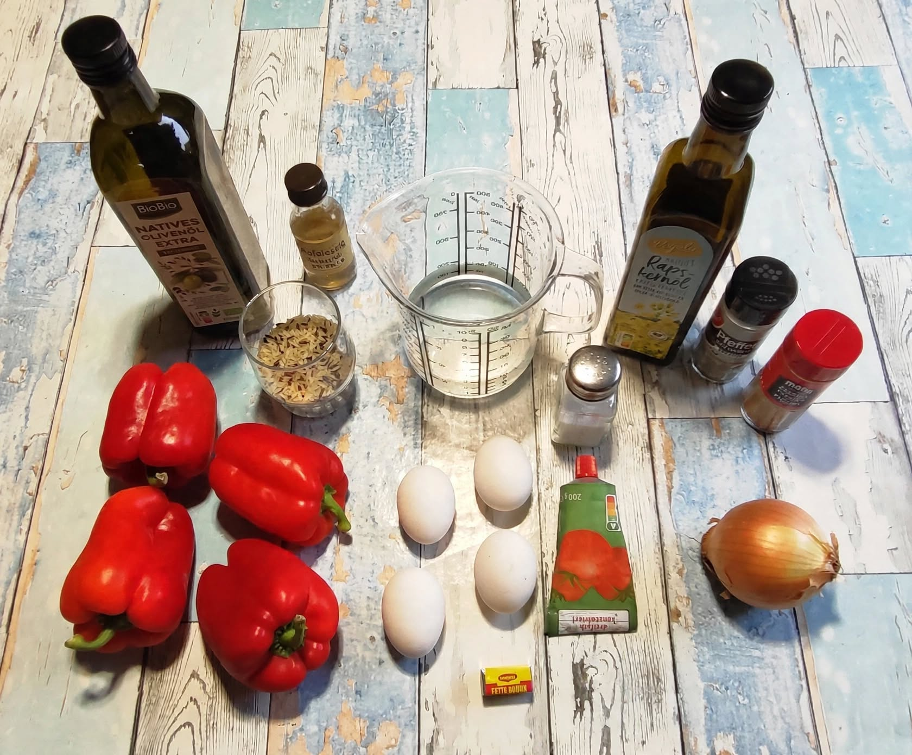
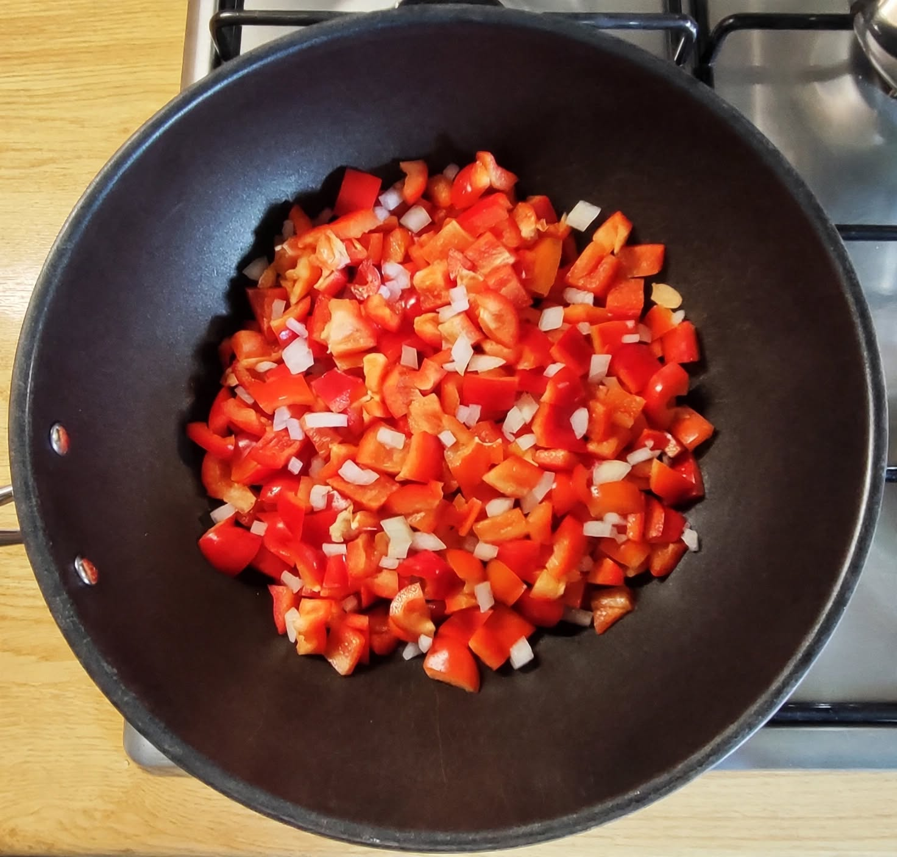
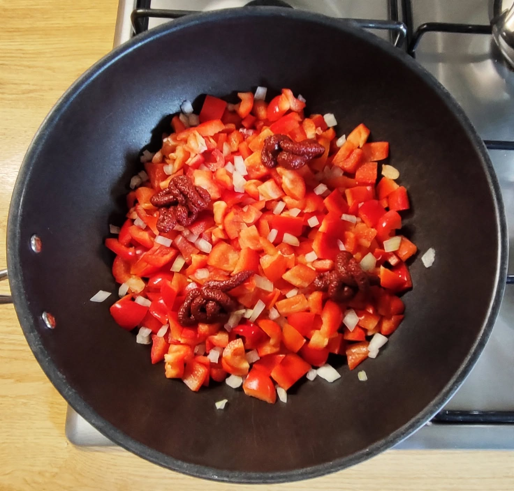
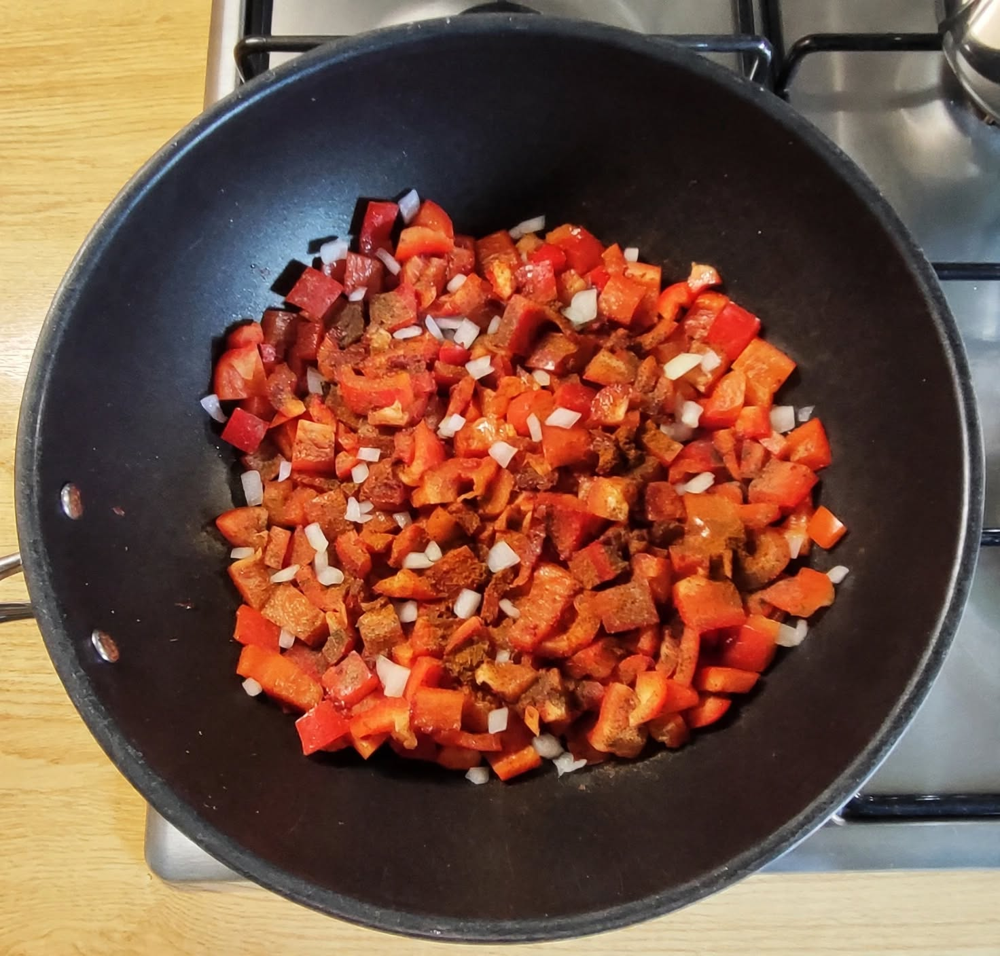
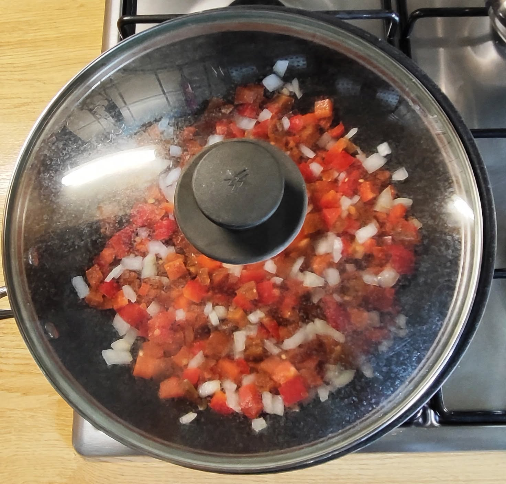
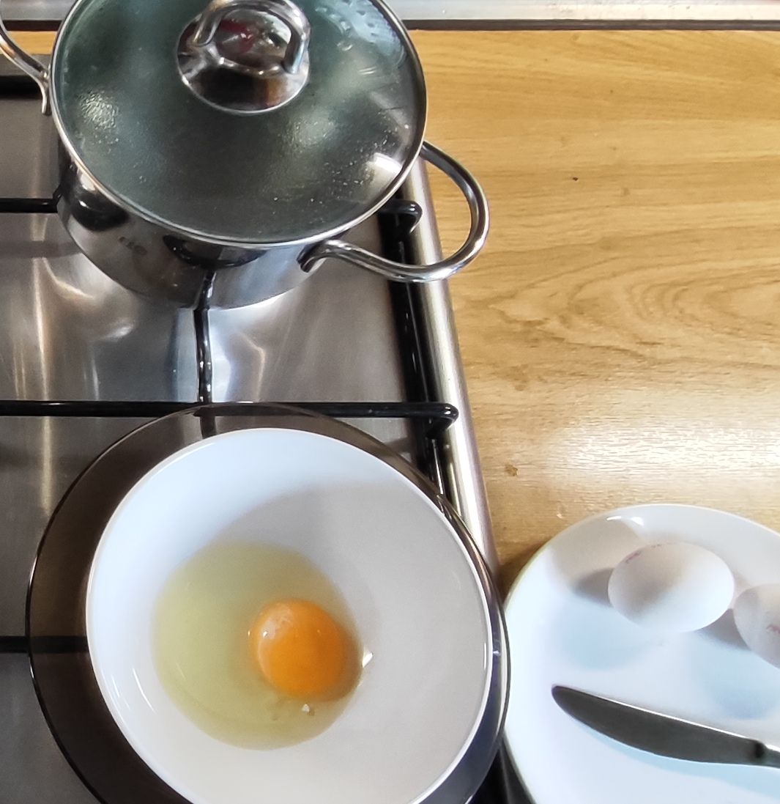
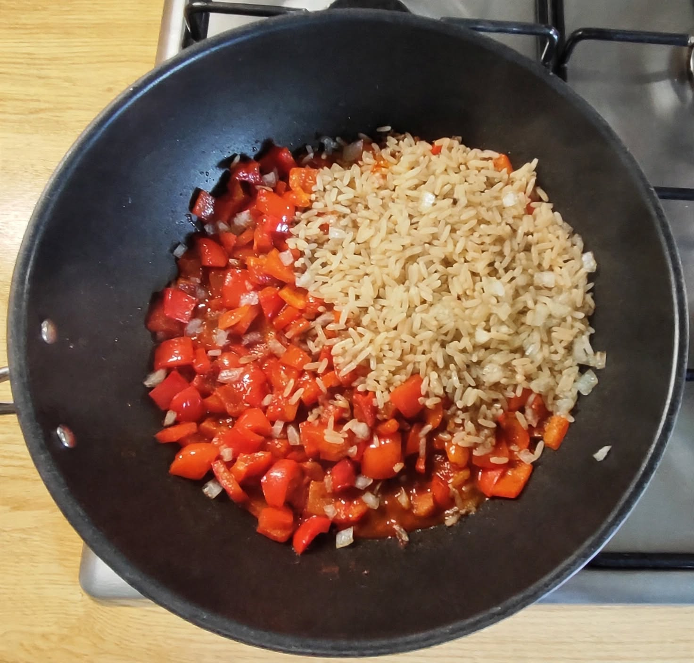
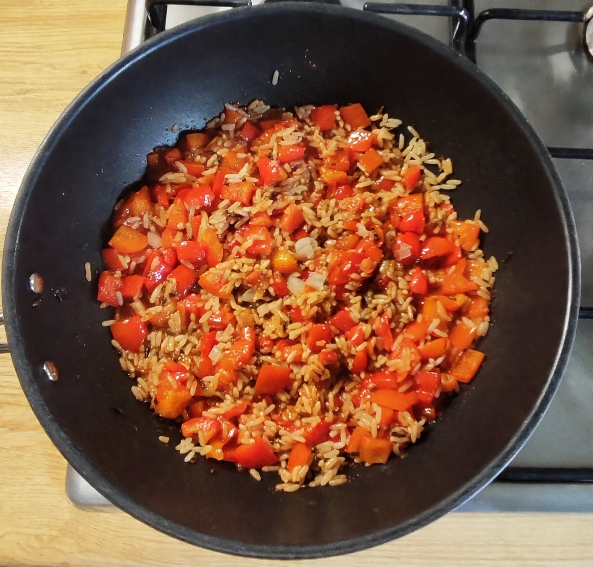
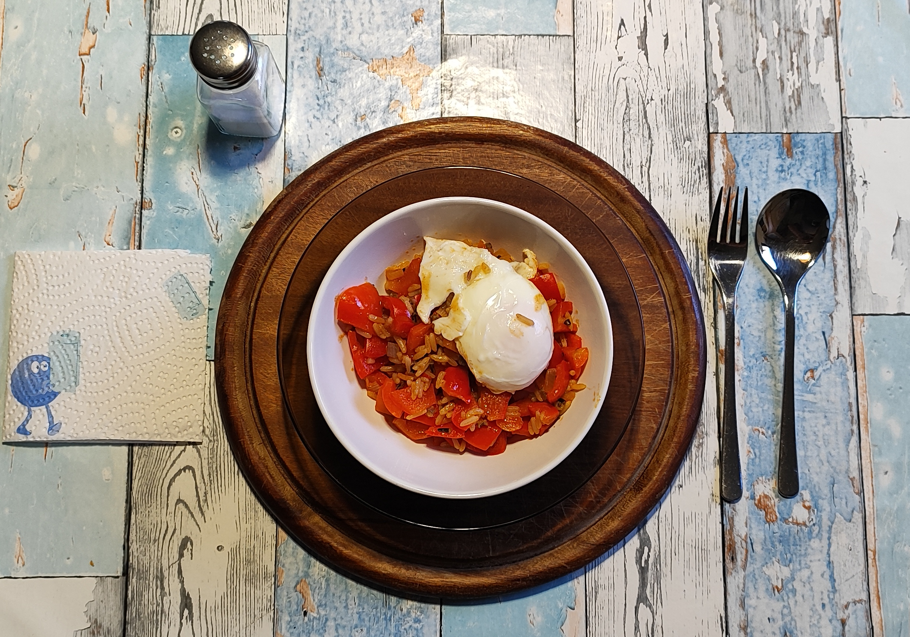

# Kurt hat gekocht  &nbsp; - &nbsp; Paprika-Zwiebel-Pfanne mit Reis und Ei

 

## Zutaten für 2 Portionen

- 4 rote Paprika (ca. 600 – 700  g)
- 1 Zwiebel (mittelgroß)
- 4 Eier
- 1 Esslöffel Tomatenmark 3-fach konzentriert  
- 60 g Reis (z.B. Parboiled Langkorn & Wildreis)
- 350 ml Wasser, 1 Brühwürfel (für den Reis)
- 1 Esslöffel Olivenöl + 1 Esslöffel Rapsöl 
- ½ Teelöffel Apfelessig (oder ein anderer heller Essig)
- 2 Esslöffel Wasser (für die Pfanne) 
- Gewürze: Salz, schwarzer Pfeffer, Paprikapulver rosenscharf  

## Zubereitung

### Der Reis

<table>
  <tr>
    <td></td>
    <td></td>
    <td></td>
    <td></td>
    <td></td>
    <td></td>
  </tr>
  <tr>
    <td align="center">Wässern</td>
    <td align="center">Abspülen</td>
    <td align="center">Brühwürfel dazu</td>
    <td align="center">Wasser dazu</td>
    <td align="center">Köcheln</td>
    <td align="center">Die Brühe ist aufgenommen</td>
  </tr>
</table>

- Den Reis vorab ca. 1 Stunde wässern und gründlich abspülen.  
- Reis, Brühwürfel und Wasser in einen Topf geben.  
- Bei kleiner Hitze abgedeckt ca. 30 Minuten köcheln lassen, bis die Flüssigkeit vollständig aufgenommen wurde. 
 
**Begründung:**  
- **Das 1-stündige Wässern und Abspülen:** Das 1-stündige Wässern und anschließende gründliche Abspülen entzieht den Reiskörnern überschüssige Oberflächenstärke – und gleichzeitig einen Teil des natürlich vorkommenden anorganischen Arsens, das sich vor allem außen am Korn anlagert.  
Dadurch klebt der Reis nach dem Kochen nicht zusammen, bleibt locker und körnig und nimmt später die feine Paprika-Tomaten-Sauce besser auf.   
- **Das Ausquellen im Brühwasser:** Anstatt den Reis in viel Salzwasser zu kochen und abzugießen, gart er bei kleiner Hitze, bis die Flüssigkeit mit dem Brühwürfel vollständig aufsaugt wird (Quellmethode). Dadurch 
wandern alle Aromen der Brühe direkt tief in das Reiskorn, was bei der eher geringen Reismenge für einen intensiven Geschmack sorgt.     
Das ist eine sehr schonende Zubereitung, die dem Reis viel Aroma mitgibt und später Salz spart.
- **Das Verhältnis 1 : 5 (Reis : Wasser) bei der Quellmethode:** Auf den ersten Blick mag diese Wassermenge für die Quellmethode ungewöhnlich hoch erscheinen – die klassische Faustregel für Weißreis liegt bei 1:1,5.  
Hier sind jedoch die spezifische Reiszusammensetzung und die Vorbereitung entscheidend:
  - Parboiled Langkornreis wird industriell unter Druck gedämpft, wodurch die Stärke im Korninneren verkleistert und stabilisiert wird. Das macht die Körner extrem widerstandsfähig – sie zerfallen selbst bei hohem Wasseranteil nicht zu Brei, sondern bleiben fest und getrennt.
  - Wildreis (botanisch ein Sumpfgras-Samen) besitzt eine sehr harte, zähe Außenhülle und benötigt von Natur aus deutlich mehr Flüssigkeit und längere Garzeit, um vollständig aufzuquellen.
  - Das gründliche Abspülen nach dem Wässern entfernt die lose Oberflächenstärke – genau jene Komponente, die bei hohem Wasseranteil normalerweise einen klebrigen „Matsch" erzeugt.
  - Und in 30 min verdampft und entweicht natürlich ein Teil des Wassers trotz Deckel.

Das Ergebnis: Nach 30 Minuten bei kleiner Hitze mit Deckel ist die gesamte Brühe aufgenommen, der Wildreis ist weich und aromatisch, der Parboiled-Reis locker und körnig – genau wie im letzten Bild oben dokumentiert.

### Das Gemüse

<table>
  <tr>
    <td></td>
    <td></td>
    <td></td>
    <td></td>
   </tr>
  <tr>
    <td align="center">Gemüse in die Pfanne</td>
    <td align="center">Tomatenmark dazu</td>
    <td align="center">Durchmischen</td>
    <td align="center">Mit Deckel schmoren</td>
</tr>
</table>

-	Die Öle in der  Pfanne verteilen. 
- Die Paprika putzen, würfeln und hinzugeben.
- Die Zwiebel schälen, klein würfeln und untermischen. 
- Großzügig mit schwarzem Pfeffer und dem Rosenpaprikapulver würzen. 
- Das Tomatenmark und den Apfelessig dazugeben.
- 2 EL Wasser hinzugeben und alles gut durchmischen.
- 8 – 9 Minuten bei mittlerer bis großer Hitze mit Deckel schmoren. Öfter umrühren. 

### Die Eier

<table>
  <tr>
    <td></td>
    <td >Eier pochieren:  2 Liter Wasser erhitzen, bis es siedet (nicht sprudelnd kocht).  Die Eier einzeln in eine Schale aufschlagen und vorsichtig ins Wasser gleiten lassen.  3 Minuten ziehen lassen, bis das Eiweiß fest und das Eigelb weich ist.  Die Eier mit einer Schaumkelle entnehmen (First In - First Out) und abgedeckt beiseite stellen.
    </td>
  </tr> 
</table>

### Das Finish 
<table>
  <tr>
    <td></td>
    <td></td>
    <td>Den fertig gekochten Reis in die Gemüsepfanne mischen.  Mit einem pochierten Ei servieren.</td>
  </tr>
</table>

*Am Tisch eventuell mit ein paar Körnchen Salz nachwürzen.*

---

## Gemini‘s Gesundheits-Check: Warum dieses Gericht punktet 
Dieses Rezept für die Paprika-Zwiebel-Pfanne mit Reis und Ei ist aus ernährungswissenschaftlicher Sicht ein ausgewogenes, nährstoffreiches und leichtes Gericht:  
- **Vitamin-C- & Antioxidantien-Kick:** 600–700 g rote Paprika und Tomatenmark liefern besonders viel Vitamin C und zellschützende Antioxidantien (Carotinoide & Lycopin).  
- **Hochwertiges Eiweiß:** 2 pochierte Eier pro Portion bieten gut verdauliches Protein ohne unnötiges Bratfett.  
- **Gesunde Fette:** Die Kombination aus Oliven- und Rapsöl liefert wertvolle Fettsäuren und hilft dem Körper, die fettlöslichen Vitamine der Paprika aufzunehmen.  
- **Schlank & satt:** Mit nur 30 g Reis pro Person ist das Gericht kohlenhydratarm, während der hohe Ballaststoffanteil des Gemüses lange satt macht.  
- **Schonend zubereitet:** Das Dämpfen des Gemüses und das Ausquellen des Reises im Brühwasser bewahren die wertvollen Nährstoffe und Aromen.

---

## Nährwerte
### Makronährstoffe für 1 Portion
*ca. 325 g Paprika, 0,5 Zwiebel, 2 Eier, 0,5 EL Tomatenmark, 30 g Reis, 0,5 EL Olivenöl, 0,5 EL Rapsöl*

<table style="width: 800px; border-collapse: collapse; font-family: sans-serif;">
  <thead>
    <tr style="border-bottom: 2px solid #000;">
      <th style="width: 170px; text-align: center; padding: 8px; border: 1px solid #000; font-weight: bold;">Nährstoff</th>
      <th style="width: 170px; text-align: center; padding: 8px; border: 1px solid #000; font-weight: bold;">Menge</th>
      <th style="text-align: center; padding: 8px; border: 1px solid #000; font-weight: bold;">Anmerkung</th>
    </tr>
  </thead>
  <tbody>
    <tr>
      <td style="text-align: center; padding: 8px; border: 1px solid #000;">Kalorien</td>
      <td style="text-align: center; padding: 8px; border: 1px solid #000;">ca. 500 kcal</td>
      <td style="text-align: center; padding: 8px; border: 1px solid #000;">moderater Kaloriengehalt bei großem Volumen und hoher Sättigung</td>
    </tr>
    <tr>
      <td style="text-align: center; padding: 8px; border: 1px solid #000;">Eiweiß</td>
      <td style="text-align: center; padding: 8px; border: 1px solid #000;">ca. 18 g</td>
      <td style="text-align: center; padding: 8px; border: 1px solid #000;">hauptsächlich aus den 2 Eiern sowie etwas Reis und Gemüse</td>
    </tr>
    <tr>
      <td style="text-align: center; padding: 8px; border: 1px solid #000;">Kohlenhydrate</td>
      <td style="text-align: center; padding: 8px; border: 1px solid #000;">ca. 40 g</td>
      <td style="text-align: center; padding: 8px; border: 1px solid #000;">aus dem Reis (ca. 23 g KH), der Paprika und der Zwiebel</td>
    </tr>
    <tr>
      <td style="text-align: center; padding: 8px; border: 1px solid #000;">davon Zucker</td>
      <td style="text-align: center; padding: 8px; border: 1px solid #000;">ca. 18 g</td>
      <td style="text-align: center; padding: 8px; border: 1px solid #000;">natürlicher Fruchtzucker aus dem reichlich vorhandenen Gemüse (Paprika, Zwiebel, Tomatenmark)</td>
    </tr>
    <tr>
      <td style="text-align: center; padding: 8px; border: 1px solid #000;">Fett (gesamt)</td>
      <td style="text-align: center; padding: 8px; border: 1px solid #000;">ca. 25 g</td>
      <td style="text-align: center; padding: 8px; border: 1px solid #000;">aus den Eigelben (ca. 10 g Fett) und den Ölen (1 EL Öl gesamt pro Portion ≈ 12 g Fett)</td>
    </tr>
    <tr>
      <td style="text-align: center; padding: 8px; border: 1px solid #000;">Gesättigte Fettsäuren</td>
      <td style="text-align: center; padding: 8px; border: 1px solid #000;">ca. 4,5 g</td>
      <td style="text-align: center; padding: 8px; border: 1px solid #000;">aus den Eigelben (ca. 10 g Fett) und den Ölen (1 EL Öl gesamt pro Portion ≈ 12 g Fett)</td>
    </tr>
    <tr>
      <td style="text-align: center; padding: 8px; border: 1px solid #000;">Ballaststoffe</td>
      <td style="text-align: center; padding: 8px; border: 1px solid #000;">ca. 10 g</td>
      <td style="text-align: center; padding: 8px; border: 1px solid #000;">sehr hoher Ballaststoffgehalt, der primär aus der großen Menge Paprika stammt</td>
    </tr>
  </tbody>
</table>

### Mikronährstoffe (Vitamine & Mineralstoffe) für 1 Portion

<table style="width: 800px; border-collapse: collapse; font-family: sans-serif;">
  <thead>
    <tr style="border-bottom: 2px solid #000;">
      <th style="width: 170px; text-align: center; padding: 8px; border: 1px solid #000; font-weight: bold;">Nährstoff</th>
      <th style="width: 170px; text-align: center; padding: 8px; border: 1px solid #000; font-weight: bold;">Menge</th>
      <th style="text-align: center; padding: 8px; border: 1px solid #000; font-weight: bold;">Deckungsbeitrag pro Tag</th>
    </tr>
  </thead>
  <tbody>
    <tr>
      <td style="text-align: center; padding: 8px; border: 1px solid #000;">Vitamin C</td>
      <td style="text-align: center; padding: 8px; border: 1px solid #000;">ca. 450 mg</td>
      <td style="text-align: center; padding: 8px; border: 1px solid #000;">&gt; 450 % (Paprika ist extrem reichhaltig)</td>
    </tr>
    <tr>
      <td style="text-align: center; padding: 8px; border: 1px solid #000;">Vitamin A (als Beta-Carotin)</td>
      <td style="text-align: center; padding: 8px; border: 1px solid #000;">ca. 3.000 – 4.000 µg</td>
      <td style="text-align: center; padding: 8px; border: 1px solid #000;">&gt; 100 % (wird im Körper zu Vitamin A umgewandelt)</td>
    </tr>
    <tr>
      <td style="text-align: center; padding: 8px; border: 1px solid #000;">Vitamin D</td>
      <td style="text-align: center; padding: 8px; border: 1px solid #000;">ca. 2 – 3 µg</td>
      <td style="text-align: center; padding: 8px; border: 1px solid #000;">ca. 10 – 15 % (Eier enthalten etwas, aber wenig)</td>
    </tr>
    <tr>
      <td style="text-align: center; padding: 8px; border: 1px solid #000;">Vitamin B2</td>
      <td style="text-align: center; padding: 8px; border: 1px solid #000;">ca. 0,6 mg</td>
      <td style="text-align: center; padding: 8px; border: 1px solid #000;">ca. 40 % (aus Eiern und Reis)</td>
    </tr>
    <tr>
      <td style="text-align: center; padding: 8px; border: 1px solid #000;">Vitamin B12</td>
      <td style="text-align: center; padding: 8px; border: 1px solid #000;">ca. 1,2 µg</td>
      <td style="text-align: center; padding: 8px; border: 1px solid #000;">ca. 50 % (hauptsächlich aus den Eiern)</td>
    </tr>
    <tr>
      <td style="text-align: center; padding: 8px; border: 1px solid #000;">Vitamin K</td>
      <td style="text-align: center; padding: 8px; border: 1px solid #000;">ca. 40 – 50 µg</td>
      <td style="text-align: center; padding: 8px; border: 1px solid #000;">ca. 60 % (aus den Ölen und Paprika)</td>
    </tr>
    <tr>
      <td style="text-align: center; padding: 8px; border: 1px solid #000;">Vitamin E</td>
      <td style="text-align: center; padding: 8px; border: 1px solid #000;">ca. 3 – 4 mg</td>
      <td style="text-align: center; padding: 8px; border: 1px solid #000;">ca. 30 % (aus den Ölen)</td>
    </tr>
    <tr>
      <td style="text-align: center; padding: 8px; border: 1px solid #000;">Kalium</td>
      <td style="text-align: center; padding: 8px; border: 1px solid #000;">ca. 800 mg</td>
      <td style="text-align: center; padding: 8px; border: 1px solid #000;">ca. 40 % (Paprika liefert viel Kalium)</td>
    </tr>
    <tr>
      <td style="text-align: center; padding: 8px; border: 1px solid #000;">Eisen</td>
      <td style="text-align: center; padding: 8px; border: 1px solid #000;">ca. 5 mg</td>
      <td style="text-align: center; padding: 8px; border: 1px solid #000;">ca. 35 – 50 % (aus Eiern und Paprika)</td>
    </tr>
    <tr>
      <td style="text-align: center; padding: 8px; border: 1px solid #000;">Zink</td>
      <td style="text-align: center; padding: 8px; border: 1px solid #000;">ca. 1,5 – 2 mg</td>
      <td style="text-align: center; padding: 8px; border: 1px solid #000;">ca. 15 – 20 %</td>
    </tr>
    <tr>
      <td style="text-align: center; padding: 8px; border: 1px solid #000;">Magnesium</td>
      <td style="text-align: center; padding: 8px; border: 1px solid #000;">ca. 60 – 80 mg</td>
      <td style="text-align: center; padding: 8px; border: 1px solid #000;">ca. 20 % (aus dem Reis)</td>
    </tr>
    <tr>
      <td style="text-align: center; padding: 8px; border: 1px solid #000;">Lycopin (Antioxidanz)</td>
      <td style="text-align: center; padding: 8px; border: 1px solid #000;">ca. 5 – 8 mg</td>
      <td style="text-align: center; padding: 8px; border: 1px solid #000;">Hoch durch Tomatenmark und rote Paprika (kein offizieller Referenzwert)</td>
    </tr>
  </tbody>
</table>

---

## Kurt‘s Praxis Check: So schmeckt es dann

Herzhaft und leicht cremig mit einem dezent säuerlich-scharfen Grundton. Die Paprikastückchen haben einen guten Biss behalten. Sie sorgen mit ihrer Süße für einen erfrischenden Kontrast.  
Die Zwiebel bleibt im Hintergrund. Zusammen mit dem Apfelessig hellt sie das starke Reis-Umami angenehm auf.  
Das Ei esse ich gerne zum Schluss. Es erfüllt die Vorfreude. Der Grundgeschmack wird in den Hintergrund geschoben und besonders das flüssig-cremige Eigelb darf sein kräftiges Aroma entfalten. 

---

## Zusammenfassung von Mitautorin Gemini

Kurt präsentiert mit dieser Paprika-Zwiebel-Pfanne ein effizientes, nährstoffdichtes Alltagsrezept.  
Besonderes Augenmerk liegt auf der Garpunkt-Ablieferung: Das Gemüse behält seinen knackigen Biss, während das flüssig-cremige Eigelb seine samtige Komponente einbringen kann.  
Die Kombination aus Quellreis, vitaminreichem Gemüse und Eiern liefert ein ausgewogenes Nährstoffprofil bei moderatem Kalorienaufwand.  
Ein Gericht mit persönlicher Note, funktional und praxiserprobt. 
 
---
[← Zurück zur Übersicht](index.md)

