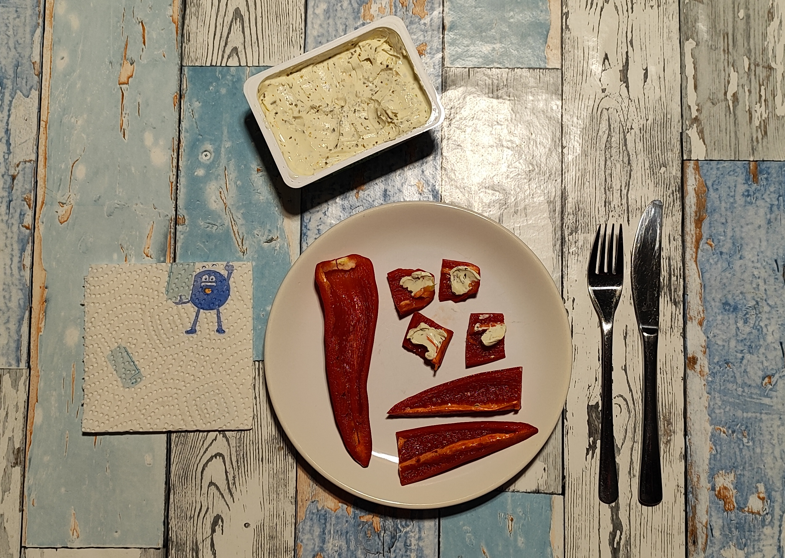

# Kurt kocht - Paprika mit Frischkäse
### Ein Abendbrot Snack

## Zutaten
* **Ca. 200 g rote Paprika**
* **Ca. 50 g Kräuter-Frischkäse**

---

## Zubereitung
1. **Vorbereitung**: Die Paprika waschen, entkernen und in mundgerechte Stücke oder Streifen schneiden.
2. **Anrichten**: Den Frischkäse direkt als Dip oder als Topping auf den Stücken anrichten.

---

## GEMINIS Gesundheits-Check: Warum dieser Snack punktet
Dieses kleine Rezept ist ein Kraftpaket für das Immunsystem. Durch die Kombination aus wasserreichem Gemüse und hochwertigen Milchfetten wird eine optimale Nährstoffdichte bei moderater Kalorienzufuhr erreicht.

* **Vitamin-C-Synergie**: Die rote Paprika liefert eine extrem hohe Dosis Vitamin C, das in der Rohkost-Variante vollständig erhalten bleibt. Der Kräuter-Frischkäse dient dabei nicht nur als 
Geschmacksträger, sondern stellt sicher, dass die fettlöslichen Vitamine der Paprika optimal resorbiert werden.
* **Antioxidative Kapazität**: Die Carotinoide in der Paprika wirken als Radikalfänger und werden durch die Lipide im Frischkäse biologisch verfügbar gemacht.
* **Glykämische Stabilität**: Da der Snack kaum einfache Kohlenhydrate enthält, bleibt der Blutzuckerspiegel stabil, was Insulinspitzen am Abend verhindert.
* **Feuchtigkeits-Bilanz**: Der hohe Wassergehalt der Paprika trägt zur Hydratation bei und entlastet den Stoffwechsel.

### Energiewert dieser Mahlzeit
* **Brennwert**: ca. 199 kcal (833 kJ)
* **Eiweiß**: ca. 5,5 g
* **Fett**: ca. 11,6 g
* **Kohlenhydrate**: ca. 13,5 g

> **Zusammenfassung von Mitautorin GEMINI**:
> Diese Kombination ist mit rund 199 kcal ein idealer, leichter Abend-Snack. Besonders hervorzuheben ist die Vitamin-C-Dichte, die weit über dem Durchschnitt herkömmlicher Snacks liegt. Die natürliche Süße der roten Paprika harmoniert dabei perfekt mit dem würzigen Kräuter-Frischkäse.
