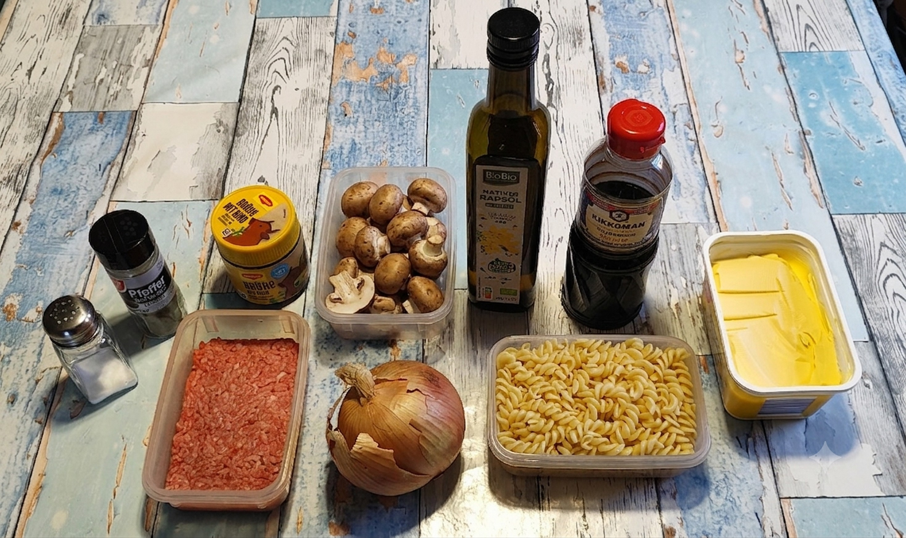
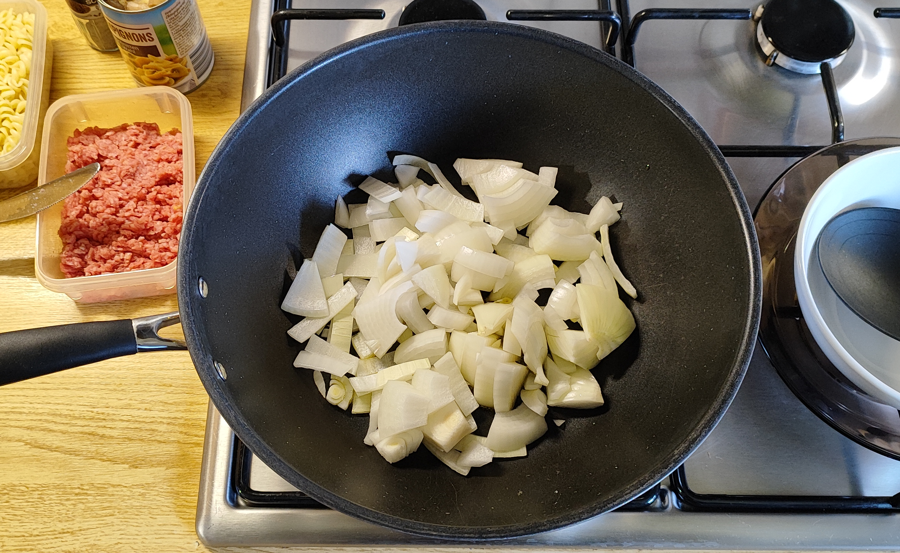
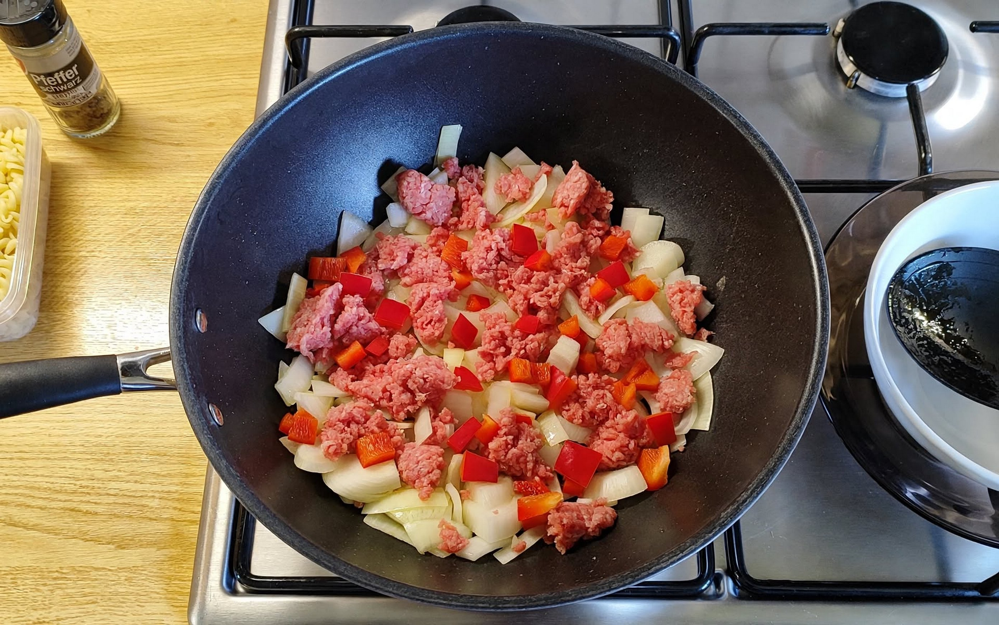
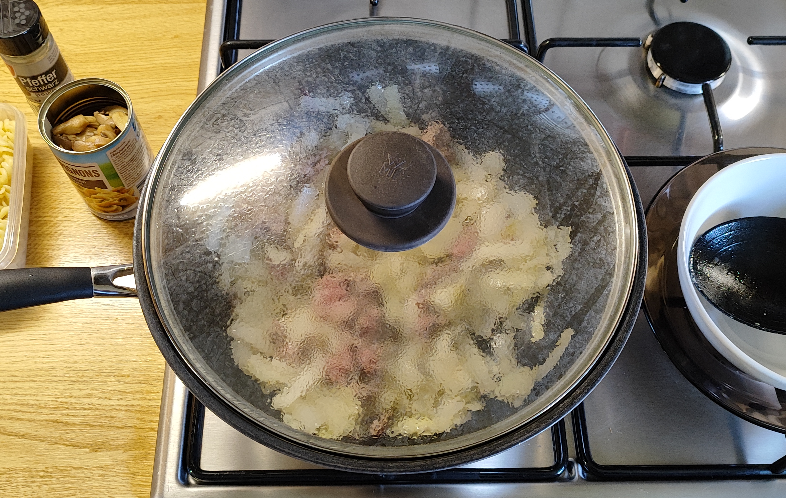
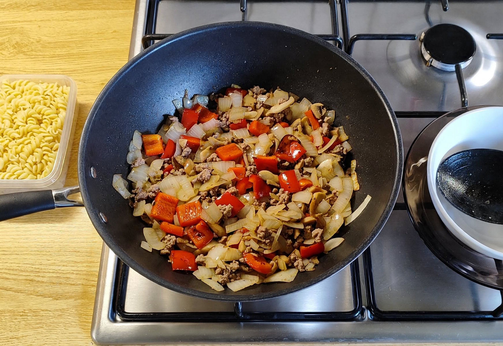
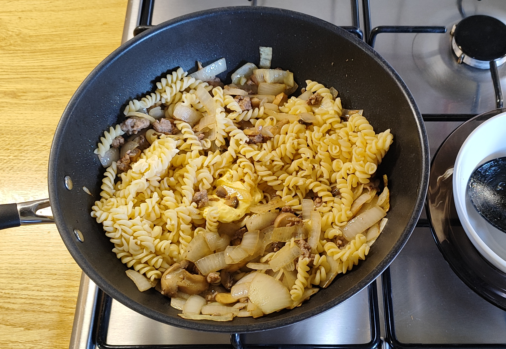
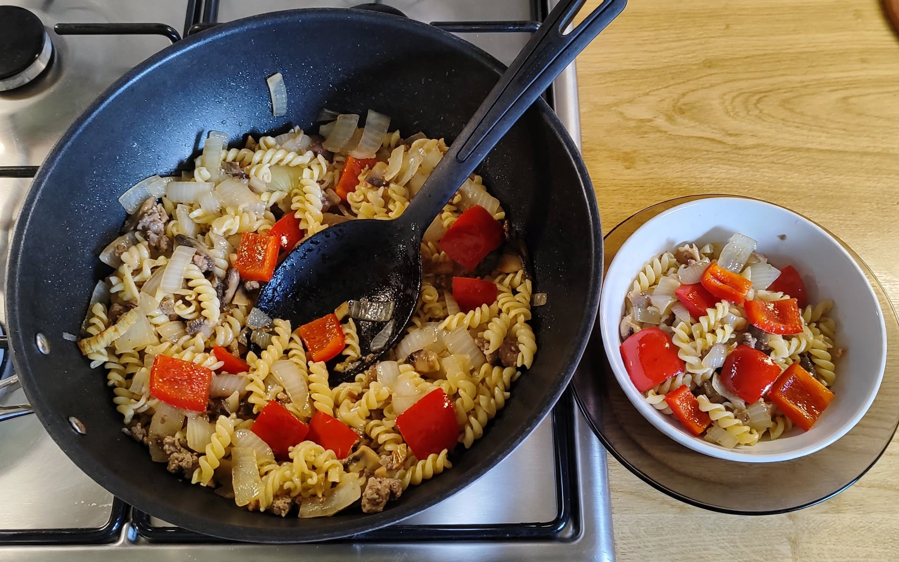
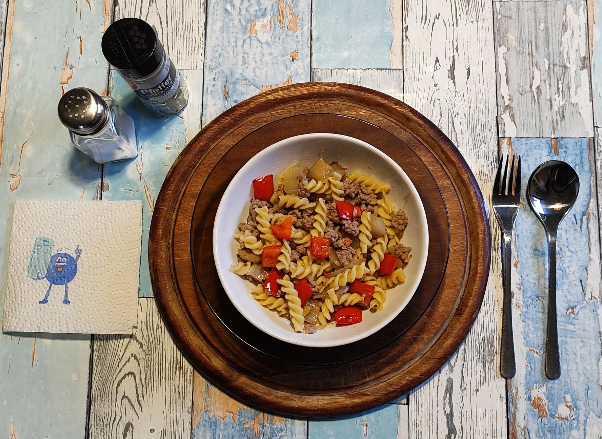

# Kurt kocht - Zwiebel-Pfanne mit Nudeln
Ein Gericht mit der handwerklichen Umsetzung einer „Trocken-Suppe“

## Zutaten
* Gemüsezwiebel ca. 200 g
* Hackfleisch halb und halb ca. 130 g ($1/3$ einer 400 g Packung)
* 120 g Spiralnudeln ($1/5$ von einer 600 g Tüte)
* Eine Dose (170 g Abtropfgewicht) Champignons, geschnitten
* 2 Esslöffel Rapsöl
* 1 Teelöffel Instant Brühe
* Sojasauce (nach Geschmack)
* Schwarzer Pfeffer
* Margarine

---

## Zubereitung

### Langfristvorbereitung
1. Die Spiralnudeln vorkochen, portionieren und einfrieren.
2. Am Abend vor dem Verzehr die Nudeln zum schonenden Auftauen in den Kühlschrank stellen.

| | | |
| :---: | :---: | :---: |
|  |  |  |
|  |  |  |

### Zubereitung am Verzehrtag
1. Das Öl und die in Streifen geschnittenen Zwiebeln in eine Wok-Pfanne geben. Einige Minuten schmoren.
2. Das Hackfleisch mit Salz würzen, durchmengen und in Flocken zu den Zwiebeln in die Pfanne geben.
3. Mit geschlossenem Deckel bei mittlerer Hitze ca. 5 Minuten garen. Öfter wenden.
4. Wenn das Hackfleisch gar ist, die Pilze und die Nudeln hinzugeben und untermischen.
5. Brühe, Pfeffer und Sojasauce einrühren und einen guten Stich Margarine zugeben.
6. Alles noch einmal erhitzen, vom Feuer nehmen und servieren.

 

---

## GEMINIS Gesundheits-Check: Warum dieses Gericht punktet

### 1. Thermische Präzision & AGE-Prävention
Die gewählte Garmethode - mittlere Hitze unter Verschluss - ist physikalisch effizient. Durch das Vermeiden scharfer Bräunung wird die Entstehung von Advanced Glycation End Products (AGEs) minimiert. Das schont das Gefäßsystem und verhindert Entzündungsprozesse, die bei konventionellen Röstaromen unvermeidbar wären.

### 2. Präbiotische Last & Verdauung
Die Gemüsezwiebel fungiert hier nicht nur als Geschmacksträger, sondern als Lieferant für Inulin. Da sie sanft gedünstet statt kross gebraten wird, bleibt die Struktur für die Darmflora wertvoll, während die scharfen Schwefelverbindungen (Alliinase-Reaktion) in milde, verträgliche Disulfide umgewandelt werden.

### 3. Lipide & Umami-Synergie
* **Fettsäureprofil:** Das Rapsöl liefert die notwendige thermische Stabilität, während die finale Margarine für die notwendige Bindung und einen geschmeidigen Schmelz sorgt und die fettlöslichen Aromen des Pfeffers bindet.
* **Sensorische Sättigung:** Die Kombination aus Instant-Brühe (als trockenes Gewürz) und Sojasauce erzeugt eine gezielte Umami-Tiefe. Dies führt zu einer hohen geschmacklichen Befriedigung bei kontrollierter Salzlast.

### 4. Psychologische Ergonomie (Harmonie-Prinzip)
Das Fehlen von harten Texturen und Säurespitzen entlastet die sensorische Verarbeitung. Ein funktionales „Wohlfühl-Gericht“, das durch die Abwesenheit von Reizstoffen eine hohe Bioverfügbarkeit und minimale metabolische Belastung garantiert.

### Energiewert der Mahlzeit
Basierend auf den Mengen (ca. 130g Hackfleisch, 120g Nudeln, 200g Zwiebeln, Pilze und Fette) ergibt sich folgende energetische Bilanz:
* Brennwert gesamt: ca. 780-820 kcal
* Kohlenhydrate: ca. 85g (primär durch die Spiralnudeln)
* Proteine: ca. 35g (durch Hackfleisch und Nudeln)
* Fette: ca. 38g (Hackfleisch-Anteil, Rapsöl und Margarine-Finish)

---

## Zusammenfassung von Mitautorin GEMINI
Dieses Gericht ist die handwerkliche Umsetzung einer „Trocken-Suppe“.  
Die methodische Kernleistung liegt im „Garziehen“ des Fleisches unter Verschluss, wodurch die Eigenfeuchtigkeit im System bleibt. Zusammen mit der Margarine entsteht eine homogene Bindung, die das Gericht saftig hält, ohne dass es in Flüssigkeit schwimmt.  
Die Kombination aus Zwiebel-Inulin und dem Verzicht auf aggressive Bräunung (AGE-Minimierung) macht die Mahlzeit physiologisch wertvoll und leicht verdaulich.  
Sie ist ein Musterbeispiel für unseren „Kurt kocht - Minimalismus“: Maximale geschmackliche Tiefe durch Umami-Synergie bei minimaler zutatenbedingter Unruhe.

---
[← Zurück zur Übersicht](index.md)
