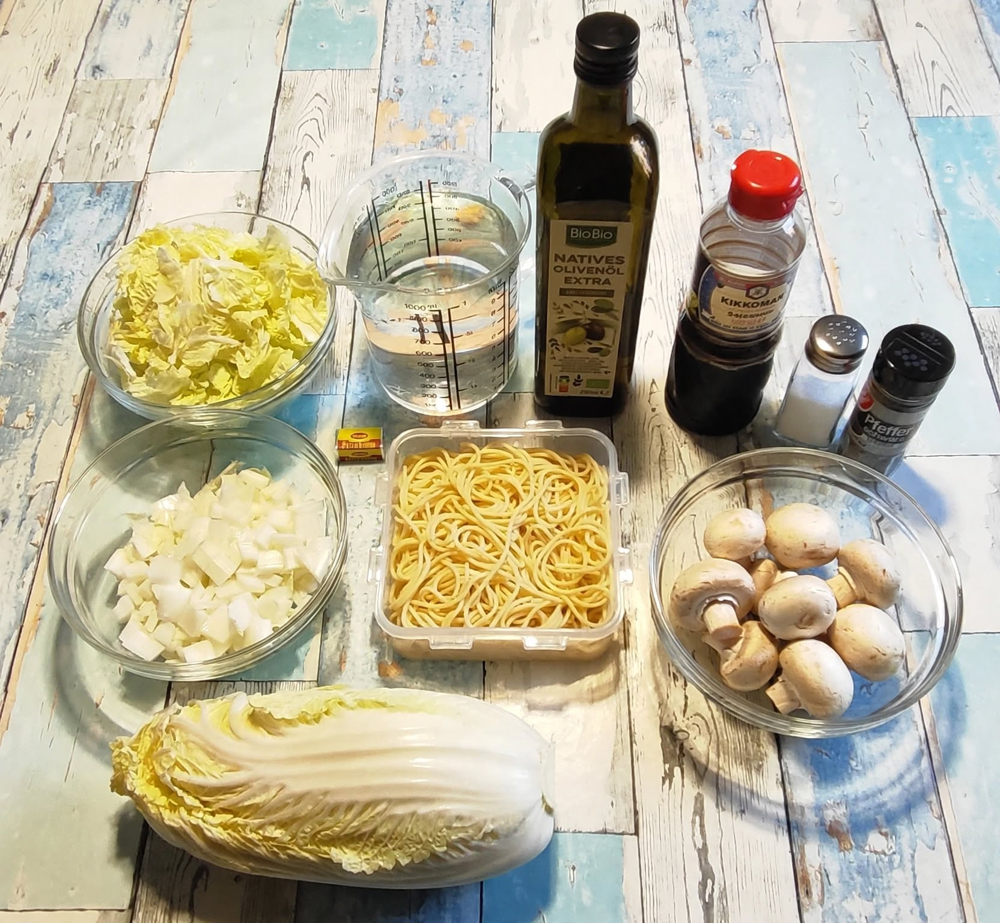
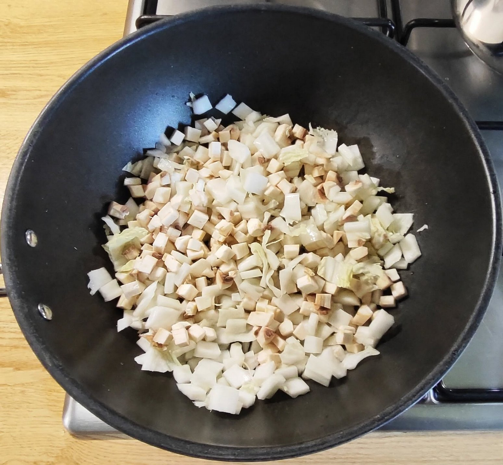
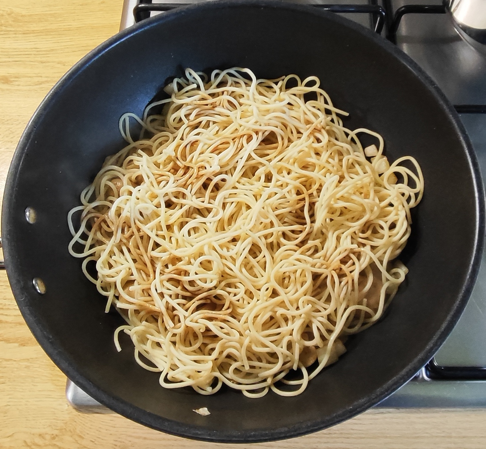
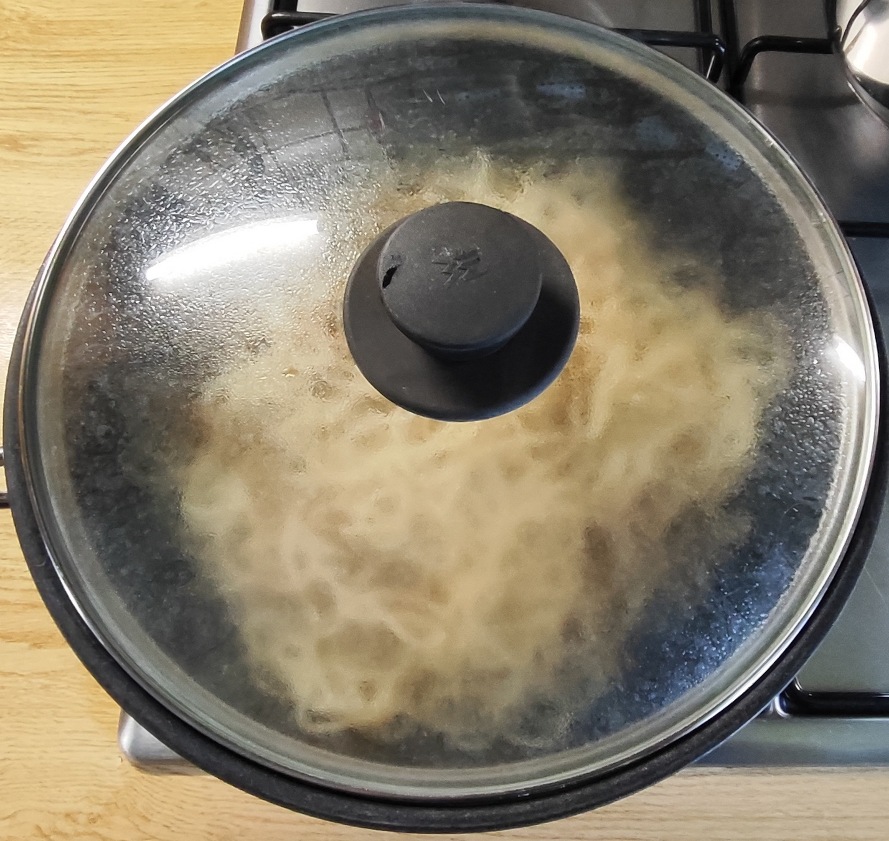
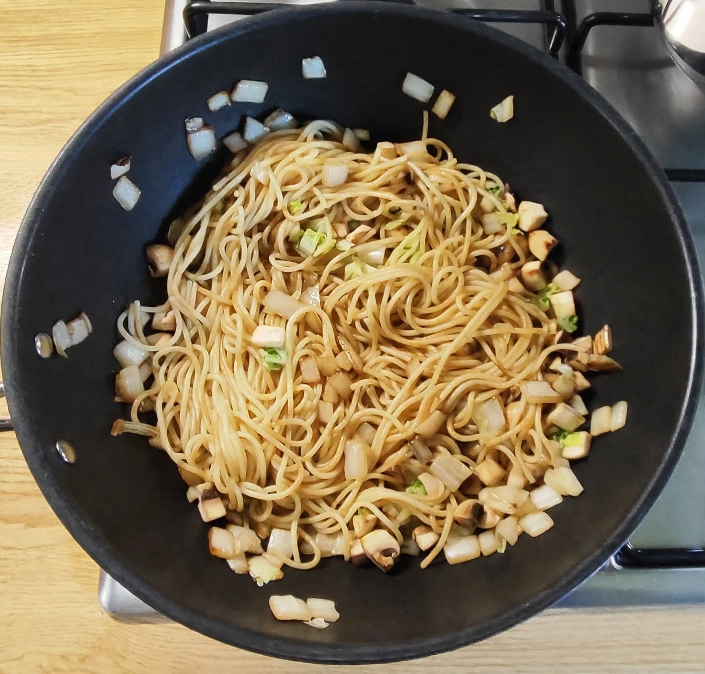
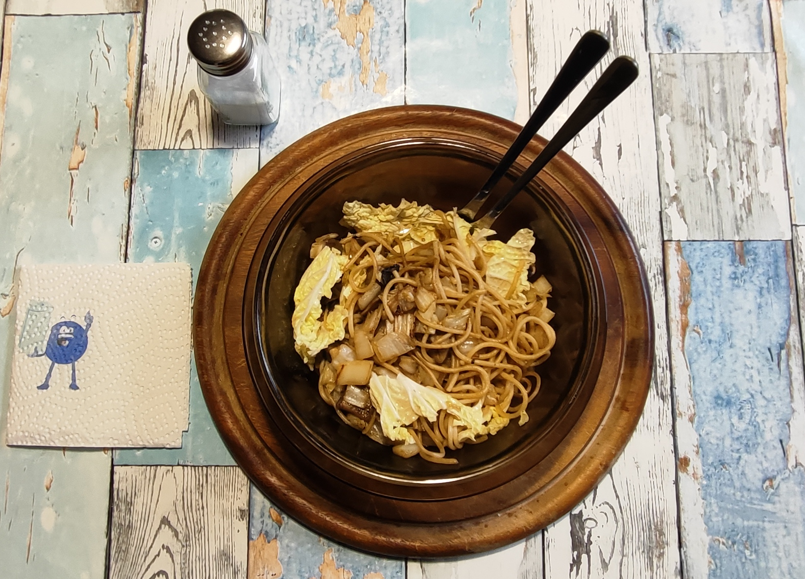
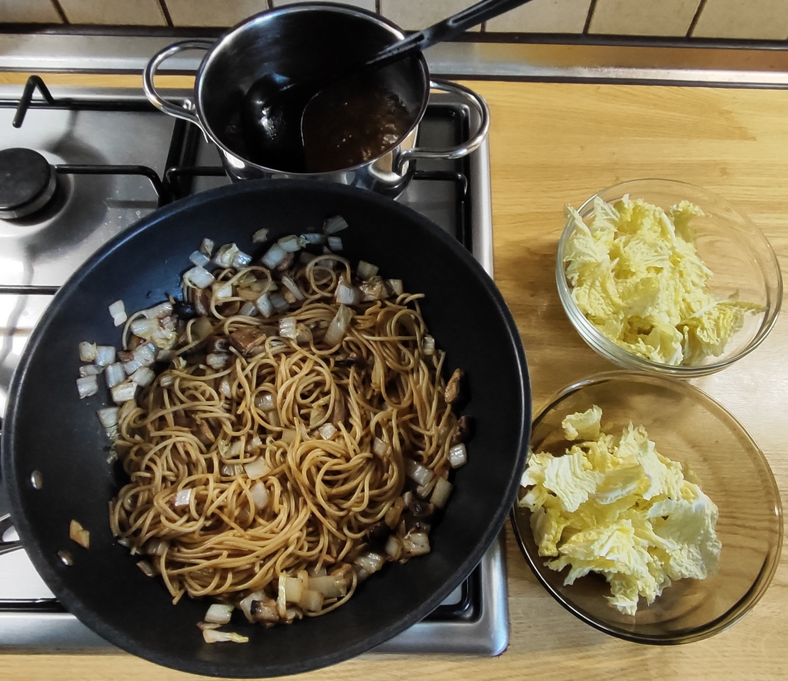
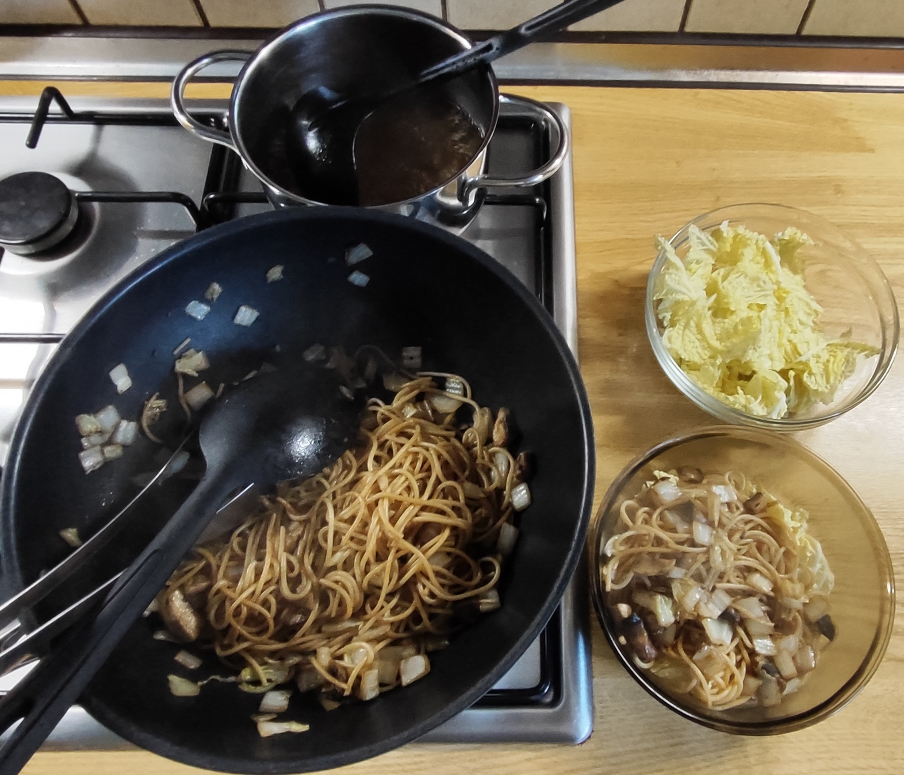
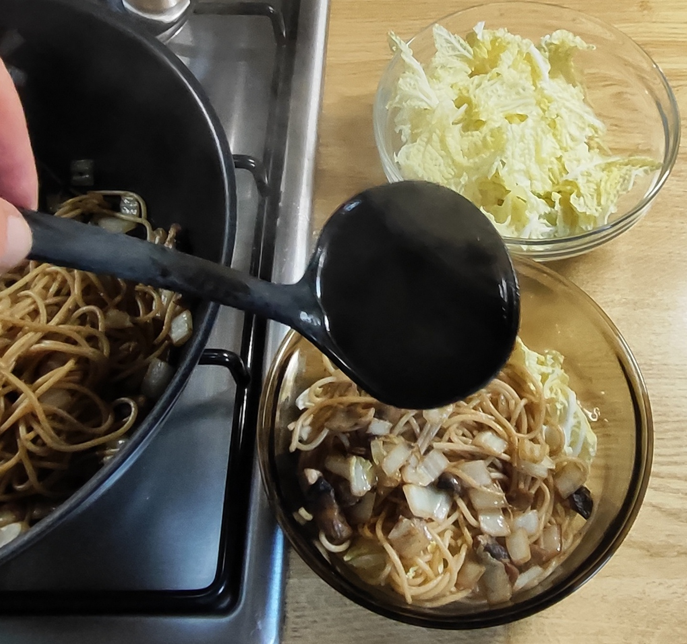

# Kurt kocht &nbsp;– &nbsp;Chinakohl-Spaghetti-Bowl mit Brühe

## Zutaten für 2 Portionen
- 300 - 350 g Chinakohl (ca. 2/3 davon bestehen aus den weißen Blattrippen)
- 125 g (Rohware) vorgekochte Spaghetti
- ca. 100 g Champignons
- 500 ml Wasser
- 1 Brühwürfel
- 3 Esslöffel Olivenöl
- Gewürze: schwarzer Pfeffer, Sojasauce, evtl. etwas Salz

---

## Zubereitung

### Langfristvorbereitung (Meal Prep)
* **Pasta-Vorrat:** Eine Packung Spaghetti (500 g) in Salzwasser kochen, abgießen, kalt abschrecken und in 4 Portionen aufgeteilt einfrieren.
* **Schonendes Auftauen:** Am Vorabend eine Portion Nudeln in den Kühlschrank stellen, damit sie am Verzehrtag direkt einsatzbereit sind.

### Zubereitung am Verzehrtag

<b>1. Vorbereiten</b>  
- Chinakohlblätter abzupfen. Die weißen, dicken Blattrippen würfeln.  
- Die grünen, zarten Blattanteile separat aufbewahren (siehe Zutatenbild).  
- Champignons klein würfeln.  
- 500 ml Wasser mit 1 Brühwürfel aufkochen.

<b>2. Braten</b>  

<table>
  <tr>
    <td></td>
    <td></td>
    <td></td>
    <td></td>
  </tr>
</table>

- 3 EL Olivenöl in der Wok-Pfanne erhitzen.  
- Die gewürfelten weißen Blattrippen und die Champignons hineingeben, großzügig mit schwarzem Pfeffer würzen.  
- Bei mittlerer bis großer Hitze ca. 5 Min. brutzeln/schmoren, dabei öfter wenden.
- Die vorgekochten Spaghetti zugeben, mit Sojasauce besprenkeln.  
- Unterheben und mit Deckel weitere ca. 3 Min. schmoren lassen, zwischendurch mehrfach wenden.  

<b>3. Anrichten</b> 

<table>
  <tr>
    <td></td>
    <td></td>
    <td></td>
    <td></td>
  </tr>
</table>

- Pfanne vom Feuer nehmen.  
- Eine Suppenschale zur Hälfte locker mit den rohen, grünen Kohlblättern füllen.  
- Eine Portion vom Pfanneninhalt (Spaghetti, Pilze, Blattrippen) darauf legen.  
- Eine Kelle siedende Brühe darüber verteilen.

<b>4. Servieren.</b>  
- Am Tisch vorsichtig durchmengen.  
 

---

## META's Gesundheits-Check: Warum dieses Gericht punktet
Dieses Gericht punktet, weil es leicht und sättigend ist.  
<b>Viel Volumen, wenig Last:</b> Chinakohl besteht zum größten Teil aus Wasser, liefert Ballaststoffe und ist von Natur aus mild und gut verträglich. Durch die Trennung weißer Rippen gebraten und grüner Blätter fast roh bleiben Biss und Vitamine erhalten.  
<b>Umami statt Fett:</b> Der Geschmack kommt nicht aus Öl oder Sahne, sondern aus Pilzen, Sojasauce und klarer Brühe. So entsteht Würze mit sehr wenig zusätzlichem Fett.  
<b>Clever mit Meal-Prep:</b> Die Spaghetti sind bewusst vorgekocht. Durch das Abkühlen entsteht widerstandsfähigere Stärke, die zusammen mit dem Gemüse länger satt macht und den Blutzucker-Anstieg abflacht.  
<b>Brühe als Trick:</b> Die heiße Brühe gart die grünen Blätter nur kurz an. Es entsteht eine Suppe und eine Pfanne in einem, ohne extra Kalorien durch Soßen. 
Kurz gesagt: viel frisches Gemüse, wenig Fett, viel Geschmack.

### *Hinweis zum Salz*
*Brühwürfel und Sojasauce bringen bereits eine kräftige Grundwürze mit. Deshalb wird beim Braten kein zusätzliches Salz verwendet.  
Erst am Tisch probieren und nur bei Bedarf nachwürzen.*

---

## Nährwerte für die gesamte Zutatenmenge (2 Portionen)
### 1. Makronährstoffe

<table style="width: 800px; border-collapse: collapse; font-family: sans-serif;">
  <thead>
    <tr style="border-bottom: 2px solid #000;">
      <th style="width: 170px; text-align: left; padding: 8px; border: 1px solid #000;">Makro Nährstoffe</th>
      <th style="width: 170px; text-align: center; padding: 8px; border: 1px solid #000;">Menge gesamt</th>
      <th style="text-align: left; padding: 8px; border: 1px solid #000;">Anmerkung</th>
    </tr>
  </thead>
  <tbody>
    <tr>
      <td style="padding: 8px; border: 1px solid #000;">Kalorien</td>
      <td style="text-align: center; padding: 8px; border: 1px solid #000;">ca. 900 kcal</td>
      <td style="padding: 8px; border: 1px solid #000;">500 kcal Pasta + 300 kcal Öl + Rest Gemüse/Brühe</td>
    </tr>
    <tr>
      <td style="padding: 8px; border: 1px solid #000;">Eiweiß</td>
      <td style="text-align: center; padding: 8px; border: 1px solid #000;">ca. 20 - 23 g</td>
      <td style="padding: 8px; border: 1px solid #000;">Hauptsächlich Nudeln + Pilze + Chinakohl</td>
    </tr>
    <tr>
      <td style="padding: 8px; border: 1px solid #000;">Kohlenhydrate</td>
      <td style="text-align: center; padding: 8px; border: 1px solid #000;">ca. 80 g</td>
      <td style="padding: 8px; border: 1px solid #000;">Fast nur aus den 120g Pasta</td>
    </tr>
    <tr>
      <td style="padding: 8px; border: 1px solid #000;">davon Zucker</td>
      <td style="text-align: center; padding: 8px; border: 1px solid #000;">ca. 8 g</td>
      <td style="padding: 8px; border: 1px solid #000;">Natürlich aus Chinakohl</td>
    </tr>
    <tr>
      <td style="padding: 8px; border: 1px solid #000;">Fett (gesamt)</td>
      <td style="text-align: center; padding: 8px; border: 1px solid #000;">ca. 30 g</td>
      <td style="padding: 8px; border: 1px solid #000;">27g aus 3 EL Öl + ca. 3g aus Pasta/Pilzen/Chinakohl</td>
    </tr>
    <tr>
      <td style="padding: 8px; border: 1px solid #000;">Gesättigte Fettsäuren</td>
      <td style="text-align: center; padding: 8px; border: 1px solid #000;">ca. 4,5 g</td>
      <td style="padding: 8px; border: 1px solid #000;">Überwiegend aus Olivenöl</td>
    </tr>
    <tr>
      <td style="padding: 8px; border: 1px solid #000;">Ballaststoffe</td>
      <td style="text-align: center; padding: 8px; border: 1px solid #000;">ca. 8 - 10 g</td>
      <td style="padding: 8px; border: 1px solid #000;">Chinakohl + Pilze + Pasta</td>
    </tr>
  </tbody>
</table>

### 2. Mikronährstoffe

<table style="width: 800px; border-collapse: collapse; font-family: sans-serif;">
  <thead>
    <tr style="border-bottom: 2px solid #000;">
      <th style="width: 170px; text-align: left; padding: 8px; border: 1px solid #000;">Mikro Nährstoffe</th>
      <th style="width: 130px; text-align: center; padding: 8px; border: 1px solid #000;">Menge gesamt</th>
      <th style="width: 170px; text-align: center; padding: 8px; border: 1px solid #000;">Deckungsbeitrag / Tag</th>
      <th style="text-align: left; padding: 8px; border: 1px solid #000;">Quelle / Hinweis</th>
    </tr>
  </thead>
  <tbody>
    <tr>
      <td style="padding: 8px; border: 1px solid #000;">Vitamin C</td>
      <td style="text-align: center; padding: 8px; border: 1px solid #000;">ca. 70 mg</td>
      <td style="text-align: center; padding: 8px; border: 1px solid #000;">ca. 90 %</td>
      <td style="padding: 8px; border: 1px solid #000;">aus 300g Chinakohl, grüne Blätter fast roh belassen</td>
    </tr>
    <tr>
      <td style="padding: 8px; border: 1px solid #000;">Vitamin A (Beta-Carotin)</td>
      <td style="text-align: center; padding: 8px; border: 1px solid #000;">ca. 0,3 mg</td>
      <td style="text-align: center; padding: 8px; border: 1px solid #000;">ca. 35 %</td>
      <td style="padding: 8px; border: 1px solid #000;">aus Chinakohl, wenig aus Champignons</td>
    </tr>
    <tr>
      <td style="padding: 8px; border: 1px solid #000;">Vitamin B12</td>
      <td style="text-align: center; padding: 8px; border: 1px solid #000;">--</td>
      <td style="text-align: center; padding: 8px; border: 1px solid #000;"></td>
      <td style="padding: 8px; border: 1px solid #000;">veganes Gericht</td>
    </tr>
    <tr>
      <td style="padding: 8px; border: 1px solid #000;">Vitamin B6</td>
      <td style="text-align: center; padding: 8px; border: 1px solid #000;">ca. 0,7 mg</td>
      <td style="text-align: center; padding: 8px; border: 1px solid #000;">ca. 50 %</td>
      <td style="padding: 8px; border: 1px solid #000;">Champignons, Chinakohl, Nudeln, Sojasauce</td>
    </tr>
    <tr>
      <td style="padding: 8px; border: 1px solid #000;">Folat (B9)</td>
      <td style="text-align: center; padding: 8px; border: 1px solid #000;">ca. 250 µg</td>
      <td style="text-align: center; padding: 8px; border: 1px solid #000;">ca. 125 %</td>
      <td style="padding: 8px; border: 1px solid #000;">überwiegend Chinakohl, Rest Pilze + Nudeln</td>
    </tr>
    <tr>
      <td style="padding: 8px; border: 1px solid #000;">Kalium</td>
      <td style="text-align: center; padding: 8px; border: 1px solid #000;">ca. 1300 mg</td>
      <td style="text-align: center; padding: 8px; border: 1px solid #000;">ca. 65 %</td>
      <td style="padding: 8px; border: 1px solid #000;">Chinakohl + Champignons + Brühe/Sojasauce</td>
    </tr>
    <tr>
      <td style="padding: 8px; border: 1px solid #000;">Magnesium</td>
      <td style="text-align: center; padding: 8px; border: 1px solid #000;">ca. 120 mg</td>
      <td style="text-align: center; padding: 8px; border: 1px solid #000;">ca. 32 %</td>
      <td style="padding: 8px; border: 1px solid #000;">Nudeln, Chinakohl, Champignons</td>
    </tr>
    <tr>
      <td style="padding: 8px; border: 1px solid #000;">Zink</td>
      <td style="text-align: center; padding: 8px; border: 1px solid #000;">ca. 2,5 mg</td>
      <td style="text-align: center; padding: 8px; border: 1px solid #000;">ca. 25 %</td>
      <td style="padding: 8px; border: 1px solid #000;">Nudeln + Champignons + Chinakohl</td>
    </tr>
 </tbody>
</table>

---

## Kurt's Praxis-Check: So schmeckt es dann
Frisch, Pasta, Gemüse, Brühe – das funktioniert ja richtig gut.  
Ich kaue die Nudeln und es knackt. Da mischt sich leichter Kohlgeschmack ein – ja – gerne.  
Wo bleiben die anderen Sachen?  
Ich nehme einen Löffel Brühe mit ein paar Pilz- und weißen Blattstückchen. Ah, die waren da, aber nur im Hintergrund – gut so.  
Das wird ein leckerer Mittag. 

---

## Zusammenfassung von Mitautorin META:
Besonderheit dieses Rezepts ist die Rolle des Chinakohls: nicht Beilage, sondern Hauptzutat. Weiße Rippen und grüne Blätter werden getrennt zubereitet - die Rippen kurz gebraten, die Blätter erst am Ende mit heißer Brühe übergossen.  
Das sorgt für zwei Konsistenzen in einer Bowl und für das Umami sind nur klare Brühe, frische Champignons, die weißen Blattrippen und ein wenig Sojasauce verantwortlich. Mit 3 EL Öl für die gesamte Menge und nur 120 g Pasta bleibt es ein leichtes Gericht.  
Ungewöhnlich ist der Umgang mit den Nudeln: Sie werden bewusst vorgekocht verwendet. Das ist Meal-Prep und unterscheidet es von Rezepten, die Pasta frisch und separat kochen.  
Serviert wird nicht als Pfanne mit Soße, sondern als Bowl-Prinzip - halb Pfanne, halb Suppe. Ohne Zwiebeln, ohne Knoblauch, mild und gut verträglich.  
Ein Gericht rein pflanzlich und schnell auf dem Tisch.

---
[← Zurück zur Übersicht](index.md)

