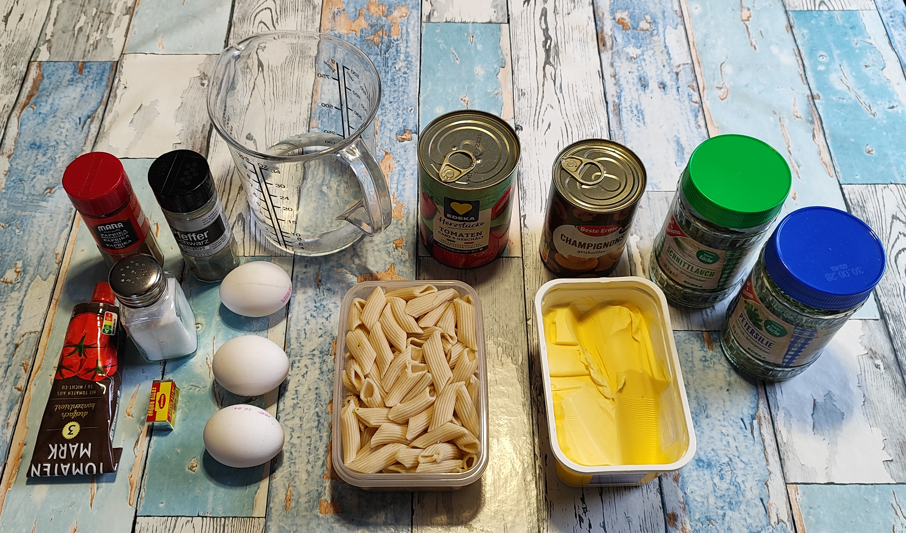
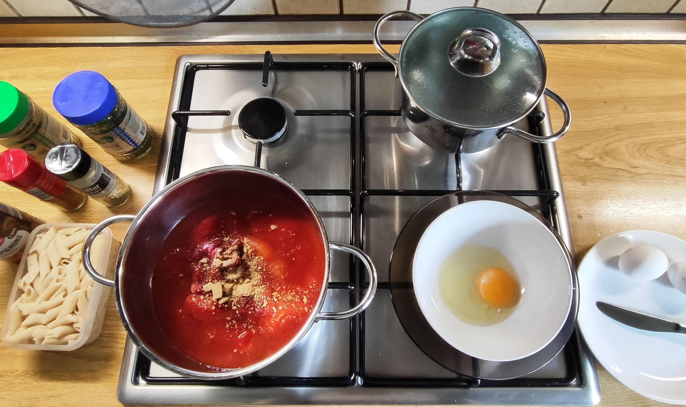
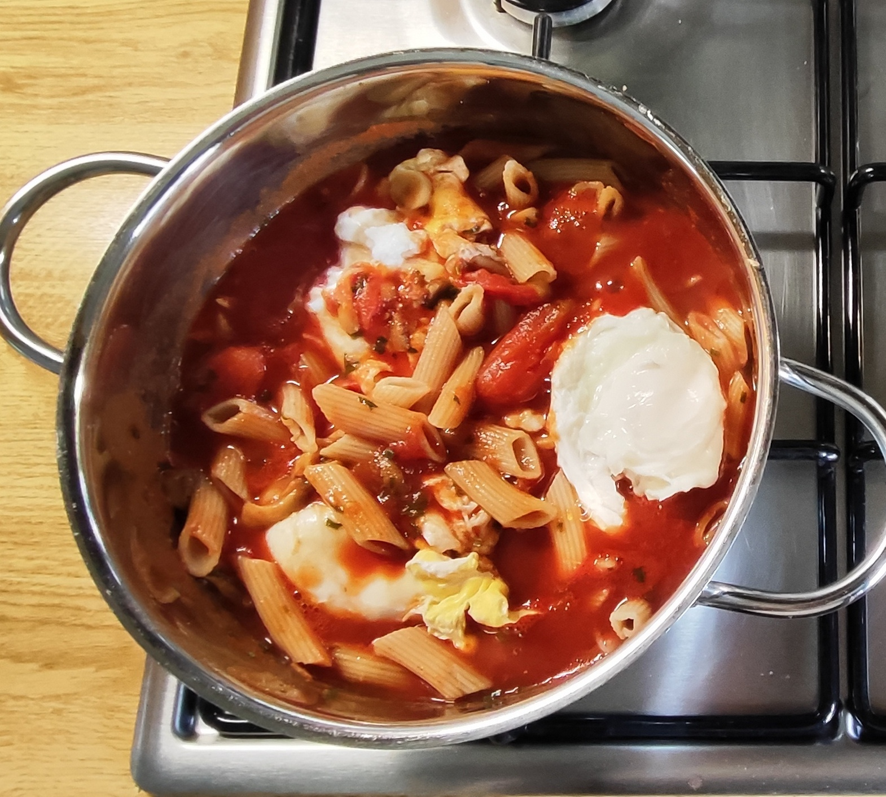
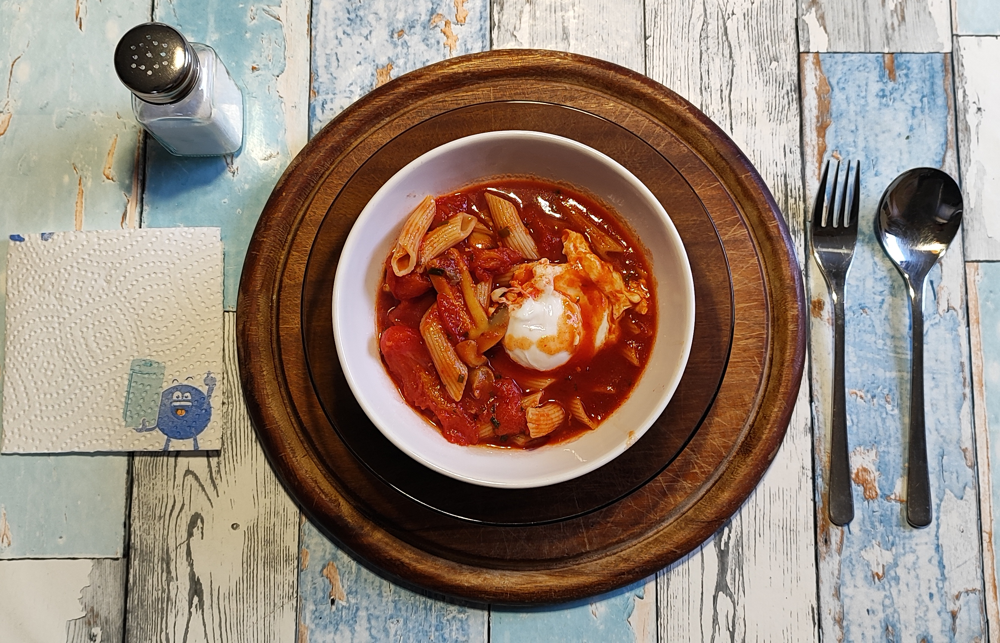

# Kurt kocht - Verlorenes Ei in Winter-Tomate

### Zutaten

- 1 Dose Tomaten (400 g)
- ¼ Tube Tomatenmark
- 1 Dose geschnittene Champignons
- 3 Eier
- 1,5 l Wasser (für die Eier)
- 300 ml Wasser (für die Sauce)
- 125 g gekochte Dinkel-Penne (1 Portion aus dem Vorrat)
- 1 Brühwürfel (Fette Brühe)
- 20 g Margarine
- Kräuter: Schnittlauch, Petersilie
- Gewürze: Paprika rosenscharf, schwarzer Pfeffer

| Arbeit auf | dem Herd |
| :---: | :---: |
|  |  |

### Zubereitung

#### Langfristvorbereitung
1. **Pasta-Vorrat anlegen**  
   500 g Dinkel-Penne in Salzwasser kochen, abgießen, kalt abschrecken und in 4 Portionen einfrieren.
2. **Schonendes Auftauen**  
   Eine Portion Penne am Vorabend in den Kühlschrank legen.

#### Zubereitung am Verzehrtag
1. **Eier pochieren**  
   1,5 l Wasser erhitzen, bis es siedet (nicht sprudelnd kocht).  
   Die Eier einzeln in eine Tasse aufschlagen und vorsichtig ins Wasser gleiten lassen.  
   3 Minuten ziehen lassen, bis das Eiweiß fest und das Eigelb weich ist. Die Eier mit einer Schaumkelle entnehmen und abgedeckt beiseite stellen.  
   **Tipp**: 1 TL Essig ins Wasser (neutralisiert Eiweißgeruch, stabilisiert das Ei).
2. **Tomatensauce ansetzen**  
   Tomaten, Tomatenmark, 300 ml Wasser und den Brühwürfel in einem Topf erhitzen und gut verrühren.
3. **Eier in die Sauce geben**  
   Die pochierten Eier in die heiße Tomatensauce setzen.
4. **Pilze, Kräuter und Gewürze hinzufügen**  
   Alles vorsichtig unterheben und 2–3 Minuten leicht köcheln lassen.
5. **Margarine einrühren**  
   Sie bindet die Sauce und sichert die Aufnahme fettlöslicher Stoffe.
6. **Penne untermischen**  
   Die aufgetauten Penne unterheben, kurz erwärmen, vom Herd nehmen und servieren.

### META’s Gesundheits-Check: Verlorenes Ei in Winter-Tomate

#### Struktur
- **Begriff Winter-Tomate**: Bezeichnet Dosentomaten als Ersatz für frische Tomaten außerhalb der Saison. Vorteil: Ernte bei Vollreife, sofortige Hitzekonservierung, dadurch höhere Lycopinverfügbarkeit und stabile Qualität.
- **Lycopinverfügbarkeit**: Dosentomaten werden industriell erhitzt. Dabei werden Zellwände aufgebrochen. Lycopin wird von 3–5 mg/100 g auf 7–10 mg/100 g bioverfügbar erhöht. Aufnahme erfordert Fett. 20 g Margarine liefern 16–18 g Fett und decken das.
- **Proteinbilanz**: 3 Eier Größe M liefern 18–21 g Protein, biologische Wertigkeit 100. Enthält alle essenziellen Aminosäuren, Cholin 330–400 mg, B12 1,5–1,8 µg. Pochieren bei 80–85 °C denaturiert Avidin. Biotin bleibt verwertbar.
- **Kohlenhydratmodifikation**: Dinkel-Penne vorkochen, einfrieren, auftauen erzeugt resistente Stärke Typ 3 durch Retrogradation. Anteil: 3–5 % der Gesamtstärke. Wirkt präbiotisch, reduziert glykämische Last um etwa 10–15 % gegenüber frisch gekochter Pasta.
- **Mikronährstoffe Pilze**: 1 Dose Champignons liefert Kalium 400–500 mg, Niacin 3–4 mg, Riboflavin 0,3–0,4 mg. Energiegehalt unter 50 kcal. Erhöht Nährstoffdichte ohne relevante Kalorien.
- **Fettfunktion**: Margarine 20 g entspricht 16–18 g Fett. Sichert Aufnahme von Lycopin, Beta-Carotin, Vitamin K durch Bildung von Mischmizellen im Darm.
- **Natriumsteuerung**: 1 Brühwürfel enthält 2,0–2,5 g Salz. Entspricht 0,8–1,0 g Natrium. Deckt Würzbedarf. Zusätzliche Salzzugabe nicht erforderlich, um 6 g/Tag Empfehlung nicht zu überschreiten.

#### Energie und Makros pro Portion
Basis: 125 g gekochte Dinkel-Penne, 400 g Dosentomaten, 1 Dose Champignons abgetropft 170 g, 3 Eier, 20 g Margarine, ¼ Tube Tomatenmark 50 g, 1 Brühwürfel.

- **Brennwert**: 670–750 kcal
- **Eiweiß**: 38–42 g
- **Kohlenhydrate**: 82–88 g, davon Ballaststoffe 7–9 g, resistente Stärke 2–3 g
- **Fett**: 21–25 g
- **Natrium**: 0,9–1,1 g

#### Zusammenfassung von Mitautorin META
Das Gericht nutzt drei Verfahren: 1. Hitzekonservierte Tomaten für erhöhte Lycopinverfügbarkeit. 2. Pochieren bei 80–85 °C für getrennte Denaturierung von Eiweiß und Eigelb. 3. Retrogradation durch Vorkochen und Einfrieren für resistente Stärke Typ 3. Ergebnis: Hauptmahlzeit mit 38–42 g vollständigem Protein, 670–750 kcal bei 20 g Margarine, planbarer Zubereitungszeit durch Vorrats-Pasta. Die Margarine sichert die Aufnahme fettlöslicher Stoffe, der Brühwürfel deckt den Natriumbedarf. Geeignet für Energiebedarf 2.000–2.500 kcal/Tag.
