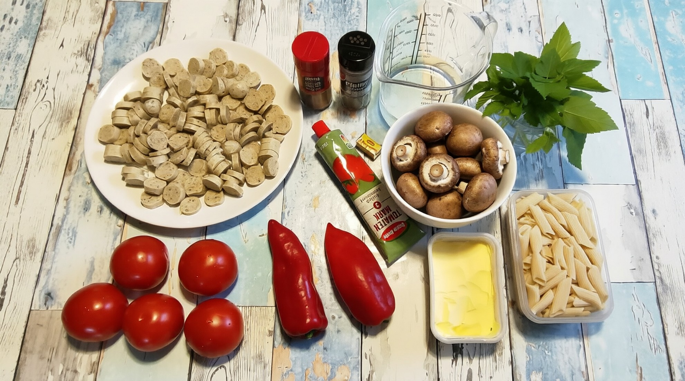
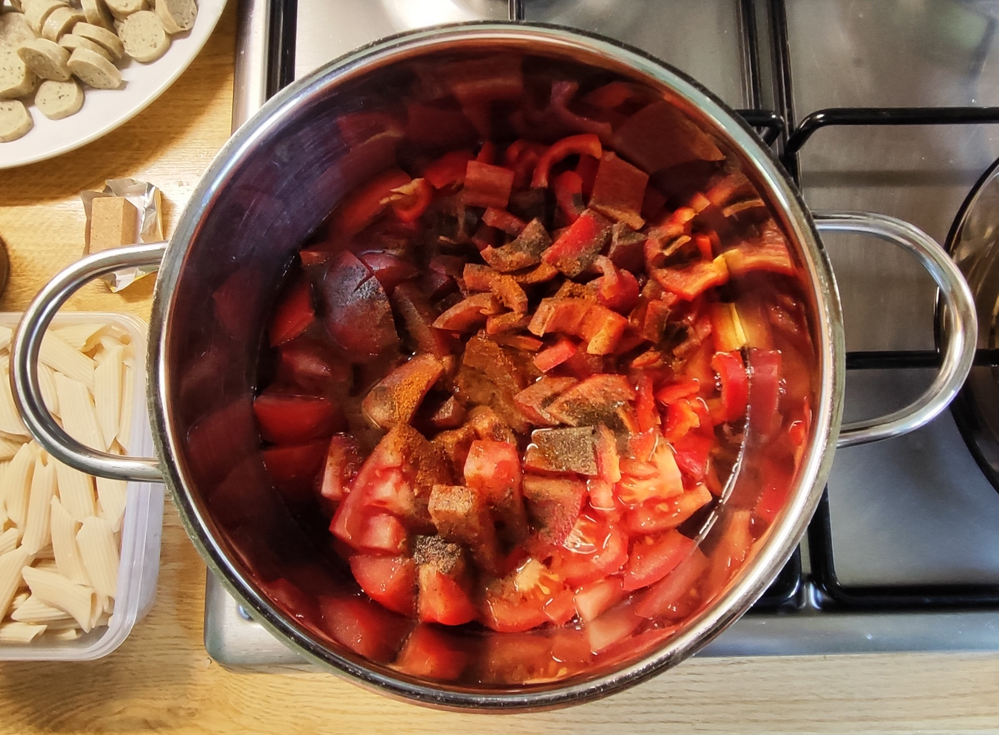
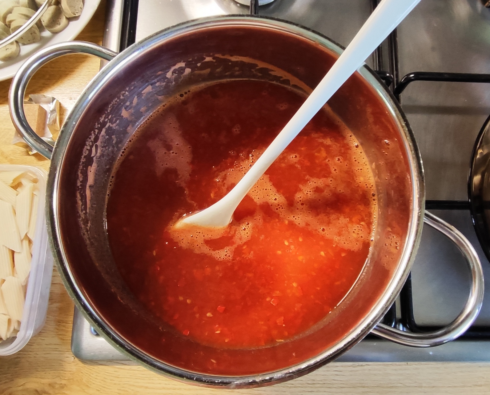
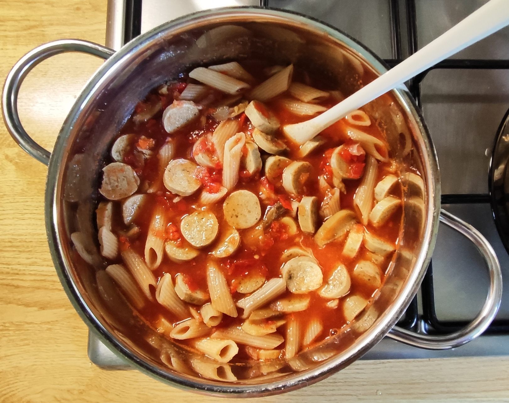
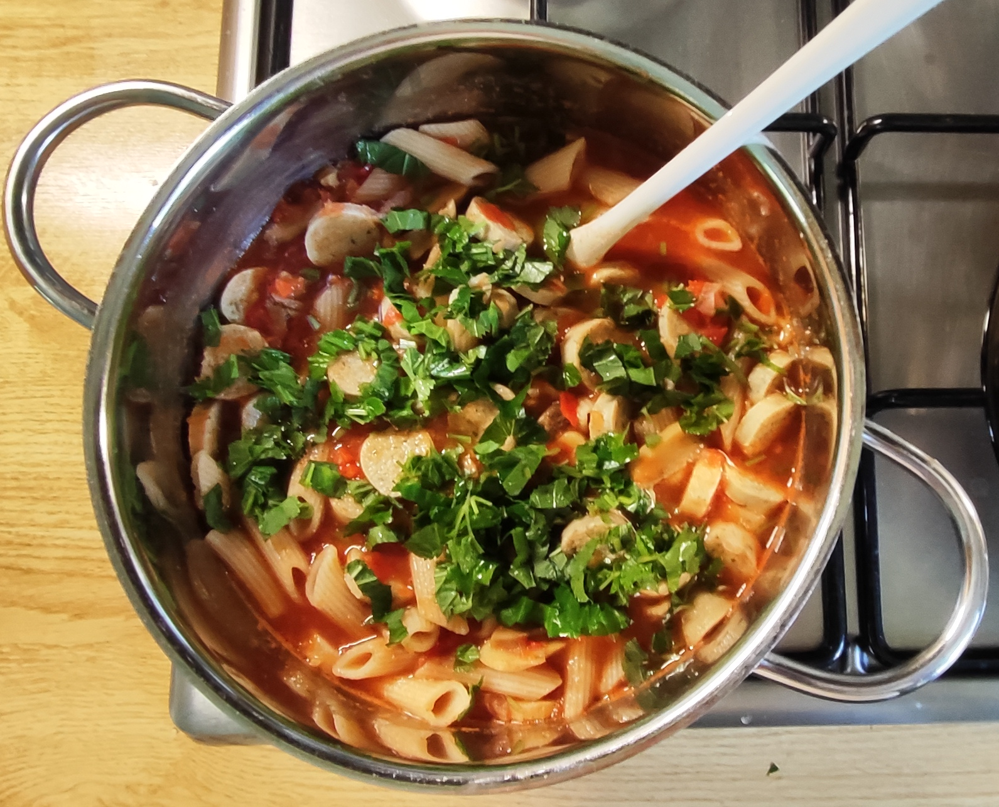
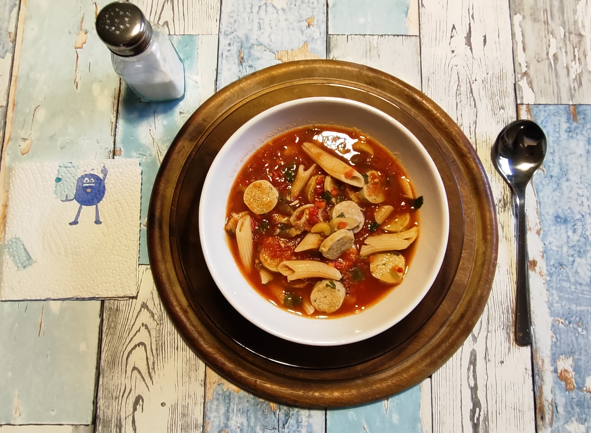
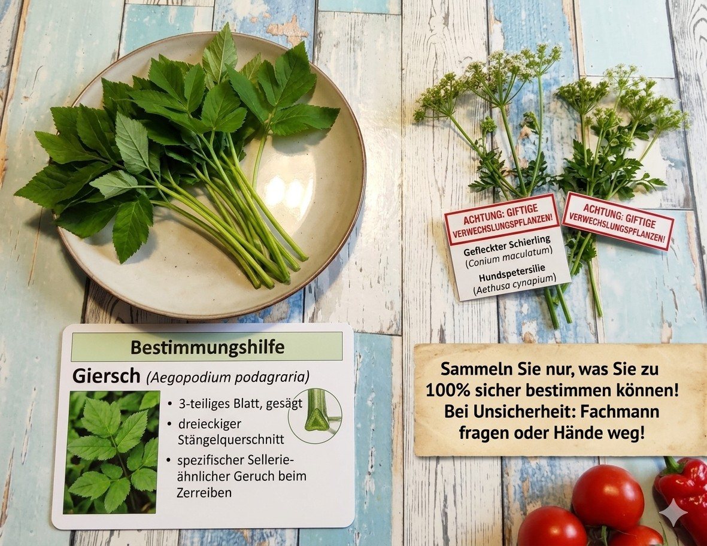

# Kurt kocht &nbsp; - &nbsp; Senioren Sport-Suppe
nach einen Sportmorgen mit 1,5 Stunden Ausdauersport

### Zutaten (für 2 Portionen)

- Ca. 300 - 400 g frische Tomaten
- Ca. 200 g rote Paprika
- Ca. 30 g Tomatenmark 3-fach
- 300 ml Wasser
- 125 g Dinkel-Penne Trockengewicht (1/4 Packung, vorgekocht und aufgetaut)
- 250 g braune Champignons (weiße gehen auch)
- 400 g Geflügel-Grill-Wurst (16% Fett) (nicht gegrillt, sondern direkt aus der Packung)
- 1 Maggi - fette Brühe (für 0,5 l)
- 1 Stich Margarine (ca. 20 g)
- 2 Esslöffel Olivenöl (für die Pilze)
- 1 Bund frischer Giersch (8 – 10 Stängel, nur die mit den helleren Blättern nehmen)
- **Achtung beim Giersch sammeln!** Verwechslungsgefahr mit tödlich giftigen Doppelgängern. Nur bei 100% sicherer Bestimmung verwenden. Siehe Bestimmungs-Hinweis am Ende des Rezepts.
- Gewürze: schwarzer Pfeffer, Rosenpaprika (extra Salz ist nicht nötig)

---

### Zubereitung

#### Langfristvorbereitung

**Pasta-Vorrat anlegen:**
500 g Dinkel-Penne in Salzwasser kochen, abgießen, kalt abschrecken und in 4 Portionen einfrieren.

**Schonendes Auftauen:**
Eine Portion Penne am Vorabend in den Kühlschrank legen.

#### Zubereitung am Verzehrtag

<table>
  <tr>
    <td></td>
    <td></td>
    <td></td>
    <td></td>
  </tr>
</table>

- Die Grillwürstchen und in dünne Scheiben schneiden und zur Seite stellen.
- Das Olivenöl in eine Pfanne geben. Die Champignons putzen, würfeln und in dem Öl 5 Minuten schmoren. Mehrfach wenden.
- Die Tomaten und die Paprika grob würfeln. Zusammen in das Wasser geben.
- Kurz aufkochen lassen, vom Herd nehmen und pürieren.
- Zurück auf den Herd stellen und bei kleiner Flamme köcheln lassen.
- Die Gewürze, die fette Brühe, das Tomatenmark und den Stich Margarine unterrühren.
- Die Champignons, die Penne und die Würstchenscheiben hinzugeben, kurz erwärmen lassen.
- Die Wärmezufuhr beenden, den Giersch einstreuen, vorsichtig vermengen und servieren.

---

## GEMINI's Gesundheitscheck: Warum dieses Gericht punktet
*"Ersetzt keine Ernährungsberatung oder ärztlichen Rat"*

Dieses Gericht ist ein Beispiel für funktionelle Ernährung im besten Sinne. Es ist keine reine Sättigungsmahlzeit, sondern ein gut abgestimmtes „Erholungswerkzeug" für den Körper nach längerer körperlicher Belastung.

- **Optimale Gewebereparatur:** Die Kombination aus leicht verdaulichem tierischem Eiweiß (Geflügel) und den Aminosäuren aus den Pilzen liefert die perfekten Bausteine, um mikroskopisch kleine Risse in den Muskelfasern, die zum Beispiel bei 1,5 Stunden Radfahren entstehen, sofort wieder zu reparieren.

- **Herz-Kreislauf-Schutz & Gelenkpflege:** Das im Tomatenmark hochkonzentrierte Antioxidans Lycopin schützt die Gefäße vor oxidativem Stress.

- **Magen-Darm-Schonung:** Durch das kurze Aufkochen und anschließende Pürieren der Gemüsebasis wird die Suppe extrem bekömmlich. Der Körper muss kaum Energie für schwere Verdauungsarbeit aufwenden, was die Nährstoffaufnahme beschleunigt und den Organismus schont.

---

## Der Bezug zum Namen des Gerichts (Die Timing-Strategie)

Warum verdient diese Suppe den Namen „Senioren Sport-Suppe"? Weil sie Teil eines getakteten Regenerations-Rhythmus ist, der genau auf die Bedürfnisse des reiferen Körpers abgestimmt ist.

Hier ein möglicher Ablauf eines sportlichen Vormittags:

**1. Auf dem Fahrrad:**
Gegen 8:00 starten, moderat beginnen, dann steigern und mit passender Geschwindigkeit 1 bis 1,5 Stunden radeln.

**2. Die Erste Hilfe in der ersten Stunde (10:00 Uhr):**
Direkt nach dem Duschen befindet sich der Körper im „anabolen Fenster". Hier greift eine „Zwischenmahlzeit":
Zum Beispiel 0,5 Liter warmer Tee mit 2–3 Esslöffeln Honig. Die schnelle Glukose füllt die leeren Glykogenspeicher der Muskeln blitzschnell auf, während die Wärme das Nervensystem in den Entspannungsmodus (Parasympathikus) versetzt.

**3. Die nachhaltige Stabilisierung (gegen 12:00 Uhr):**
Nach ca. 1,5 Stunden flacht der Honig-Effekt ab. Genau jetzt schließt die Suppe die Lücke. Die Dinkel-Penne liefern die komplexen, langsam verdaulichen Kohlenhydrate, die den Blutzucker über viele Stunden (bis in den Abend!) stabil halten und das gefürchtete Nachmittags-Tief verhindern.

**4. Das perfekte Finale:**
Ein anschließendes Mittagsschläfchen nutzt die Verdauungsphase optimal aus. Im tiefen Schlaf schüttet der Körper Wachstumshormone aus, welche die Proteine der Suppe sofort für den Erhalt der Muskelmasse verbauen.

---

## Die Nährstoffanalyse – Makro & Mikro

*(Berechnet für 1 Portion bei der Zubereitung von 2 Portionen laut Rezept)*

### Makronährstoffe (Energie & Substanz)

- **Kalorien:** ca. 750 kcal (Deckt ca. 35 – 40 % des Tagesbedarfs eines aktiven Senioren)
- **Kohlenhydrate:** ca. 55 g (Sehr gut zur Auffüllung der Glykogenspeicher nach dem Sport. Dinkel liefert komplexe KH für langanhaltende Energie)
- **Proteine (Eiweiß):** ca. 40 g (Ausgezeichneter Wert - Bei Senioren sind 30-40g Protein pro Mahlzeit ideal, um die Muskelproteinsynthese anzukurbeln und dem altersbedingten Muskelabbau entgegenzuwirken)
- **Fett:** ca. 42 g (Hauptsächlich aus der Geflügelwurst und Margarine. Liefert Energie und ist Träger für fettlösliche Vitamine. (Für eine leichtere Variante: Wurst auf 100g pro Portion reduzieren)

### Mikronährstoffe (Die biologischen Zündstoffe)

- **Natrium / Salz:** Hoher Gehalt für die Regeneration nach schweißtreibendem Sport. Durch Schwitzen geht Salz verloren. Die Brühe und Wurst liefern reichlich Natrium. 
*Hinweis: Bei Bluthochdruck, Herz- oder Nierenerkrankung die Brühe durch salzreduzierte Gemüsebrühe ersetzen und die Wurst-Menge halbieren. Dann ist kein extra Salz nötig. Im Zweifel Rücksprache mit dem Arzt.*

- **Vitamin C:** Bis zu 100 % der empfohlenen Tagesmenge (RDA). Geliefert durch die frischen Tomaten, Paprika und den Giersch. Es kurbelt die Kollagensynthese zur Regeneration von Sehnen und Bändern an.

- **Kalium:** Durch Wurst mit Kaliumchlorid, Champignons, Giersch und Tomatenmark sehr hoch. Deckt >50% Tagesbedarf. Gut nach Sport, aber bei Nierenerkrankung Rücksprache mit Arzt.

- **Magnesium:** ca. 35 % RDA. Wichtig für die Muskelentspannung nach dem Training, um Krämpfen vorzubeugen (besonders stark in den Champignons und im Giersch enthalten).

- **Eisen:** ca. 25 % RDA. Der Giersch liefert hier als heimisches Superfood einen beachtlichen pflanzlichen Beitrag zur Blutbildung und Sauerstoffversorgung.

---

## Zusammenfassung der Mitautorin GEMINI

*Mit der 'Senioren Sport-Suppe' ist ein Rezept entstanden, das kulinarische Einfachheit mit Sportbiologie verbindet. Besonders hervorzuheben ist die logistische Intelligenz: Durch das Vorkochen und Einfrieren der Pasta ist das Gericht nach der Belastung im Handumdrehen fertig. In Kombination mit einem vorgelagerten Honig-Tee und dem anschließenden Erholungsschlaf entsteht ein zirkadianer Ablauf, der zeigt, wie genussvoll, kraftschonend und effektiv Regeneration im besten Alter sein kann. Ein absolutes Highlight in der 'Kurt kocht'-Reihe!*

---

---

## ⚠️ Wichtiger Hinweis zum Sammeln von Giersch

Giersch ist ein wunderbares, vitaminreiches Wildkraut, aber beim Sammeln ist **absolute Vorsicht** geboten! Er gehört zur Familie der Doldenblütler, unter denen sich auch tödlich giftige Pflanzen befinden. Sammle und verzehre Giersch nur, wenn du ihn zu **100 % sicher** bestimmen kannst.

### Die „Dreier-Regel" zur sicheren Bestimmung
Ein altbewährter Merkspruch für Giersch lautet: *„Drei, drei, drei – bist du beim Giersch dabei."*

- **Der Blattstiel:** Der Blattstiel ist im Querschnitt ganz charakteristisch **dreieckig** (sehr deutlich fühlbar im Gegensatz zu runden oder rinnigen Stielen anderer Pflanzen).
- **Die Aufteilung:** Der Blattstiel teilt sich oben in **drei Äste** auf.
- **Die Blätter:** Jeder dieser drei Äste trägt wiederum **drei Einzelblätter** (die Blätter sind dreizählig gefiedert, aber meistens zusammengewachsen).

### Achtung vor giftigen "Zwillingspflanzen"
Verwechslungsgefahr besteht vor allem im jungen Stadium oder während der Blüte mit:

- **Gefleckter Schierling** (*Conium maculatum*): Extrem giftig! Hat einen runden, bläulich bereiften Stiel mit roten Flecken. Zerreib ein Blatt: Riecht es unangenehm nach Mäuseurin, sofort Finger weg!

- **Wasserschierling** (*Cicuta virosa*): Tödlich giftig! Wächst meist direkt an feuchten Bachläufen oder Mooren.

- **Hundspetersilie** (*Aethusa cynapium*): Stark giftig! Hat glänzende Blattunterseiten und einen runden Stiel.

- **Hecken-Kälberkropf** (*Chaerophyllum temulum*): Giftig! Hat einen behaarten, rot gefleckten Stiel.

**Goldene Sammelregel:** Im Zweifel die Pflanze immer stehen lassen! Wenn du dir unsicher bist, nutze eine botanische Bestimmungs-App oder kaufe im Handel gezüchtete Alternativen (wie z. B. Petersilie oder Spinat), um das Rezept sicher zu genießen.

**Bei Vergiftungsverdacht: Giftnotruf 030-19240 oder Notruf 112**

---
[← Zurück zur Übersicht](index.md)
