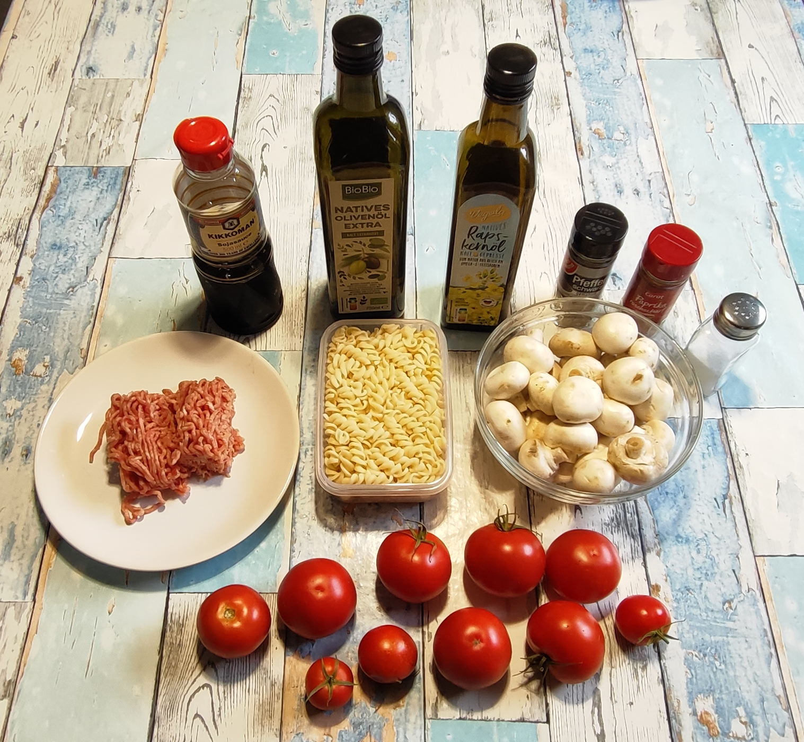
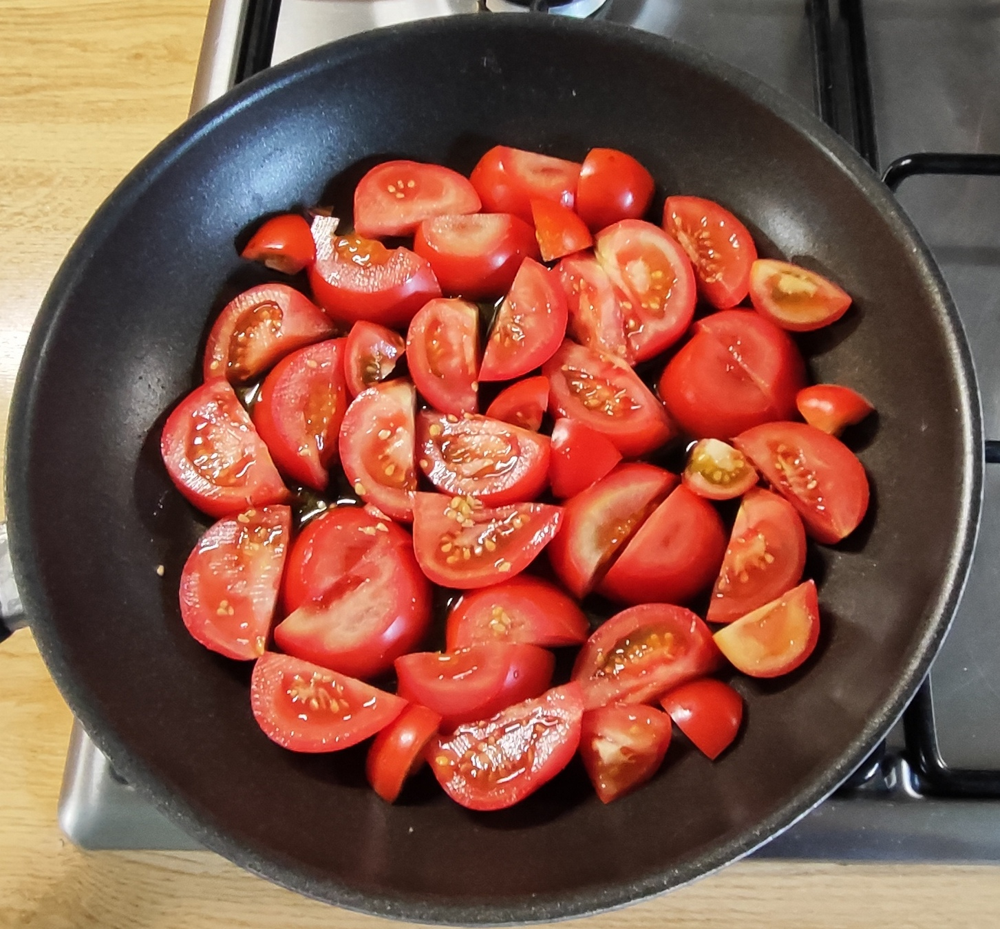
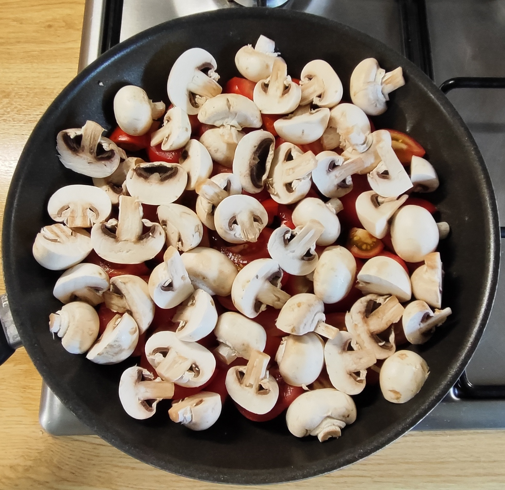
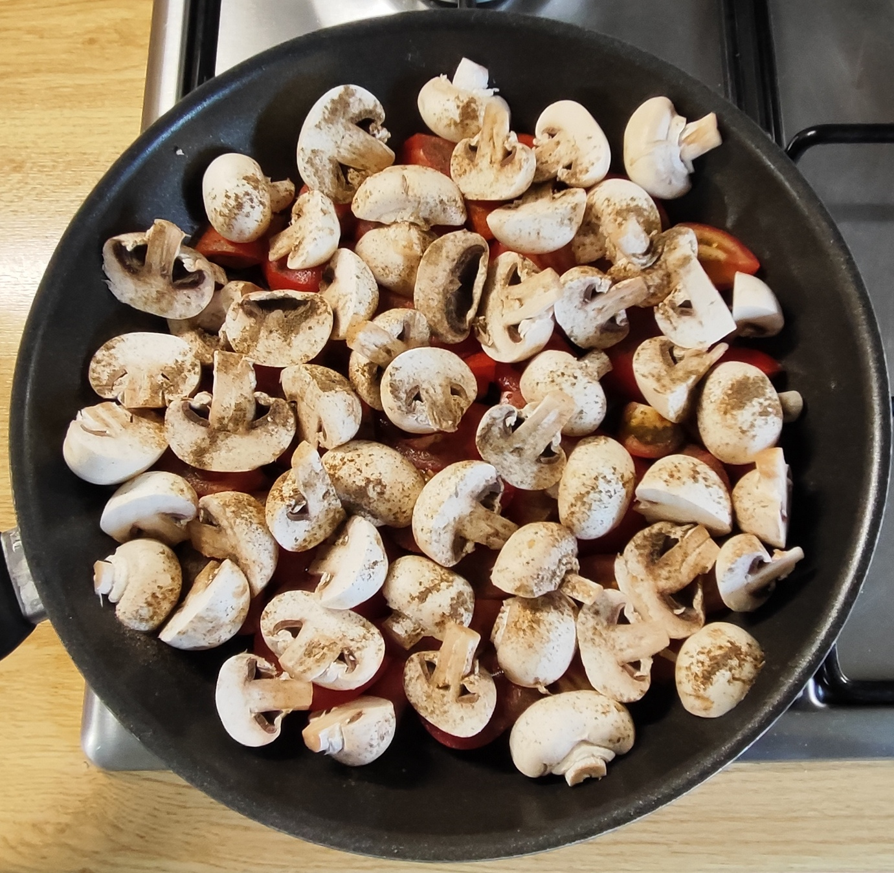
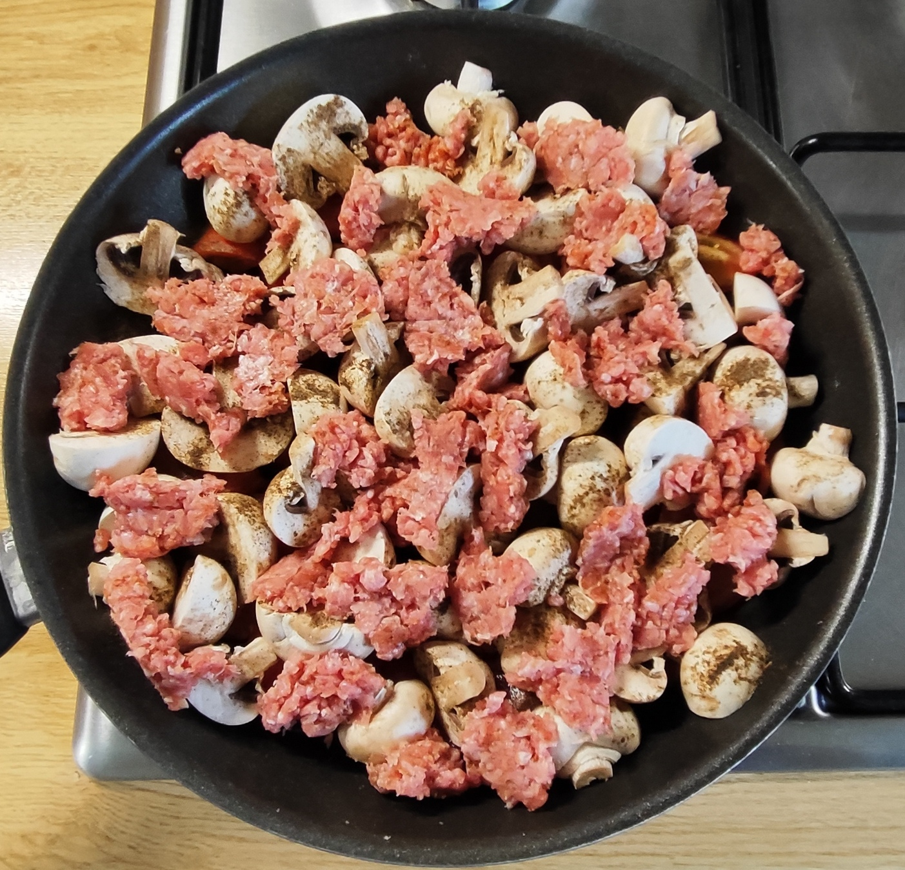
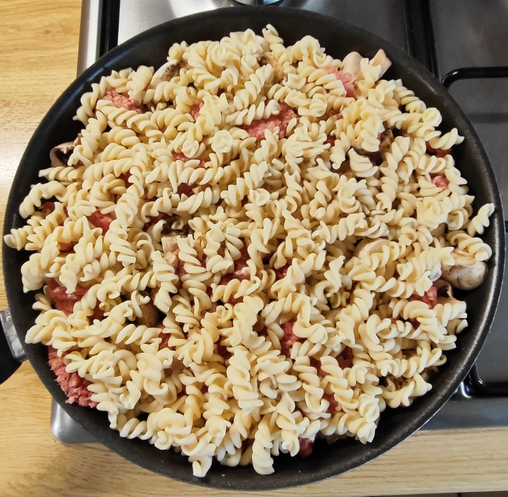
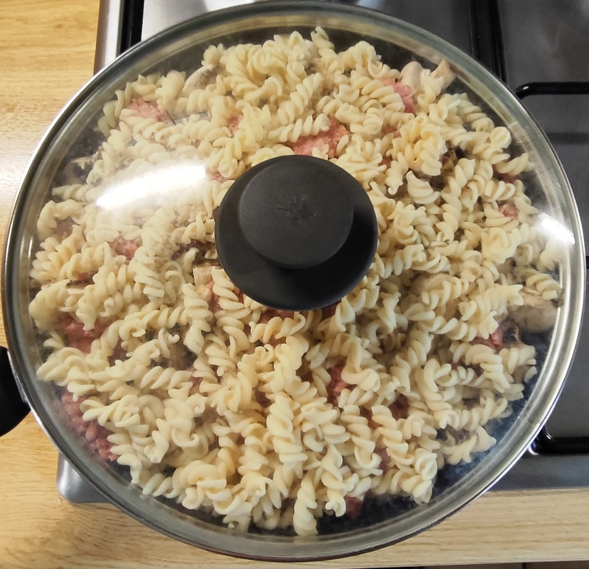
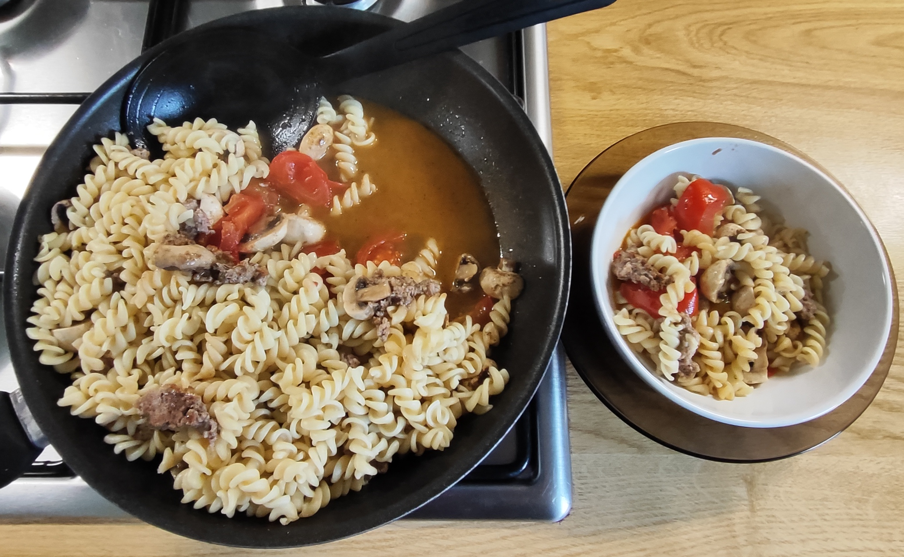
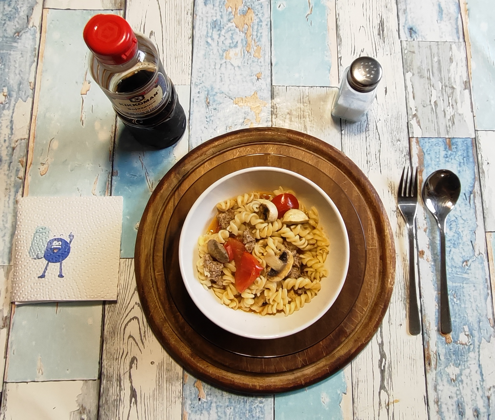
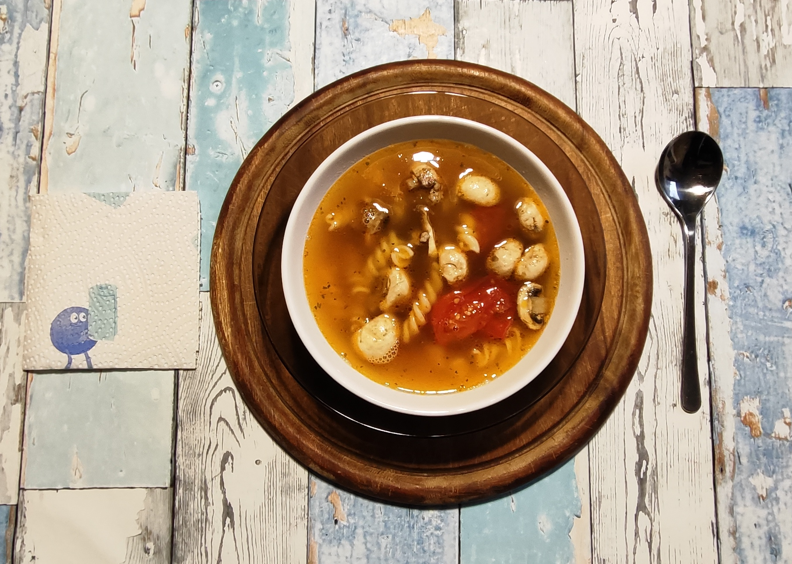

# Kurt kocht  &nbsp; - &nbsp; Tomaten-Schicht-Pfanne mit "Asia Note"

 

### Zutaten (für eine Riesen- oder zwei Normalportionen)

- Tomaten (ca. 500 g - diese sind aus dem eigenen Garten) 
- Champignons (250 – 300 g) 
- 150 g Hackfleisch, gemischt (halb und halb) 
- 120 g Spiralnudeln (Trockenmenge) 
- 2 Esslöffel Olivenöl + 1 Esslöffel Rapsöl 
- Gewürze: Salz, schwarzer Pfeffer, Paprikapulver rosenscharf, Sojasauce

### Zubereitung

#### Meal-Prep (Langfristvorbereitung)

- **Nudel-Vorrat**: Eine Packung Spiralnudeln (600 g) in Salzwasser kochen, abgießen, kalt abschrecken und in 5 Portionen aufgeteilt einfrieren.
- **Schonendes Auftauen**: Am Abend vor dem Verzehr eine Portion Nudeln in den Kühlschrank stellen.

#### Zubereitung am Verzehrtag

<table>
  <tr>
    <td></td>
    <td></td>
    <td></td>
  </tr>
  <tr>
    <td></td>
    <td></td>
    <td></td>
  </tr>
</table>

-	Die Öle in die Pfanne geben.
-	Die Tomaten in dicke Scheiben schneiden und den Pfannenboden auslegen.
-	Die Pilze putzen, in grobe Würfel schneiden und darüber verteilen. Mutig mit schwarzem Pfeffer würzen. 
- Das Hackfleisch nach Geschmack mit Salz, Pfeffer, Paprikapulver  würzen und in Flocken hinzugeben. 
- Mit den Nudeln bedecken. 
- Ca. 8 Minuten bei mittlerer Hitze mit Deckel schmoren / garen. 
- Sobald das Hackfleisch durchgegart ist, die Pfanne vom Herd nehmen.  
*Bei Bedarf auf kleinster Stufe warmhalten.* 

 

<table>
  <tr>
    <td></td>
    <td align="center"> <i>und so soll es aussehen  die Tomaten sind noch nicht zu weich  das Hack und die Pilze wurden im Dampf gegart  die Nudeln sind gut durchgewärmt  und  am Pfannenboden haben sich Tomaten- und Pilzsaft zu einem leckeren Sud gesammelt</i></td>
  </tr>
</table>

---

Am Tisch nach Geschmack mit Sojasauce würzen.
*(Vorsicht! Die Tomatenstücke bleiben unerwartet lange heiss!)*
 

---

#### Am Abend schmeckt ein Rest als Süppchen:
<table>
  <tr>
    <td></td>
    <td align="center"> <i>Sollte von der Pfanne am Mittag etwas übrig bleiben, lässt sich daraus mit minimalem Aufwand eine leichte Abendvariante zaubern.  Schnelle Zubereitung:  Basis: Die verbliebenen Reste (Gemüse, 
Nudeln und Fleisch) in eine Suppenschale geben.  Aufgießen: Mit heißer Brühe aufgießen und servieren. </i></td>
  </tr>
</table>

---

### META's Gesundheitscheck: Warum dieses Gericht punktet

Diese Schicht-Pfanne ist mehr als nur schnell zubereitet – sie ist ein wahres Nährstoffkraftpaket.  
Die reine Dampf-Garung ohne Anbraten schont nicht nur die Zutaten, sondern verhindert auch die Bildung unerwünschter Röststoffe.  
Alle Nährstoffe und Aromen bleiben im Gericht erhalten.  
Besondere Stärken: 
- Lycopin-Power: Durch das Erhitzen der Tomaten wird das sekundäre Pflanzenstoff Lycopin besonders gut für den Körper verfügbar – ein starker Antioxidans für Zellschutz und Herzgesundheit. 
- Kalium-Reichtum: Die Kombination aus Tomaten und Champignons liefert außergewöhnlich viel Kalium, das zur Regulierung des Blutdrucks beiträgt.
- Komplette B-Vitamine:  Das Hackfleisch deckt den Tagesbedarf an B12, Pilze und Nudeln liefern B6 und Folat.
- Volumen ohne Reue:  800 g Gemüse pro Pfanne = enorme Sättigung bei moderater Kaloriendichte. 
- Resistente Stärke: Die vorgekochten, tiefgefrorenen und wieder aufgetauten Nudeln enthalten resistente Stärke, gut für die Darmgesundheit. 

---

### Nährwerte
#### 1. Makronährstoffe (bezogen auf die gesamte Zutatenmenge) 

<table style="width: 800px; border-collapse: collapse; font-family: sans-serif;">
  <thead>
    <tr style="border-bottom: 2px solid #000;">
      <th style="width: 170px; text-align: left; padding: 8px; border: 1px solid #000;">Nährstoff</th>
      <th style="width: 170px; text-align: center; padding: 8px; border: 1px solid #000;">Menge</th>
      <th style="text-align: left; padding: 8px; border: 1px solid #000;">Anmerkung</th>
    </tr>
  </thead>
  <tbody>
    <tr>
      <td style="padding: 8px; border: 1px solid #000;"><strong>Kalorien</strong></td>
      <td style="text-align: center; padding: 8px; border: 1px solid #000;">ca. 1250 kcal</td>
      <td style="padding: 8px; border: 1px solid #000;">Vor allem durch Nudeln, Hack und Öl</td>
    </tr>
    <tr>
      <td style="padding: 8px; border: 1px solid #000;"><strong>Eiweiß</strong></td>
      <td style="text-align: center; padding: 8px; border: 1px solid #000;">ca. 55 g</td>
      <td style="padding: 8px; border: 1px solid #000;">Sehr gut! Durch Fleisch, Nudeln und Pilze</td>
    </tr>
    <tr>
      <td style="padding: 8px; border: 1px solid #000;"><strong>Kohlenhydrate</strong></td>
      <td style="text-align: center; padding: 8px; border: 1px solid #000;">ca. 95 g</td>
      <td style="padding: 8px; border: 1px solid #000;">Hauptenergiequelle durch Nudeln</td>
    </tr>
    <tr>
      <td style="padding: 8px; border: 1px solid #000;"><strong>davon Zucker</strong></td>
      <td style="text-align: center; padding: 8px; border: 1px solid #000;">ca. 12 g</td>
      <td style="padding: 8px; border: 1px solid #000;">Natürlich durch Tomaten</td>
    </tr>
    <tr>
      <td style="padding: 8px; border: 1px solid #000;"><strong>Fett (gesamt)</strong></td>
      <td style="text-align: center; padding: 8px; border: 1px solid #000;">ca. 65 g</td>
      <td style="padding: 8px; border: 1px solid #000;">3 EL Öl + Hackfleisch</td>
    </tr>
    <tr>
      <td style="padding: 8px; border: 1px solid #000;"><strong>Gesättigte Fettsäuren</strong></td>
      <td style="text-align: center; padding: 8px; border: 1px solid #000;">ca. 15 g</td>
      <td style="padding: 8px; border: 1px solid #000;">Durch das gemischte Hack</td>
    </tr>
    <tr>
      <td style="padding: 8px; border: 1px solid #000;"><strong>Ballaststoffe</strong></td>
      <td style="text-align: center; padding: 8px; border: 1px solid #000;">ca. 10 g</td>
      <td style="padding: 8px; border: 1px solid #000;">Sehr gut durch große Gemüsemenge</td>
    </tr>
  </tbody>
</table>

#### 2. Mikronährstoffe (bezogen auf die gesamte Zutatenmenge)

<table style="width: 800px; border-collapse: collapse; font-family: sans-serif;">
  <thead>
    <tr style="border-bottom: 2px solid #000;">
      <th style="width: 170px; text-align: left; padding: 8px; border: 1px solid #000;">Nährstoff</th>
      <th style="width: 170px; text-align: center; padding: 8px; border: 1px solid #000;">Menge</th>
      <th style="text-align: left; padding: 8px; border: 1px solid #000;">Deckungsbeitrag (Referenzwert Erwachsene/Tag)</th>
    </tr>
  </thead>
  <tbody>
    <tr>
      <td style="padding: 8px; border: 1px solid #000;"><strong>Vitamin C</strong></td>
      <td style="text-align: center; padding: 8px; border: 1px solid #000;">ca. 65 mg</td>
      <td style="padding: 8px; border: 1px solid #000;">65 % (hoher Gehalt durch Tomaten)</td>
    </tr>
    <tr>
      <td style="padding: 8px; border: 1px solid #000;"><strong>Vitamin A (Beta-Carotin)</strong></td>
      <td style="text-align: center; padding: 8px; border: 1px solid #000;">ca. 1,2 mg</td>
      <td style="padding: 8px; border: 1px solid #000;">150 % (aus Tomaten)</td>
    </tr>
    <tr>
      <td style="padding: 8px; border: 1px solid #000;"><strong>Vitamin B12</strong></td>
      <td style="text-align: center; padding: 8px; border: 1px solid #000;">ca. 2,5 µg</td>
      <td style="padding: 8px; border: 1px solid #000;">100 % (aus Hackfleisch)</td>
    </tr>
    <tr>
      <td style="padding: 8px; border: 1px solid #000;"><strong>Vitamin B6</strong></td>
      <td style="text-align: center; padding: 8px; border: 1px solid #000;">ca. 1,5 mg</td>
      <td style="padding: 8px; border: 1px solid #000;">100 % (Hack, Pilze, Nudeln)</td>
    </tr>
    <tr>
      <td style="padding: 8px; border: 1px solid #000;"><strong>Folat (B9)</strong></td>
      <td style="text-align: center; padding: 8px; border: 1px solid #000;">ca. 120 µg</td>
      <td style="padding: 8px; border: 1px solid #000;">60 % (Pilze, Tomaten, Nudeln)</td>
    </tr>
    <tr>
      <td style="padding: 8px; border: 1px solid #000;"><strong>Kalium</strong></td>
      <td style="text-align: center; padding: 8px; border: 1px solid #000;">ca. 1900 mg</td>
      <td style="padding: 8px; border: 1px solid #000;">90 % (sehr hoch in Tomaten & Pilzen)</td>
    </tr>
    <tr>
      <td style="padding: 8px; border: 1px solid #000;"><strong>Magnesium</strong></td>
      <td style="text-align: center; padding: 8px; border: 1px solid #000;">ca. 150 mg</td>
      <td style="padding: 8px; border: 1px solid #000;">40 % (Pilze, Nudeln)</td>
    </tr>
    <tr>
      <td style="padding: 8px; border: 1px solid #000;"><strong>Zink</strong></td>
      <td style="text-align: center; padding: 8px; border: 1px solid #000;">ca. 5 mg</td>
      <td style="padding: 8px; border: 1px solid #000;">50 % (aus Hackfleisch)</td>
    </tr>
    <tr>
      <td style="padding: 8px; border: 1px solid #000;"><strong>Lycopin</strong></td>
      <td style="text-align: center; padding: 8px; border: 1px solid #000;">ca. 15 mg</td>
      <td style="padding: 8px; border: 1px solid #000;">sehr hoch (durch gekochte Tomaten optimal verfügbar)</td>
    </tr>
  </tbody>
</table>

---

### Kurt's Praxis Check: So schmeckt es dann

Saftig, sehr saftig.  
Die Sojasauce verbindet sich mit den weich geschmorten Tomaten zu einer lecker leichten Asia Note.  
Die Pilzstücke sind groß genug geblieben. Sie heben sich deutlich heraus und setzen mit Biss und Geschmack einen eigenen Akzent.  
Das Hackfleisch gibt würzige Tiefe und verstärkt den saftigen Eindruck.  
Die Nudeln lieben den Sud und nehmen ihn gerne an. 

---

### Zusammenfassung von Mitautorin META

Eine clevere Schicht-Pfanne ohne Anbraten mit reiner Dampf-Garung - schonend und nährstofferhaltend.  
Die große Gemüsemenge (500 g Tomaten + 300 g Pilze) sorgt für Volumen und Sättigung.  
Das Meal-Prep der Nudeln ist clever: Es verkürzt die Zubereitungszeit am Verzehrtag und liefert durch die resistente Stärke einen gesundheitlichen Vorteil.  
Die Sojasauce schafft die Asia-Note und ermöglicht durch die Zugabe erst am Tisch eine bewusst dosierte Salzzugabe.  
Ein Gericht mit einfachen Zutaten, kurzer Zubereitungszeit und überraschend viel Geschmack, das auch am Abend als Reste-Süppchen noch lecker ist.  

---
[← Zurück zur Übersicht](index.md)
