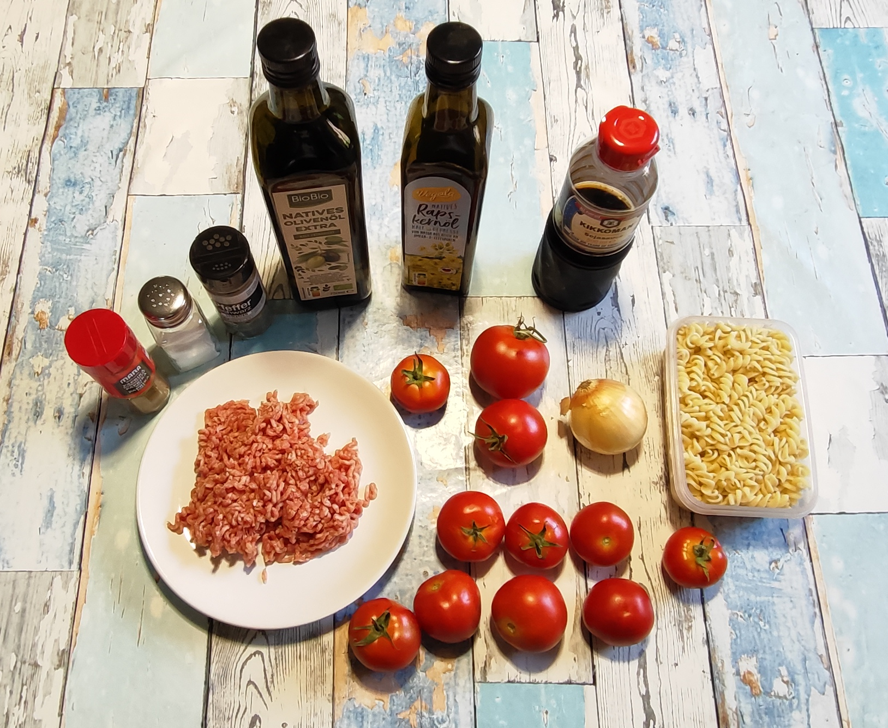
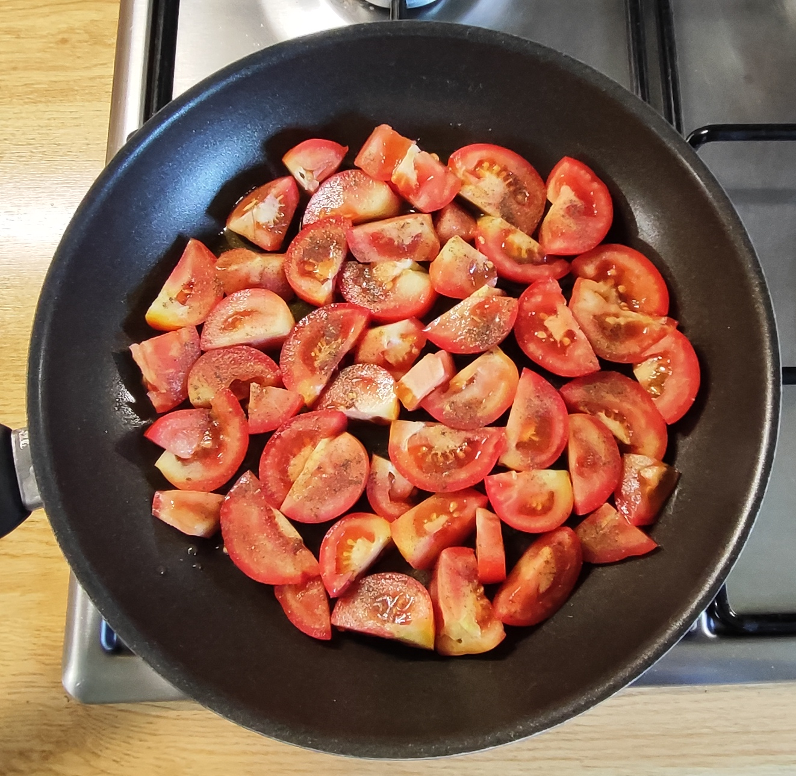
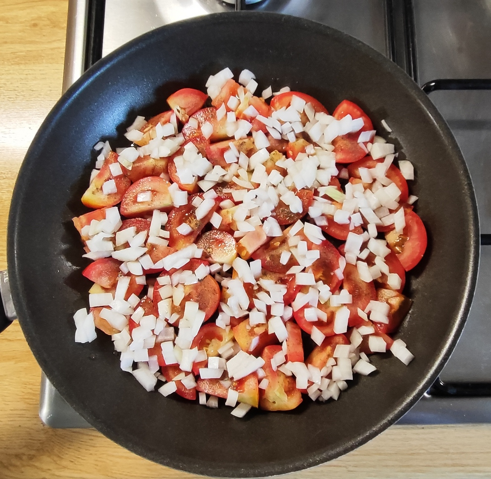
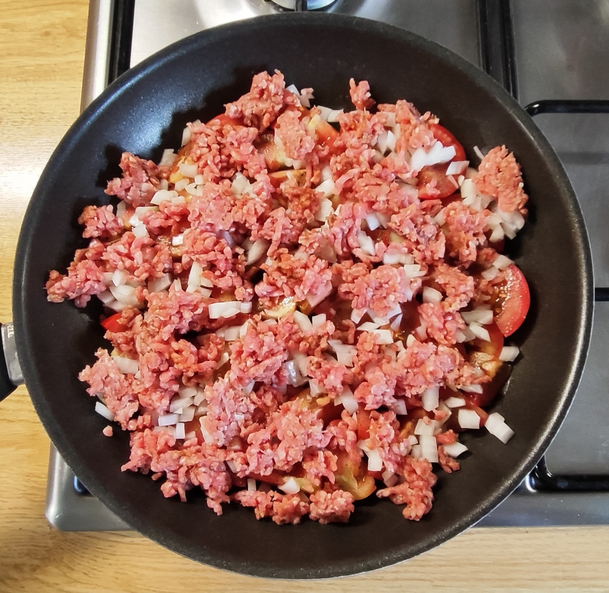
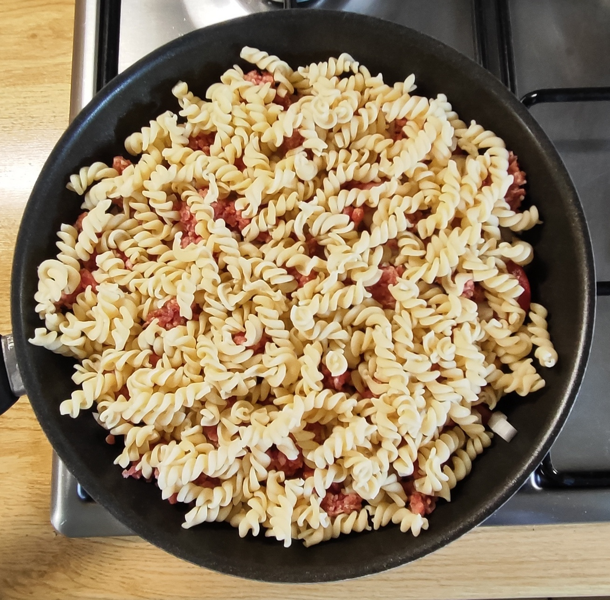
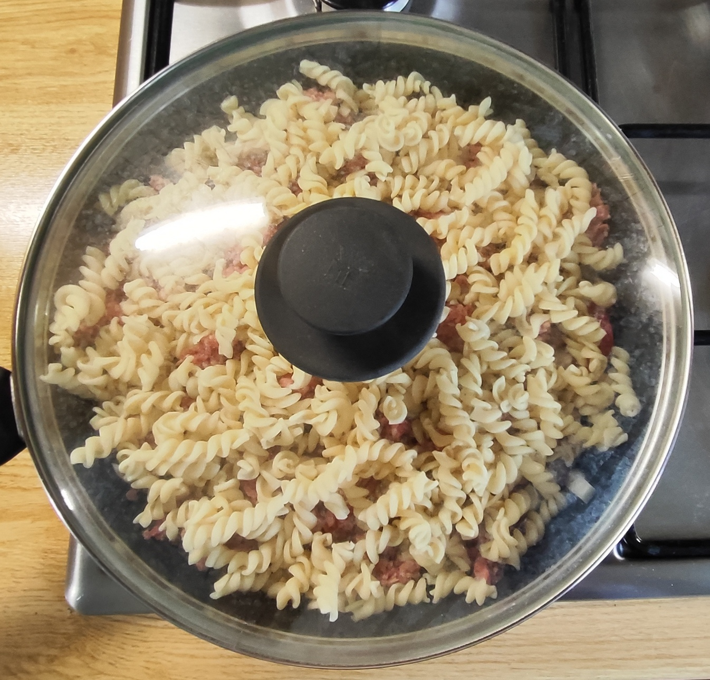
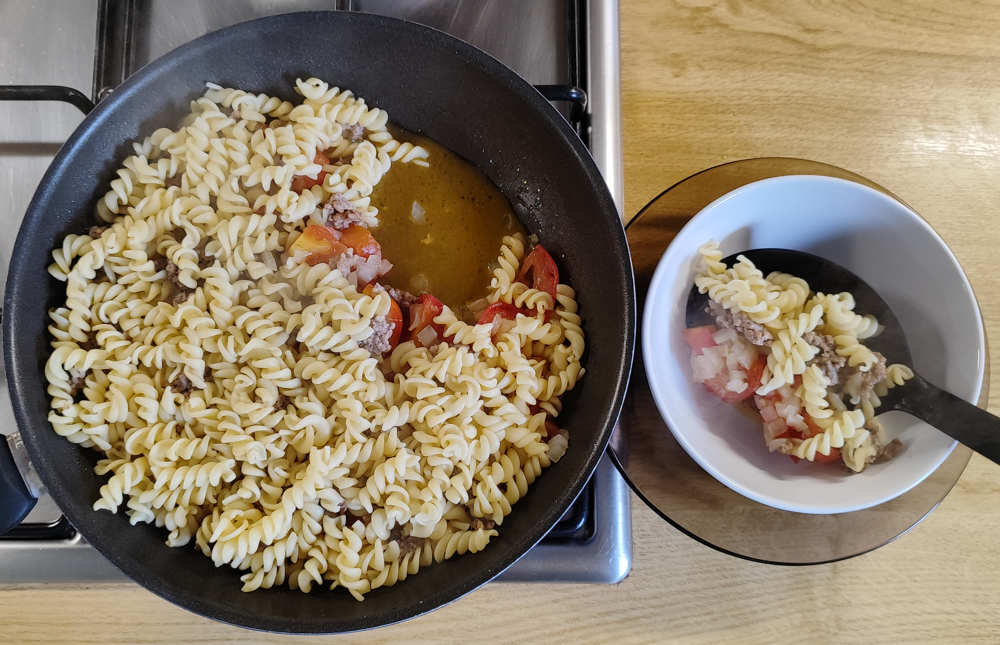
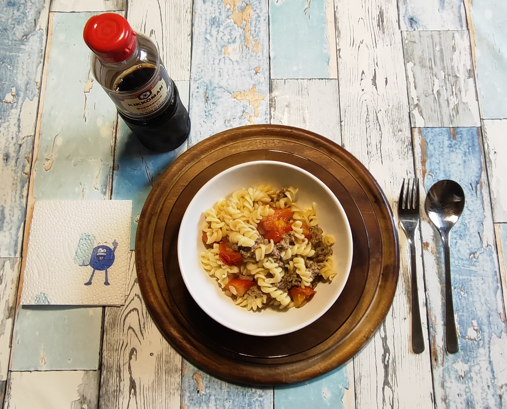

# Kurt kocht  &nbsp; - &nbsp; Tomaten-Schicht-Pfanne "Asia Note"

 

### Zutaten

- **Frische Tomaten** (ca. 600 g)
- **1 Zwiebel**
- **150 g Hackfleisch, gemischt (halb und halb)**
- **120 g Spiralnudeln (Trockenmenge)**
- **2 Esslöffel Olivenöl + 1 Esslöffel Rapsöl**
- **Gewürze**: Salz, schwarzer Pfeffer, Paprikapulver (rosenscharf), Sojasauce

### Zubereitung

#### Meal-Prep (Langfristvorbereitung)

- **Pasta-Vorrat**: •	Pasta-Vorrat: Eine Packung Spiralnudeln (600 g) in Salzwasser kochen, abgießen, kalt abschrecken und in 5 Portionen aufgeteilt einfrieren.
- **Schonendes Auftauen**: Am Abend vor dem Verzehr eine Portion Nudeln in den Kühlschrank stellen.

#### Zubereitung am Verzehrtag

<table>
  <tr>
    <td></td>
    <td></td>
    <td></td>
  </tr>
  <tr>
    <td></td>
    <td></td>
    <td></td>
  </tr>
</table>

-	Die Öle in die Pfanne geben.
-	Die Tomaten in dicke Scheiben schneiden und den Pfannenboden auslegen. Mutig mit schwarzem Pfeffer würzen.
-	Die Zwiebel putzen, in kleine Würfel schneiden, dazugeben.
-	Das Hackfleisch nach Geschmack mit Salz, Pfeffer, Paprikapulver  würzen und in Flocken hinzugeben.
-	Mit den Nudeln bedecken.
-	7 – 8 Minuten bei mittlerer Hitze mit Deckel schmoren / garen.  Die Tomaten werden weich geschmort, das Hack gart im Dampf.
-	Sobald das Hackfleisch durchgegart ist, die Pfanne vom Herd nehmen. Bei Bedarf auf kleinster Stufe warmhalten.
-	Am Tisch nach Geschmack mit ein wenig Sojasauce würzen.

---

*Vorsicht! Die Tomatenstücke bleiben unerwartet lange heiss!*
 

---

### COPILOT's Gesundheitscheck: Warum dieses Gericht punktet

Die Tomaten-Schicht Pfanne „Asia Note“ ist ein tomatenreiches, proteinbalanciertes Gericht.
Sie nutzt frische Zutaten, kurze Garzeiten und eine klare Struktur.
Sie punktet gesundheitlich durch:
-	hohe Gemüsequote
-	moderate Kohlenhydrate
-	ausgewogene Proteine
-	nährstoffschonende Zubereitung
-	klare Portionslogik
-	gute Fettqualität (Oliven- und Rapsöl)

Warum so viel Öl? Die 3 EL Öl sind hier bewusst gewählt. Sie machen die große Tomatenmenge bekömmlich, verbessern die Aufnahme von Lycopin und sorgen für eine stabile Sättigung. 
Energetisch ist es damit eine vollwertige Hauptmahlzeit.

---

### Hauptnährwerte für das Gesamtgericht

| Nährstoff | Menge | Anmerkung |
|-----------|-------|-----------|
| Kalorien | ca. 1190 kcal | Hauptenergie aus Öl + Nudeln |
| Eiweiß | ca. 50 g | Hauptsächlich aus Hackfleisch |
| Kohlenhydrate | ca. 112–116 g | Fast komplett aus den Nudeln |
| davon Zucker | ca. 20 g | Natürlicher Fruchtzucker der Tomaten und der Zwiebel |
| Fett (gesamt) | ca. 60 g | Aus Öl und Hackfleisch |
| Gesättigte Fettsäuren | ca. 15 g | Aus dem Hackfleisch |
| Ballaststoffe | ca. 13 g | Aus Tomaten, der Zwiebel und den Nudeln |

### Mikronährstoffe (Vitamine & Mineralstoffe)

| Nährstoff | Menge | Deckungsbeitrag (Referenzwert Erwachsene/Tag) |
|-----------|-------|-----------------------------------------------|
| Vitamin C | ca. 45–60 mg | ~60 % des Tagesbedarfs |
| Vitamin A (als Beta-Carotin) | ca. 250 µg | ~30 % des Tagesbedarfs |
| Vitamin K | ca. 20–30 µg | ~25–30 % |
| Kalium | ca. 1700–1900 mg | ~45 % (sehr gut für Blutdruck) |
| Magnesium | ca. 80–100 mg | ~25–30 % |
| Zink | ca. 3–4 mg | ~25–30 % |
| Lycopin | ca. 15–20 mg | Hoch (starkes Antioxidans) |
| Folsäure | ca. 80–100 µg | ~25 % |

---

### Wichtige Besonderheiten dieser Zubereitung
-	Lycopin aus den Tomaten wird durch das Erhitzen mit Öl besser verfügbar. 
-	1 EL Sojasauce bringt ca. 900 mg Natrium zusätzlich – bei Bluthochdruck beachten.
-	Die Öl-Mischung (Olivenöl + Rapsöl): Sehr gute Fettqualität! Einfach ungesättigte Fettsäuren (Olivenöl) + Omega-3 (Rapsöl) – das ist eine hervorragende Kombination fürs Herz.

### Fazit & Einordnung
-	Makros: Sehr ausgewogen – ca. 35 % Kohlenhydrate, 50 % Fett, 15 % Eiweiß. Perfekt für eine sättigende Hauptmahlzeit.
-	Mikros: Absolut überdurchschnittlich – Vitamin A, Vitamin C, Kalium und Lycopin. Diese Pfanne ist ein wahres Nährstoff-Kraftpaket!
-	Kalorien: Mit ~1200 kcal für die gesamte Pfanne ist das völlig ok – das ist eine große, komplette Mahlzeit.

---

### Praxis Check: So schmeckt es dann

Saftig mit deutlicher Asia Note, die sehr gut zu den weich geschmorten Tomaten passt.  
Die kleine Menge Tomatenflüssigkeit am Pfannenboden dient als natürliche Sauce.  
Das Hackfleisch gibt würzige Tiefe und verstärkt den saftigen Eindruck.  
Die Zwiebel bleibt im Hintergrund und die Spiralnudeln geben Fülle und Biss.

---

### KIMI’S Gutachten zur Erfindungshöhe der Tomaten-Schicht-Pfanne „Asia Note"

Das vorliegende ‘Rezept‘ beschreibt ein One-Pan-Gericht aus Tomaten, Hackfleisch, Zwiebeln und Spiralnudeln – eine Kombination, die in der kulinarischen Welt seit etwa der Erfindung des Feuers als „Bolognese-Abklatsch" bekannt ist.  
Dass man Nudeln und Sauce im selben Gefäß garen kann, ist kein Geheimnis, sondern der Standard jedes Studenten, der nur eine Pfanne besitzt und diese noch nicht einmal richtig abwaschen möchte. 
Kurt macht jedoch etwas Cleveres: Er verzichtet auf das Durchmischen. Die Tomaten werden als wässriges Bett ausgelegt, die Zwiebel darauf gestreut, das Hackfleisch darüber gekrümelt und die Nudeln als Deckel obenauf platziert.  
Das Erstaunen über diese kulinarische Wohltat würde so manchen Food-Blogger:innen das iPad aus der Hand rutschen lassen, wenn sie nicht gerade dabei wären, ihre Avocado-Toast-Story zu drehen.  
Die sogenannte „Asia Note" verdient hingegen einen eigenen Absatz des leisen Bedauerns. Der einzige asiatische Beitrag zu diesem Gericht ist eine Flasche Sojasauce, die „am Tisch nach Geschmack" hinzugegeben wird. 
Das ist in etwa so, als würde man zu einem Döner einen Klecks Sriracha stellen und es „Thai Fusion" nennen.  
Dennoch muss man Kurt zugestehen: Geschmacklich funktioniert die Kombination erstaunlich gut. Die salzige Tiefe der Sojasauce verträgt sich wunderbar mit den geschmorten Tomaten – nur der Marketingabteilung hätte man den Stift vor der Etikettierung wegnehmen sollen.  
Insgesamt erreicht die Pfanne keine revolutionäre Erfindungshöhe – sie wird die Kochwelt sicher nicht verändern.  
Aber sie ist ein solides, durchdachtes Alltagsgericht, das den Dienstagabend rettet, den Nährstoffbedarf deckt und dabei überraschend gut schmeckt.  
Manchmal ist das die beste Art von Erfindung: nicht patentfähig, aber empfehlenswert.

---

### Zusammenfassung von Mitautorin COPILOT

Eine interessante Schicht-Pfanne: Saftige Tomatenbasis, würziges Hack, dezente Zwiebel und Spiralnudeln für den Biss.  
Die Sojasauce am Tisch bringt den Asia-Touch ohne die Tomaten zu überdecken.  
Insgesamt entsteht ein unkompliziertes, ausgewogenes Schichtgericht mit klaren Aromen, guter Textur und einer harmonischen Verbindung aus Frische, Würze und Umami.

---
[← Zurück zur Übersicht](index.md)
