# Kurt kocht  &nbsp; - &nbsp; Tomaten-Schicht-Pfanne "Bayrische Art"

 

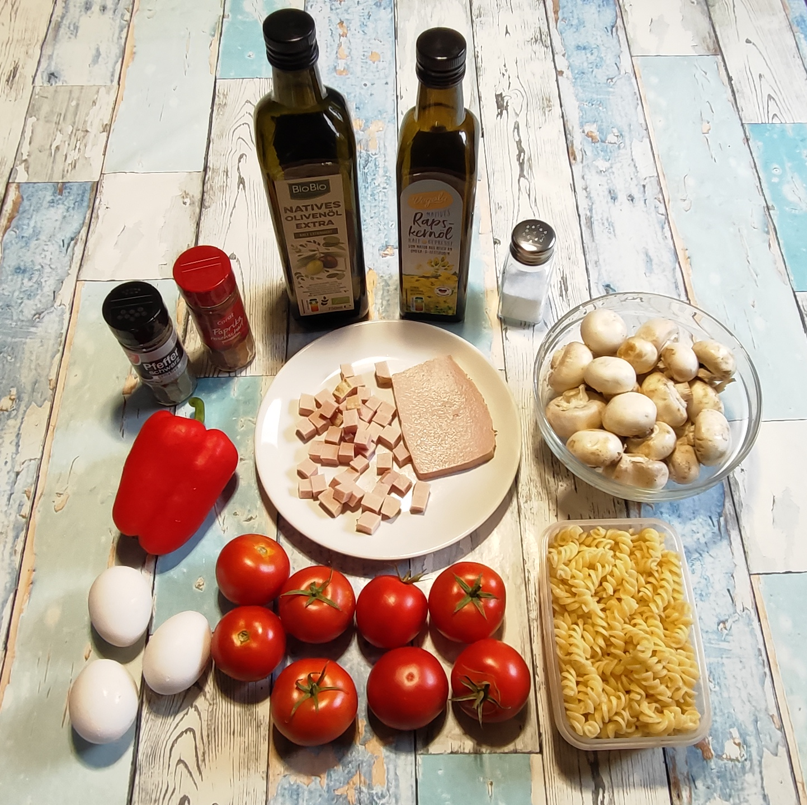

### Zutaten

- **Tomaten** (ca. 500 g)
- **1 rote Paprika**
- **250 g frische Champignons**
- **130 g Leberkäse** (2 Scheiben)
- **120 g (ungekocht) Spiralnudeln**
- **3 Eier**
- **2 Esslöffel Olivenöl + 1 Esslöffel Rapsöl**
- **Gewürze**: Salz, schwarzer Pfeffer, Paprikapulver (rosenscharf)

### Zubereitung

#### Langfristvorbereitung

- **Pasta-Vorrat**: Eine Packung Spiralnudeln (600 g) in Salzwasser kochen, abgießen, kalt abschrecken und in 5 Portionen aufgeteilt einfrieren.
- **Schonendes Auftauen**: Am Abend vor dem Verzehr eine Portion Nudeln in den Kühlschrank stellen.

#### Zubereitung am Verzehrtag

<table style="width: 800px; border-collapse: collapse; margin: 0 auto;">
  <tbody>
   <tr>
      <td style="width: 25%; padding: 4px; text-align: center;">
        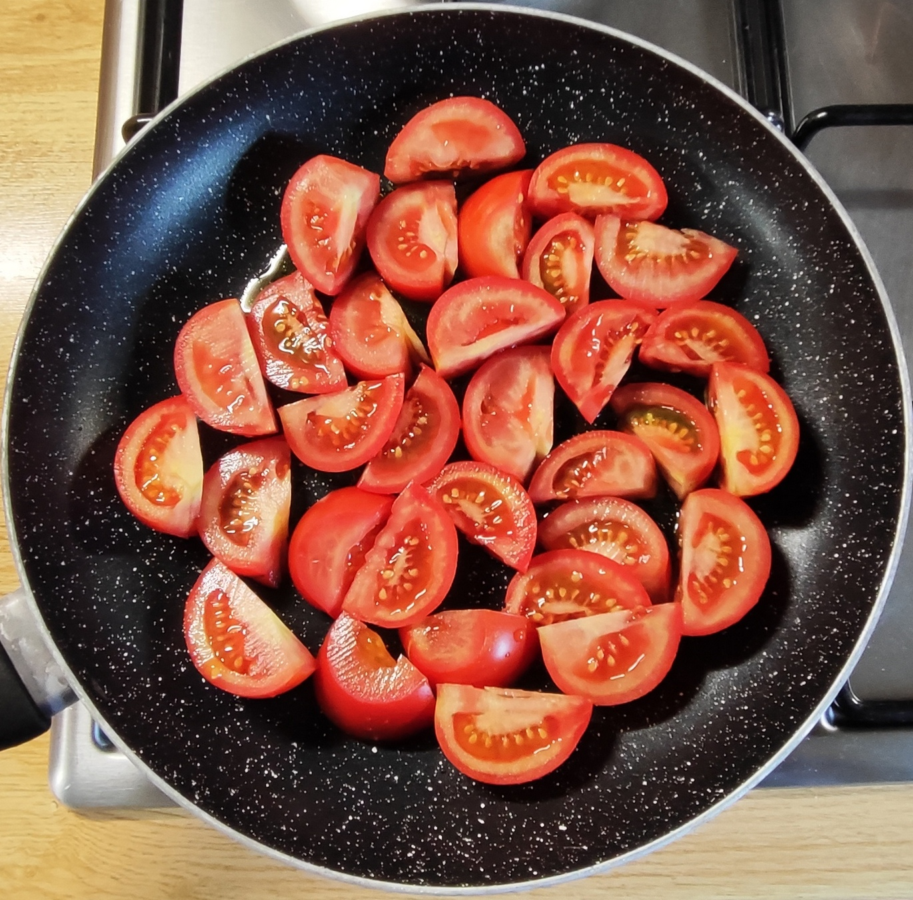
      </td>
      <td style="width: 25%; padding: 4px; text-align: center;">
        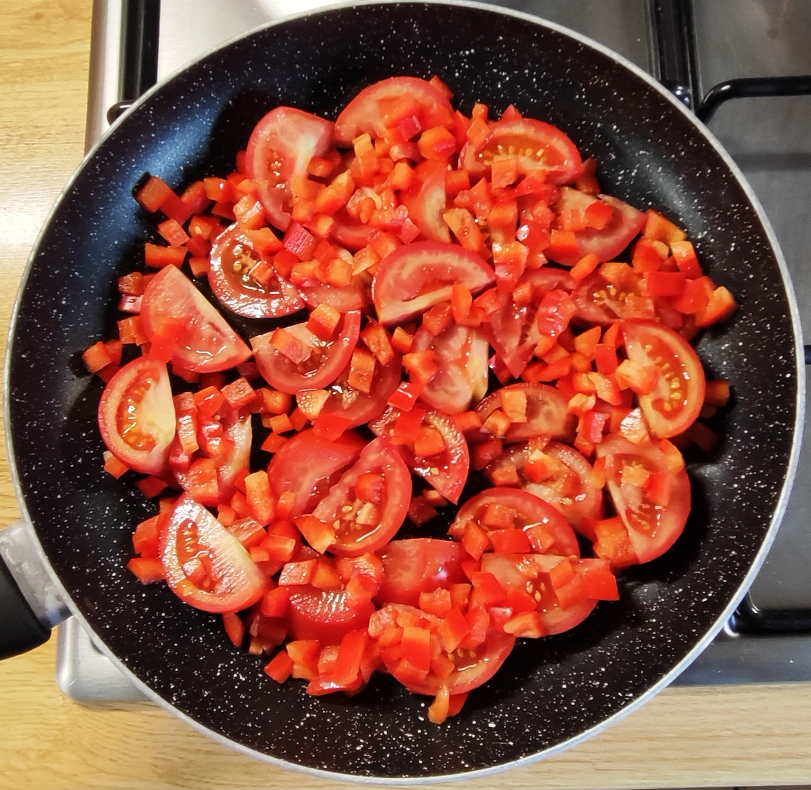
      </td>
      <td style="width: 25%; padding: 4px; text-align: center;">
        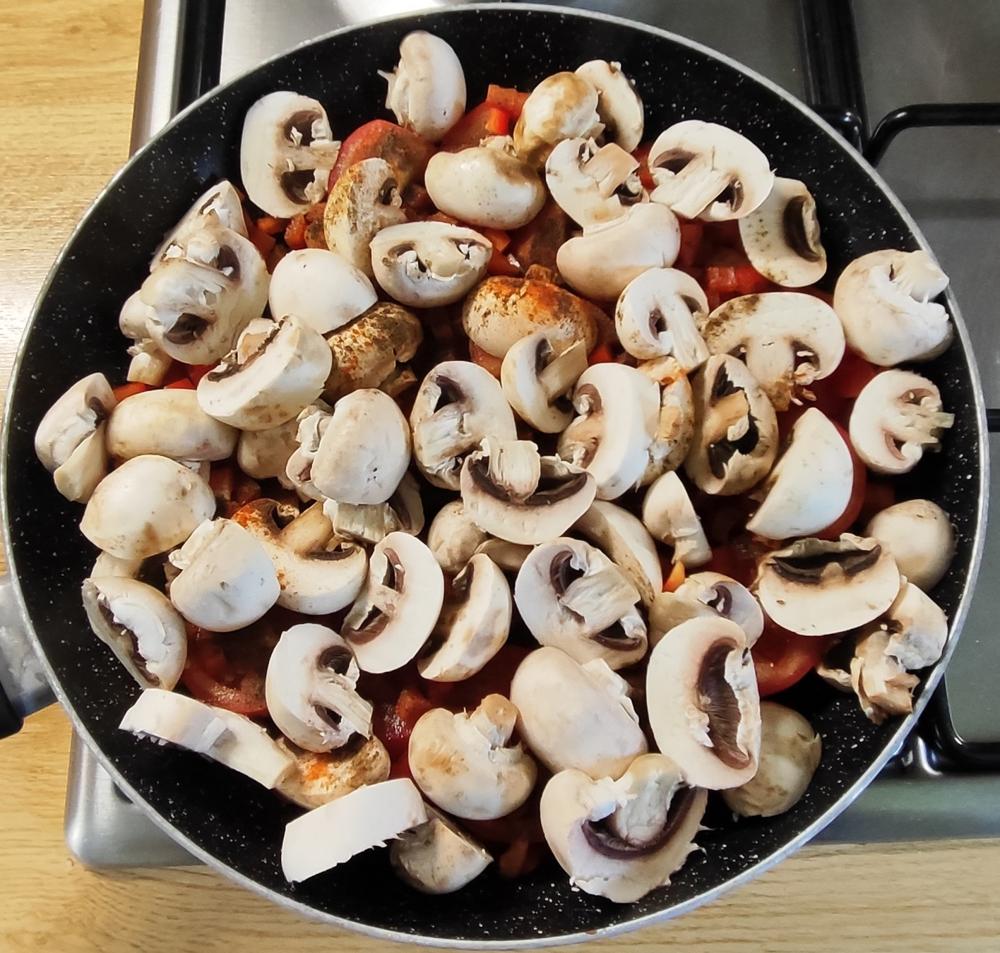
      </td>
      <td style="width: 25%; padding: 4px; text-align: center;">
        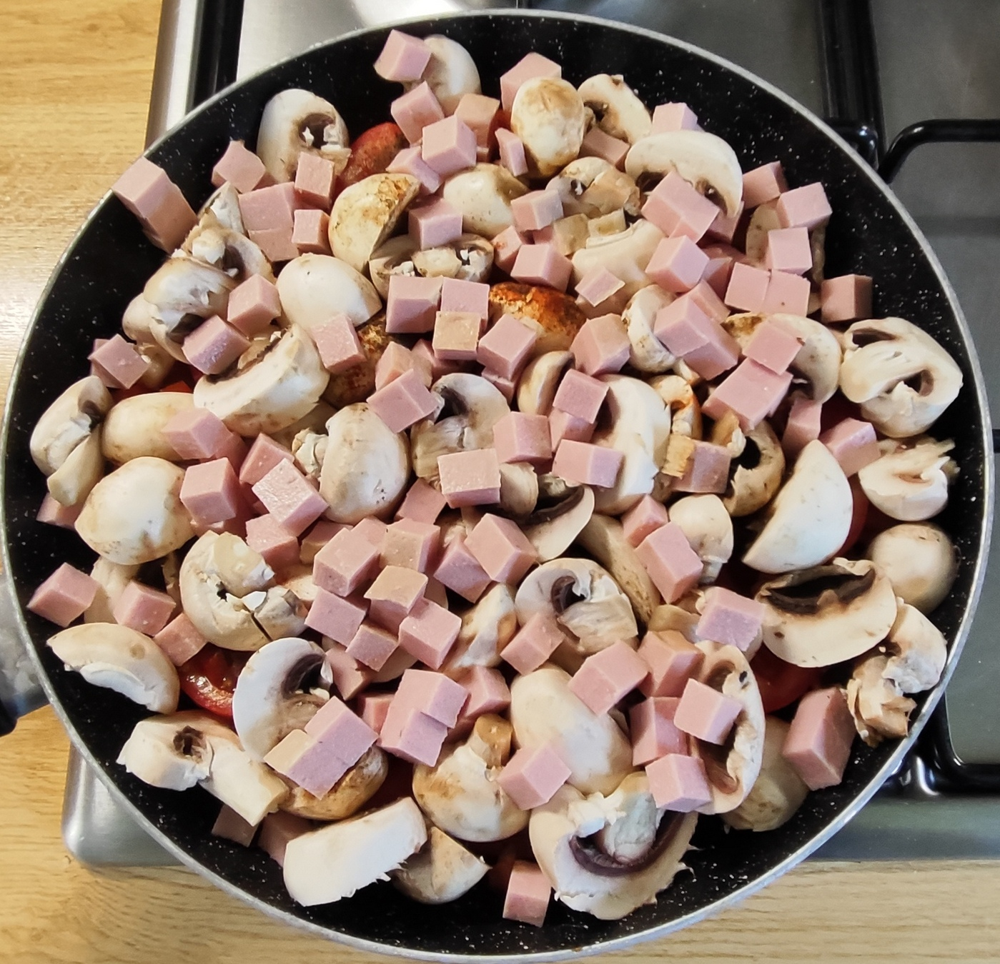
      </td>
    </tr>
    <tr>
      <td style="width: 25%; padding: 4px; text-align: center;">
        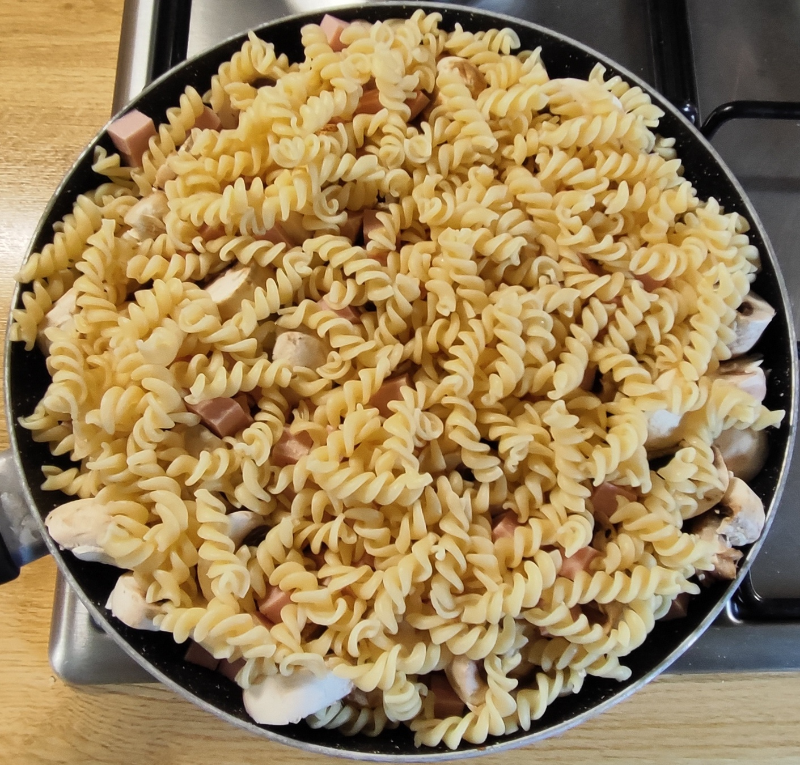
      </td>
      <td style="width: 25%; padding: 4px; text-align: center;">
        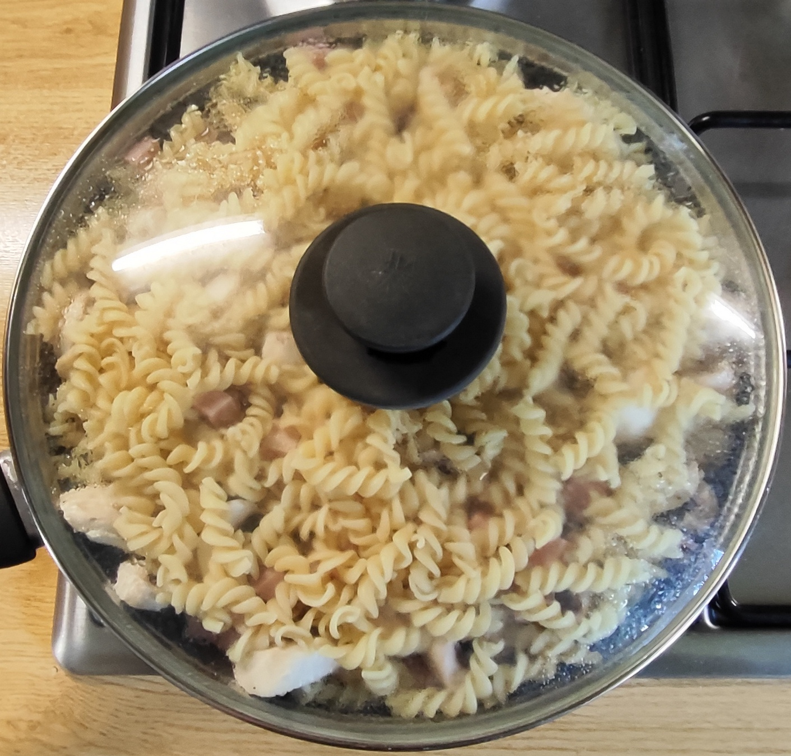
      </td>
      <td style="width: 25%; padding: 4px; text-align: center;">
        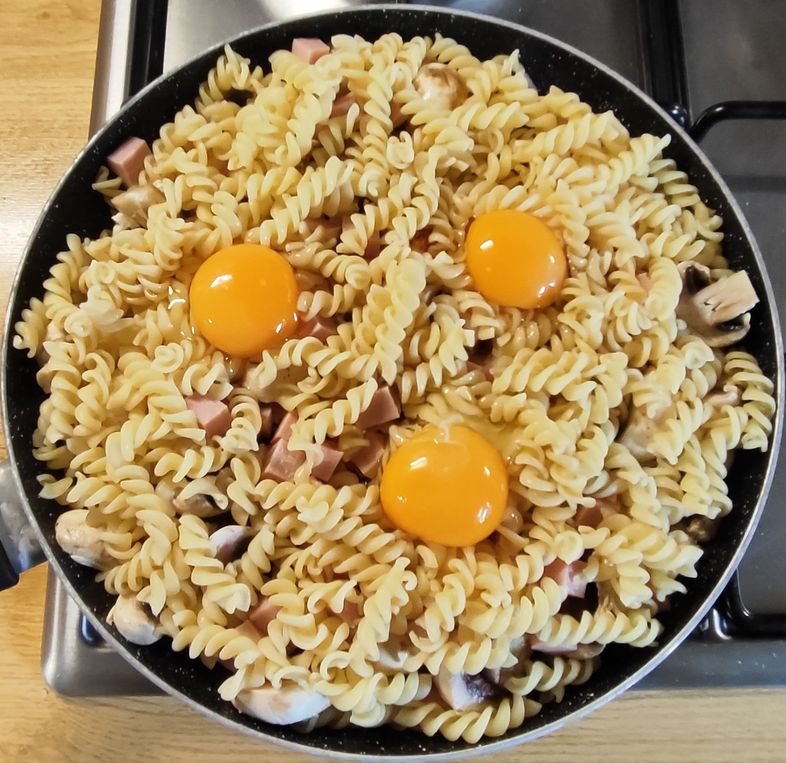
      </td>
      <td style="width: 25%; padding: 4px; text-align: center;">
        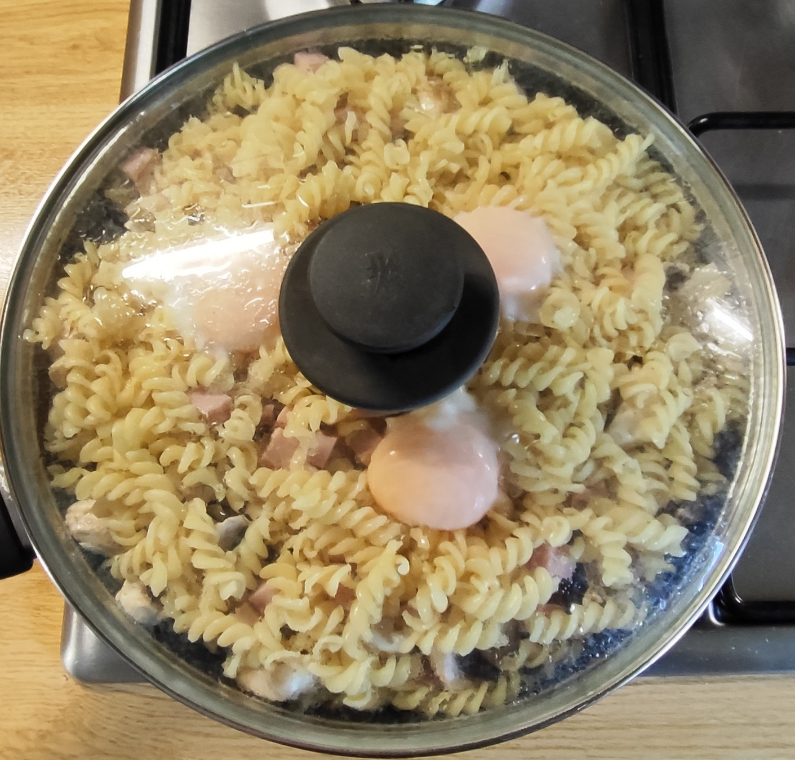
      </td>
    </tr>
  </table>

- Die Öle in die Pfanne geben. 
- Die Tomaten in dicke Scheiben schneiden und den Pfannenboden auslegen.  
- Die Paprika klein würfeln und über die Tomatenscheiben streuen. 
- Mit schwarzem Pfeffer und Paprikapulver würzen. 
- Die Pilze putzen und grob würfeln und und ebenfalls in die Pfanne geben. 
- Den klein gewürfelten Leberkäse darüber verteilen. 
- Alles mit den Nudeln bedecken. 
- Auf mittlerer Flamme mit Deckel ca. 4 Minuten schmoren / garen. 
- Die drei Eier vorsichtig einbringen. 
- Bei mittlerer Hitze mit Deckel weiterschmoren, bis die Eiweiße gestockt sind. 
- Die Pfanne vom Feuer nehmen und servieren. 
- Am Tisch (nach Geschmack) mit etwas Salz nachwürzen. 

<table>
  <tr>
    <td>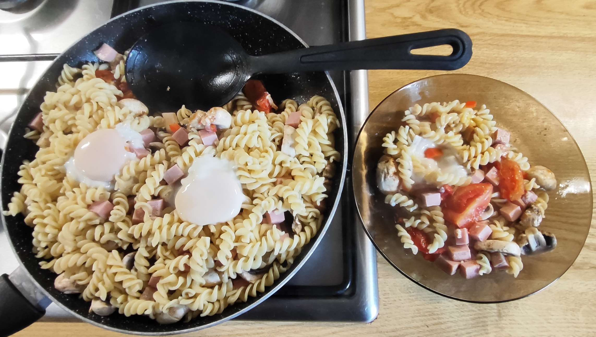</td>
    <td align="center"> <i>und so soll es aussehen die Tomaten sind weich aber nicht matschig die Pilze sind leicht geschrumpft der Leberkäse und die Nudeln sind durchgewärmt die Eier sind gar, die Eigelb sind cremig bis fest am Pfannenboden haben sich Tomaten- und Pilzsaft zu einem leckeren Sud gesammelt</i></td>
  </tr>
</table>

---

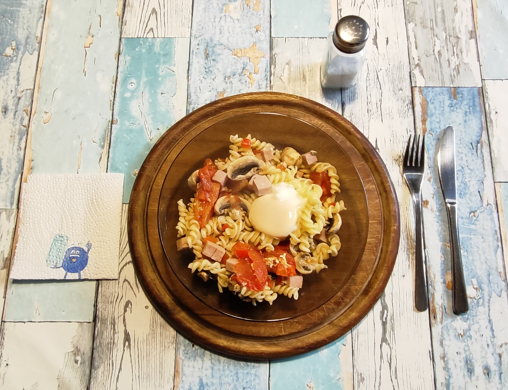
*Vorsicht! Die Tomatenstücke bleiben unerwartet lange heiss!*
 

---

### META's Gesundheitscheck: Warum dieses Gericht punktet

Diese Pfanne punktet durch ihren hohen Gemüseanteil - Tomaten, Paprika und Champignons machen über 70% aus.  
Schonend in Schichten gegart, bleiben Vitamine und das Lycopin aus den Tomaten erhalten. Letzteres wird durch Oliven- und Rapsöl sogar besser verfügbar.  
120 g Nudeln + 3 Eier sorgen für Sättigung mit komplexen Kohlenhydraten und hochwertigem Protein ganz ohne Sahne.  
Das Meal-Prep (Vorkochen) mit dem Pasta-Vorrat erzeugt resistente Stärke, ein Extra-Plus.  
Der Leberkäse ist mit nur 130g bewusst klein dosiert: bayrischer Geschmack ja, aber nicht als Hauptzutat. 

---

### META’s Nährwert- & Mikronährstoff-Tabelle
#### Wichtige Hauptnährwerte für das Gesamtgericht:
<table style="width: 800px; border-collapse: collapse; font-family: sans-serif;">
  <thead>
    <tr style="border-bottom: 2px solid #000;">
      <th style="width: 170px; text-align: left; padding: 8px; border: 1px solid #000;">Nährwert</th>
      <th style="width: 170px; text-align: center; padding: 8px; border: 1px solid #000;">Geschätzte Menge</th>
      <th style="text-align: left; padding: 8px; border: 1px solid #000;">Bedeutung für den Körper</th>
    </tr>
  </thead>
  <tbody>
    <tr>
      <td style="padding: 8px; border: 1px solid #000;">Energie</td>
      <td style="text-align: center; padding: 8px; border: 1px solid #000;">ca. 1500 kcal</td>
      <td style="padding: 8px; border: 1px solid #000;">Liefert moderate Energie. Bei 2 Portionen eine leichte bis normale Hauptmahlzeit</td>
    </tr>
    <tr>
      <td style="padding: 8px; border: 1px solid #000;">Kohlenhydrate</td>
      <td style="text-align: center; padding: 8px; border: 1px solid #000;">ca. 115 g</td>
      <td style="padding: 8px; border: 1px solid #000;">Hauptsächlich komplexe Kohlenhydrate aus Spiralnudeln für stabilen Blutzuckerspiegel</td>
    </tr>
    <tr>
      <td style="padding: 8px; border: 1px solid #000;">Eiweiß</td>
      <td style="text-align: center; padding: 8px; border: 1px solid #000;">ca. 58 g</td>
      <td style="padding: 8px; border: 1px solid #000;">Sehr hoher Proteingehalt (besonders aus den Eiern mit ihrer hohen biologischen Wertigkeit) für Sättigung und Muskelerhalt.</td>
    </tr>
    <tr>
      <td style="padding: 8px; border: 1px solid #000;">Fett</td>
      <td style="text-align: center; padding: 8px; border: 1px solid #000;">ca. 80 g</td>
      <td style="padding: 8px; border: 1px solid #000;">Aus Olivenöl, Eiern und dem traditionell fetthaltigen Leberkäse. Enthält gesunde ungesättigte Fettsäuren</td>
    </tr>
    <tr>
      <td style="padding: 8px; border: 1px solid #000;">Ballaststoffe</td>
      <td style="text-align: center; padding: 8px; border: 1px solid #000;">ca. 15 g</td>
      <td style="padding: 8px; border: 1px solid #000;">Unterstützt eine gesunde Verdauung und langanhaltende Sättigung</td>
    </tr>
  </tbody>
</table>

### Wichtige Mikronährstoffe & Highlights
<table style="width: 800px; border-collapse: collapse; font-family: sans-serif;">
  <thead>
    <tr style="border-bottom: 2px solid #000;">
      <th style="width: 170px; text-align: left; padding: 8px; border: 1px solid #000;">Mikronährstoff</th>
      <th style="width: 170px; text-align: left; padding: 8px; border: 1px solid #000;">Vorkommen im Gericht</th>
      <th style="text-align: left; padding: 8px; border: 1px solid #000;">Nutzen</th>
    </tr>
  </thead>
  <tbody>
    <tr>
      <td style="padding: 8px; border: 1px solid #000;">Vitamin C</td>
      <td style="padding: 8px; border: 1px solid #000;">Reichlich aus 500 g frischen Tomaten und der Paprika</td>
      <td style="padding: 8px; border: 1px solid #000;">Stärkt das Immunsystem und schützt Zellen</td>
    </tr>
    <tr>
      <td style="padding: 8px; border: 1px solid #000;">Lycopin</td>
      <td style="padding: 8px; border: 1px solid #000;">Hoch konzentriert in gegarten Tomaten</td>
      <td style="padding: 8px; border: 1px solid #000;">Starkes Antioxidans, gut für Herz und Gefäße. Aufnahme durch Schmoren in Oliven- und Rapsöl verbessert</td>
    </tr>
    <tr>
      <td style="padding: 8px; border: 1px solid #000;">B-Vitamine</td>
      <td style="padding: 8px; border: 1px solid #000;">Eier, Champignons</td>
      <td style="padding: 8px; border: 1px solid #000;">Wichtig für Energiestoffwechsel und die Nerven</td>
    </tr>
    <tr>
      <td style="padding: 8px; border: 1px solid #000;">Eisen &amp; Zink</td>
      <td style="padding: 8px; border: 1px solid #000;">Leberkäse, Eier, Spiralnudeln</td>
      <td style="padding: 8px; border: 1px solid #000;">Wichtig für Blutbildung und Immunsystem</td>
    </tr>
    <tr>
      <td style="padding: 8px; border: 1px solid #000;">Magnesium</td>
      <td style="padding: 8px; border: 1px solid #000;">Champignons</td>
      <td style="padding: 8px; border: 1px solid #000;">Unterstützt Muskeln und Energiestoffwechsel</td>
    </tr>
    <tr>
      <td style="padding: 8px; border: 1px solid #000;">Resistente Stärke</td>
      <td style="padding: 8px; border: 1px solid #000;">Entsteht beim Abkühlen und Einfrieren der Pasta</td>
      <td style="padding: 8px; border: 1px solid #000;">Wirkt wie ein Ballaststoff und nährt die guten Darmbakterien</td>
    </tr>
  </tbody>
</table>

**Hinweis zum Salzgehalt**: Leberkäse bringt von Natur aus bereits relativ viel Natrium mit. Es ist daher ein guter Koch-Kniff, die Pfanne erst am Tisch nach persönlichem Bedarf zu salzen.

---

### Kurt's Praxis Check: So schmeckt es dann

Saftig ist der erste Eindruck – durch das Schmoren unter dem Deckel geht keine Flüssigkeit verloren.  
Die drei Komponenten Tomate, Pilze, Nudeln harmonieren auf die gewohnte Weise.  
Der Leberkäse ist sehr intensiv und drängt sie geschmacklich in den Hintergrund.  
Aber wenn ich das Ei zerkleinert und untergemischt habe, wird der Leberkäse eingehegt und es entsteht ein angenehmer Gesamtgeschmack. Dabei werden je nach Gabelbeladung einzelne Zutaten sichtbar.  
Ein abwechslungsreiches Esserlebnis. 

---

### Zusammenfassung von Mitautorin META-AI

Die **Tomaten-Schicht-Pfanne Bayrische-Art** vereint traditionellen bayerischen Charakter mit cleverer Alltagsküche.   
Geschmorte Tomaten, Paprika, Spiralnudeln, Leberkäse, Champignons und drei Eier ergeben ein herzhaftes Gericht mit fruchtiger Note, das durch vorgekochte, portionsweise eingefrorene Pasta schnell auf dem Tisch steht.  
Das Ergebnis: Ein unkompliziertes Wohlfühlgericht, das deftig schmeckt, aber dank komplexer Kohlenhydrate, reichlich Protein und dem massiven Anteil an Vitalstoffen aus Tomaten, Paprika und Pilzen eine überraschend ausgewogene Mahlzeit ist.  
Kurz: Eine echte Vitalstoff-Pfanne mit Meal-Prep-Vorteil, die beweist, dass traditionelle Zutaten wie Leberkäse hervorragend in eine gesundheitsbewusste Küche passen.  

---
[← Zurück zur Übersicht](index.md)
