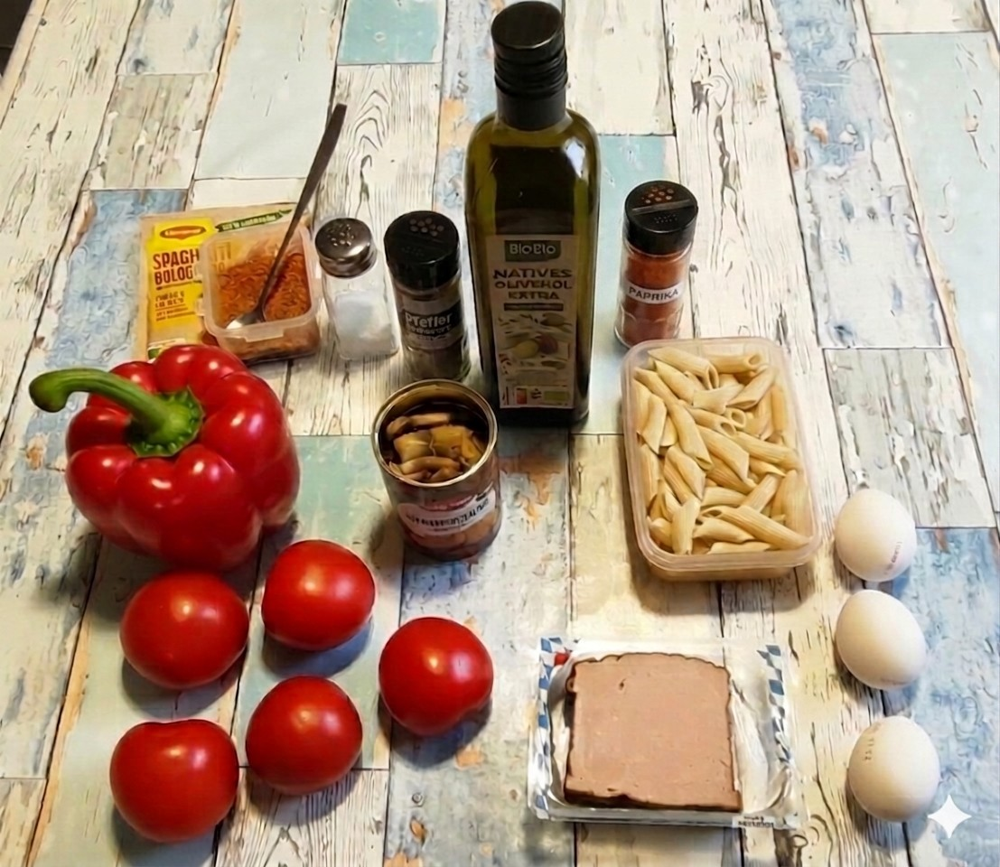

# Kurt kocht &nbsp; - &nbsp; Fruchtige Nudelpfanne Bayrische-Art

 

### Zutaten

- **Frische Tomaten** (ca. 400 g)
- **1 rote Paprika**
- **125 g Leberkäse** (2 Scheiben)
- **125 g (ungekocht ¼ Packung) Dinkel-Penne**
- **3 Eier**
- **200 g frische Champignons** - wenn nicht verfügbar, als Ersatz eine Dose Champignons (geschnitten)
- **3 Esslöffel Olivenöl**
- **Gewürze**: Salz, schwarzer Pfeffer, Paprikapulver (rosenscharf) und ein halber Teelöffel Maggi fix für Bolognese

### Zubereitung

#### Langfristvorbereitung

- **Pasta-Vorrat**: Eine Packung Dinkel-Penne (500 g) in Salzwasser kochen, abgießen, kalt abschrecken und in 4 Portionen aufgeteilt einfrieren.
- **Schonendes Auftauen**: Am Abend vor dem Verzehr eine Portion Penne in den Kühlschrank stellen.

#### Zubereitung am Verzehrtag

|  |  |  |
| --- | --- | --- |
|  |  |  |

1.  Das Olivenöl in die Pfanne geben.
2.  Die Tomaten in dicke Scheiben schneiden und den Pfannenboden auslegen.
3.  Die Paprika in ganz kleine Würfel schneiden und über den Tomaten verteilen.
4.  Mit Maggi fix, schwarzen Pfeffer und Paprikapulver würzen.
5.  Die Pilze putzen, klein würfeln und ebenfalls in die Pfanne geben (Dosenpilze nach den Nudeln).
6.  Alles mit den Nudeln bedecken.
7.  Den klein gewürfelten Leberkäse darüber verteilen.
8.  Die drei Eier vorsichtig einbringen.
9.  Bei mittlerer Hitze mit Deckel schmoren, bis das Eiweiß stockt.
10.  Die Pfanne vom Feuer nehmen (kann auch auf ganz kleiner Flamme warm gehalten werden) und servieren.
11.  Am Tisch nach Geschmack mit etwas Salz nachwürzen.

---

*Vorsicht! Die Tomatenstücke bleiben unerwartet lange heiss!*
 

---

### META's Gesundheitscheck: Warum dieses Gericht punktet

Diese Pfanne ist eine überraschend clevere Balance aus deftig und durchdacht:   
Dinkel-Penne liefern mehr Ballaststoffe und Mineralstoffe als klassische Pasta und sorgen für langanhaltende Sättigung ohne Blutzucker-Achterbahn.   
Die starke Proteinkombi aus Eiern mit hoher biologischer Wertigkeit und dem Leberkäse unterstützt die Muskeln.   
400 g frische Tomaten steuern ordentlich Vitamin C und Lycopin bei, das durch das schonende Schmoren in Olivenöl vom Körper besonders gut aufgenommen wird.   
Champignons bringen als kalorienarme Ergänzung Volumen, B-Vitamine und zusätzliche Ballaststoffe, und das Olivenöl liefert obendrauf gesunde ungesättigte Fettsäuren. 

Unterm Strich: Eine sättigende, nährstoffdichte Mahlzeit mit moderatem Fettanteil, die bayerisch schmeckt und ernährungsphysiologisch mitdenkt.

---

### Hauptnährwerte für das Gesamtgericht

| Nährwert | Geschätzte Menge | Bedeutung für den Körper |
| --- | --- | --- |
| **Energie** | ca. 1100 kcal   (je nach Zutaten) | Liefert moderate Energie. Bei 2 Portionen eine leichte bis normale Hauptmahlzeit |
| **Kohlenhydrate** | ca. 95 g | Hauptsächlich komplexe Kohlenhydrate aus Dinkel-Penne für stabilen Blutzuckerspiegel |
| **Eiweiß** | ca. 54 g | Sehr hoher Proteingehalt (besonders aus den Eiern mit ihrer hohen biologischen Wertigkeit) für Sättigung und Muskelerhalt |
| **Fett** | ca. 70 g | Aus Olivenöl, Eiern und dem traditionell fetthaltigen Leberkäse. Enthält gesunde ungesättigte Fettsäuren |
| **Ballaststoffe** | ca. 12 g | Unterstützt eine gesunde Verdauung und langanhaltende Sättigung |

### Wichtige Mikronährstoffe & Highlights

| Mikronährstoff | Vorkommen im Gericht | Nutzen |
| --- | --- | --- |
| **Vitamin C** | Reichlich aus den frischen Tomaten und der Paprika | Stärkt das Immunsystem und schützt Zellen |
| **Lycopin** | Hoch konzentriert in gegarten Tomaten | Starkes Antioxidans, gut für Herz und Gefäße. Aufnahme durch Schmoren und Olivenöl verbessert |
| **B-Vitamine** | Eier, Champignons, Dinkel | Wichtig für Energiestoffwechsel und die Nerven |
| **Eisen & Zink** | Leberkäse, Eier, Dinkel | Wichtig für Blutbildung und Immunsystem |
| **Magnesium** | Dinkel-Penne, Champignons | Unterstützt Muskeln und Energiestoffwechsel |
| **Resistente Stärke** | Entsteht beim Abkühlen und Einfrieren der Pasta | Wirkt wie ein Ballaststoff und nährt die guten Darmbakterien |

**Hinweis zum Salzgehalt**: Leberkäse bringt von Natur aus bereits relativ viel Natrium mit. Es ist daher ein guter Koch-Kniff, die Pfanne erst am Tisch nach persönlichem Bedarf zu salzen.

---

### Zusammenfassung von Mitautorin META-AI

Die **Fruchtige Nudelpfanne Bayrische-Art** vereint traditionellen bayerischen Charakter mit cleverer Alltagsküche.   
Geschmorte Tomaten, Paprika, Dinkel-Penne, Leberkäse, Champignons und drei Eier ergeben ein herzhaftes Gericht mit fruchtiger Note, das durch vorgekochte, portionsweise eingefrorene Pasta blitzschnell auf dem Tisch steht.   
Das Ergebnis: Ein unkompliziertes Wohlfühlgericht, das deftig schmeckt, aber dank komplexer Kohlenhydrate, reichlich Protein und dem massiven Anteil an Vitalstoffen aus Tomaten und Paprika eine überraschend ausgewogene Mahlzeit ist.   
Kurz: Eine echte Vitalstoff-Pfanne mit Meal-Prep-Vorteil, die beweist, dass traditionelle Zutaten wie Leberkäse hervorragend in eine gesundheitsbewusste Küche passen.

---
[← Zurück zur Übersicht](index.md)
