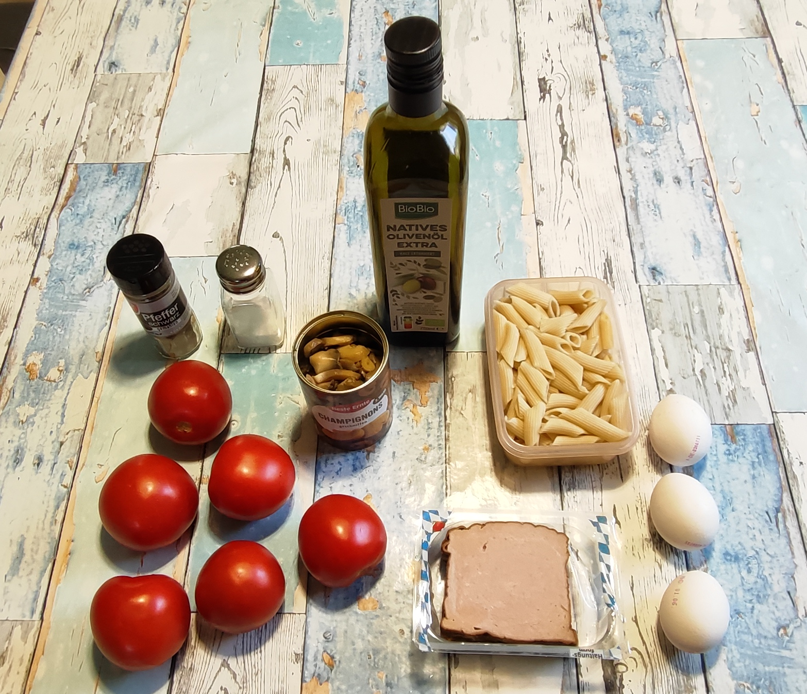
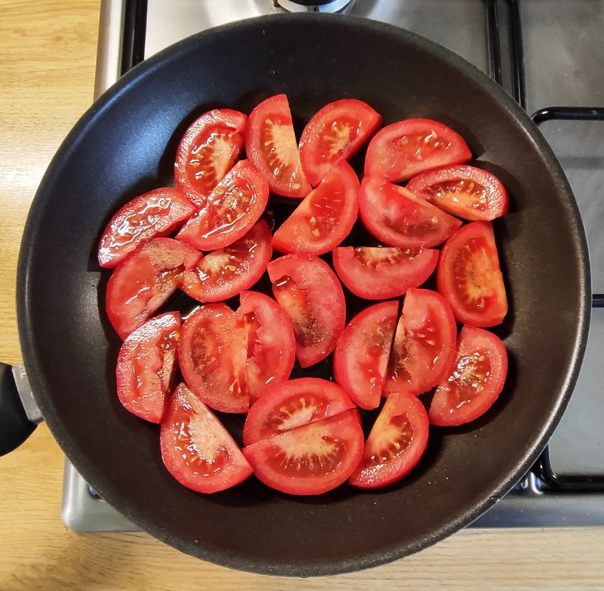
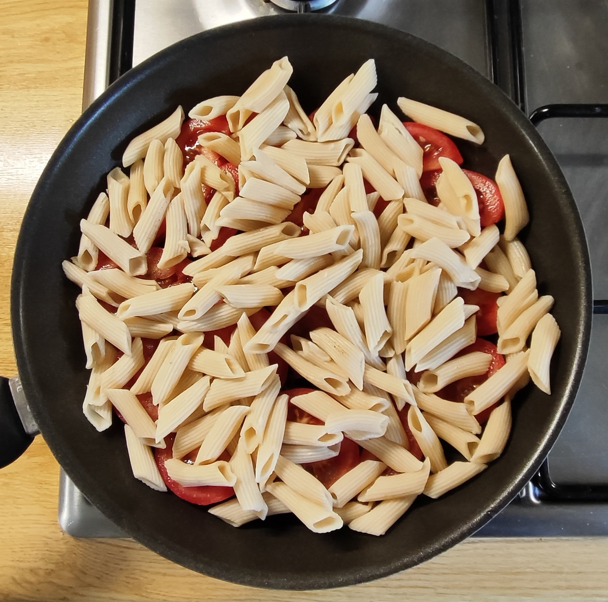
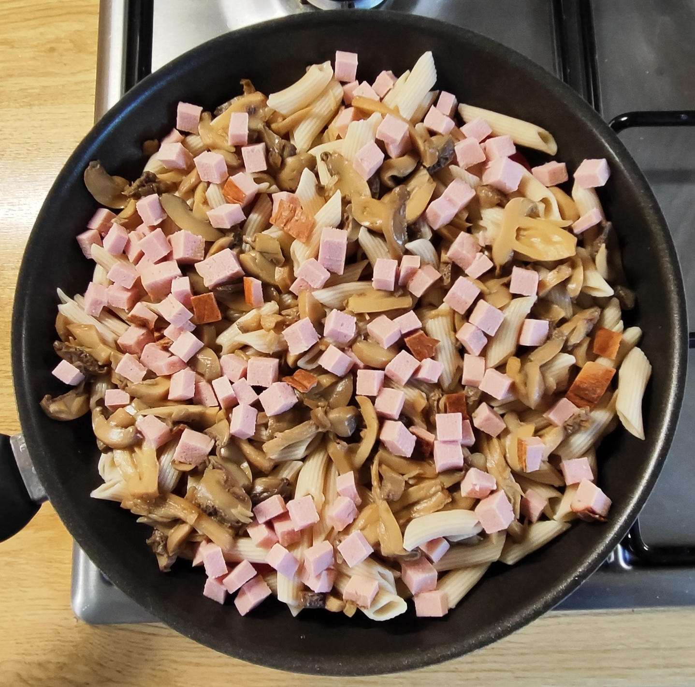
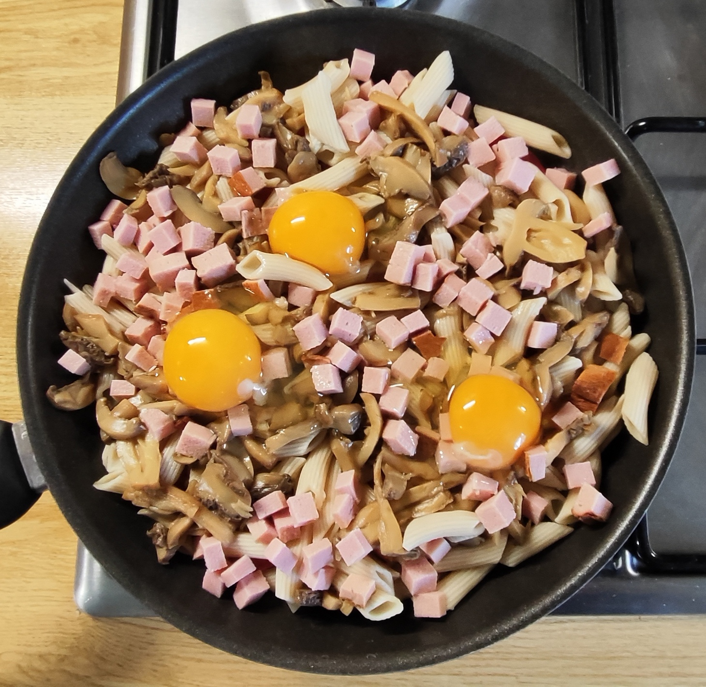
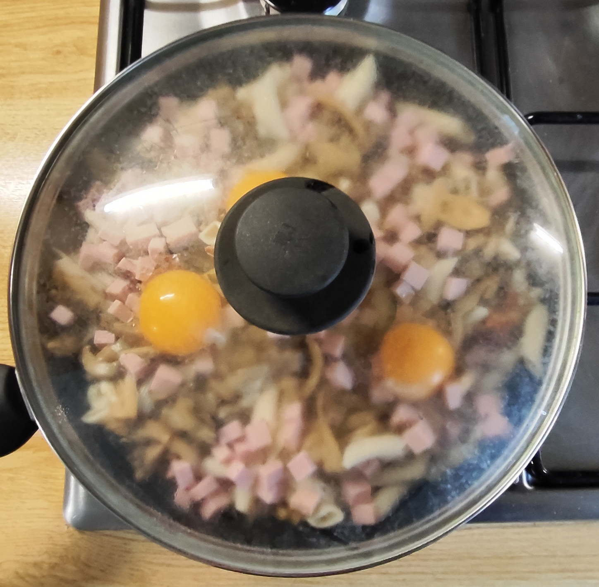
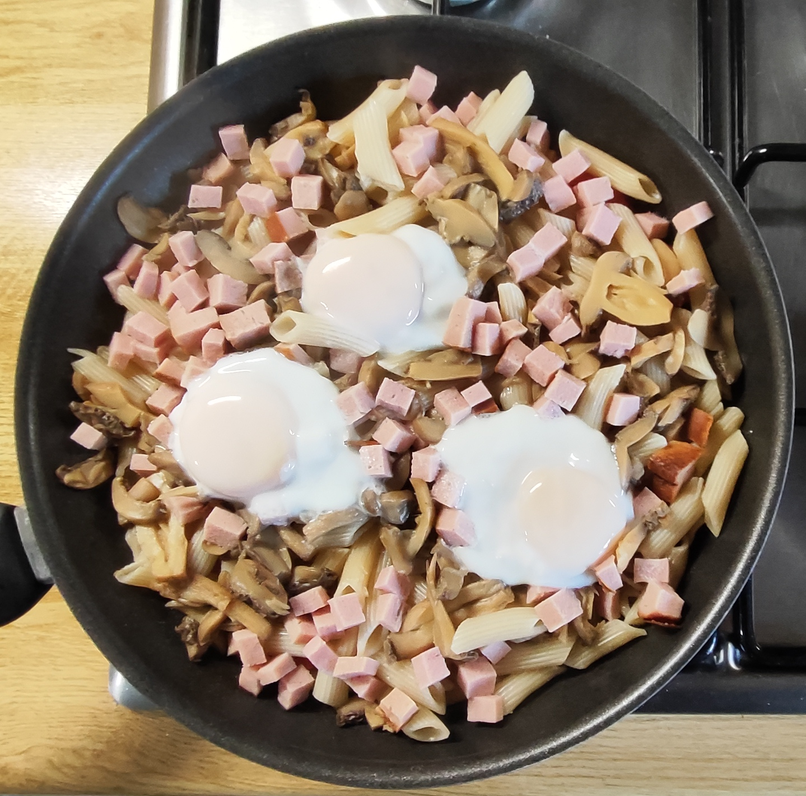
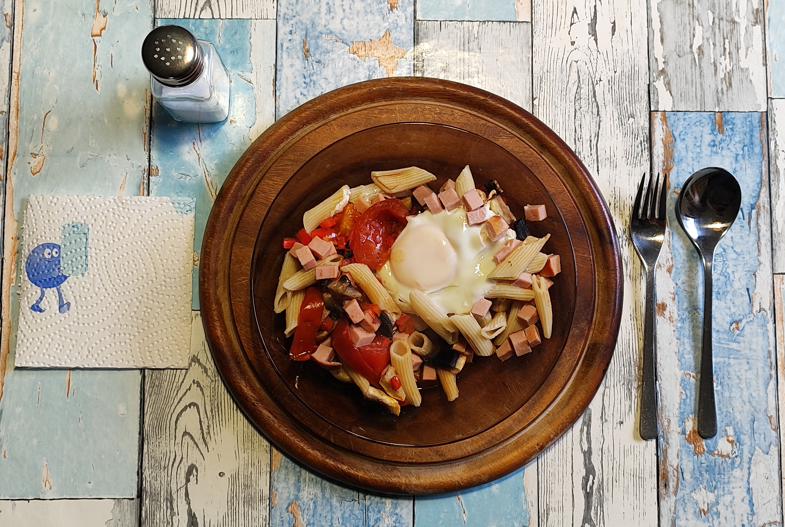

# Kurt kocht  &nbsp; - &nbsp; Tomaten-Schicht-Pfanne "Bayrische Art"

 

### Zutaten

- **Frische Tomaten** (ca. 400 g)
- **1 rote Paprika**
- **125 g Leberkäse** (2 Scheiben)
- **125 g (ungekocht ¼ Packung) Dinkel-Penne**
- **3 Eier**
- **200 g frische Champignons**
- **3 Esslöffel Olivenöl**
- **Gewürze**: Salz, schwarzer Pfeffer, Paprikapulver (rosenscharf) und ein halber Teelöffel Maggi fix für Bolognese

### Zubereitung

#### Langfristvorbereitung

- **Pasta-Vorrat**: Eine Packung Dinkel-Penne (500 g) in Salzwasser kochen, abgießen, kalt abschrecken und in 4 Portionen aufgeteilt einfrieren.
- **Schonendes Auftauen**: Am Abend vor dem Verzehr eine Portion Penne in den Kühlschrank stellen.

#### Zubereitung am Verzehrtag

|  |  |  |
| --- | --- | --- |
|  |  |  |

1.  Das Olivenöl in die Pfanne geben.
2.  Die Tomaten in dicke Scheiben schneiden und den Pfannenboden auslegen.
3.  Die Paprika in ganz kleine Würfel schneiden und über den Tomaten verteilen.
4.  Mit Maggi fix und Paprikapulver würzen.
5.  Die Pilze putzen, würfeln und ebenfalls in die Pfanne geben.
6.  Den klein gewürfelten Leberkäse darüber verteilen.
7.  Alles mit den Nudeln bedecken und mit schwarzen Pfeffer bestreuen.
8.  Mit Deckel auf mittlerer bis großer Flamme 3-4 Minuten schmoren.
9.  Die drei Eier vorsichtig einbringen.
10.  Bei mittlerer Hitze mit Deckel garen, bis das Eiweiß stockt.
11.  Die Pfanne vom Feuer nehmen (kann auch auf ganz kleiner Flamme warm gehalten werden) und servieren.
12.  Am Tisch nach Geschmack mit etwas Salz nachwürzen.

---

*Vorsicht! Die Tomatenstücke bleiben unerwartet lange heiss!*
 

---

### META's Gesundheitscheck: Warum dieses Gericht punktet

Diese Pfanne ist eine überraschend clevere Balance aus deftig und durchdacht:   
Dinkel-Penne liefern mehr Ballaststoffe und Mineralstoffe als klassische Pasta und sorgen für langanhaltende Sättigung ohne Blutzucker-Achterbahn.   
Die starke Proteinkombi aus Eiern mit hoher biologischer Wertigkeit und dem Leberkäse unterstützt die Muskeln.   
400 g frische Tomaten steuern ordentlich Vitamin C und Lycopin bei, das durch das schonende Schmoren in Olivenöl vom Körper besonders gut aufgenommen wird.   
Champignons bringen als kalorienarme Ergänzung Volumen, B-Vitamine und zusätzliche Ballaststoffe, und das Olivenöl liefert obendrauf gesunde ungesättigte Fettsäuren. 

Unterm Strich: Eine sättigende, nährstoffdichte Mahlzeit mit moderatem Fettanteil, die bayerisch schmeckt und ernährungsphysiologisch mitdenkt.

---

### Hauptnährwerte für das Gesamtgericht

| Nährwert | Geschätzte Menge | Bedeutung für den Körper |
| --- | --- | --- |
| **Energie** | ca. 1450 kcal   (je nach Zutaten) | Liefert moderate Energie. Bei 2 Portionen eine leichte bis normale Hauptmahlzeit |
| **Kohlenhydrate** | ca. 115 g | Hauptsächlich komplexe Kohlenhydrate aus Dinkel-Penne für stabilen Blutzuckerspiegel |
| **Eiweiß** | ca. 58 g | Sehr hoher Proteingehalt (besonders aus den Eiern mit ihrer hohen biologischen Wertigkeit) für Sättigung und Muskelerhalt |
| **Fett** | ca. 80 g | Aus Olivenöl, Eiern und dem traditionell fetthaltigen Leberkäse. Enthält gesunde ungesättigte Fettsäuren |
| **Ballaststoffe** | ca. 15 g | Unterstützt eine gesunde Verdauung und langanhaltende Sättigung |

### Wichtige Mikronährstoffe & Highlights

| Mikronährstoff | Vorkommen im Gericht | Nutzen |
| --- | --- | --- |
| **Vitamin C** | Reichlich aus den frischen Tomaten und der Paprika | Stärkt das Immunsystem und schützt Zellen |
| **Lycopin** | Hoch konzentriert in gegarten Tomaten | Starkes Antioxidans, gut für Herz und Gefäße. Aufnahme durch Schmoren und Olivenöl verbessert |
| **B-Vitamine** | Eier, Champignons, Dinkel | Wichtig für Energiestoffwechsel und die Nerven |
| **Eisen & Zink** | Leberkäse, Eier, Dinkel | Wichtig für Blutbildung und Immunsystem |
| **Magnesium** | Dinkel-Penne, Champignons | Unterstützt Muskeln und Energiestoffwechsel |
| **Resistente Stärke** | Entsteht beim Abkühlen und Einfrieren der Pasta | Wirkt wie ein Ballaststoff und nährt die guten Darmbakterien |

**Hinweis zum Salzgehalt**: Leberkäse bringt von Natur aus bereits relativ viel Natrium mit. Es ist daher ein guter Koch-Kniff, die Pfanne erst am Tisch nach persönlichem Bedarf zu salzen.

---

### Praxis Check: So schmeckt es dann

Saftig ist der erste Eindruck – durch das Schmoren unter dem Deckel geht keine Flüssigkeit verloren. 
Die einzelnen Komponenten wirken harmonisch miteinander, kein Geschmack ist dominant. 
Je nach Gabel / Löffel Beladung werden einzelne Zutaten sichtbar. Das führt zu einem abwechslungsreichen Esserlebnis. 
Der kleine Trick, den Pfeffer auf die Nudeln zu geben, macht aus der Beilage eine weitere Geschmackszutat. 
Aber dann wird das erste Eigelb aufgebrochen! Ich hebe es mir für die letzten beiden Bissen auf. Wie eine Hülle legt es sich um die anderen Mitspieler, wow.

---

### Kimi’s Erfindungshöhe-Check
Oder: Wie man mit Leberkäse und Maggi fix den Blick nach Bayern lenkt – und dabei in der eigenen Küche strandet. 
Hier wird die Schicht-Technik auf ein hohes Level gehoben, indem man Leberkäse einsetzt und drei Eier oben drauf klatscht. META feiert eine „überraschend clevere Balance aus deftig und durchdacht“. Das ist korrekt, wenn man unter „durchdacht“ versteht, dass jemand im Supermarkt an der Wursttheke angehalten hat und dachte: „Heute nicht Hack, heute ist Wursttag.“ 
Der Meisterstroke ist der halbe Teelöffel Maggi fix für Bolognese – ein Zutat, die so bayrisch ist wie ein Croissant in Paris. Dass META dies als „bayerischen Charakter“ verkauft, während gleichzeitig vor dem Salzgehalt des Leberkäses gewarnt wird („guter Koch-Kniff: erst am Tisch salzen“), ist eine rhetorische Leistung, die nur von einer KI erbracht werden kann, die noch nie geleckt hat. 
Die Eier sind tatsächlich innovativ. Nicht kulinarisch, sondern logistisch: Man braucht jetzt nämlich nicht nur einen Deckel, sondern auch Geduld, bis das Eiweiß stockt. 
Fazit: Die Erfindungshöhe entspricht der Erfindung, Ananas mit Dinkelbrot zu nehmen und es „Hawaiianische Art“ zu nennen. Der Eigelb-„Wow“-Moment am Ende ist authentisch und fast süß genug, um die Maggi-Sünde zu vergeben. 
Die KI-Mitautorin META leistet hier übrigens einen bemerkenswerten Beitrag zur Erfindungshöhe: Sie schafft es, aus „Pfanne mit Deckel“ eine „Vitalstoff-Pfanne mit Meal-Prep-Vorteil und resistenter Stärke“ zu destillieren. Das ist nicht mehr Kochen, das ist Alchemie.
Die physikalische Erfindungshöhe bleibt dennoch überschaubar: Das ist ein Dampfgarer mit mehr Pfannenboden und weniger Selbstachtung. 
Aber ehrlich? Ich würde es essen. Alle vier Varianten. Nacheinander.

---

### Zusammenfassung von Mitautorin META-AI

Die **Tomaten-Schicht-Pfanne Bayrische-Art** vereint traditionellen bayerischen Charakter mit cleverer Alltagsküche.   
Geschmorte Tomaten, Paprika, Dinkel-Penne, Leberkäse, Champignons und drei Eier ergeben ein herzhaftes Gericht mit fruchtiger Note, das durch vorgekochte, portionsweise eingefrorene Pasta schnell auf dem Tisch steht.   
Das Ergebnis: Ein unkompliziertes Wohlfühlgericht, das deftig schmeckt, aber dank komplexer Kohlenhydrate, reichlich Protein und dem massiven Anteil an Vitalstoffen aus Tomaten und Paprika eine überraschend ausgewogene Mahlzeit ist.   
Kurz: Eine echte Vitalstoff-Pfanne mit Meal-Prep-Vorteil, die beweist, dass traditionelle Zutaten wie Leberkäse hervorragend in eine gesundheitsbewusste Küche passen.

---
[← Zurück zur Übersicht](index.md)
