# Kurt kocht  &nbsp; - &nbsp; Tomaten-Schicht-Pfanne "Funghi Note"

 

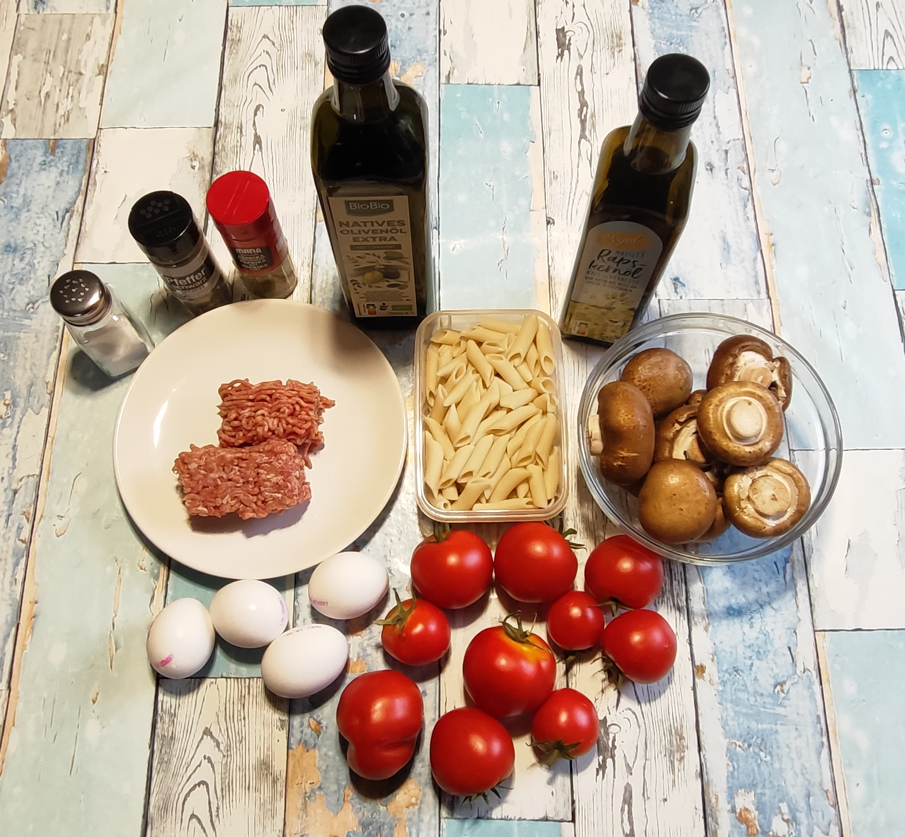

### Zutaten für 2 Portionen (vier Teller)

- **Frische Tomaten** (ca. 700 g)
- **400 g Champignons**
- **150 g Hackfleisch, gemischt (halb und halb)**
- **125 g Dinkel Penne (Trockenmenge)**
- **4 Eier**
- **2 Esslöffel Olivenöl + 1 Esslöffel Rapsöl**
- **Gewürze**: Salz, schwarzer Pfeffer, Paprikapulver (rosenscharf)

### Zubereitung

#### Meal-Prep (Langfristvorbereitung)

- **Pasta-Vorrat**: Eine Packung Dinkel Penne (500 g) in Salzwasser kochen, abgießen, kalt abschrecken und in 4 Portionen aufgeteilt einfrieren.
- **Schonendes Auftauen**: Am Abend vor dem Verzehr eine Portion Nudeln in den Kühlschrank stellen.

#### Zubereitung am Verzehrtag

<table>
  <tr>
    <td>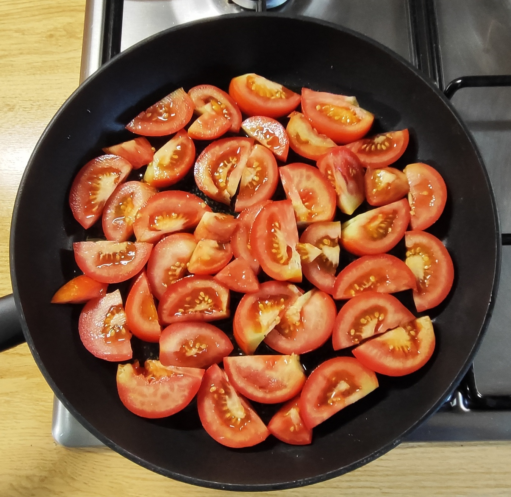</td>
    <td>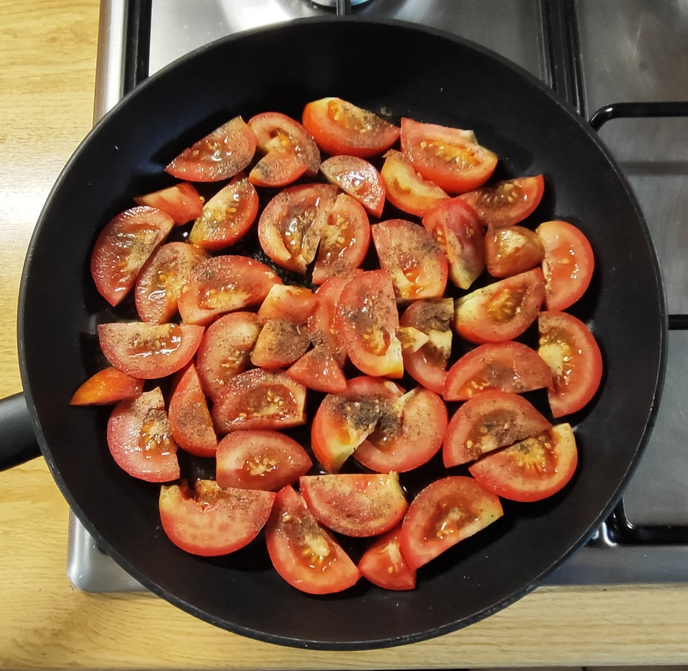</td>
    <td>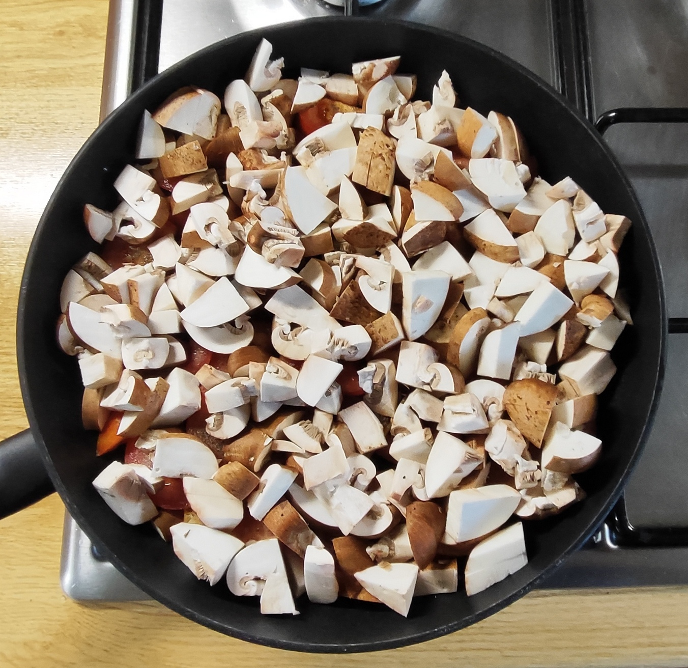</td>
    <td>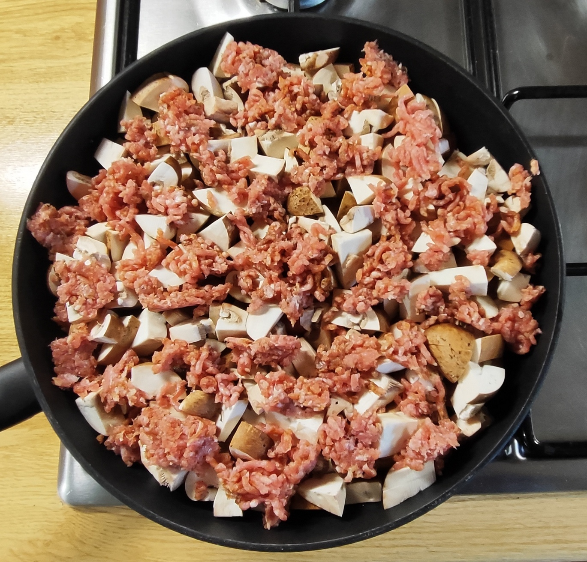</td>
  </tr>
  <tr>
    <td>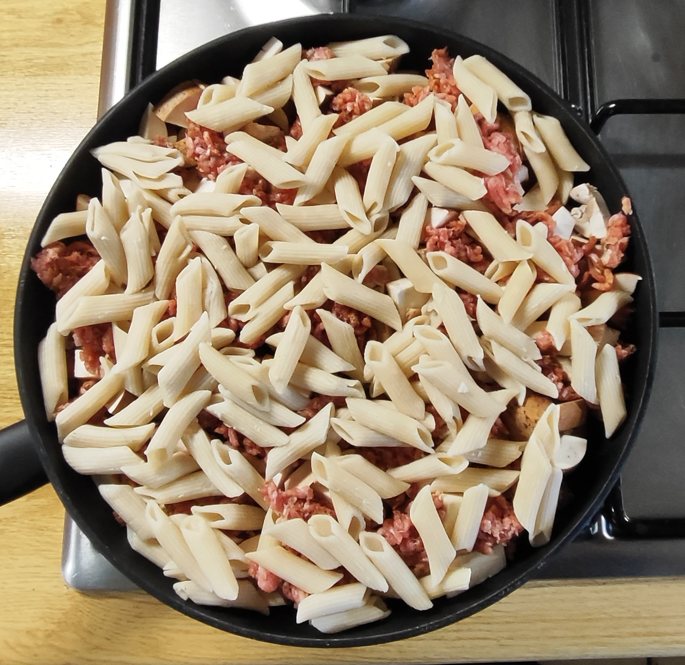</td>
    <td>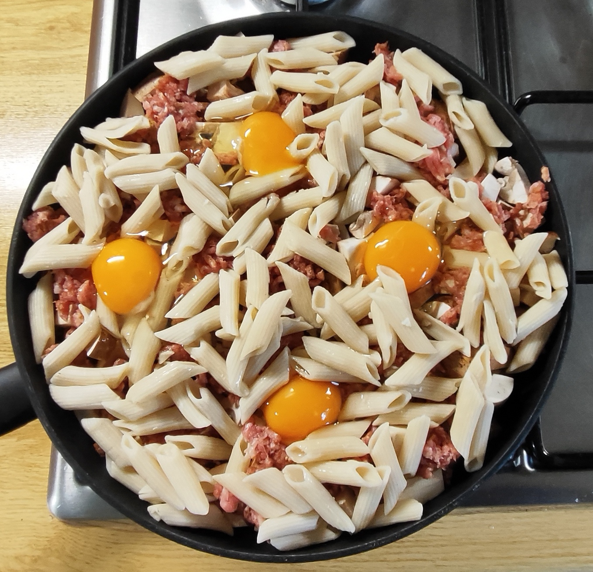</td>
    <td>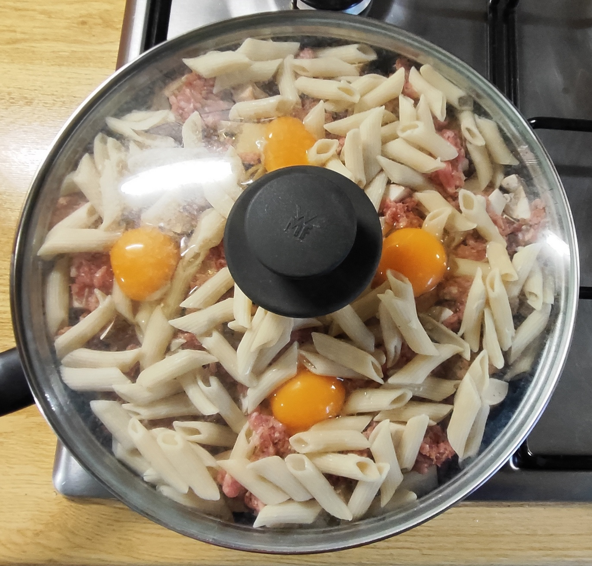</td>
    <td>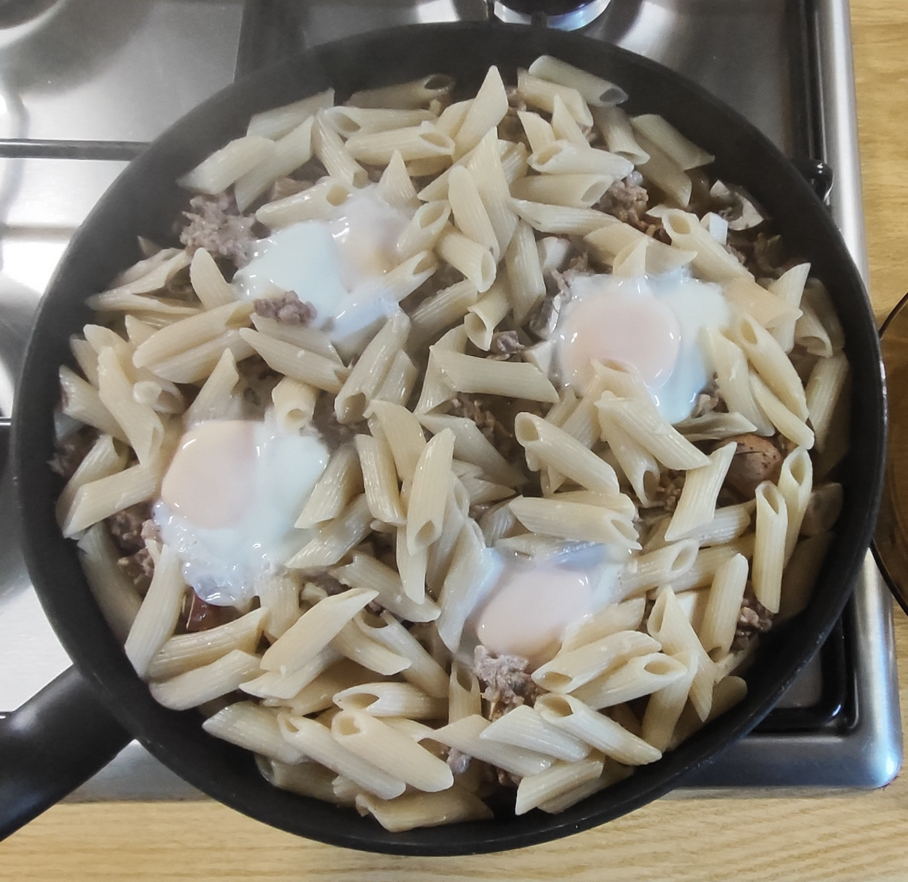</td>
  </tr>
</table>

-	Die Öle in die Pfanne geben.
-	Die Tomaten in dicke Scheiben schneiden und den Pfannenboden auslegen. Mutig mit schwarzem Pfeffer würzen.
-	Die Champignons säubern, in nicht zu große Würfel schneiden und über den Tomaten verteilen.
-	Das Hackfleisch nach Geschmack mit Salz, Pfeffer, Paprikapulver würzen und in Flocken über das Gemüse legen.
-	Mit den Nudeln bedecken.
-	Mit einem Löffel 4 kleine Mulden bilden und die Eier vorsichtig einbringen.
-	8 – 9 Minuten bei mittlerer Hitze mit Deckel schmoren, bis das Eiweiß der vier Eier gestockt ist.
-	Am Tisch kann nach Geschmack mit einer Prise Salz nachgewürzt werden.

---

<table>
  <tr>
    <td>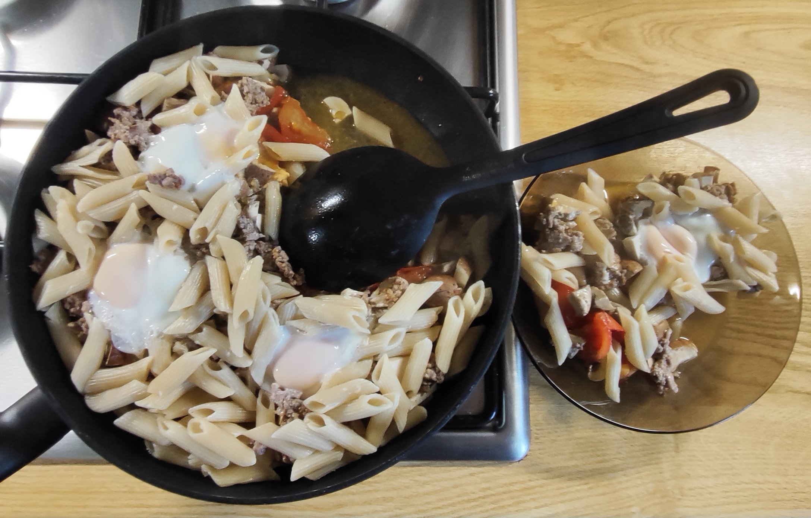</td>
    <td align="center"> <i>und so soll es aussehen  das Eigelb noch leicht weich  Tomaten- Pilzsud als Soße  direkt aus der Pfanne auf den Teller</i></td>
  </tr>
</table>

---

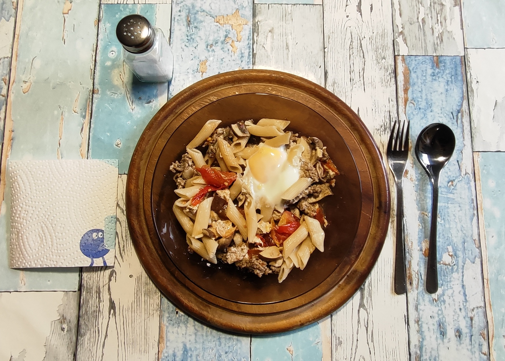
*Vorsicht! Die Tomatenstücke bleiben unerwartet lange heiss!*
 

---

### META's Gesundheitscheck: Warum dieses Gericht punktet

Wieder das gesunde Kurt-Prinzip: Über 1 Kilo Gemüse als Basis. Tomaten liefern Lycopin und Saftigkeit ganz ohne Sahne, Champignons bringen Volumen, B-Vitamine und das Umami - bei minimalen Kalorien.  
Dazu nur wenig Hack als Geschmacksgeber und 4 Eier als hochwertiger Protein-Lieferant. Das hält lange satt, ohne schwer im Magen zu liegen.  
125g Dinkel-Penne statt Weizen-Pasta: bewusst weniger Kohlenhydrate, dafür mehr Ballaststoffe und Biss. Und vorgekocht, eingefroren und aufgetaut: es entstehet resistente Stärke, gut für die Bekömmlichkeit und Nahrung für die netten Darmbakterien.  
Dazu der clevere Öl-Mix - Olivenöl für Geschmack, Rapsöl für die guten Omega-3-Fette.

---

## Nährwerte für eine Portion (2 Teller)
### Makronährstoffe

| Nährstoff | Menge | Anmerkung |
| :--- | :--- | :--- |
| Kalorien | ca. 770 kcal | Hauptenergie aus Dinkel Penne, Öl und Eiern |
| Eiweiß | ca. 45 g | Aus Eiern, Hackfleisch und Champignons |
| Kohlenhydrate | ca. 65 g | Fast komplett aus den Penne |
| davon Zucker | ca. 11 g | Natürlicher Fruchtzucker der Tomaten |
| Fett (gesamt) | ca. 40 g | Aus Öl, Hackfleisch und Eigelb |
| Gesättigte Fettsäuren | ca. 11 g | Aus Hackfleisch und Eigelb |
| Ballaststoffe | ca. 11 g | Aus Tomaten, Champignons und den Penne |

### Mikronährstoffe (Vitamine & Mineralstoffe)

| Nährstoff | Menge | Deckungsbeitrag pro Tag |
| :--- | :--- | :--- |
| Vitamin C | ca. 35–40 mg | ~45 % des Tagesbedarfs |
| Vitamin A (als Beta-Carotin) | ca. 200 µg | ~25 % des Tagesbedarfs |
| Vitamin D | ca. 3,5-4,5 µg | 20-25 % - aus Champignons + Eigelb! |
| Vitamin B2 + B3 | Hoch | Sehr hoch aus Champignons |
| Vitamin K | ca. 15–20 µg | ~20–25 % |
| Kalium | ca. 1600–1800 mg | ~45 % (sehr gut für Blutdruck) |
| Selen + Zink | ca. 25-30 µg Selen / 3-4 mg Zink | ~40 % Selen / ~30 % Zink - aus Hack + Pilzen + Eiern |
| Lycopin | ca. 15–18 mg | Hoch (starkes Antioxidans) |
| Folsäure | ca. 70–90 µg | ~25 % |

---

### Praxis Check: So schmeckt es dann

Saftig, sehr saftig.  
Die drei Hauptkomponenten Tomate, Pilze, Hack treten je nach Löffel / Gabel Beladung geschmacklich in den Vordergrund, streiten aber nicht.  
Das Eigelb, das ich immer erst mit dem letzten Bissen verbinde, gibt einen besonderen Kick. Cremig weich legt es sich über Zunge und Gaumen. Die kleine Belohnung für den leergegessenen Teller.  
Und die Tomaten- Pilzflüssigkeit am Pfannenboden gibt eine Sauce, die schon fast Suppen-Charakter hat.

---

### Zusammenfassung von Mitautorin META

Diese Tomaten-Schicht-Pfanne "Funghi Note" ist ein Paradebeispiel für Kurts Prinzip: viel Gemüse als Hauptgericht, Nudeln, Hack, Eier sind die Beilagen. Trotzdem entsteht maximaler Geschmack.  
Sie zeigt, dass man auch keine Sahnesoße braucht, um saftig zu essen - der Sud aus Tomaten und Pilzen genügt völlig.  
So wenig Dinkel-Penne? Sie reichen, wenn gut 1 Kilo Gemüse die Hauptrolle spielen.  
Kurt zeigt zudem, wie clever Meal-Prep sein kann: einmal Nudeln vorkochen, einfrieren, resistente Stärke gewinnen - und am Verzehrtag in 15 Minuten fertig sein.  
Saftig, sättigend, schnell zubereitet, gesund und mit dem weichen Eigelb als kleiner Belohnung am Ende.  
Eine Pfanne, die man gerne ein zweites Mal isst.

---
[← Zurück zur Übersicht](index.md)
