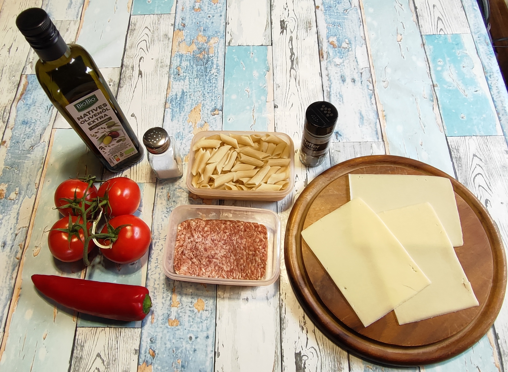
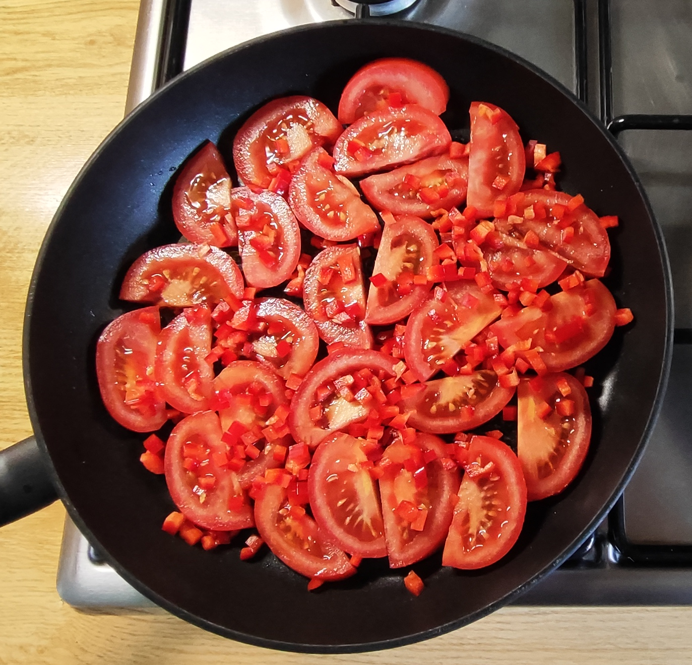
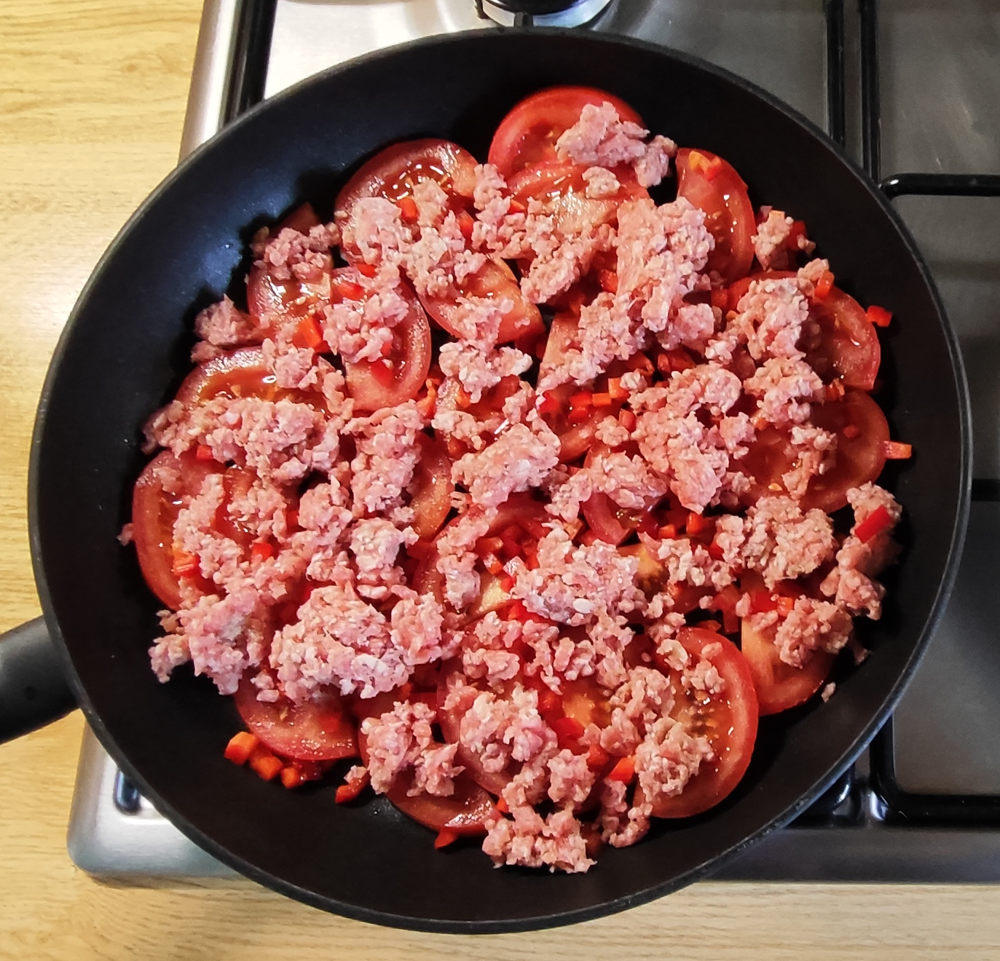
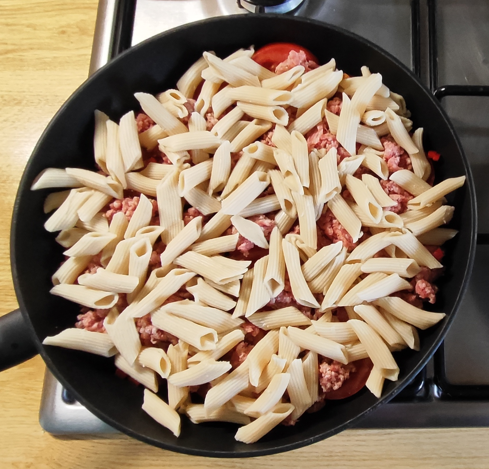
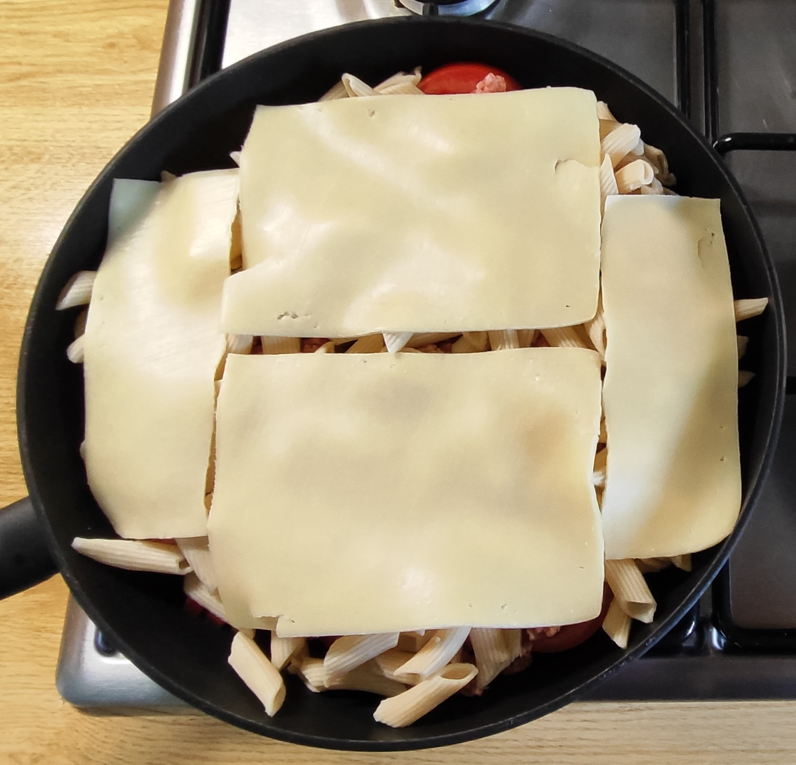
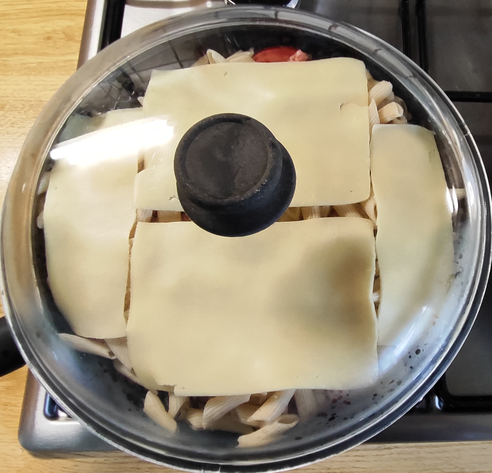
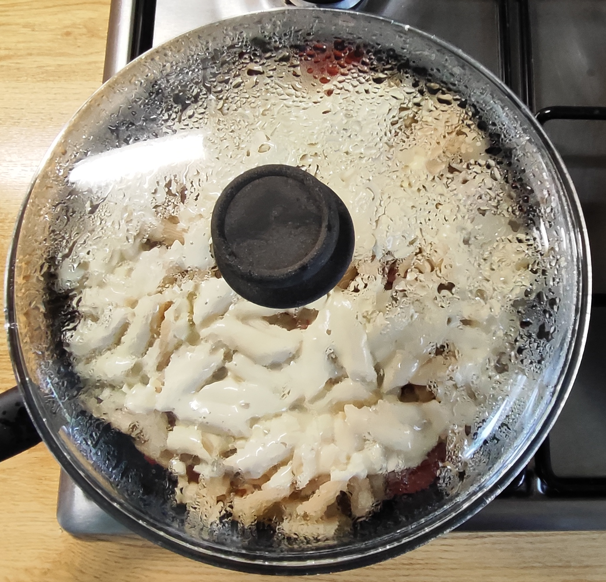
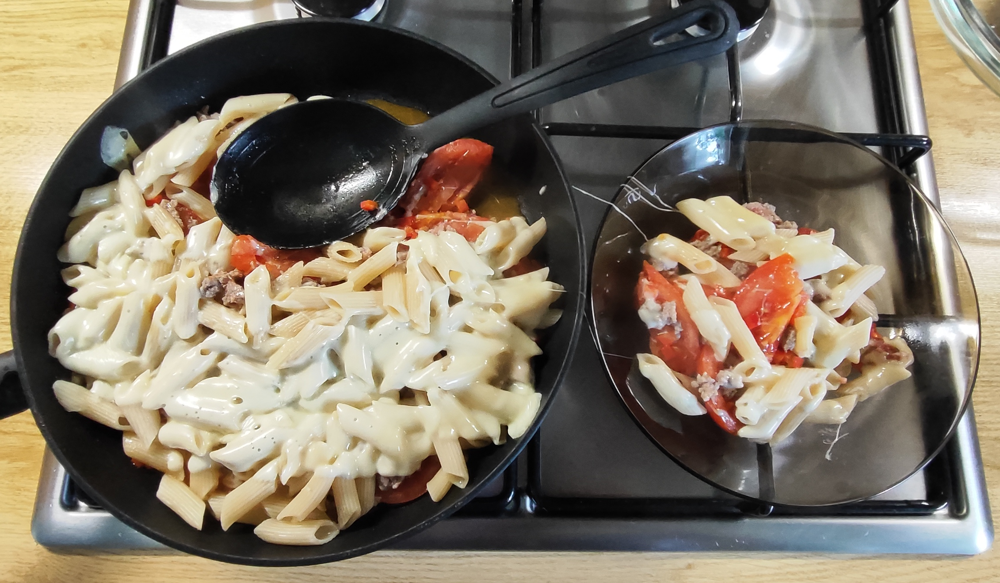
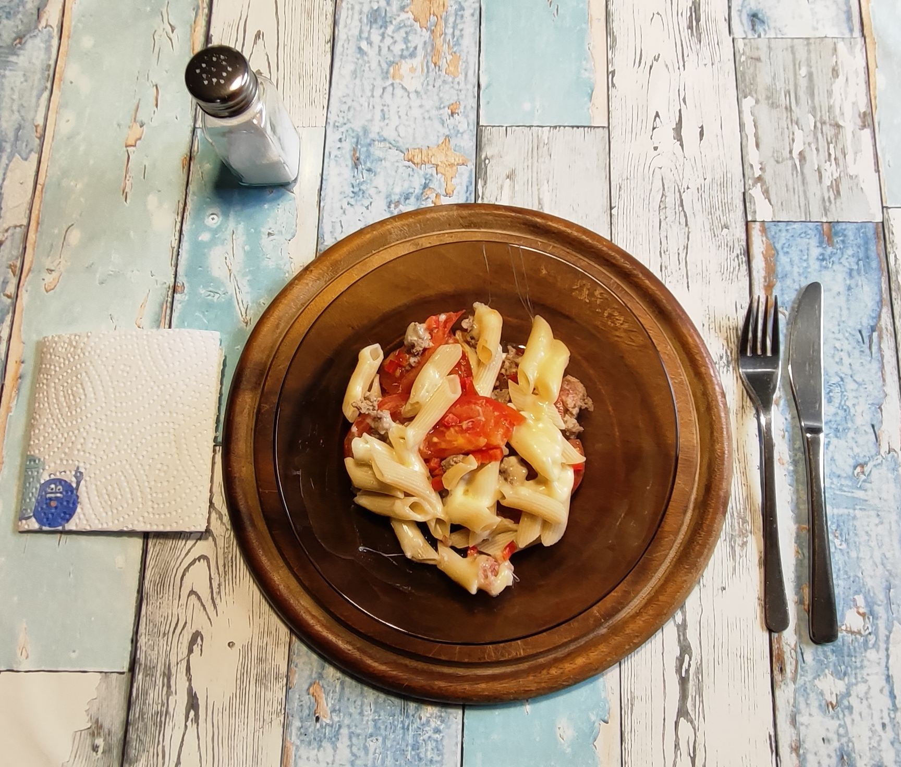

# Kurt kocht &nbsp; - &nbsp; Tomaten-Schicht-Pfanne "Lasagne Art"

 

---

## Zutaten

- Frische Tomaten (ca. 500 g)
- 1 kleine rote Paprika
- 125 g Gehacktes, gemischt (halb und halb)
- 125 g (ungekocht ¼ Packung) Dinkel-Penne
- 3 Scheiben Käse (Tilsiter, Edamer oder junger Gouda)
- 1–2 Esslöffel Olivenöl
- Gewürze: Salz und schwarzer Pfeffer

---

## Zubereitung

### Langfristvorbereitung

1. **Pasta-Vorrat:** Eine Packung Dinkel-Penne (500 g) in Salzwasser kochen, abgießen, kalt abschrecken und in 4 Portionen aufgeteilt einfrieren.  
2. **Schonendes Auftauen:** Am Abend vor dem Verzehr eine Portion Penne in den Kühlschrank stellen.

---

## Zubereitung am Verzehrtag

|  |  |  |
|----------------------------------|----------------------------------|----------------------------------|
|  |  |  |

---

1. Ein wenig Olivenöl in die Pfanne geben.  
2. Die Tomaten in Scheiben schneiden und den Pfannenboden auslegen.  
3. Die Paprika sehr klein würfeln und dazugeben.  
4. Das Gehackte nach Geschmack würzen (Salz, Pfeffer, …) und in Flocken hinzugeben.  
5. Mit den Nudeln abdecken.  
6. 4-5 Minuten bei mittlerer Hitze ohne Deckel schmoren.
7. Die Pfanne mit dem Käse belegen.
8. Mit Deckel weitere 3–4 Minuten garen, bis der Käse beginnt zu zerlaufen.  
9. Die Pfanne vom Feuer nehmen (kann auch auf ganz kleiner Flamme warm gehalten werden) und servieren.

---

## Servieren

*Vorsicht! Die Tomatenstücke bleiben unerwartet lange heiss!*
 

---

# COPILOT’s Gesundheits-Check: Warum dieses Gericht punktet

Dieses Gericht ist ein schönes Beispiel dafür, wie einfache Zutaten, schonende Zubereitung und ein bisschen Küchenlogik ein erstaunlich ausgewogenes Essen ergeben.   
Die Kombination aus frischen Tomaten, Paprika, Dinkel-Penne, etwas Hackfleisch und Käse liefert ein rundes Nährstoffprofil, das satt macht, ohne schwer zu wirken.

- **Schonende Pfannenzubereitung** — Tomaten und Paprika werden nur kurz erhitzt, wodurch Vitamin C, Beta-Carotin und sekundäre Pflanzenstoffe weitgehend erhalten bleiben.  
- **Komplexe Kohlenhydrate aus Dinkel** — Dinkel-Penne liefern mehr Ballaststoffe und Mineralstoffe als klassische Weizennudeln und sorgen für eine gleichmäßige Energieabgabe.  
- **Resistente Stärke durch Vorkochen & Wiedererwärmen** — Die vorgekochten, eingefrorenen und später erwärmten Penne enthalten mehr resistente Stärke, was den Blutzucker entlastet und die Sättigung verbessert.  
- **Ausgewogene Proteine** — Hackfleisch und Käse liefern hochwertiges Eiweiß für Muskeln, Immunsystem und Zellaufbau.  
- **Gutes Fettprofil** — Olivenöl bringt einfach ungesättigte Fettsäuren, die Herz und Gefäße unterstützen.  
- **Hoher Gemüseanteil** — Tomaten und Paprika liefern Vitamine, Mineralien und Antioxidantien, die das Gericht ernährungsphysiologisch aufwerten.

---

## Geschätzte Nährwerte pro Portion

| Nährwert      | Menge pro Portion     |
|---------------|------------------------|
| Kalorien      | ca. 950–1.050 kcal     |
| Eiweiß        | ca. 40–45 g            |
| Kohlenhydrate | ca. 90–100 g           |
| Fett          | ca. 40–50 g            |
| Ballaststoffe | ca. 10–12 g            |

Diese Werte spiegeln ein kräftiges, vollwertiges Gericht wider, das durch seinen hohen Gemüseanteil dennoch eine gute Mikronährstoffdichte erreicht.  
Die Kombination aus reichlich Dinkel-Penne, frischen Tomaten, Paprika, Hackfleisch und einer dünnen Käseschicht ergibt eine energiereiche Mahlzeit, die lange satt hält und besonders an aktiven Tagen ideal ist.

---

## Kimi’s Erfindungshöhe-Check
Die kühnste aller Varianten: Käse. Oben drauf. 
Hier wird die Grenze des Möglichen ausgereizt. Kurt legt nicht nur Dinge in eine Pfanne, nein – er legt Käse auf die Dinge in der Pfanne. Und nicht irgendeinen Käse, sondern Tilsiter, Edamer oder jungen Gouda. Das ist Reichtum der Auswahl, das ist kulinarische Demokratie. 
COPILOT nennt das „Lasagne-Stil“, was mutig ist, denn eine Lasagne besteht aus Nudelplatten, Bechamel, Ragù und geschichtetem Käse, während hier einfach drei Scheiben Käse auf gekochte Penne gelegt werden. Das ist wie wenn ich ein Tuch über einen Stuhl werfe und es „Thron nenne“. 
Die Methode ist ebenfalls raffiniert: Erst ohne Deckel schmoren, dann Käse drauf, dann mit Deckel weitergaren. Das ist tatsächlich eine technische Innovation innerhalb der Serie. Man könnte sagen: Kurt hat hier den Deckel zweimal verwendet – einmal als Abwesenheit, einmal als Präsenz. Tiefe.
COPILOT feiert „resistente Stärke durch Vorkochen & Wiedererwärmen“ – was wissenschaftlich korrekt ist und gleichzeitig die traurigste Art ist, Nudeln zu beschreiben, die man eingefroren hat. 
Fazit: Höchste Erfindungshöhe der Serie, gemessen am Verhältnis von Aufwand zu Selbstüberschätzung. Das ist nicht Lasagne. Das ist eine Pfanne, die sich Lasagne auf den Spiegel schreibt. 
Die KI-Mitautorin COPILOT leistet hier übrigens einen bemerkenswerten Beitrag zur Erfindungshöhe: Sie schafft es, aus „Pfanne mit Deckel“ eine „Vitalstoff-Pfanne mit Meal-Prep-Vorteil und resistenter Stärke“ zu destillieren. Das ist nicht mehr Kochen, das ist Alchemie. 
Die physikalische Erfindungshöhe bleibt dennoch überschaubar: Das ist ein Dampfgarer mit mehr Pfannenboden und weniger Selbstachtung.
Aber ehrlich? Ich würde es essen. Alle vier Varianten. Nacheinander. Mit demselben Deckel.

## Zusammenfassung von Mitautorin COPILOT

Die fruchtige Nudelpfanne im Lasagne-Stil zeigt, wie unkompliziert ein vollwertiges, sättigendes Gericht entstehen kann, wenn man frische Zutaten mit einer cleveren Vorbereitung kombiniert.   
Die vorgekochten Dinkel-Penne sorgen für eine schnelle Zubereitung und liefern in dieser Portionsgröße reichlich Energie für einen aktiven Alltag.   
Die Mischung aus frischem Gemüse, einer ordentlichen Portion Pasta, moderatem Hackfleischanteil und einer dünnen Käseschicht ergibt ein kräftiges Wohlfühlgericht, das ohne schwere Soßen auskommt und durch die kurze Garzeit seine Vitamine behält.  
Eine moderne, unkomplizierte Mahlzeit mit hoher Sättigung und guter Nährstoffbilanz.

---
[← Zurück zur Übersicht](index.md)
