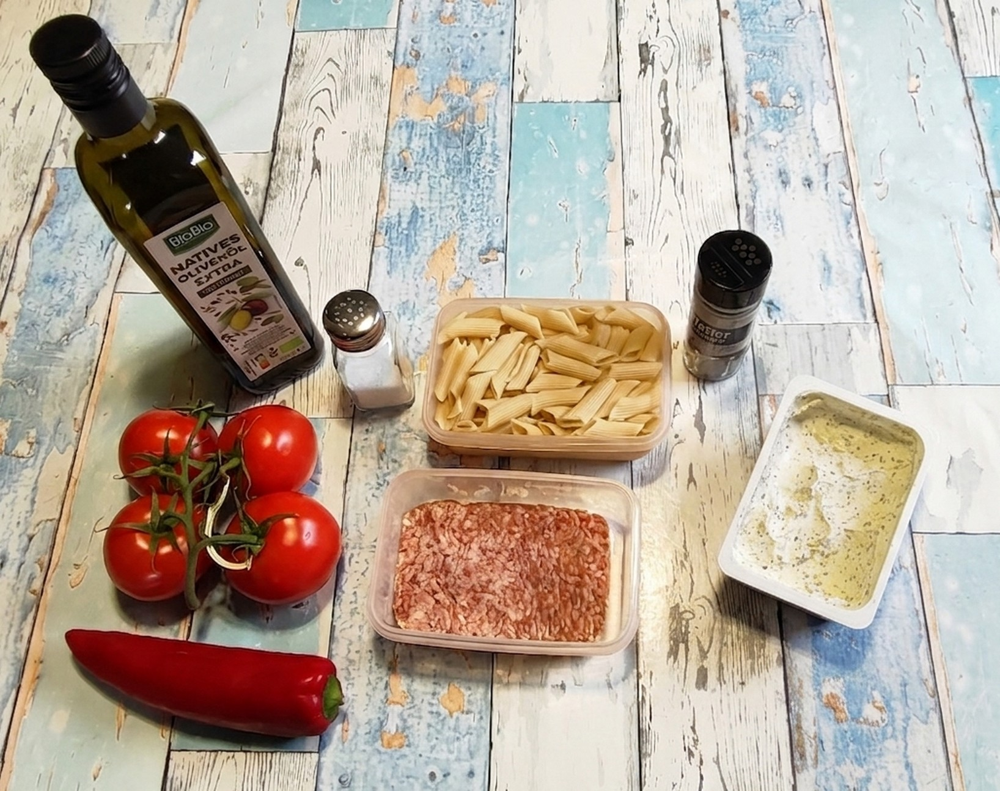
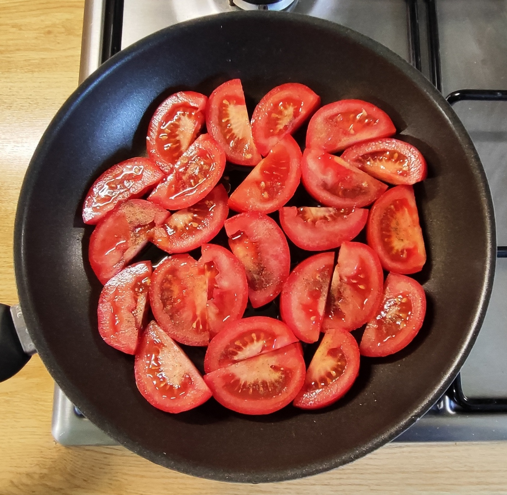
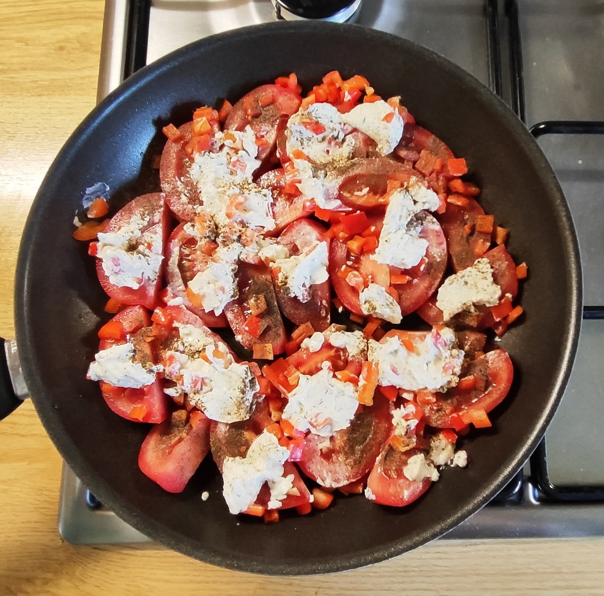
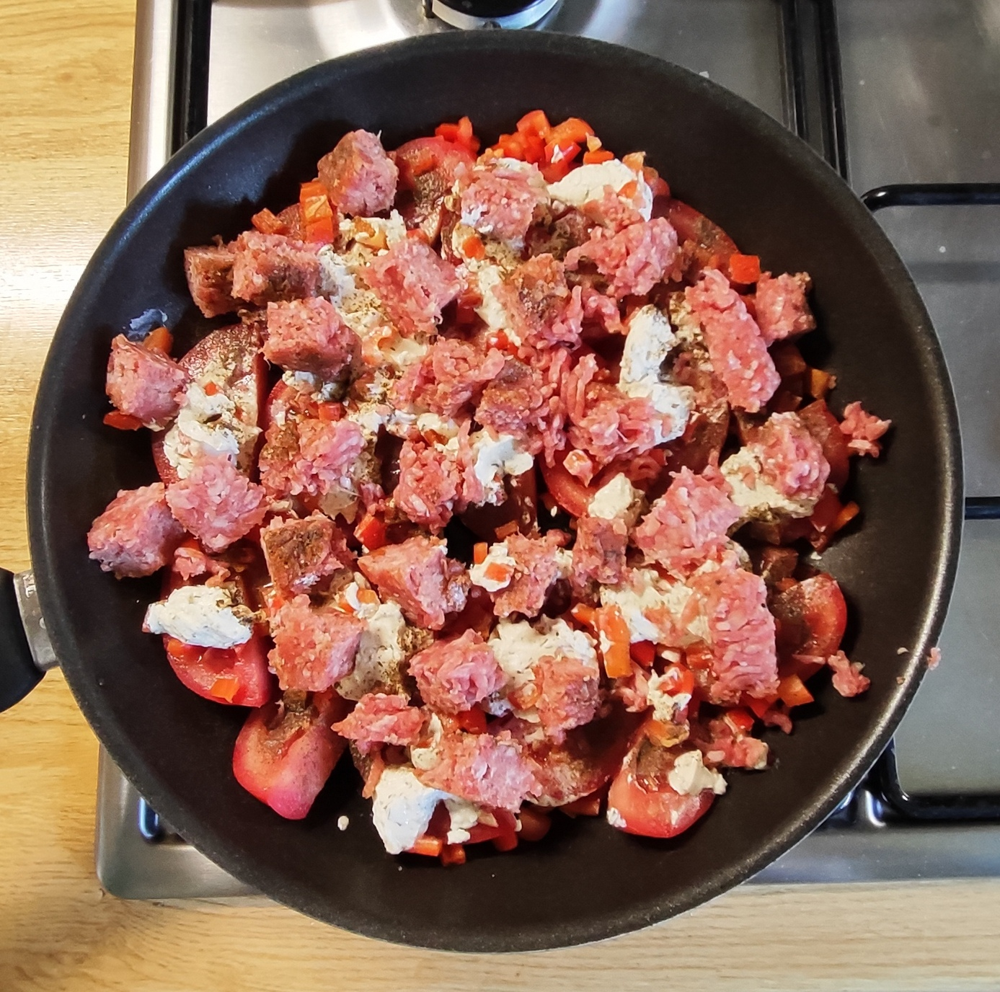
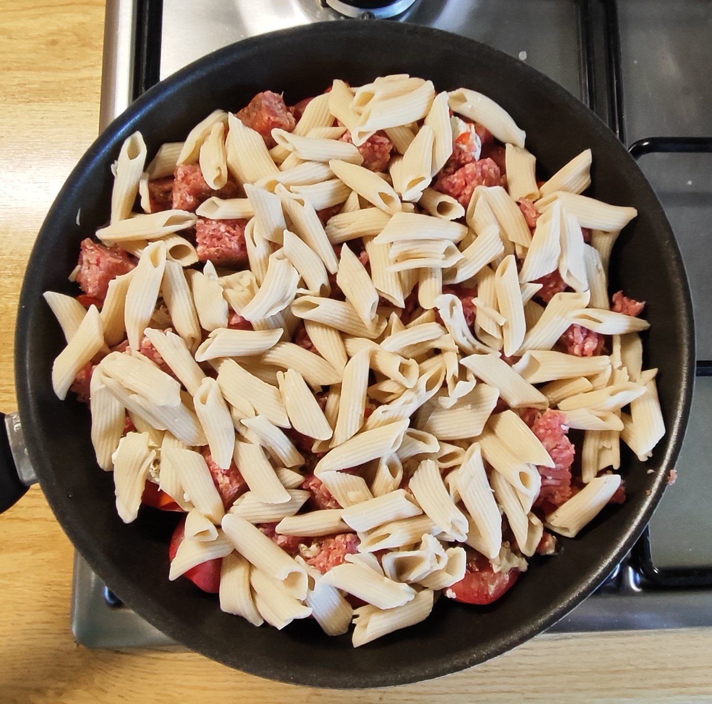
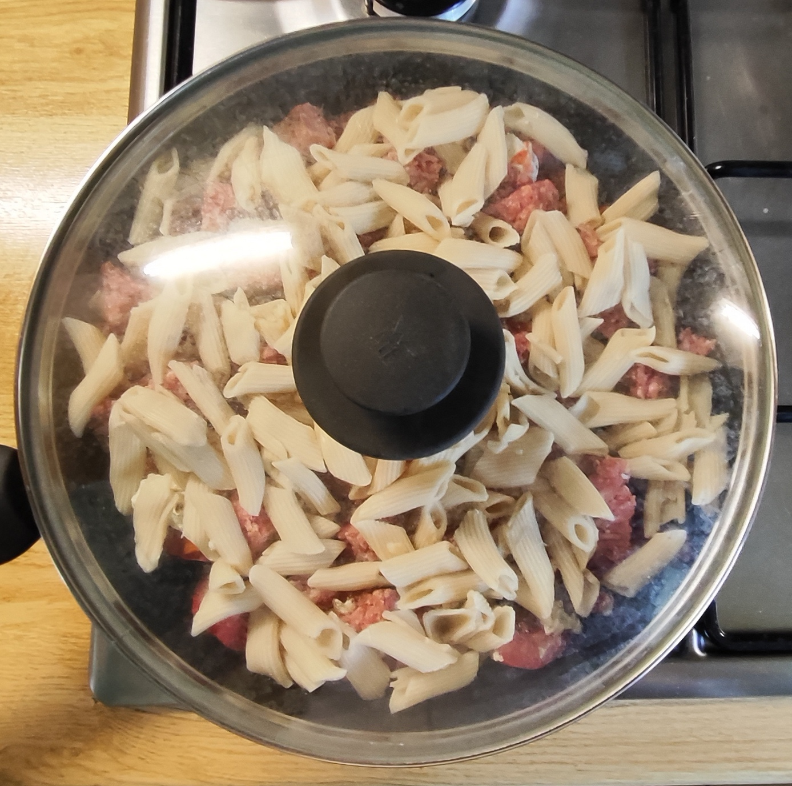
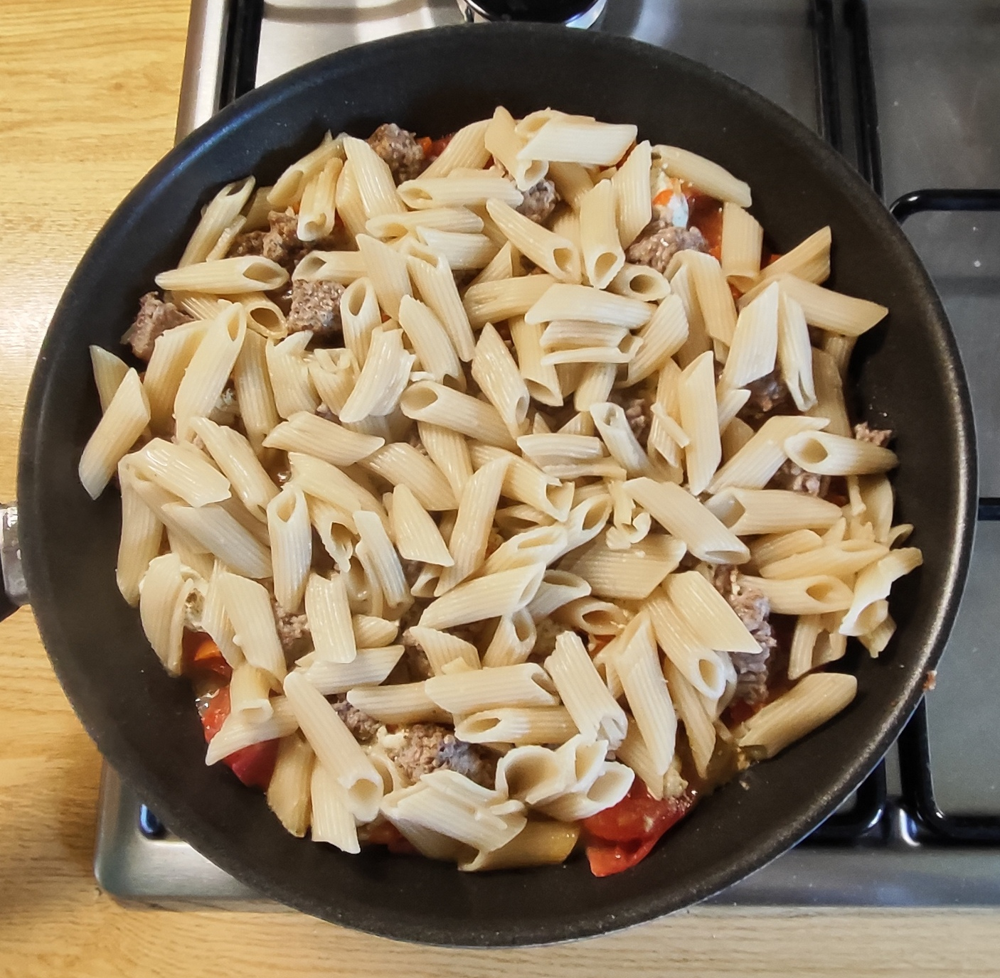
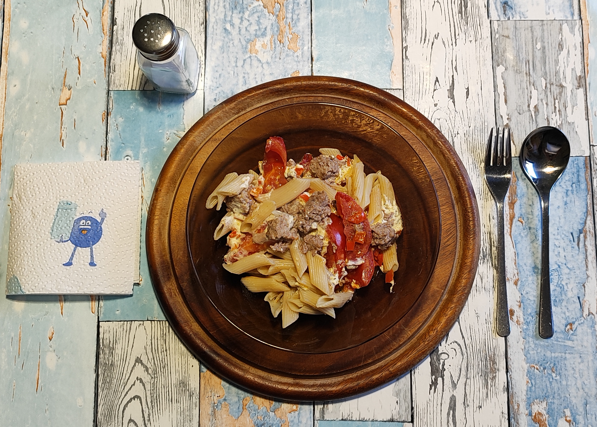

# Kurt kocht &nbsp; - &nbsp; Tomatenschicht-Pfanne "Provenzalische Art"

 

### Zutaten

- **Frische Tomaten** (ca. 500-600 g)
- **1 rote Paprika**
- **150 g Gehacktes**, gemischt (halb und halb)
- **125 g Dinkel-Penne** (Trockenmenge)
- **80-100 g Kräuterfrischkäse**
- **2 Esslöffel Olivenöl**
- **Gewürze**: Salz, schwarzer Pfeffer

### Zubereitung

#### Langfristvorbereitung

- **Pasta-Vorrat**: Eine Packung Dinkel-Penne (500 g) in Salzwasser kochen, abgießen, kalt abschrecken und in 4 Portionen aufgeteilt einfrieren.
- **Schonendes Auftauen**: Am Abend vor dem Verzehr eine Portion Penne in den Kühlschrank stellen.

#### Zubereitung am Verzehrtag

|  |  |  |
| --- | --- | --- |
|  |  |  |

1.  Das Olivenöl in die Pfanne geben.
2.  Die Tomaten in dicke Scheiben schneiden und den Pfannenboden auslegen.
3.  Die Paprika in ganz kleine Würfel schneiden, dazugeben.
4.  Den Frischkäse darüber verteilen und alles kräftig mit schwarzem Pfeffer würzen.
5.  Das Gehackte nach Geschmack würzen (Salz, Pfeffer, ..) und in Flocken hinzugeben.
6.  Alles mit den Nudeln bedecken.
7.  Ca. 7 Minuten bei mittlerer Hitze mit Deckel schmoren.
8.  Die Pfanne vom Feuer nehmen (kann auch auf ganz kleiner Flamme warm gehalten werden) und servieren.
9.  Am Tisch nach Geschmack mit etwas Salz nachwürzen.

---

*Vorsicht! Die Tomatenstücke bleiben unerwartet lange heiss!*
 

---

### COPILOT's Gesundheitscheck: Warum dieses Gericht punktet

Die Kombination aus frischen Tomaten, Paprika und Dinkel-Penne liefert eine ausgewogene 
Mischung aus Ballaststoffen, pflanzlichen Nährstoffen und komplexen Kohlenhydraten. 
Das Gericht enthält wenig zugesetztes Fett, nutzt Olivenöl als hochwertige Quelle und bleibt 
durch den Kräuterfrischkäse mild cremig. 
Die Schichtung sorgt für schonende Garung – Vitamine und Aromen bleiben erhalten.

---

### Hauptnährwerte für das Gesamtgericht

| Makronährstoffe | Geschätzte Menge | Bemerkung |
| --- | --- | --- |
| **Energie** | ca. 1 250 – 1 300 kcal | abhängig von Ölmenge und Frischkäseanteil |
| **Kohlenhydrate** | ca. 120 g | aus Dinkel-Penne und Gemüse |
| **Eiweiß** | ca. 55 g | Quelle: Hackfleisch, Dinkel-Penne, Frischkäse |
| **Fett** | ca. 65 g | aus Olivenöl, Frischkäse, Fleisch |
| **Ballaststoffe** | ca. 8 g | durch Dinkel-Penne und Tomaten |

| Mikronährstoffe | Geschätzte Menge | Hauptquelle |
| --- | --- | --- |
| **Vitamin C** | ca. 150 mg | Tomaten, Paprika |
| **Vitamin A** | ca. 1 000 µg | Paprika, Tomaten |
| **Kalium** | ca. 1 800 mg | Tomaten, Dinkel |
| **Magnesium** | ca. 150 mg | Dinkel-Penne |
| **Eisen** | ca. 6 mg | Hackfleisch, Dinkel |
| **Calcium** | ca. 250 mg | Frischkäse |

---

### Praxis-Check: So schmeckt es dann
Ein Gericht mit klaren Einzelstimmen. Je nach Löffelportion übernimmt eine andere Zutat den Hauptton. 
Die Penne halten den Gesamtgeschmack zusammen und verhindern Dominanz. 
Ein harmonisches Neben- und Miteinander.

---

### Zusammenfassung von Mitautorin COPILOT

Die Tomatenschicht-Pfanne Provenzal-Art ist ein gut strukturiertes Alltagsgericht.  
Die Zutaten sind einfach verfügbar und ergeben eine ausgewogene Kombination aus Gemüse, Getreide und Eiweiß.  
Die Schichttechnik sorgt für eine stabile Garführung.  
Ein schnell zubereitetes Gericht mit einer überraschenden Geschmacks-Sensorik.

### Zusammenfassung von Mitautorin GEMINI

Das ist im Grunde „dekonstruiertes“ Kochen im besten Sinne – extrem unkompliziert in der Zubereitung, aber beim Essen richtig spannend und abwechslungsreich. 
Ein toller Beweis dafür, dass einfache Alltagsküche überhaupt nicht langweilig sein muss!

---
[← Zurück zur Übersicht](index.md)

