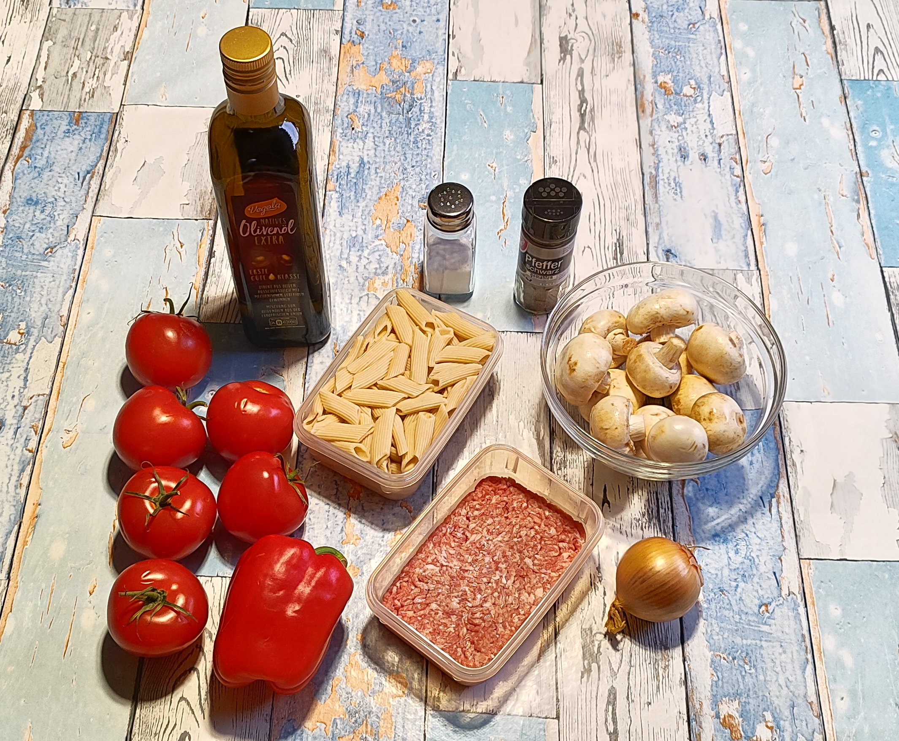
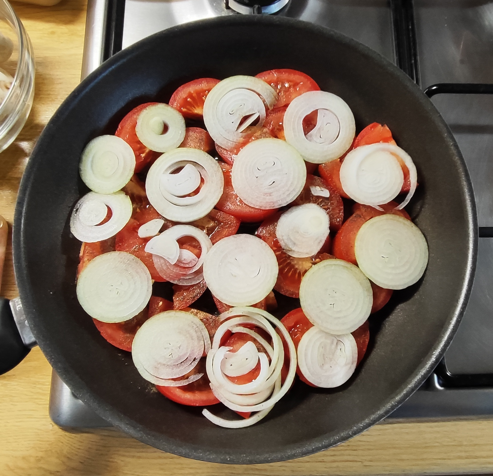
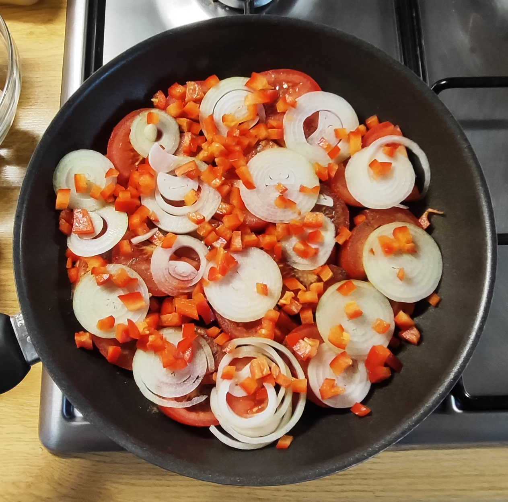
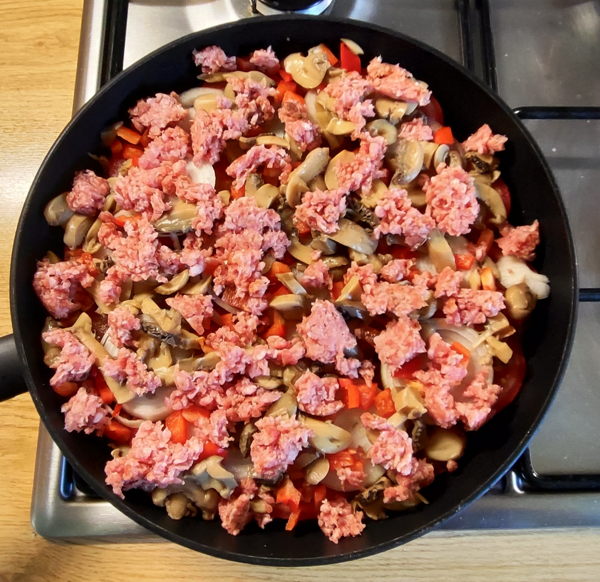
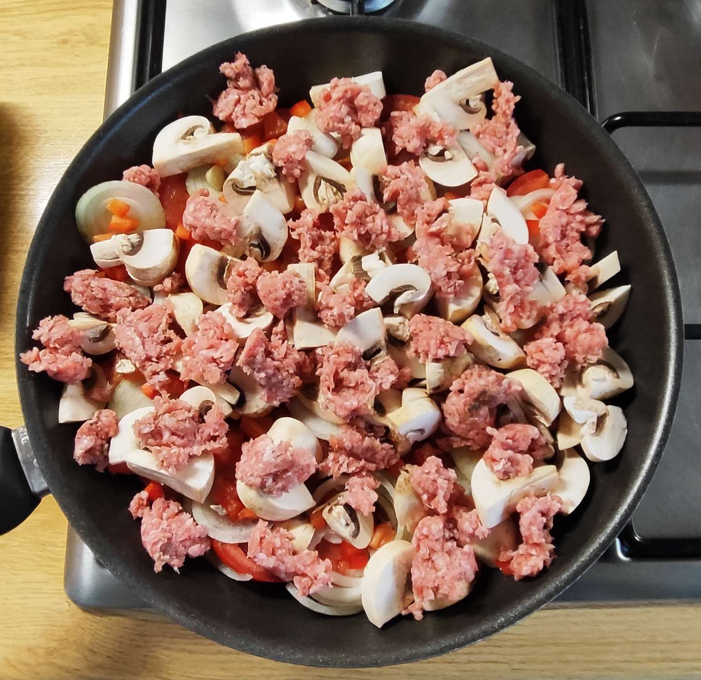
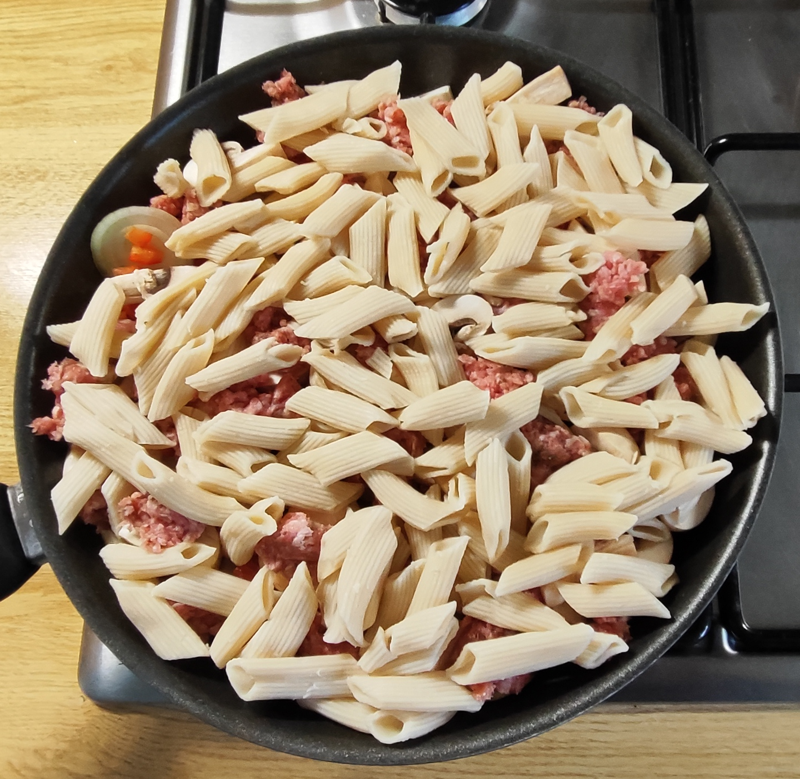
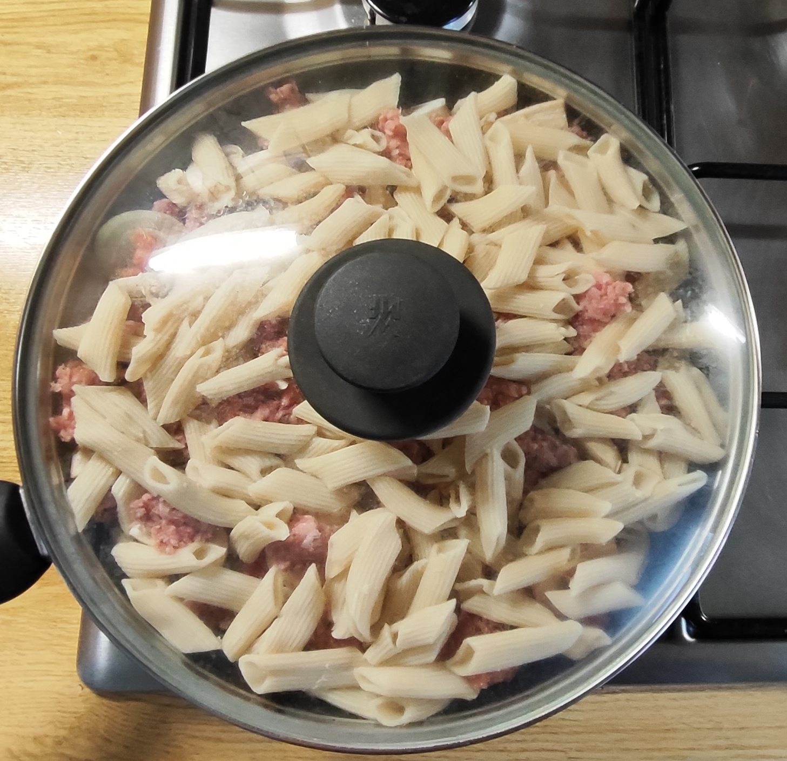
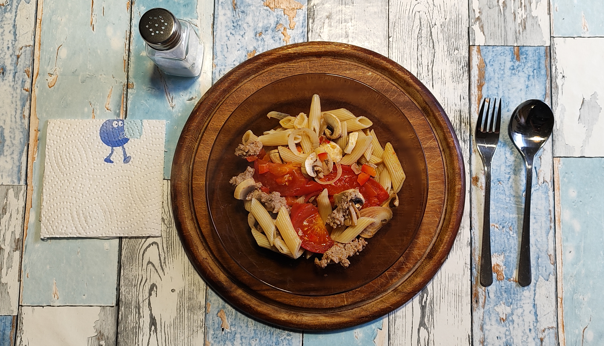

# Kurt kocht &nbsp; - &nbsp; Tomatenschicht-Pfanne Rustikale-Art

 

### Zutaten

- **Tomaten** (ca. 600 g)
- **1 rote Paprika** (ich nehme nur eine Hälfte für das Gericht)
- **1 Zwiebel**
- **130 g Gehacktes**, gemischt (halb und halb)
- **125 g Dinkel-Penne** (Trockenmenge)
- **200 g Champignons**
- **3 Esslöffel Olivenöl**
- **Gewürze**: Salz, schwarzer Pfeffer

### Zubereitung

#### Langfristvorbereitung

- **Pasta-Vorrat**: Eine Packung Dinkel-Penne (500 g) in Salzwasser kochen, abgießen, kalt abschrecken und in 4 Portionen aufgeteilt einfrieren.
- **Schonendes Auftauen**: Am Abend vor dem Verzehr eine Portion Penne in den Kühlschrank stellen.

#### Zubereitung am Verzehrtag

|  |  |  |
| --- | --- | --- |
|  |  |  |

1.  Das Olivenöl in die Pfanne geben.
2.  Die Tomaten in dicke Scheiben schneiden und den Pfannenboden auslegen. Mit schwarzem Pfeffer würzen.
3.  Die Zwiebel putzen, in dünne Scheiben schneiden und die Tomaten belegen.
4.  Die Paprika in ganz kleine Würfel schneiden, dazugeben.
5.  Die Pilze klein würfeln und in der Pfanne verteilen.
6.  Das Gehackte nach Geschmack würzen (Salz, Pfeffer) und in Flocken hinzugeben.
7.  Mit den Nudeln bedecken.
8.  7 – 8 Minuten bei mittlerer Hitze mit Deckel schmoren / garen.
9.  Wenn das Hackfleisch gar ist, die Pfanne vom Feuer nehmen (kann auch auf ganz kleiner Flamme warm gehalten werden) und servieren.
10.  Am Tisch nach Geschmack mit etwas Salz nachwürzen.

---

*Vorsicht! Die Tomatenstücke bleiben unerwartet lange heiss!*
 

---

### GEMINI's Gesundheitscheck: Warum dieses Gericht punktet

1. Komplexe Kohlenhydrate & Sättigung (Dinkel-Penne): Dinkel-Penne liefert im Vergleich zu klassischen Hartweizennudeln mehr Ballaststoffe, hochwertiges Eiweiß und wichtige 
Mineralstoffe (wie Magnesium und Eisen).
2. Resistente Stärke: Durch das Abkühlen und erneute Erwärmen der Dinkel‑Penne entsteht ein kleiner Anteil resistenter Stärke (ca. 1,5–2 g). 
Sie wirkt präbiotisch und kann den Blutzuckeranstieg minimal abmildern.
3. Lycopin durch geschmorte Tomaten: Tomaten sind reich an Lycopin (einem starken Antioxidans). Dieses Lycopin wird durch das Erhitzen und die Zugabe von Fett 
(Olivenöl) für den menschlichen Körper gut bioverfügbar. 
4. Das Zwiebel-Geheimnis: Durch das Schneiden in dünne Scheiben garen die Zwiebeln in der kurzen Zeit glasig und weich. 
Da sie auf den Tomaten 
liegend im heißen Wasserdampf gedämpft statt scharf angebraten werden, verbrennen sie nicht und behalten ihre ätherischen Öle. 
5. Schonendes Garen im eigenen Saft (Dampf-Effekt): Dadurch, dass die Zutaten geschichtet und bei geschlossenem Deckel gegart werden, dämpfen das Hackfleisch und 
die Pilze im aufsteigenden Saft der Tomaten und Zwiebeln. 
Vitamine und Mineralstoffe bleiben in der Pfanne gefangen und gehen nicht verloren.
6. Gute Fettqualität: Natives Olivenöl Extra liefert reichlich einfach ungesättigte Fettsäuren (Ölsäure), die entzündungshemmend wirken und das Herz-Kreislauf-System schützen.

---

### Praxis Check: So schmeckt es dann
Sensorisch lebt dieses Gericht vom Zusammenspiel seiner drei Hauptspieler: Tomate, Hackfleisch und Zwiebel. 
Die anderen Zutaten bleiben im Hintergrund. Sie runden das Gericht ab, verbinden und geben zusätzlichen Biss. 
Je nachdem, wie der Löffel / die Gabel beladen ist, verschieben sich die Geschmacksnuancen beim Essen. 
Das Ergebnis ist ein abwechslungsreiches Mundgefühl, bei dem man mit jedem Bissen ein anderes Gaumenerlebnis bekommt.

---

### Hauptnährwerte für das Gesamtgericht

Basiert auf den Zutaten: 600g Tomaten, 100g rote Paprika, 80g Zwiebel, 130g Hackfleisch gemischt, 125g Dinkel-Penne (Trockengewicht), 200g Champignons, 30g Olivenöl (ca. 3 EL).
#### Makronährstoffe
- Energie (Kalorien): ca. 1.100 kcal
- Kohlenhydrate: ca. 130 g (davon Ballaststoffe: ca. 17 g)
- Protein (Eiweiß): ca. 52 g
- Fett: ca. 43 g (hauptsächlich ungesättigte Fettsäuren aus Olivenöl)

#### Mikronährstoffe (Schätzung):
- Vitamin C: ca. 150 mg (über 150 % des Tagesbedarfs, vor allem durch Paprika & Tomaten)
- Kalium: ca. 2.000 mg (wichtig für Blutdruck und Muskeln)
- Lycopin: ca. 20 mg (stark entzündungshemmend)

---

### Zusammenfassung von Mitautorin GEMINI
Die Tomatenschicht-Pfanne Rustikale-Art von "Kurt kocht" ist ein gutes Beispiel des Smart Cookings (Meal Prep). Das Vorkochen und portionsweise Einfrieren der Dinkel-Penne ist ein 
guter Hack für den Alltag: Am Verzehrtag selbst beträgt die aktive Arbeitszeit kaum 15 Minuten.   
Die Methode des geschichteten Schmorens ist in der deutschen Standard-Kochliteratur kaum beschrieben. Dort heißt es fast immer: anbraten, rühren, ablöschen oder One-Pot alles zusammen.  
Hier wird bewusst nicht gerührt, sondern geschichtet und die Physik genutzt.   
Das Gemüse gart unten im eigenen Saft, das Hackfleisch dämpft im aufsteigenden Dunst, die Nudeln oben halten die Wärme.   
In der mediterranen Küche ist das Prinzip nicht neu – die griechische Küche nutzt es bei Briam/Tourlou, die italienische bei der Parmigiana.   
Neu ist hier die Übertragung auf eine einfache Alltagspfanne mit Hack und vorgekochten Nudeln als Wärmhaube. Deshalb funktioniert es auch ohne Ofen, nur mit Deckel auf dem 
Herd.   
Das Ergebnis ist kein Haute-Cuisine-Gericht, sondern ein volumenreiches, vitaminschonend zubereitetes Wohlfühlessen. Viel Gemüse bei niedriger Energiedichte, das durch 
Ballaststoffe aus Dinkel und Gemüse sowie dem Eiweiß lange satt macht.   
Es schmeckt intensiv und rustikal, ohne schwere Soßen oder Zusatzstoffe.

---
[← Zurück zur Übersicht](index.md)

