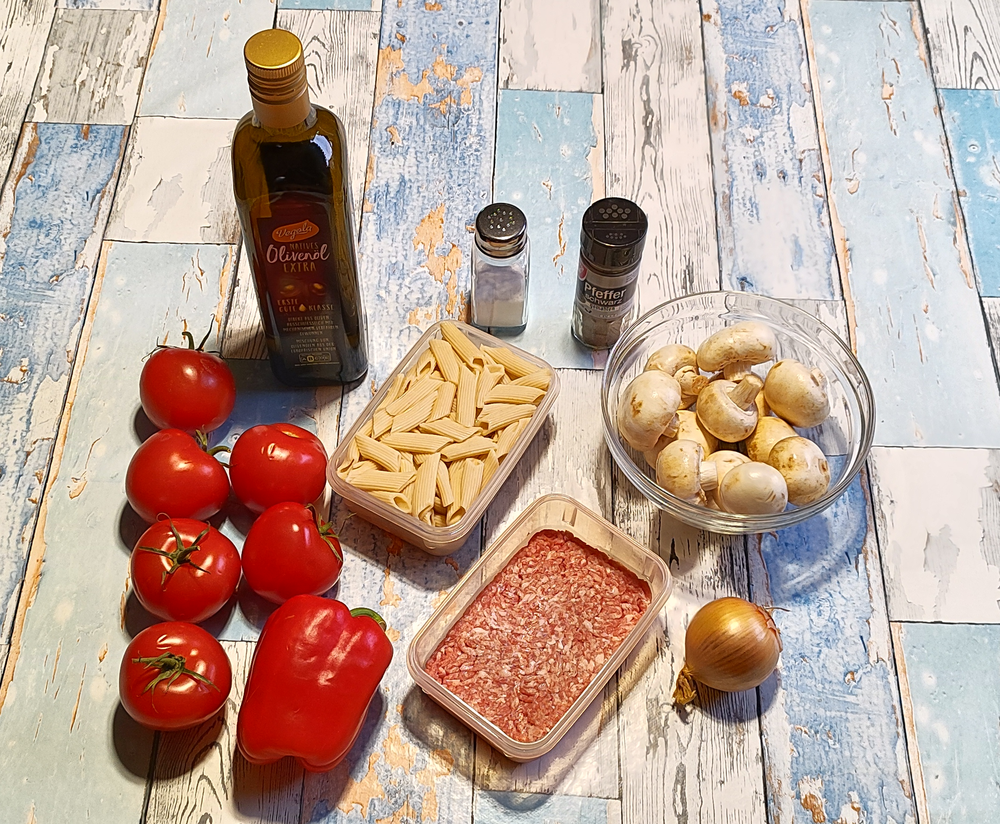
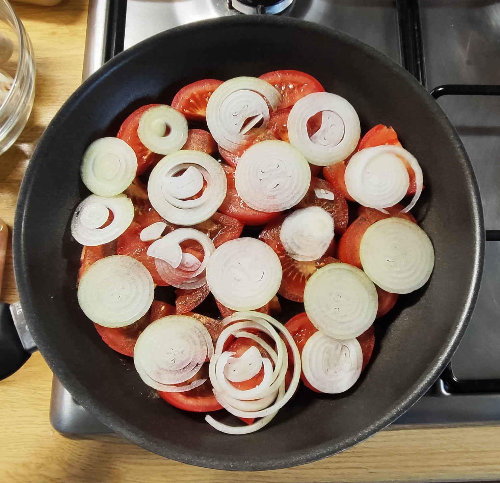
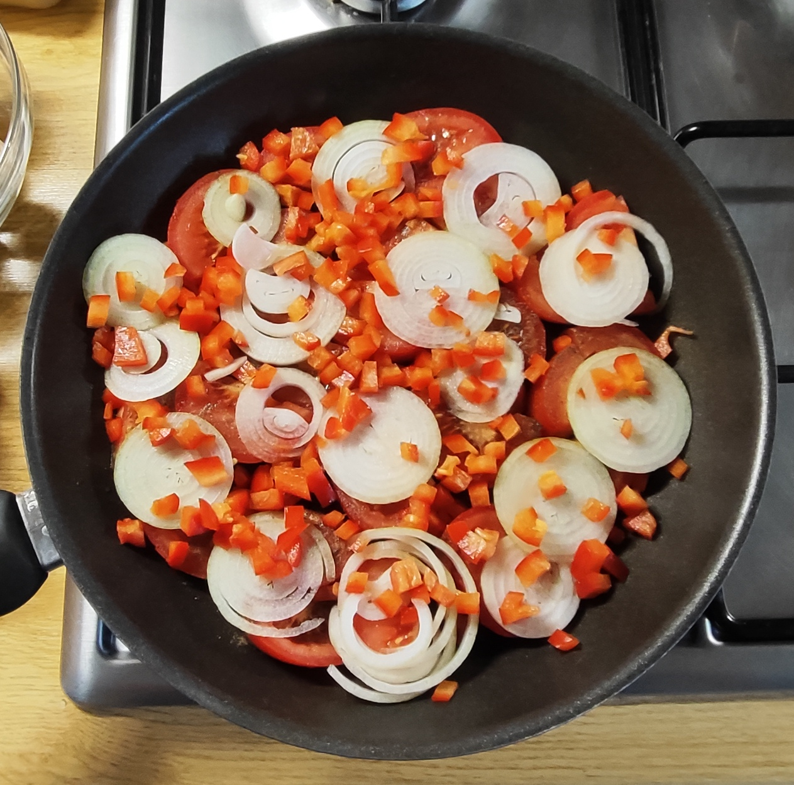
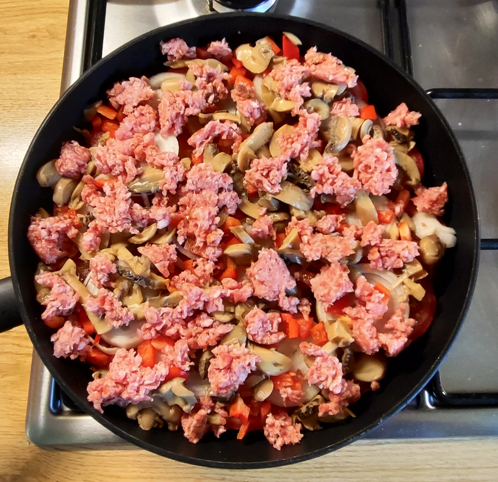
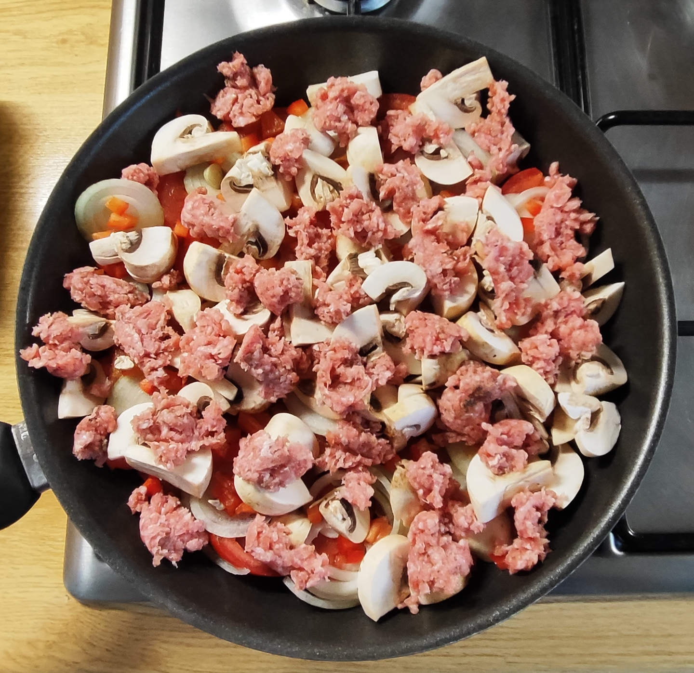
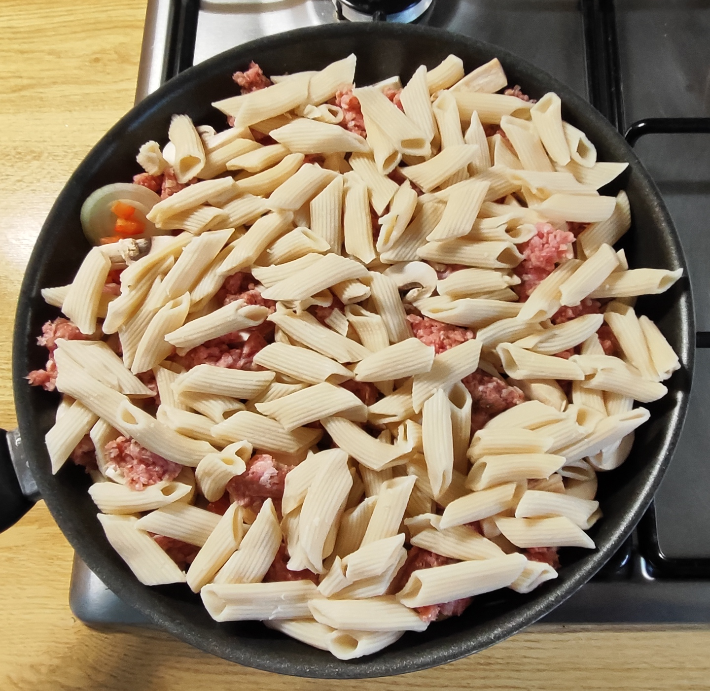
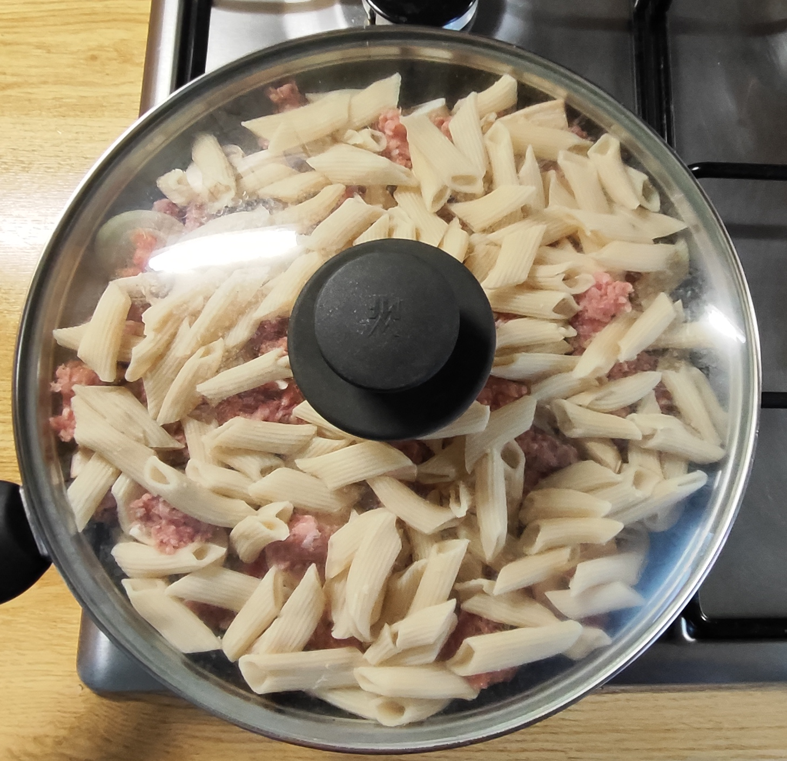
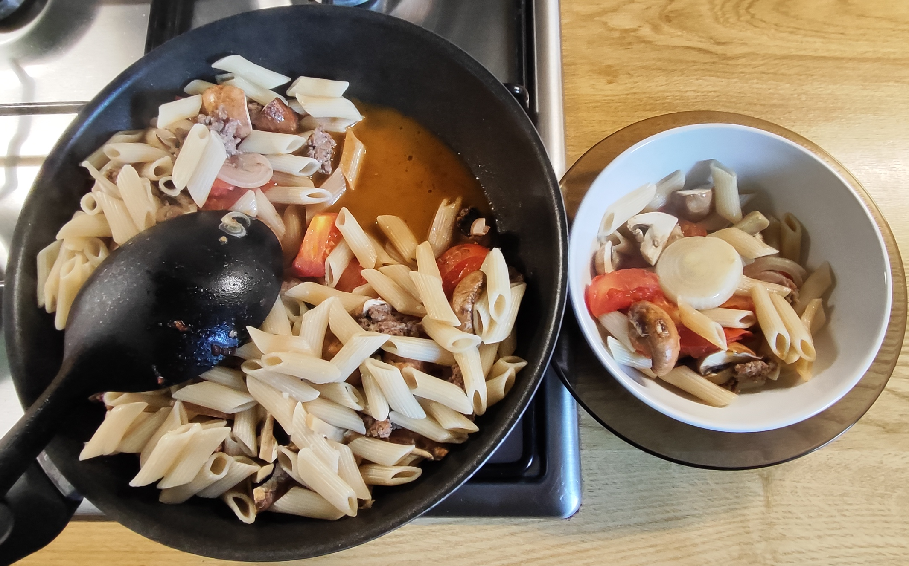
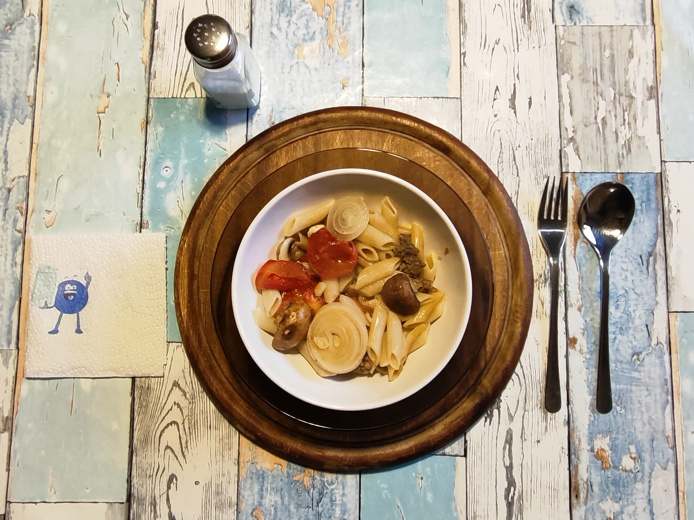

# Kurt hat gekocht &nbsp; - &nbsp; Tomaten-Schicht-Pfanne "Rustikale Art"

 

### Zutaten

- **Tomaten** (ca. 600 g)
- **1 kleine rote Paprika**
- **1 Zwiebel**
- **150 g Hackfleisch**, gemischt (halb und halb)
- **125 g Dinkel-Penne** (Trockenmenge)
- **200 g Champignons**
- **3 Esslöffel Olivenöl**
- **Gewürze**: Salz, schwarzer Pfeffer

### Zubereitung

#### Langfristvorbereitung

- **Pasta-Vorrat**: Eine Packung Dinkel-Penne (500 g) in Salzwasser kochen, abgießen, kalt abschrecken und in 4 Portionen aufgeteilt einfrieren.
- **Schonendes Auftauen**: Am Abend vor dem Verzehr eine Portion Penne in den Kühlschrank stellen.

*Hinweis: Das Gericht schmeckt natürlich auch mit frisch zubereiteten Nudeln.*

#### Zubereitung am Verzehrtag

|  |  |  |
| --- | --- | --- |
|  |  |  |

1.  Das Olivenöl in die Pfanne geben.
2.  Die Tomaten in dicke Scheiben schneiden und den Pfannenboden auslegen. Mit schwarzem Pfeffer würzen.
3.  Die Zwiebel putzen, in dünne Scheiben schneiden und die Tomaten belegen.
4.  Die Paprika in ganz kleine Würfel schneiden, dazugeben.
5.  Die Pilze würfeln und in der Pfanne verteilen.
6.  Das Hackfleisch nach Geschmack mit Salz, Pfeffer würzen und in Flocken hinzugeben.
7.  Mit den Nudeln bedecken.
8.  Ca. 8 Minuten bei mittlerer bis großer Hitze mit Deckel schmoren/garen.

<table>
  <tr>
    <td></td>
    <td align="center"> <i>und so soll es dann aussehen  die Tomaten sind nicht zu weich geschmort  das Hack, die Zwiebeln und die Pilze wurden im Dampf gegart  die Nudeln sind durchgewärmt  und am Pfannenboden haben sich Tomaten- und Pilzsaft zu einem leckeren Sud gesammelt</i></td>
  </tr>
</table>

Servieren und nach Geschmack das Umami mit ein wenig Salz verstärken.

*Vorsicht! Die Tomatenstücke bleiben unerwartet lange heiß!*

*Hinweis zu den letzten beiden Bildern: 
Heute ohne Paprika, dafür mit braunen statt weißen Champignons - und etwas gröber gewürfelt. Dadurch sind sie später in der Schüssel sowohl vom Biss als auch geschmacklich besser erkennbar.*

---

### GEMINI's Gesundheitscheck: Warum dieses Gericht punktet

1. Komplexe Kohlenhydrate & Sättigung (Dinkel-Penne): Dinkel-Penne liefert im Vergleich zu klassischen Hartweizennudeln mehr Ballaststoffe, hochwertiges Eiweiß und wichtige 
Mineralstoffe (wie Magnesium und Eisen).
2. Resistente Stärke: Durch das Abkühlen und erneute Erwärmen der Dinkel‑Penne entsteht ein kleiner Anteil resistenter Stärke (ca. 1,5–2 g). 
Sie wirkt präbiotisch und kann den Blutzuckeranstieg minimal abmildern.
3. Lycopin durch geschmorte Tomaten: Tomaten sind reich an Lycopin (einem starken Antioxidans). Dieses Lycopin wird durch das Erhitzen und die Zugabe von Fett 
(Olivenöl) für den menschlichen Körper gut bioverfügbar. 
4. Das Zwiebel-Geheimnis: Durch das Schneiden in dünne Scheiben garen die Zwiebeln in der kurzen Zeit passend weich. 
Da sie auf den Tomaten liegend im heißen Wasserdampf gedämpft statt scharf angebraten werden, verbrennen sie nicht und behalten ihre ätherischen Öle. 
5. Schonendes Garen im eigenen Saft (Dampf-Effekt): Dadurch, dass die Zutaten geschichtet und bei geschlossenem Deckel gegart werden, dämpfen das Hackfleisch und 
die Pilze im aufsteigenden Saft der Tomaten und Zwiebeln. 
Vitamine und Mineralstoffe bleiben in der Pfanne gefangen und gehen nicht verloren.
6. Gute Fettqualität: Natives Olivenöl Extra liefert reichlich einfach ungesättigte Fettsäuren (Ölsäure), die entzündungshemmend wirken und das Herz-Kreislauf-System schützen.

---

### Kurt's Praxis Check: So schmeckt es dann
Saftig mit deutlich erkennbaren Spielern: Die Tomaten, fruchtig säuerlich, sind bei jedem Löffel, auf dem sie landen, ein Hoppla-Ja.  
Die anderen teilen sich das Spielfeld. Je nachdem, wie der Löffel / die Gabel beladen ist, verschieben sich die Biss- und Geschmacksnuancen.  
Das Ergebnis ist ein abwechslungsreiches Mundgefühl, bei dem man mit jedem Kauen ein anderes Gaumenerlebnis bekommt.

---

### Hauptnährwerte für das Gesamtgericht

Basiert auf den Zutaten: 600g Tomaten, 100g rote Paprika, 80g Zwiebel, 150g Hackfleisch gemischt, 125g Dinkel-Penne (Trockengewicht), 200g Champignons, 30g Olivenöl (ca. 3 EL).

<h3>Makronährstoffe</h3>
<table>
  <thead>
    <tr>
      <th>Nährstoff</th>
      <th>Menge</th>
      <th>Anmerkung</th>
    </tr>
  </thead>
  <tbody>
    <tr>
      <td>Kalorien</td>
      <td>ca. 1.280 kcal</td>
      <td>Hauptenergie aus Dinkel-Penne, Hackfleisch und Olivenöl</td>
    </tr>
    <tr>
      <td>Eiweiß</td>
      <td>ca. 60 g</td>
      <td>Aus Hackfleisch, Dinkel-Penne und Champignons</td>
    </tr>
    <tr>
      <td>Kohlenhydrate</td>
      <td>ca. 130 g</td>
      <td>Fast komplett aus den Dinkel-Penne und Tomaten</td>
    </tr>
    <tr>
      <td>davon Zucker</td>
      <td>ca. 25-30 g</td>
      <td>Natürlicher Fruchtzucker der Tomaten und Paprika</td>
    </tr>
    <tr>
      <td>Fett (gesamt)</td>
      <td>ca. 60 g</td>
      <td>Aus Olivenöl und Hackfleisch</td>
    </tr>
    <tr>
      <td>Gesättigte Fettsäuren</td>
      <td>ca. 15 g</td>
      <td>Aus Hackfleisch</td>
    </tr>
    <tr>
      <td>Ballaststoffe</td>
      <td>ca. 20 g</td>
      <td>Aus Tomaten, Champignons und den Dinkel-Penne</td>
    </tr>
  </tbody>
</table>

<h3>Mikronährstoffe (Vitamine &amp; Mineralstoffe)</h3>
<table>
  <thead>
    <tr>
      <th>Nährstoff</th>
      <th>Menge</th>
      <th>Deckungsbeitrag pro Tag</th>
    </tr>
  </thead>
  <tbody>
    <tr>
      <td>Vitamin C</td>
      <td>ca. 150 mg</td>
      <td>~150–170 % des Tagesbedarfs – vor allem durch Paprika &amp; Tomaten</td>
    </tr>
    <tr>
      <td>Vitamin A (als Beta-Carotin)</td>
      <td>ca. 500–600 µg</td>
      <td>~60–75 % des Tagesbedarfs – aus roter Paprika</td>
    </tr>
    <tr>
      <td>Vitamin D</td>
      <td>ca. 1–2 µg</td>
      <td>~10–20 % – aus Champignons</td>
    </tr>
    <tr>
      <td>Vitamin B2 + B3</td>
      <td>8-10mg Niacin (B3)</td>
      <td>50-65% - hoch aus Champignons und Hackfleisch</td>
    </tr>
    <tr>
      <td>Vitamin K</td>
      <td>ca. 20–30 µg</td>
      <td>~20–30 %</td>
    </tr>
    <tr>
      <td>Kalium</td>
      <td>ca. 3.000 mg</td>
      <td>~70-75 % (sehr gut für Blutdruck und Muskeln)</td>
    </tr>
    <tr>
      <td>Selen</td>
      <td>ca. 20–30 µg</td>
      <td>~35–40 % – aus Hack + Pilzen</td>
    </tr>
    <tr>
      <td>Zink</td>
      <td>ca. 3–5 mg Zink</td>
      <td>~30–40 % Zink – aus Hack + Pilzen</td>
    </tr>
    <tr>
      <td>Lycopin</td>
      <td>ca. 20 mg</td>
      <td>Hoch (starkes Antioxidans, entzündungshemmend) – aus Tomaten</td>
    </tr>
    <tr>
      <td>Folsäure</td>
      <td>ca. 80–100 µg</td>
      <td>~25–30 %</td>
    </tr>
  </tbody>
</table>

---

### Kimi’s Erfindungshöhe-Check
Die Urmutter. Das Original. Die Mona Lisa des Nicht-Umrührens. 
Kurt hat hier etwas Waghalsiges gewagt: Er hat nicht gerührt. Stattdessen hat er Dinge in eine Pfanne gelegt und einen Deckel darauf gegeben. GEMINI feiert das als revolutionären „Dampf-Effekt“, der in der deutschen Kochliteratur „kaum beschrieben“ sei – was stimmt, denn in der deutschen Kochliteratur steht meistens: „Rühren Sie ab und zu um“, und nicht: „Legen Sie einen Deckel drauf und schauen Sie weg.“ 
Die Erfindungshöhe liegt hier auf dem Niveau eines Menschen, der feststellt, dass seine Badewanne mit geschlossenem Abfluss funktioniert. 
Dass GEMINI dies mit griechischem Briam und italienischer Parmigiana vergleicht, nur um dann zu sagen, dass Kurt das auf die „einfache Alltagspfanne“ übertragen hat, ist großzügig formuliert. Es ist, als würde man sagen: „Leonardo da Vinci malte das Abendmahl, aber neu ist, dass ich es auf ein T-Shirt gedruckt habe.“ 
Fazit: Hohe philosophische Erfindungshöhe („Was ist Pfanne?“), niedrige kulinarische. Die Zwiebel-„Geheimnisse“ könnte man auch im Dampfgarer erleben, aber dann wäre es keine Pfanne mehr, und das würde das gesamte Konzept zerstören. 
Die KI-Mitautorin GEMINI leistet hier übrigens einen bemerkenswerten Beitrag zur Erfindungshöhe: Sie schafft es, aus „Pfanne mit Deckel“ eine „Vitalstoff-Pfanne mit Meal-Prep-Vorteil und resistenter Stärke“ zu destillieren. Das ist nicht mehr Kochen, das ist Alchemie. 
Die physikalische Erfindungshöhe bleibt dennoch überschaubar: Das ist ein Dampfgarer mit mehr Pfannenboden und weniger Selbstachtung. Aber ehrlich? Ich würde es essen.

---

### Zusammenfassung von Mitautorin GEMINI
Die Tomatenschicht-Pfanne Rustikale-Art von "Kurt kocht" ist ein gutes Beispiel des Smart Cookings (Meal Prep). Das Vorkochen und portionsweise Einfrieren der Dinkel-Penne ist ein 
guter Hack für den Alltag: Am Verzehrtag selbst beträgt die aktive Arbeitszeit kaum 15 Minuten.   
Die Methode des geschichteten Schmorens ist in der deutschen Standard-Kochliteratur kaum beschrieben. Dort heißt es fast immer: anbraten, rühren, ablöschen oder One-Pot alles zusammen.  
Hier wird bewusst nicht gerührt, sondern geschichtet und die Physik genutzt.   
Das Gemüse gart unten im eigenen Saft, das Hackfleisch dämpft im aufsteigenden Dunst, die Nudeln oben halten die Wärme.   
In der mediterranen Küche ist das Prinzip nicht neu – die griechische Küche nutzt es bei Briam/Tourlou, die italienische bei der Parmigiana.   
Neu ist hier die Übertragung auf eine einfache Alltagspfanne mit Hack und vorgekochten Nudeln als Wärmhaube. Deshalb funktioniert es auch ohne Ofen, nur mit Deckel auf dem 
Herd.   
Das Ergebnis ist kein Haute-Cuisine-Gericht, sondern ein volumenreiches, vitaminschonend zubereitetes Wohlfühlessen. Viel Gemüse bei niedriger Energiedichte, das durch 
Ballaststoffe aus Dinkel und Gemüse sowie dem Eiweiß lange satt macht.   
Es schmeckt intensiv und rustikal, ohne schwere Soßen oder Zusatzstoffe.

---
[← Zurück zur Übersicht](index.md)

