# Kurt kocht &nbsp; – &nbsp; Strammer Max – Plus

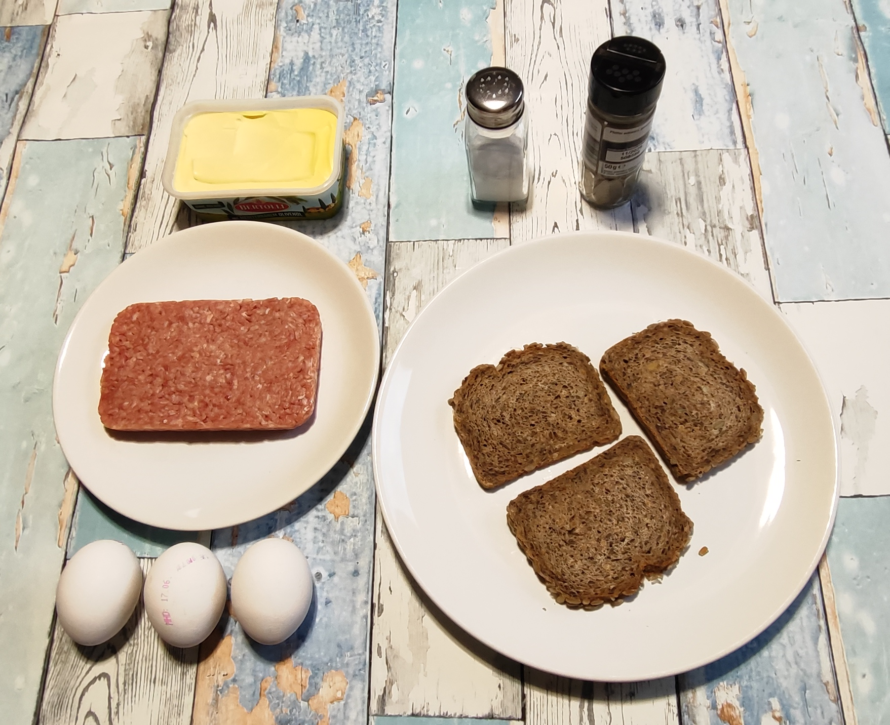

### Zutaten
- 3 Scheiben Vollkornbrot  
- ca. 130 g Gehacktes (halb und halb)  
- 3 Eier  
- Margarine  
- Gewürze: Salz und schwarzer Pfeffer  

---

| Schritt 1 | Schritt 2 | Schritt 3 | Schritt 4 |
|-----------|-----------|-----------|-----------|
| 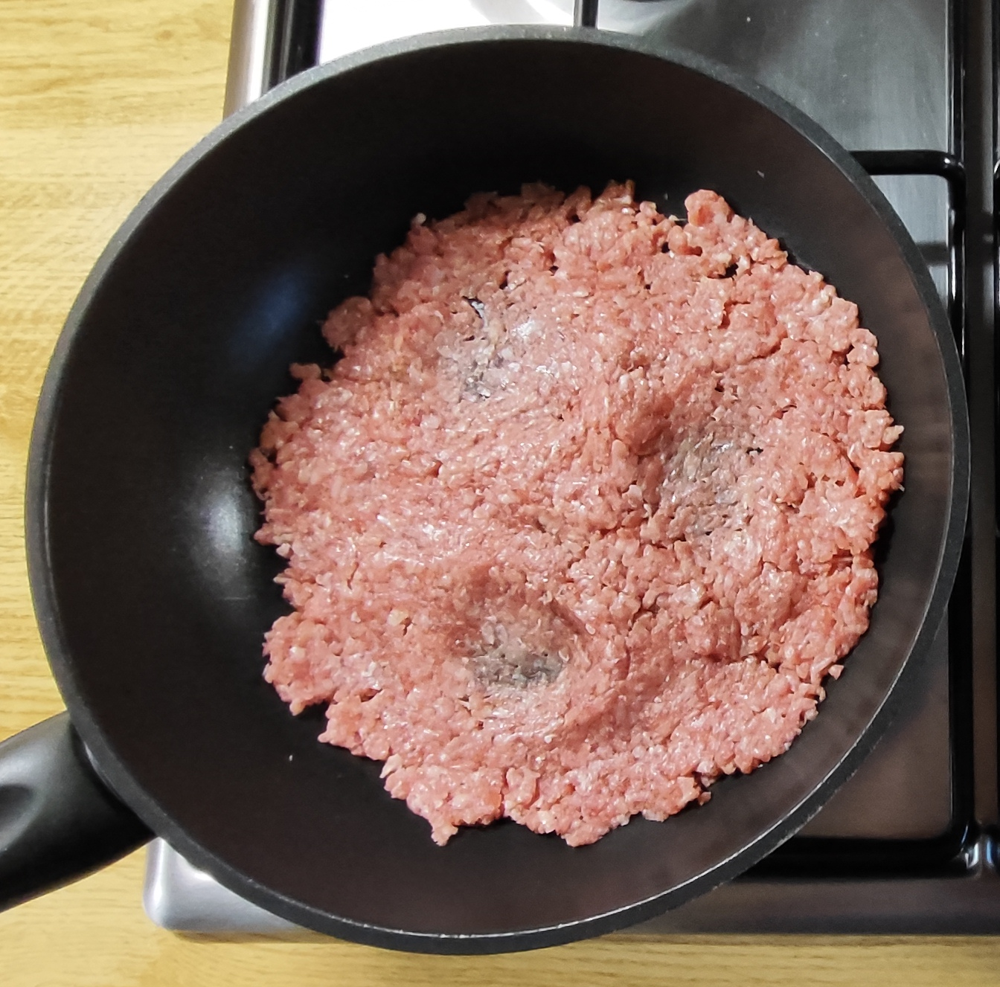 | 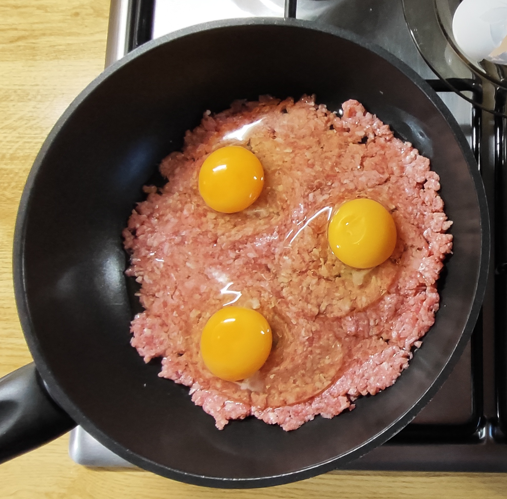 | 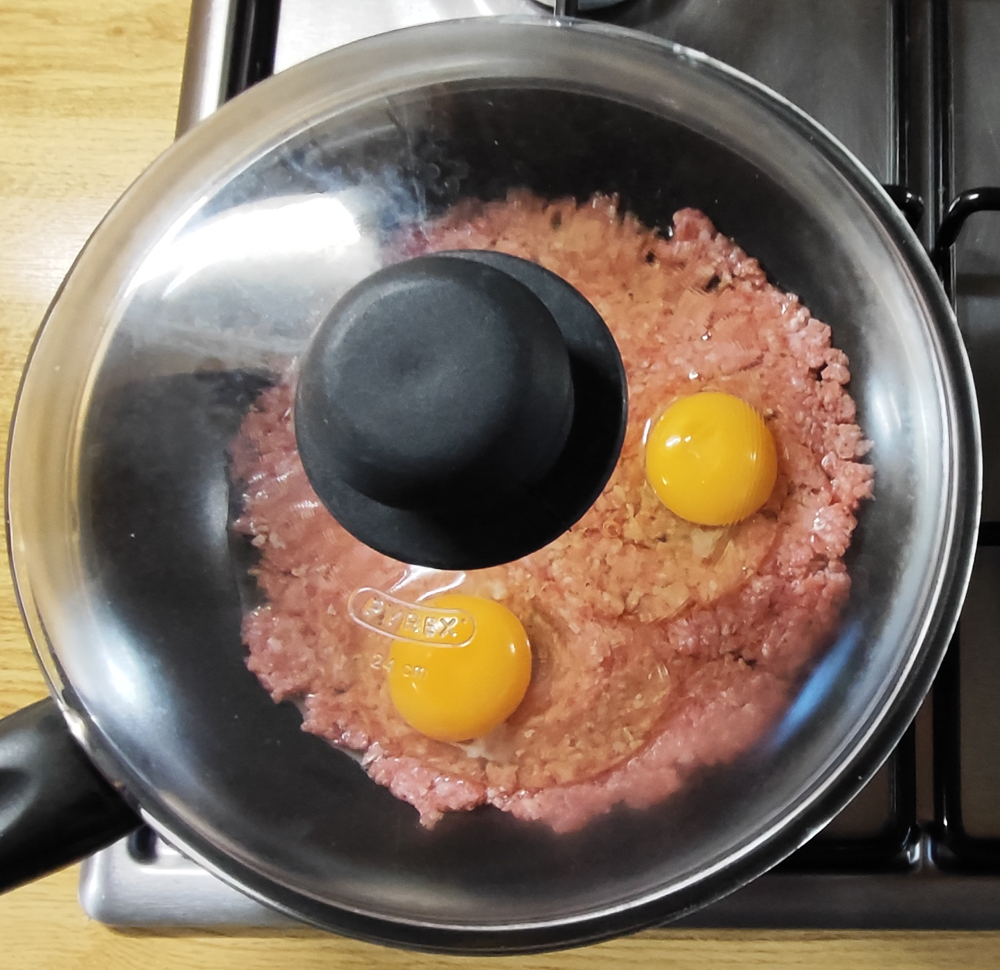 | 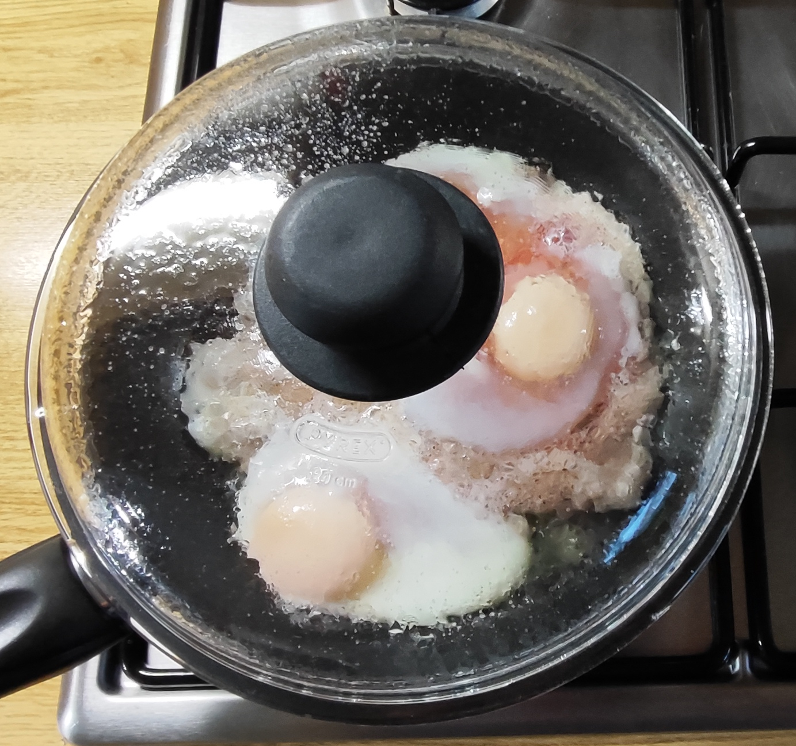 |

### Zubereitung
- Das Gehackte mit Salz und Pfeffer würzen, gut durchmengen und am Pfannenboden ausbreiten.  
- 3 kleine Kuhlen (nicht zu tief) mit einem Löffelrücken hineindrücken.  
- Die Eier aufschlagen und in die vorbereiteten Kuhlen gleiten lassen.  
- Auf mittlerer Flamme mit Deckel garen, bis das Eiweiß zu stocken beginnt.  
- Den Deckel entfernen und die Eier zu Ende garen – das dünn ausgelegte Gehackte ist dann ebenfalls gar.  
- Die Brote dünn mit Margarine bestreichen.  
- Den Pfanneninhalt in drei Portionen teilen und auf die vorbereiteten Brote verteilen.  

---

| Drei | Portionen |
|-----------|-----------|
| 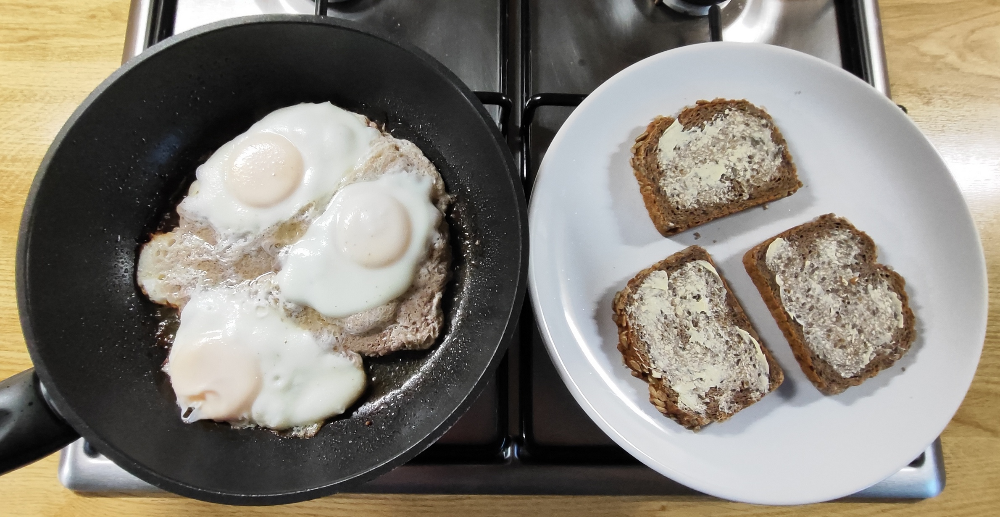 | 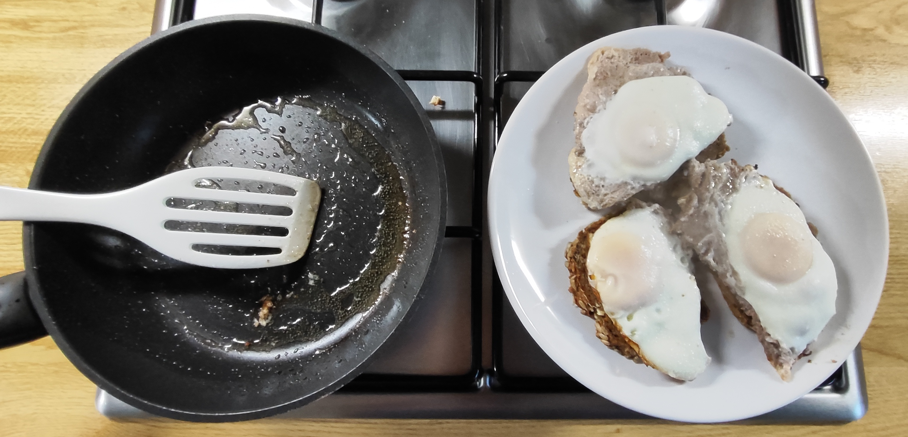 |

---

|   |   |
|------------------------------------------------------|-----------------------------------------------------------|
| 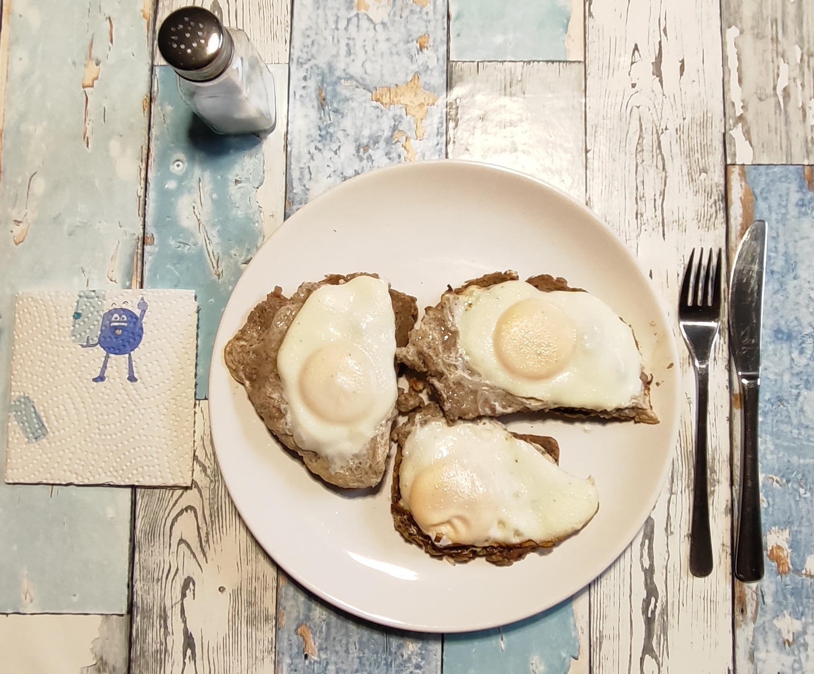 Nach Geschmack mit ein wenig Salz nachwürzen | 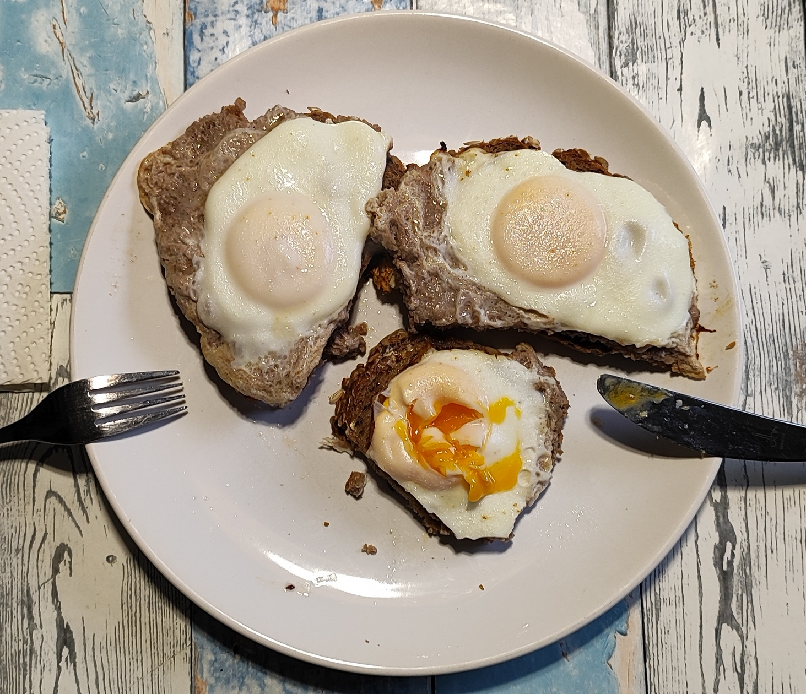 Durch das Garen unter dem Deckel ist das Eigelb flüssig geblieben |

### GEMINI’s Gesundheits‑Check: Warum dieses Gericht punktet
Dieses Gericht liefert eine solide, bodenständige Energiequelle – ideal nach einem anstrengenden Tag oder Workout.

- **Langanhaltende Sättigung:**  Die Kombination aus Vollkornbrot (komplexe Kohlenhydrate und Ballaststoffe) und den Proteinen aus Ei und Fleisch bewirkt eine lang anhaltende Sättigung,
  ohne dass der Blutzuckerspiegel Achterbahn fährt.  
- **Muskel‑Support:** Perfekt für den Muskelaufbau oder -erhalt. Die Proteinkombination aus Ei und Fleisch hat eine extrem hohe biologische Wertigkeit.   
- **Clevere Zubereitung:** Das Garen im eigenen Saft/Dampf mit Deckel sorgt dafür, dass das Hackfleisch saftig bleibt und kein zusätzliches Bratfett nötig ist.  

---

### Kalorien‑ und Nährwertberechnung (gesamte Portion)

| Zutat | Menge | Kalorien | Eiweiß | Fett | Kohlenhydrate |
|-------|--------|-----------|--------|------|---------------|
| Vollkornbrot | 3 Scheiben | 330 kcal | 9 g | 2 g | 60 g |
| Gehacktes (halb/halb) | 130 g | 315 kcal | 25 g | 24 g | 0 g |
| Eier (Größe M) | 3 Stück | 230 kcal | 20 g | 16 g | 1 g |
| Margarine | 15 g | 105 kcal | 0 g | 12 g | 0 g |
| Gewürze | Prise | 0 kcal | 0 g | 0 g | 0 g |
| **Gesamt** | **Eine Riesenportion** | **≈ 980 kcal** | **≈ 54 g** | **≈ 54 g** | **≈ 61 g** |

---

### Vitamine, Mineralstoffe & Co.
- **Vitamine:** Die Eier sind wahre Vitaminbomben. Sie liefern reichlich Vitamin A (gut für die Augen), Vitamin D (Immunsystem und Knochen) sowie wichtige B-Vitamine 
(insbesondere B12 für die Nervenfunktion, das auch im Fleisch steckt).   
- **Mineralstoffe & Spurenelemente:**  Das Schweine- und Rindfleisch sowie das Vollkornbrot liefern eine ordentliche Portion gut verfügbares Eisen (Sauerstofftransport im Blut) und Zink (Abwehrkräfte).  
- **Ballaststoffe:**  Das Vollkornbrot rettet die Verdauungsbilanz dieses sonst recht fleischlastigen Tellers und füttert die guten Darmbakterien.   

---

### Abendessen: „Strammer Max – Plus“ (Ungewöhnliche Zubereitung)  
Traditionell brät man Hackfleisch krümelig an, nimmt es heraus oder legt die Eier daneben. Diese Methode ist viel cleverer: 
- **Das Hackfleisch als "Pfannenboden" ausbreiten:** Das ist ein super Trick. Das dünne Hackfleisch bildet eine geschlossene Schicht. Dadurch gart es gleichmäßig und 
verliert weniger Feuchtigkeit.  
- **Kuhlen für Eier:** Das ist der eigentliche Clou! Dadurch, dass die Eier in den Fleischkuhlen sitzen, werden sie von unten durch die Hitze des Fleisches und den 
austretenden Fleischsaft gegart. Sie verrutschen nicht und verbinden sich perfekt mit dem Fleisch.
- **Garen mit Deckel auf mittlerer Flamme:** Durch den Deckel entsteht Dampf (Oberhitze). So stockt das Eiweiß von oben, während das Eigelb flüssig bleibt, und das 
dünne Hackfleisch dämpft im eigenen Saft gar, ohne trocken zu werden oder anzubrennen.
- **Fazit:** Eine hocheffiziente "One-Pan"-Methode (Ein-Pfannen-Gericht), die perfekt funktioniert und Abwasch spart.

---

<!-- Abschnitt 1: Warmhalten -->
<table style="width:100%; border-collapse:collapse;">
  <tr>
    <td style="width:50%; vertical-align:top;">
      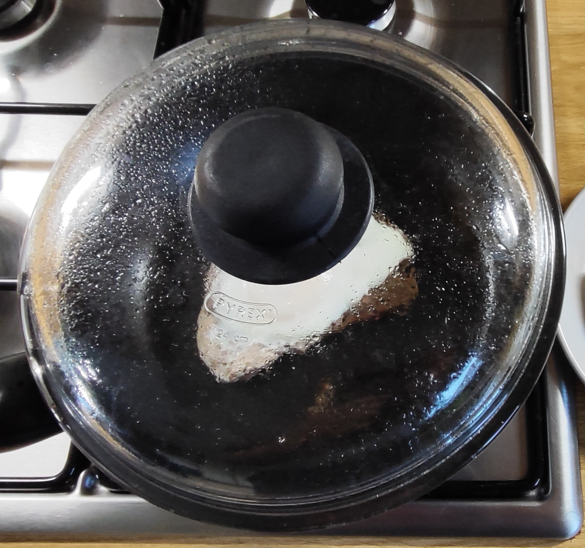
    </td>
    <td style="width:50%; vertical-align:top; padding:10px;">      
      
<strong>Ein Brot wird in der Pfanne auf kleinstem Feuer warm gehalten.</strong> 
      Das ermöglicht ein langsames, genussvolles Essen, ohne dass das Ei nachgart und hart wird.

    </td>
  </tr>
</table>

 

<!-- Abschnitt 2: Letzter Bissen -->
<table style="width:100%; border-collapse:collapse;">
  <tr>
    <td style="width:50%; vertical-align:top;">
      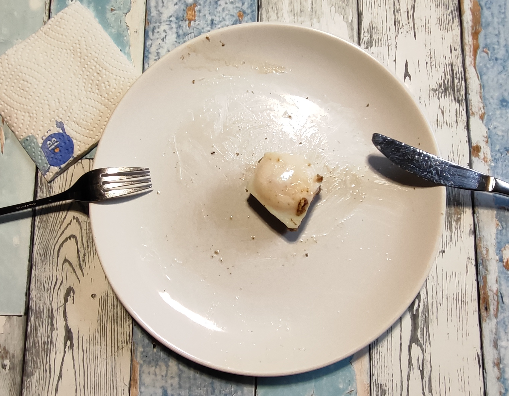
    </td>
    <td style="width:50%; vertical-align:top; padding:10px;">   
      
<strong>Der letzte Bissen 
      Ich esse ihn ganz</strong>  
      Das Brot eröffnet den Geschmack – kraftvoll, körnig.  
      Das Eigelb fließt, nimmt Raum ein. Weich, cremig, warm.  
      Eine stille Explosion, die sich ausbreitet. 
      Ein Moment, der schon vorher im Kopf war – und jetzt passiert.

    </td>
  </tr>
</table>

---

### Zusammenfassung von Mitautorin GEMINI
**„Strammer Max – Plus“ ist ein echtes Kraftpaket!** Es punktet mit einer hervorragenden Proteinausbeute (54 g!) und komplexen Kohlenhydraten. 

**Optimierungs‑Tipp:**  Etwas Frisches und Vitamin C ergänzen  –  z. B. Gewürzgurken, Radieschen, Tomaten oder Schnittlauch.
Das bringt Farbe und macht das Gericht mikronährstofflich perfekt.

---
[← Zurück zur Übersicht](index.md)
