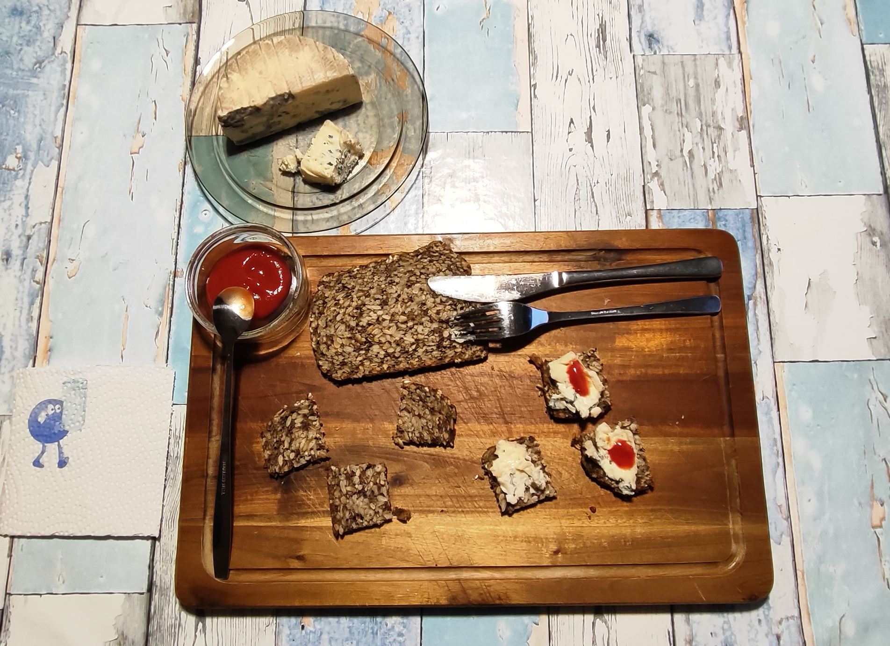

<h1>Kurt snackt</h1>

<h2> Vollkornbrot + Blauschimmelkäse 
mit 
süß-saurer Tomatenkomponente</h2>

### Ein Abend Snack

## Zutaten:
- Blauschimmelkäse (ca. 50 g) 
- 2 Scheiben mildes Vollkornbrot 
- 1 - 2 Esslöffel Ketchup 

---

## Zubereitung: 
Siehe Bild, aber nicht zu viel Ketchup nehmen. 

---

## GEMINI's Gesundheits-Check: Warum dieser Snack punktet
Wer bei Blauschimmelkäse mit Ketchup auf Kernenbrot nur an ein verrückt zusammengeschustertes Essen denkt, übersieht das verblüffende Nährstoff-Profil hinter dieser Kreation.  
Aus ernährungswissenschaftlicher Sicht greifen die drei Komponenten nämlich überraschend gut ineinander: 
1. Die saubere Basis: Das Saatenbrot (Der Motor)  
- Ballaststoff-Booster: Vollkorn- und Saatenbrote liefern reichlich unverdauliche Pflanzenfasern. Das sorgt für eine langanhaltende Sättigung, hält den Blutzuckerspiegel stabil und kurbelt die Verdauung an. 
- Gesunde Fette & Mikronährstoffe: Sonnenblumenkerne, Kürbiskerne oder Leinsamen stecken voller ungesättigter Fettsäuren, Magnesium, Zink und B-Vitaminen. 
2. Der Kraftprotz: Blauschimmelkäse (Der Geschmacksträger)  
- Hochwertiges Eiweiß & Kalzium: Käse liefert essenzielle Aminosäuren für den Muskelerhalt sowie reichlich Kalzium für Knochen und Zähne. 
- Gute Darmflora: Durch den Reifungsprozess und die Edelschimmel-Kulturen enthält hochwertiger Käse oft bioaktive Peptide und Mikrobennährstoffe, die der Darmgesundheit guttun können. 
- Gedrosselte Dosis: Da der Käse intensiv schmeckt, reicht meist schon eine kleine Menge, was die Gesamtkalorien- und Salzmenge im Rahmen hält. 
3. Der kleine Kick: Ketchup (Die Geheimzutat)  
- Lycopin-Lieferant: Konzentriertes Tomatenmark (die Basis für Ketchup) ist reich an Lycopin – einem der stärksten pflanzlichen Antioxidantien, das Zellstrukturen schützt. 
- Minimalprinzip zählt: Solange Ketchup sparsam als Würz-Akzent (wie ein Frucht-Chutney) dosiert wird, fällt der enthaltene Zucker kaum ins Gewicht.

Fazit: Eine unerwartete Kombination, die komplexe Kohlenhydrate, gesunde Fette, Proteine und mikrobiologische Vielfalt auf das Abendbrot-Brett bringt! 

---

## Kurt's Praxis-Check: So schmeckt es dann
Das war interessant lecker:   
- Das Brot - klar: der Biss, die Körner, Volumen, leichte Nussigkeit. 
- Der Käse und der Ketchup verbinden ihre Geschmäcker. Der Käse setzt den Grundton (aber durch das Brot stark gedämpft) und dann blitzt es plötzlich süßlich, der Ketchup hat sich gemeldet.  

---

## Energiewert dieser Mahlzeit

*(Berechnungsgrundlage: 50 g Blauschimmelkäse, 2 Scheiben Vollkornbrot und 20 g Ketchup)* 

* **Brennwert**: ca. 450 kcal
* **Eiweiß (Protein)**: ca. 20 g
* **Fett**: ca. 20 g 
* **Kohlenhydrate**: ca. 40 - 45 g

---

## Zusammenfassung von den Mitautorinnen GEMINI und MiniMax Ki (China):  
- Das Konzept: Ein unkonventioneller Schicht-Snack aus nussigem Kernenbrot, kräftig-salzigem Blauschimmelkäse und punktuell dosiertem Ketchup als Süße-Akzent. 
- Das Fazit: Gelungen - vom mutigen Experiment zum durchdachten, alltagstauglichen Dauerbrenner.  

---
[← Zurück zur Übersicht](index.md)

