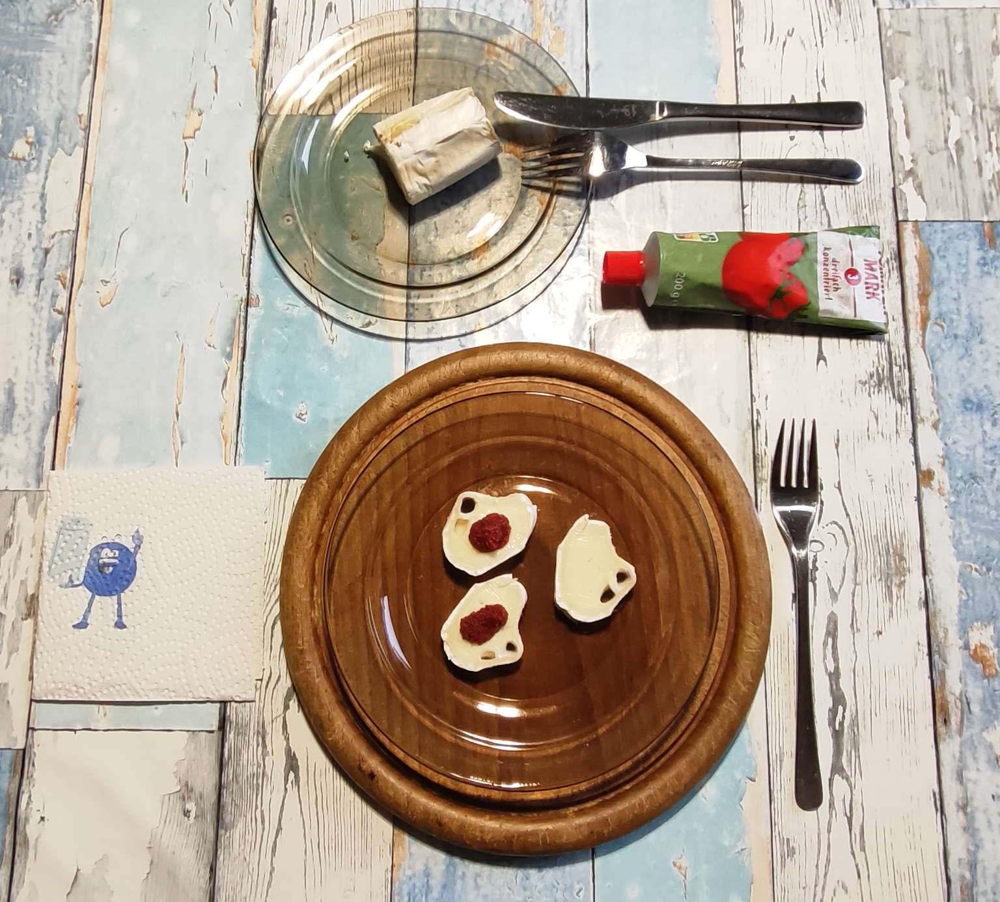

# Kurt kocht &nbsp;-&nbsp; Ziegen-Weichkäse mit Tomatenmark
### Ein Abend Snack

## Zutaten *(das Bild zeigt die Hälfte des Snacks)*:
* **6 Scheiben Ziegen-Weichkäse (ca. 60 g)**
* **6 Kleckse Tomatenmark 3-fach konzentriert (ca. 25 g)**

---

## GEMINI's Gesundheits-Check: Warum dieser Snack punktet
#### Diese kleine Snack-Idee liefert eine überraschend harmonische Aromen-Kombination und einen feinen Protein-Kick für zwischendurch. 
- **Proteinquelle & Sättigung:** Der Französische Ziegen-Weichkäse liefert hochwertige Proteine und gesunde Fette, die für eine anhaltende und angenehme Sättigung ohne Schweregefühl sorgen. 
- **Lycopin- & Nährstoff-Kick:** Das dreifach konzentrierte Tomatenmark ist extrem reich an Lycopin (einem stark wirksamen Antioxidans). 
- **Bioverfügbarkeit:** Die Fette im Ziegenkäse dienen als optimaler Geschmacksträger und verbessern die Aufnahme des fettlöslichen Lycopins aus dem Tomatenmark beträchtlich. 
- **Glykämische Stabilität:** Mit unter 5 g Kohlenhydraten pro Portion bleibt der Blutzuckerspiegel nahezu komplett stabil. 
- **Minimaler Insulin-Ausstoß:** Das Fehlen einfacher Kohlenhydrate verhindert Insulinspitzen, was die Kombination zu einem perfekten Low-Carb-Abendsnack macht.  

  ---

## Kurt's Praxis-Check: So schmeckt es dann
Die charakteristische, leicht säuerlich-würzige Note des Ziegenkäses trifft auf die intensive Umami-Süße und Fruchtsäure des konzentrierten Tomatenmarks – ein überraschend edles Zusammenspiel. 
Der Käse bleibt im Vordergrund, die Tomate hegt ihn ein, ohne ihn zu überdecken. 

---

## Energiewert dieser Mahlzeit
*(Berechnungsgrundlage: 60 g Ziegen-Weichkäse und 25 g dreifach konzentriertes Tomatenmark)*  
* **Brennwert**: ca. 200 kcal
* **Eiweiß (Protein)**: ca. 12 g
* **Fett**: ca. 13 g (davon gesättigte Fettsäuren: ca. 8,6 g) 
* **Kohlenhydrate**: ca. 4,5 g (davon fruchteigener Zucker: ca. 2,7 g) 

---

## Zusammenfassung von den Mitautorinnen GEMINI und MiniMax Ki (China):  
Eine Kombination in frecher Einfachheit, die beweist, dass kulinarische Mutproben belohnt werden können.  
Frische Tomate auf Ziegenkäse ist ein Klischee — Tomatenmark auf Ziegenkäse ist es nicht.  
Konzentrat statt Frucht, ohne ein einziges Gewürz: zwei Zutaten, die sich sonst nie begegnen.

---
[← Zurück zur Übersicht](index.md)

