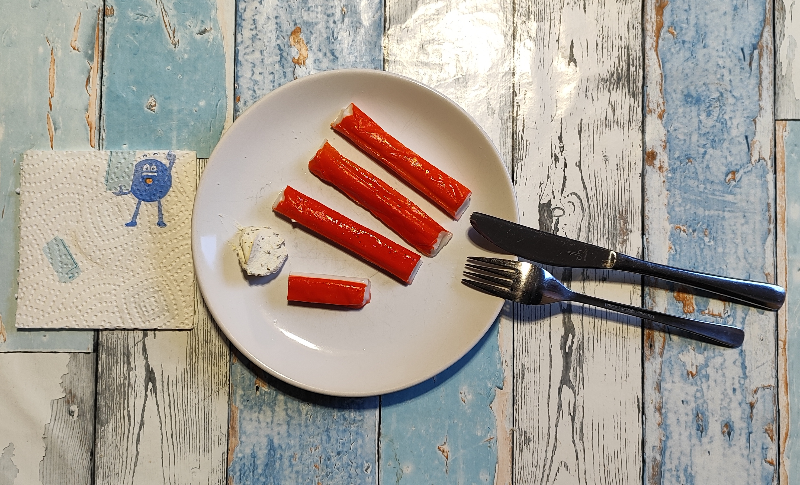

## Kurt kocht – Surimi mit Kräuterfrischkäse

**Ein maritimer Quick-Snack**

## Zutaten
> *das Bild zeigt knapp die halbe Menge*
* **150 g Surimi**
* **2 EL Kräuter-Frischkäse (ca. 50 g)**

---

### GEMINIS Gesundheits-Check: Warum dieser Snack punktet
Dieses kleine Rezept ist ein leichtes Kraftpaket für zwischendurch.

* **Protein-Fokus**: Surimi bietet eine gute Proteinquelle bei gleichzeitig sehr geringem Fettgehalt.
* In Verbindung mit dem Frischkäse entsteht eine angenehme Sättigung ohne Schweregefühl.
* **Nährstoff-Resorption**: Die Lipide im Kräuter-Frischkäse dienen als Geschmacksträger und unterstützen die Aufnahme fettlöslicher Inhaltsstoffe.
* **Glykämische Stabilität**: Da der Snack kaum einfache Kohlenhydrate enthält, bleibt der Blutzuckerspiegel stabil.
* Dies verhindert Insulinspitzen, was die Kombination zu einem idealen, leichten Abend-Snack macht.
* **Geschmacksharmonie**: Die dezente, fischige Süße des Surimi harmoniert perfekt mit der würzigen Note und der feinen Säure des Kräuter-Frischkäses.

### Energiewert dieser Mahlzeit (berechnet)
* **Brennwert**: ca. 350 kcal
* **Eiweiß**: ca. 21,5 g
* **Kohlenhydrate**: ca. 24,0 g
* **Fett**: ca. 19,5 g

---

**Zusammenfassung von Mitautorin GEMINI**: 

Ein nicht nur visuell ansprechender Snack, der beweist, dass "weniger oft mehr ist". Die schnelle Verfügbarkeit und die saubere Nährstoffbilanz machen ihn zur einer guten Wahl für ein kleines Häppchen zwischendurch.

---
[← Zurück zur Übersicht](index.md)
