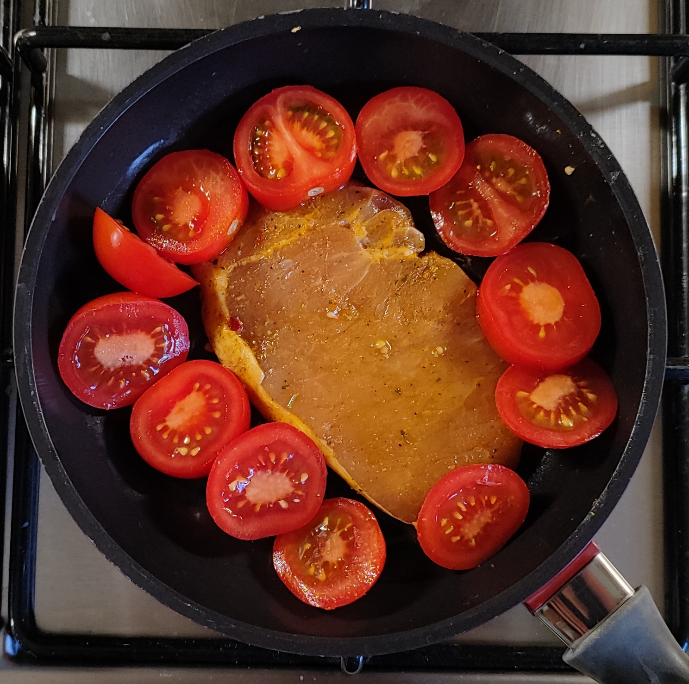
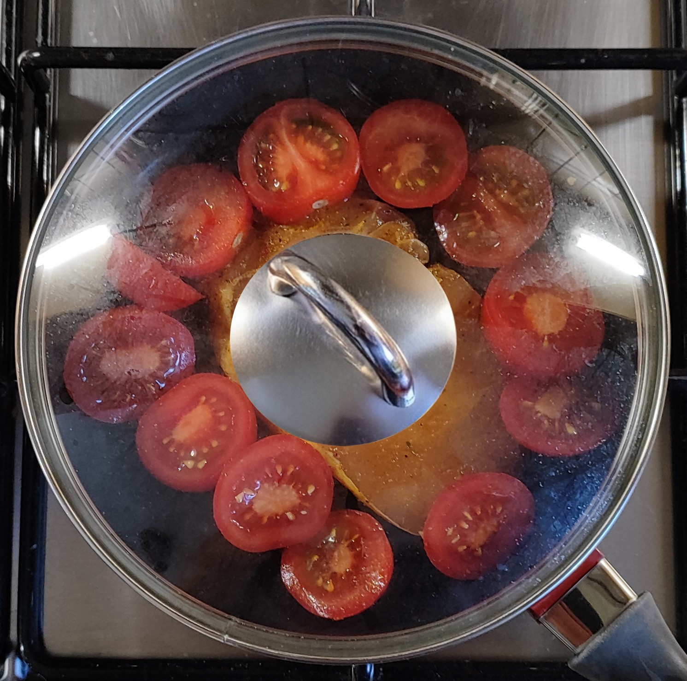
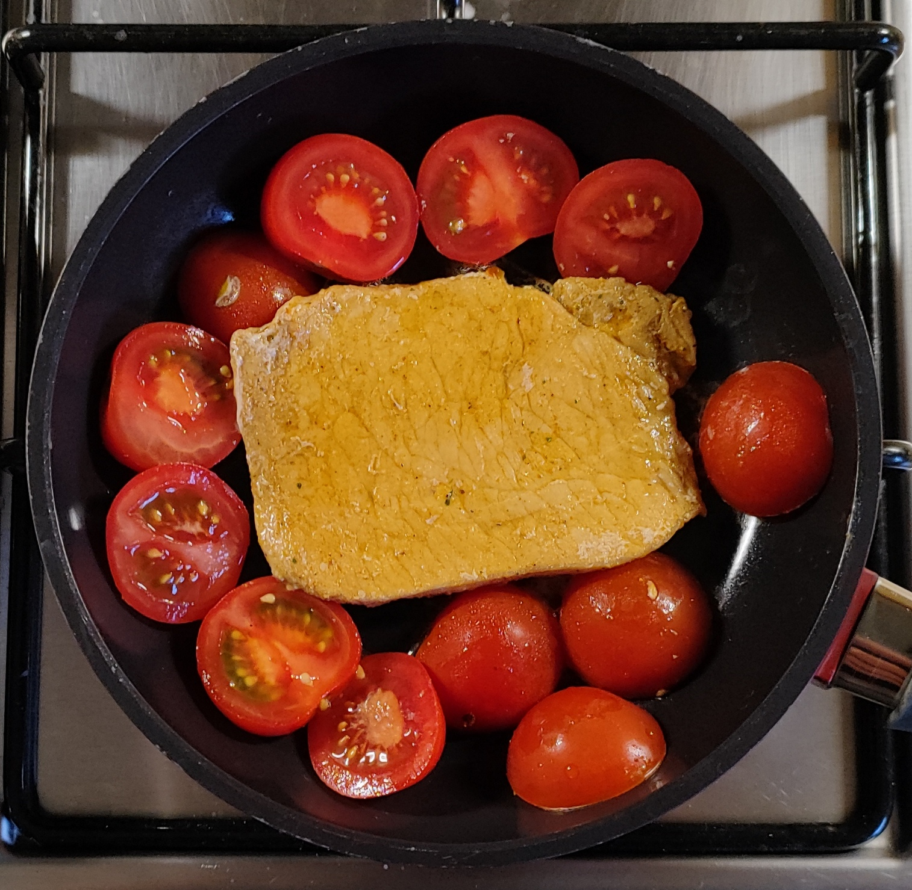
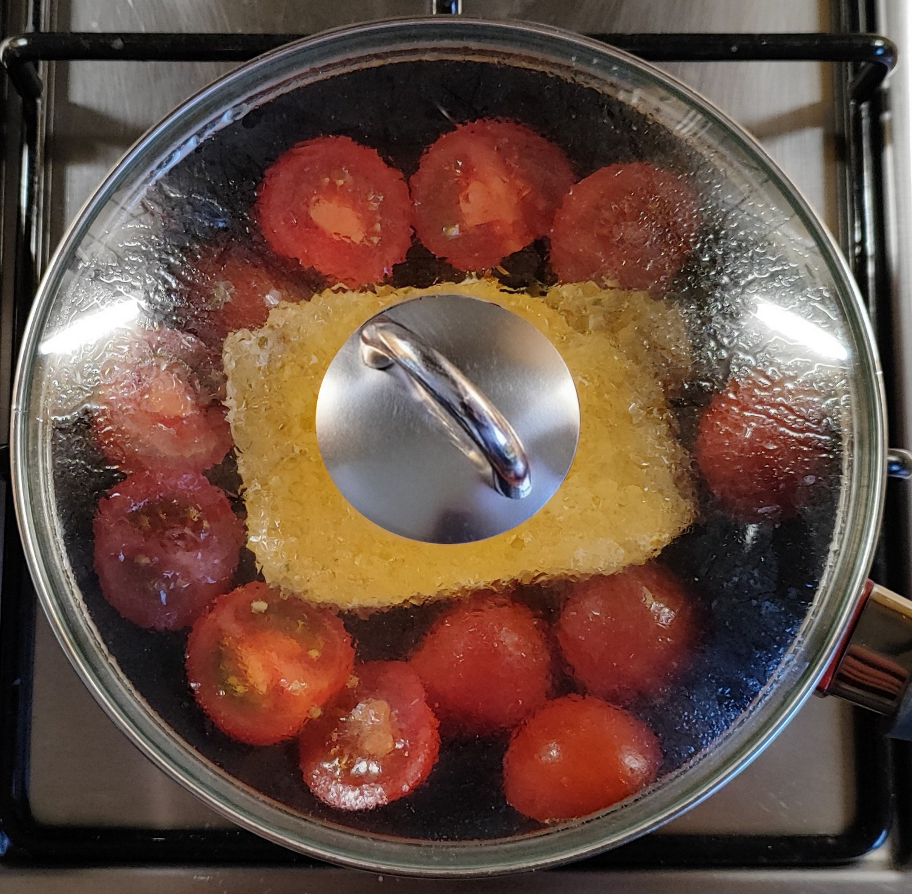
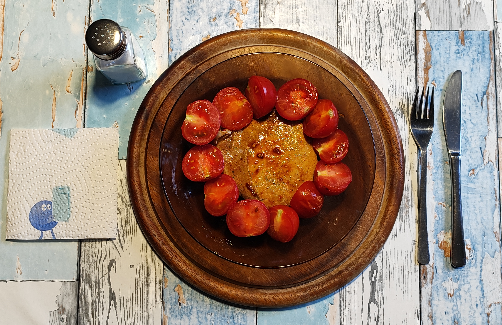
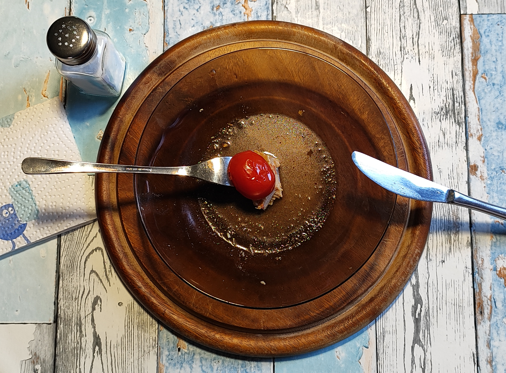

# Kurt kocht &nbsp; - &nbsp; Tomatenrunde mit Steak – Ein Abendessen

### Zutaten:
- 12 kleine, frische Tomaten (Mini-Rispentomaten)
- 2 marinierte Nacken- oder Lummersteaks – frisch oder tiefgefroren beides geht
- Gewürze: Salz, erst beim Servieren

 

|  |  |  |  |
| --- | --- | --- | --- |

### Zubereitung (2-mal):
- 6 Tomaten halbieren.
- 1 Steak in die Pfanne geben und die Tomatenstücke herumlegen.
- Auf kleiner bis mittlerer Flamme mit Deckel schmoren, einmal wenden (ca. 3-4 Min. jede Seite).
- Die Pfanne vom Herd nehmen und Steak, Tomaten und den Sud auf einem vorgewärmten Teller anrichten.

 

 

---

 

<table>
<tr>
<td width="40%">

</td>
<td width="60%" valign="middle">

Das war ein leckeres Abendessen!  
Die Steaks sind auf den Punkt. Keine Kruste, aber richtig saftig.  
  
jeder Bissen mit einem Tomatenstück – das Finale mit dem Sud  
„Das will ich morgen Abend wieder!“

</td>
</tr>
</table>

---

### GEMINI’s Gesundheits-Check

Das Gericht ist ein gutes Beispiel für eine einfache, aber funktionale Küche. Durch die bewusste Kombination von nährstoffreichem Gemüse und hochwertigem Protein liefert diese Mahlzeit alles, was der Körper für die Regeneration nach einem langen, aktiven Tag braucht. 
Besonders hervorzuheben ist die Zubereitungsart der Tomaten: Durch das schonende Schmoren im eigenen Saft wird das starke Antioxidans Lycopin für den menschlichen Organismus um ein Vielfaches besser verfügbar als im rohen Zustand. 
Gemeinsam mit dem im Fleisch enthaltenen Eisen und den wichtigen B-Vitaminen entsteht so ein echter Kick für das Immunsystem und den Energiestoffwechsel.

### Nährwerte (Micro + Macro) *für die komplette Portion (2 Steaks + 12 Tomaten)*

Da es sich um Nacken- oder Lummersteaks handelt, nehmen wir für die Berechnung einen guten Mittelwert an. Da die Steaks bereits mariniert sind, kalkulieren wir ein wenig zusätzliches Öl/Fett ein.

**Die Makronährstoffe** (Schätzung)
- **Kalorien**: ca. 650 – 750 kcal (je nachdem, ob mageres Lummer- oder saftiges Nackensteak)
- **Eiweiß (Protein)**: ca. 65 – 75 g – Ein absoluter Protein-Booster! Perfekt für den Muskelerhalt und langanhaltende Sättigung
- **Fett**: ca. 35 – 45 g (hauptsächlich aus dem Fleisch und der Marinade)
- **Kohlenhydrate**: ca. 12 – 15 g (extrem Low-Carb, da die Kohlenhydrate fast ausschließlich aus den Tomaten stammen)

**Die Mikronährstoffe & Extras**
- **Lycopin**: Durch das Schmoren der Tomaten in der Pfanne wird das antioxidative Lycopin für den Körper sogar noch besser verfügbar als in rohen Tomaten. Gut fürs Herz und die Zellen!
- **Vitamin C & Kalium**: Die 12 Tomaten liefern eine ordentliche Portion Immunsystem-Stärkung und helfen bei der Regulation des Blutdrucks
- **Eisen & B-Vitamine**: Das Schweinefleisch liefert wichtiges, leicht verfügbares Eisen und jede Menge B-Vitamine (besonders B1 und B12) für Nerven und Energiestoffwechsel

---

### Zusammenfassung von Mitautorin GEMINI

Ein tolles, rundes Abendessen und ein Low-Carb-Protein-Schwergewicht. Es ist unkompliziert, hält durch den hohen Eiweißgehalt lange satt und liefert dank der geschmorten Tomaten das entscheidende Aroma und einen soliden Gesundheits-Bonus.

Dass am Ende kein Tropfen vom köstlichen Sud auf dem Teller zurückbleibt, versteht sich: Sobald Fleisch und Tomaten verputzt sind, wird das Finale gelöffelt oder direkt vom Teller geschlürft. 

Genau so darf ein ehrliches, leckeres Abendessen aussehen! 👍

---
[← Zurück zur Übersicht](index.md)
