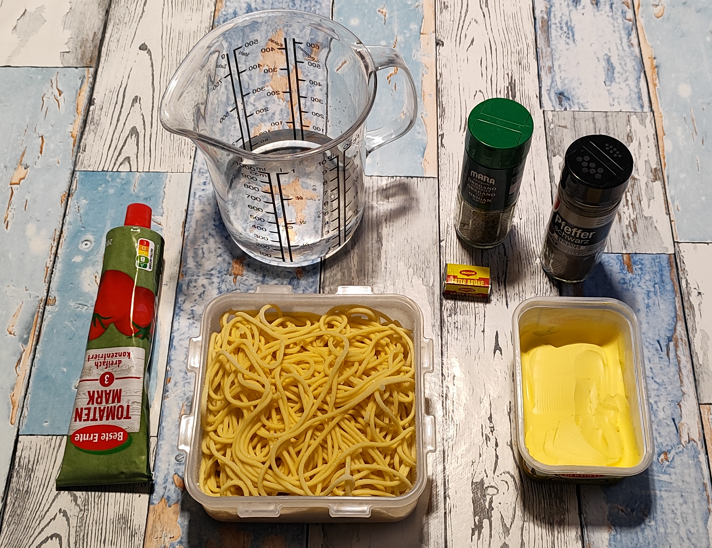
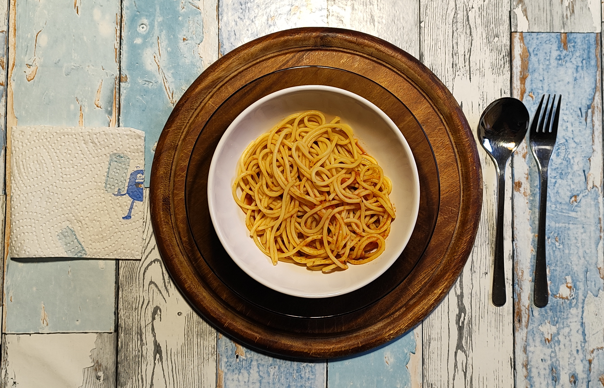

# Kurt hat gekocht &nbsp; – &nbsp; Blitz-Pasta mit Tomate
*Diese Blitz-Pasta ist nicht schneller auf dem Tisch als Instant Nudeln oder eine Dose Ravioli. Aber du weißt, was drin ist.*

### Zutaten für 2 Personen

- **125 g Spaghetti** (Trockengewicht - 1/4 Packung) 
- **1 Esslöffel Tomatenmark** (gehäuft) 
- **Wasser 250 ml** (1/4 Liter) 
- **½ Brühwürfel** (im Bild liegt ein ganzer) 
- **Margarine oder Butter** (ca. 20 g) *ich bevorzuge Margarine*
- **Gewürze:** Schwarzer Pfeffer und Oregano

---

### Zubereitungszeit 
- Weniger als 10 Minuten 

---

### Zubereitung

#### Langfristvorbereitung
- Pasta-Vorrat: Eine Packung Spaghetti (500 g) in Salzwasser kochen, abgießen, kalt abschrecken und in 4 Portionen aufgeteilt einfrieren.  
- Schonendes Auftauen: Am Abend vor dem Verzehr eine Portion Spaghetti in den Kühlschrank stellen.

[*Pasta vorkochen und einfrieren, geht das?*](32-nudeln-vorkochen.md)

#### Zubereitung am Verzehrtag

- Das Wasser mit dem Brühwürfel aufsetzen. 
- Das Tomatenmark untermischen. 
- Mit schwarzem Pfeffer und ein wenig Oregano würzen. 
- Gut vermischen und zum Sieden bringen. 
- Die Margarine (oder die Butter) hinzugeben. 
- Wenn die Margarine geschmolzen ist, die Spaghetti einbringen und vorsichtig verrühren. 
- Bei noch tiefgefrorenen Spaghetti (siehe Zutatenbild: da sind sie noch tiefgefroren) den ganzen Block in die Sauce legen. Einige Male wenden, bis alle Nudeln aufgetaut und erwärmt sind. 
- Den Topf vom Feuer nehmen und servieren. 

#### *Hinweis zum Salz: Das Gericht ist durch den halben Brühwürfel bereits gut gewürzt. Für eine salzärmere Variante weniger Brühwürfel verwenden, stattdessen mit mehr Kräutern würzen.*

---

### GEMINI's Gesundheitscheck: Warum dieses Gericht punktet
- Keine versteckten Zusatzstoffe: Im Vergleich zu fertigen Tütensaucen oder Glaskonserven, die oft Zusatzstoffe, Geschmacksverstärker, Konservierungsstoffe und oft überraschend viel zugesetzten Zucker enthalten, erlaubt dieses Gericht die volle 
Kontrolle über die Zutaten.  
- Reines, konzentriertes Lycopin: Hochwertiges Tomatenmark liefert eine besonders hohe Dosis des wertvollen Antioxidans Lycopin ganz ohne Füllstoffe. Das Fett (Margarine oder Butter) sorgt dafür, dass der Körper diesen Zellschutz optimal aufnehmen kann. 
- Gleicher Speed, bessere Qualität: Das Gericht ist genauso schnell fertig wie eine Tütensoße, kommt aber mit einer transparenten, natürlichen Zutatenliste aus und lässt sich bei Natrium/Salz durch die Dosierung des Brühwürfels individuell steuern.  
- Nachhaltige Energie: Die Spaghetti liefern komplexe Kohlenhydrate für langanhaltende Sättigung.  

---

### Smarte Küchen-Hacks: Warum das Rezept so unkonventionell anders ist
- Vorgekochter Pasta-Vorrat: Das Vorkochen und Einfrieren der Nudeln spart unter der Woche wertvolle Zeit.  
- One-Pot-Effekt: Die aufgetaute oder die noch gefrorene Pasta wird direkt in der köchelnden Würzsauce erwärmt, nimmt dabei ihre Aromen auf.  

---

### Kurt's Praxis-Check: So schmeckt es dann
Die Sauce ist dünnflüssig, hat aber einen vollen Geschmack mit einer leichten Oreganonote.  
1) *Wenn sie über Nacht aufgetaut sind* - Die Spaghetti haben ihren vollen Biss behalten und ein wenig von der Sauce angenommen.  
2) *Wenn sie noch tiefgefroren waren* - Die Spaghetti haben ein wenig Sauce aufgenommen, aber noch einen erkennbaren Biss behalten.
  
Reste der Tomaten-Sauce schlürfe ich gerne zum Schluss.  

*Anmerkung – Margarine oder Butter: Mir schmeckt Margarine in Saucen besser.*

---

### GEMINI’s Nährwert- & Mikronährstoff-Tabelle

**Hauptnährwerte für das Gesamtgericht:**
*Berechnet für die im Rezept angegebenen Gesamtmengen:*

<table style="width: 800px; border-collapse: collapse; font-family: sans-serif;">
  <thead>
    <tr style="border-bottom: 2px solid #000;">
      <th style="width: 400px; text-align: left; padding: 8px; border: 1px solid #000; font-weight: bold;">Nährwert</th>
      <th style="width: 400px; text-align: left; padding: 8px; border: 1px solid #000; font-weight: bold;">Gesamtgericht</th>
    </tr>
  </thead>
  <tbody>
    <tr>
      <td style="padding: 8px; border: 1px solid #000; font-weight: bold;">Kalorien</td>
      <td style="padding: 8px; border: 1px solid #000;">ca. 615 kcal</td>
    </tr>
    <tr>
      <td style="padding: 8px; border: 1px solid #000; font-weight: bold;">Kohlenhydrate</td>
      <td style="padding: 8px; border: 1px solid #000;">ca. 95 g</td>
    </tr>
    <tr>
      <td style="padding: 8px; border: 1px solid #000; font-weight: bold;">Eiweiß (Protein)</td>
      <td style="padding: 8px; border: 1px solid #000;">ca. 17 g</td>
    </tr>
    <tr>
      <td style="padding: 8px; border: 1px solid #000; font-weight: bold;">Fett</td>
      <td style="padding: 8px; border: 1px solid #000;">ca. 18,7 g</td>
    </tr>
  </tbody>
</table>

**Wichtige Mikronährstoffe & Highlights:**

<table style="width: 800px; border-collapse: collapse; font-family: sans-serif;">
  <thead>
    <tr style="border-bottom: 2px solid #000;">
      <th style="width: 250px; text-align: left; padding: 8px; border: 1px solid #000; font-weight: bold;">Nährstoff / Inhaltsstoff</th>
      <th style="text-align: left; padding: 8px; border: 1px solid #000; font-weight: bold;">Wirkung &amp; Herkunft</th>
    </tr>
  </thead>
  <tbody>
    <tr>
      <td style="padding: 8px; border: 1px solid #000; font-weight: bold;">Lycopin &amp; Beta-Carotin</td>
      <td style="padding: 8px; border: 1px solid #000;">Starker Zellschutz aus dem Tomatenmark</td>
    </tr>
    <tr>
      <td style="padding: 8px; border: 1px solid #000; font-weight: bold;">B-Vitamine &amp; Eisen</td>
      <td style="padding: 8px; border: 1px solid #000;">Aus den Hartweizen-Spaghetti für Energiestoffwechsel und Blutbildung</td>
    </tr>
    <tr>
      <td style="padding: 8px; border: 1px solid #000; font-weight: bold;">Natrium &amp; Mineralstoffe</td>
      <td style="padding: 8px; border: 1px solid #000;">Aus der Brühgrundlage.</td>
    </tr>
    <tr>
      <td style="padding: 8px; border: 1px solid #000; font-weight: bold;">Kalium aus Tomatenmark</td>
      <td style="padding: 8px; border: 1px solid #000;">(positiv für Blutdruck)</td>
    </tr>
    <tr>
      <td style="padding: 8px; border: 1px solid #000; font-weight: bold;">Mangan &amp; Selen</td>
      <td style="padding: 8px; border: 1px solid #000;">aus Hartweizen</td>
    </tr>
    <tr>
      <td style="padding: 8px; border: 1px solid #000; font-weight: bold;">Vitamin K aus Oregano</td>
      <td style="padding: 8px; border: 1px solid #000;">(kleine Menge, aber erwähnenswert)</td>
    </tr>
  </tbody>
</table>

---

### Zusammenfassung von Mitautorin GEMINI
Kurts „Blitz-Pasta mit Tomate“ ist ein gelungenes Beispiel für ein effizientes, geldbeutelschonendes und schmackhaftes Notfall-Gericht.  
Dank intelligenter Vorratshaltung (Meal-Prep im Tiefkühlfach) steht in unter 10 Minuten eine warme, herzhafte Mahlzeit auf dem Tisch. 

---

[← Zurück zur Übersicht](index.md)
