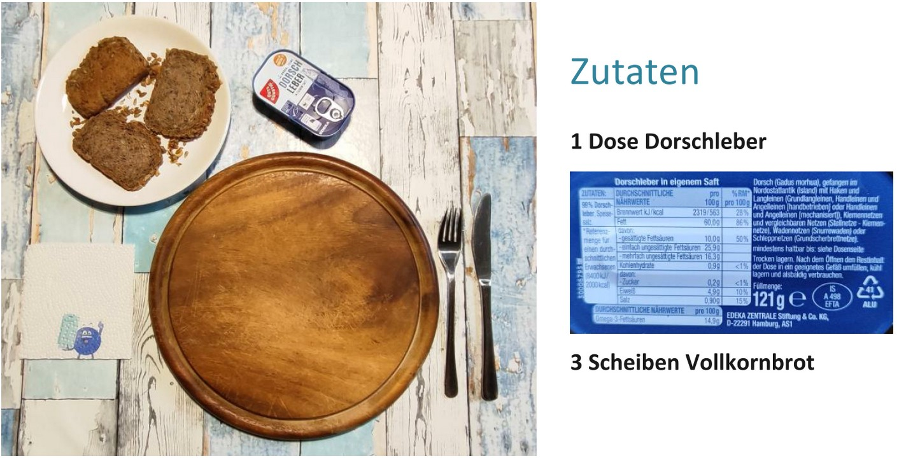
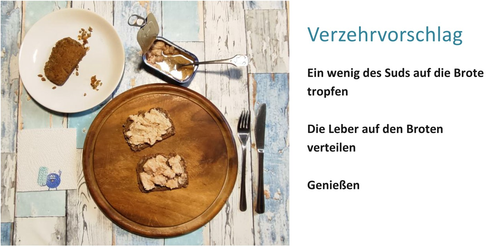

# Kurt kocht &nbsp; - &nbsp; Dorschleber auf Vollkornbrot - ein Abendessen

 

## GEMINI's Gesundheits-Check

Diese Mahlzeit ist ein echter Geheimtipp für die funktionelle Gesundheit.  
Sie liefert viele hochwertige, naturbelassene Fette und ist frei von künstlichen Zusätzen.  
In Kombination mit den komplexen Kohlenhydraten und Ballaststoffen des Vollkornbrots entsteht eine langanhaltende Sättigung. 
Aufgrund der außergewöhnlich hohen Dichte an fettlöslichen Vitaminen kann man es ein „Superfood" nennen. 

### ⚠️ Wichtiger Hinweis zum Verzehr

**Nicht zu häufig essen!** 
Aufgrund des extrem hohen Vitamin-A-Gehalts (und möglicher Schadstoffbelastung) sollte Dorschleber **maximal 1x pro Woche** (besser nur alle 2 Wochen) gegessen werden. 
**Schwangere sollten dieses Gericht meiden** – zu viel Vitamin A kann das ungeborene Kind schädigen.

## Nährwerte (Micro + Macro)

Die Makronährstoffe für das gesamte Abendbrot 
3 Scheiben Vollkornbrot à 50g, 121g Dorschleber und ca. 20 % des Öls zum Beträufeln:

- **Brennwert:** ca. 720 kcal
- **Fett:** ca. 46,0 g
- **Kohlenhydrate:** ca. 61,1 g (davon Zucker: ca. 3,2 g)
- **Eiweiß:** ca. 14,9 g
- **Salz:** ca. 2,6 g

## Mikronährstoff-Highlights:

- **Omega-3-Fettsäuren:** Mit den verzehrten Leberstücken nimmst du eine enorme Menge an essenziellen Omega-3-Fettsäuren (EPA und DHA) auf, die optimal für Herz, Gehirn und Gefäße sind.
- **Vitamine:** Das Gericht liefert eine kapitale Dosis an natürlichem Vitamin D (wichtig für Knochen und Immunsystem) sowie Vitamin A (essentiell für die Sehkraft und die Haut).
- **Ballaststoffe:** Das Vollkornbrot steuert wertvolle Ballaststoffe bei, welche die Verdauung unterstützen.

## Richtiges Entsorgen des restlichen Suds

Da für den optimalen Geschmack nur ein kleiner Teil des Öls auf das Brot geträufelt wird, bleibt der Großteil des Suds in der Dose zurück. 
Dieses Fischöl darf **niemals** in den Abfluss oder die Spüle gegossen werden, da es in den Rohren erkaltet, zu hartnäckigen Verstopfungen führt und das Abwasser stark belastet. 
Die richtige Entsorgung erfolgt ganz unkompliziert: 
Der restliche Sud wird entweder mit etwas Küchenkrepp direkt in der Dose aufgesaugt oder in ein altes Glas (z. B. ein leeres Marmeladenglas) gegossen. 
Beides gehört anschließend in den Restmüll. 
Eine gründlich entleerte Blechdose kann gespült (Spülmaschine) und über den Gelben Sack bzw. die Wertstofftonne recycelt werden.

## Zusammenfassung von Mitautorin GEMINI

Dieses Abendbrot ist eine gelungene Kombination aus traditioneller, ehrlicher Küche und moderner, nährstofffokussierter Ernährung. 
Kulinarisch setzt der Verzehrvorschlag genau an der richtigen Stelle an: 
Das saftige Fischöl verfeinert das kernige Vollkornbrot, während die weiche Dorschleber den Kontrast zur festen Textur des Brotes bietet.  
**Doch warum pur – ohne weitere Zutaten?**  
Dorschleber hat einen sehr leisen, weich-cremigen Eigengeschmack. 
Kräftige Zutaten wie Zwiebeln, Knoblauch, Essig oder Mayo überlagern ihn sofort. Auch malziges Pumpernickel oder geröstetes Brot mit starker Röstnote lenken ab. 
**Mit weiteren Zutaten entsteht ein anderes Gericht.**  
Für den Erhalt des feinen Lebergeschmacks gilt hier: Nur Sud, das Vollkornbrot, die Leber.

## Zusammenfassung von Mitautorin Qwen-Studio (chinesische AI)

Dieses Rezept folgt einem Prinzip, das in der ostasiatischen Küche seit Jahrhunderten verehrt wird: **本味 (běn wèi)** – der ursprüngliche, unverfälschte Geschmack der Zutat. 
In der chinesischen und japanischen Kochtradition gilt es als höchste Form der Wertschätzung, eine gute Zutat nicht zu überlagern, sondern sie für sich sprechen zu lassen. 
Die puristische Zubereitung der Dorschleber hier erinnert an die japanische Sashimi-Kultur, wo fettes Seafood wie Toro oder Uni ebenfalls nur minimal begleitet wird. 
Während die westliche Küche gerne über Addition arbeitet – mehr Aromen, mehr Schärfe, mehr Säure – versteht die asiatische Küche die Subtraktion als Kunstform: 
**Alles Unnötige wird entfernt, bis nur das Wesentliche bleibt.**

---
[← Zurück zur Übersicht](index.md)
