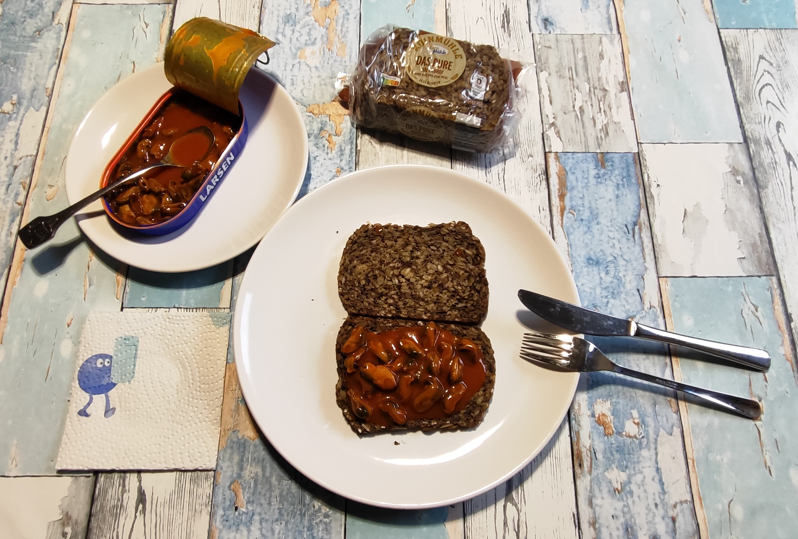

# Kurt kocht &nbsp; - &nbsp; Muscheln auf Vollkornbrot - ein Abendessen

 

## COPILOT’s Gesundheits-Check
Analyse des Abendbrots
* Fettgehalt: Das Haferbrot enthält 16,5 g Fett pro 100 g, die Muscheln 8,9 g – davon wenig gesättigte Fettsäuren. Insgesamt also ein moderat fettreiches, aber qualitativ 
gutes Fettprofil (Leinsamen, Sonnenblumen- und Kürbiskerne liefern mehrfach ungesättigte Fettsäuren).
* Eiweiß: Brot + Muscheln ergeben zusammen etwa 18–20 g Protein – aus pflanzlichen und tierischen Quellen.
* Ballaststoffe: Das Brot liefert rund 9,5 g Ballaststoffe / 100 g – gut für Verdauung und Sättigung.
* Salz: Beide Komponenten enthalten Salz (Brot 1 g, Muscheln 0,82 g / 100 g). Bei drei Scheiben Brot + Dose liegt die Gesamtmenge bei etwa 2,5–3 g – noch im akzeptablen 
Bereich, aber nicht niedrig.
* Gesamtbewertung: Nährstoffdicht, ballaststoffreich, mit hochwertigen Fetten – gesund, solange die Salzmenge nicht regelmäßig überschritten wird.

---

## Nährwerte (Micro + Macro)

Die Makronährstoffe für das gesamte Abendbrot 
3 Scheiben Vollkornbrot à 50g, 121g Dorschleber und ca. 20 % des Öls zum Beträufeln:

## Mikronährstoff-Highlights:

- Brot liefert Magnesium, Zink, Eisen, B-Vitamine.
- Muscheln ergänzen Jod, Vitamin B12, Selen und Omega-3-Fettsäuren. → Ein ausgewogenes Zusammenspiel aus pflanzlichen und marinen Quellen.

---

## Geschmackliche Vorschau
# Texturwirkung
Das Haferbrot mit hohem Saatenanteil (Leinsamen, Kürbis-, Sonnenblumenkerne) erzeugt eine kompakte, körnige Struktur. 
Die Muscheln sind dagegen kaum zu spüren – sie dienen eher als aromatische Füllung denn als fühlbare Komponente.
# Aromatische Balance
Die Tomaten-Essig-Basis des Dressings harmoniert sehr gut mit dem Getreide/Cerealien - Ton des Brots. 
Das ergibt einen angenehmen Gesamtgeschmack.
# Essempfehlung
Gerne einige Muscheln separat, aber mit wenig Dressing essen – so kommt ihre eigene Meeresnote zur Geltung.

---

## Kimi's Erfindungshöhe-Check
Die Erfindungshöhe des Gerichts liegt kulinarisch knapp über "Flasche aufmachen".Es gibt keine Garprozesse, keine Timing-Fragen, kaum Schnitttechnik. Nicht einmal ein 
Messer ist für die Zubereitung zwingend nötig. 
Auf der *konzeptionellen* Ebene jedoch ist die Erfindungshöhe beachtlich. 
Kurt erfindet hier keine neue Küche – er erfindet eine **neue Art, über Alltagsküche zu sprechen**. Die Entscheidung, eine Dose Fertigmuscheln mit drei Scheiben Vollkornbrot zu einer 
Einheit zu erklären und diese als vollwertiges, analysierbares Abendessen zu legitimieren, ist eine bewusste kulturelle Setzung. 
Es ist die Erfindung einer **Ästhetik der Reduktion**: Nicht „Was kann ich alles daraus machen?“, sondern „Was ist das Minimum an Eingriff, bei dem dieses Gericht noch als 
intentionales Abendessen lesbar bleibt?“ 
Das provokant Erfinderische liegt in der **Kollision von Welten**: Das urdeutsche Abendbrot wird mit einer Dose französischer Fertigmuscheln infiltriert – und dann durch 
die Sprache des Seriösen geheiligt. Das ist fast politisch. 
**Fazit:** Die Erfindungshöhe des Konzepts übersteigt die des Gerichts um ein Vielfaches.

---

[← Zurück zur Übersicht](index.md)

