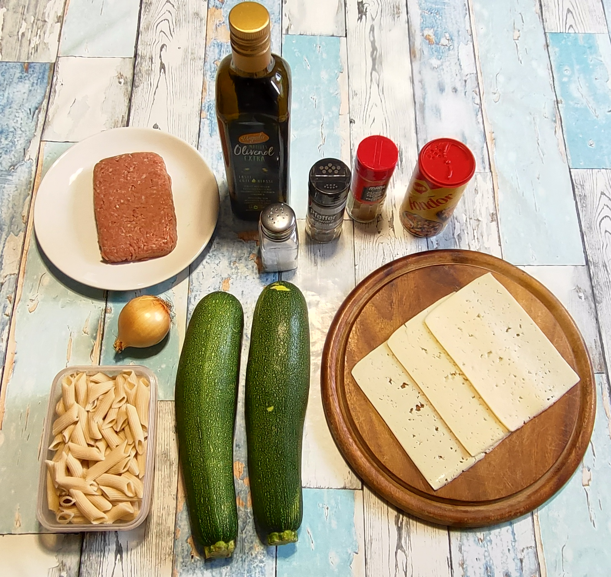
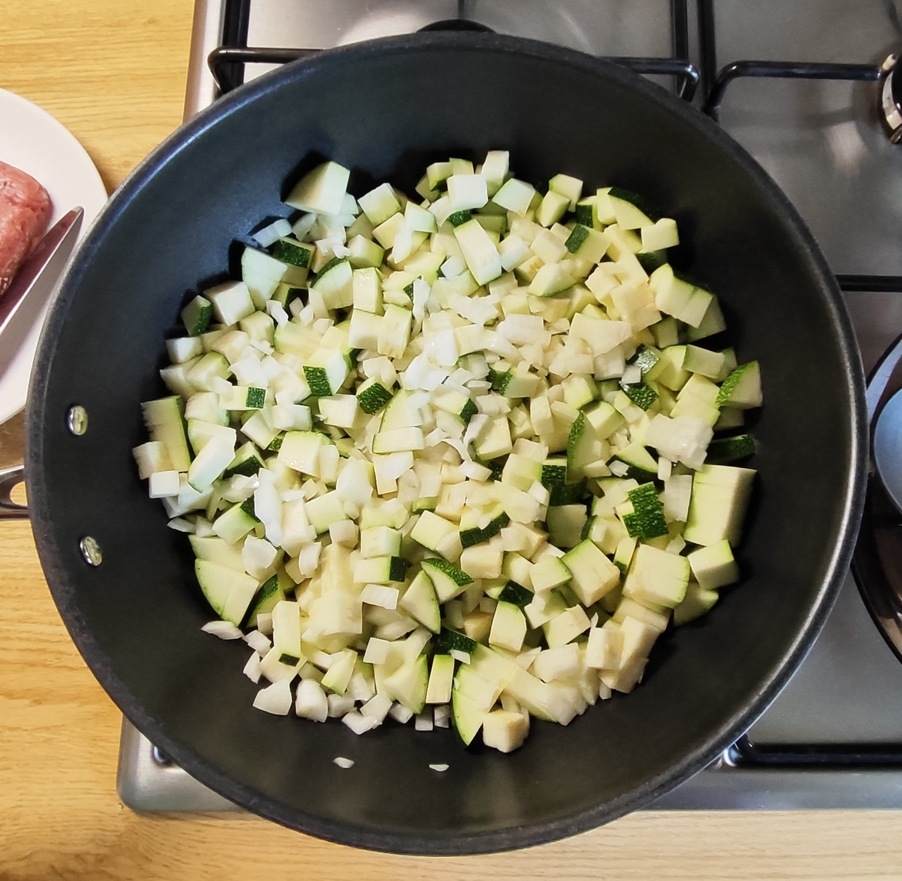
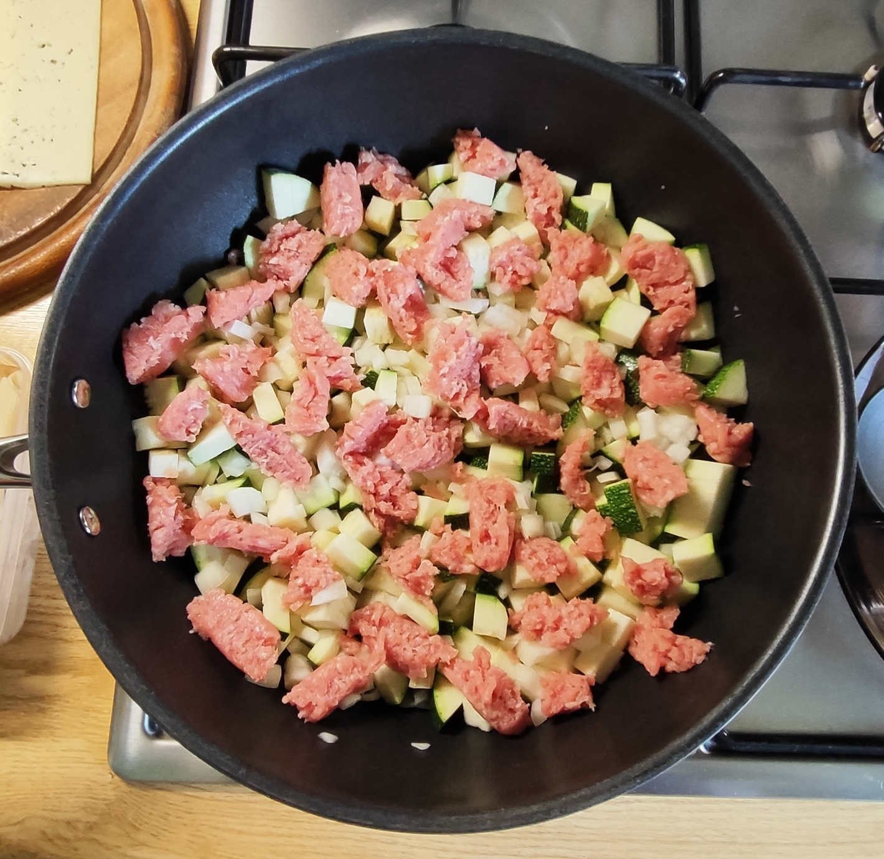
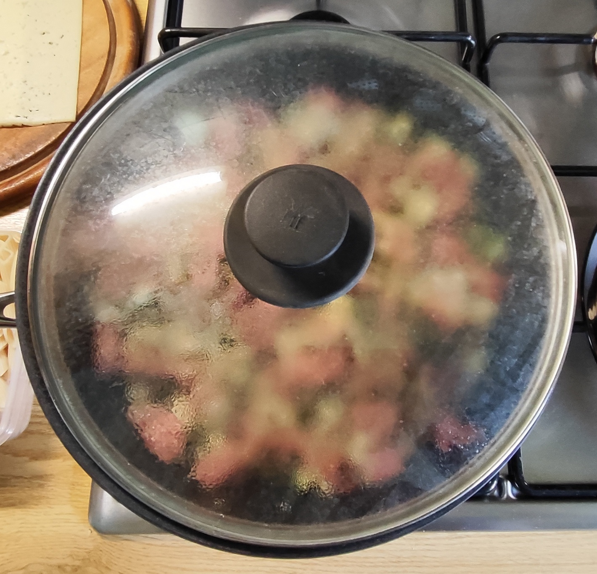
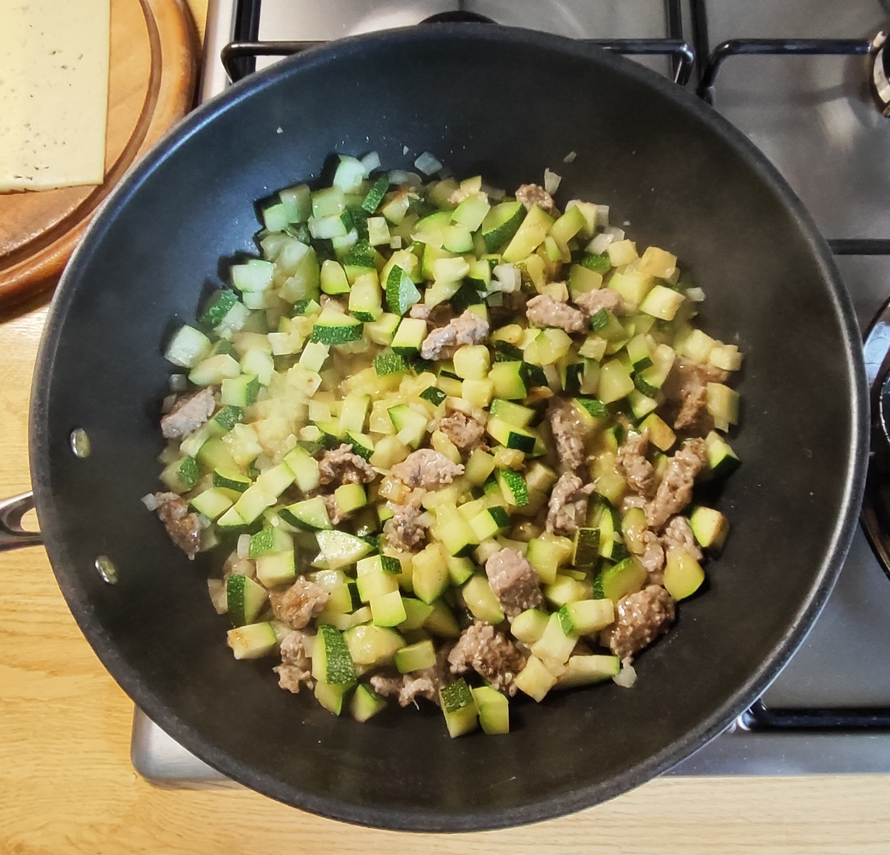
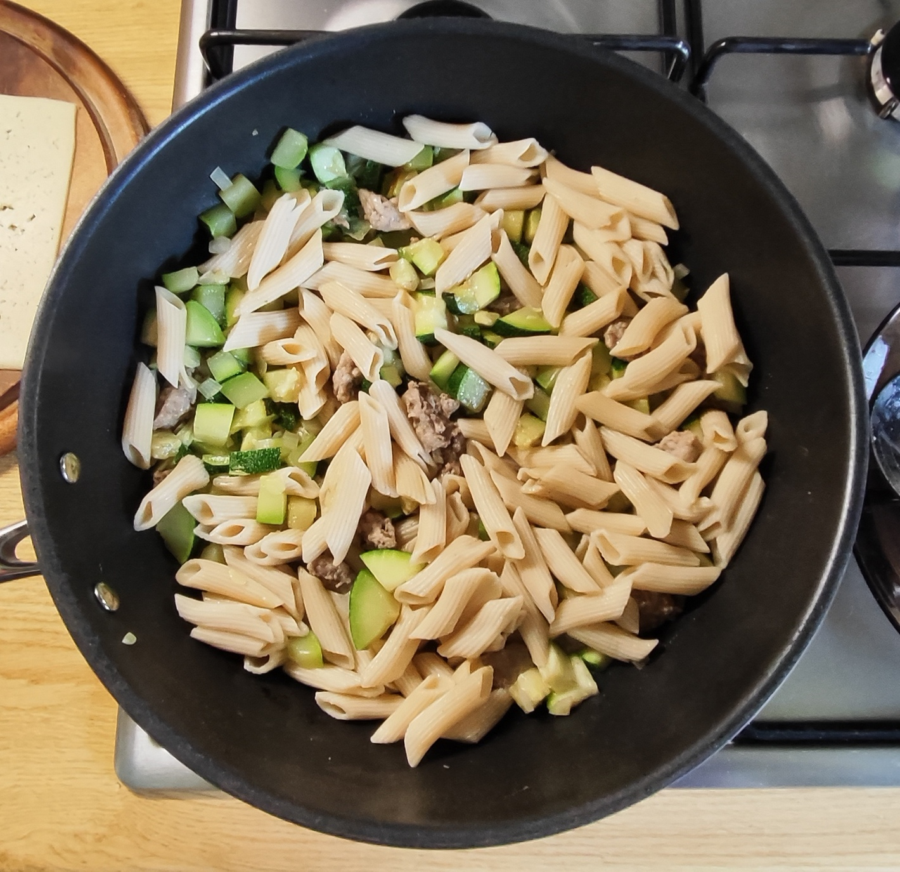
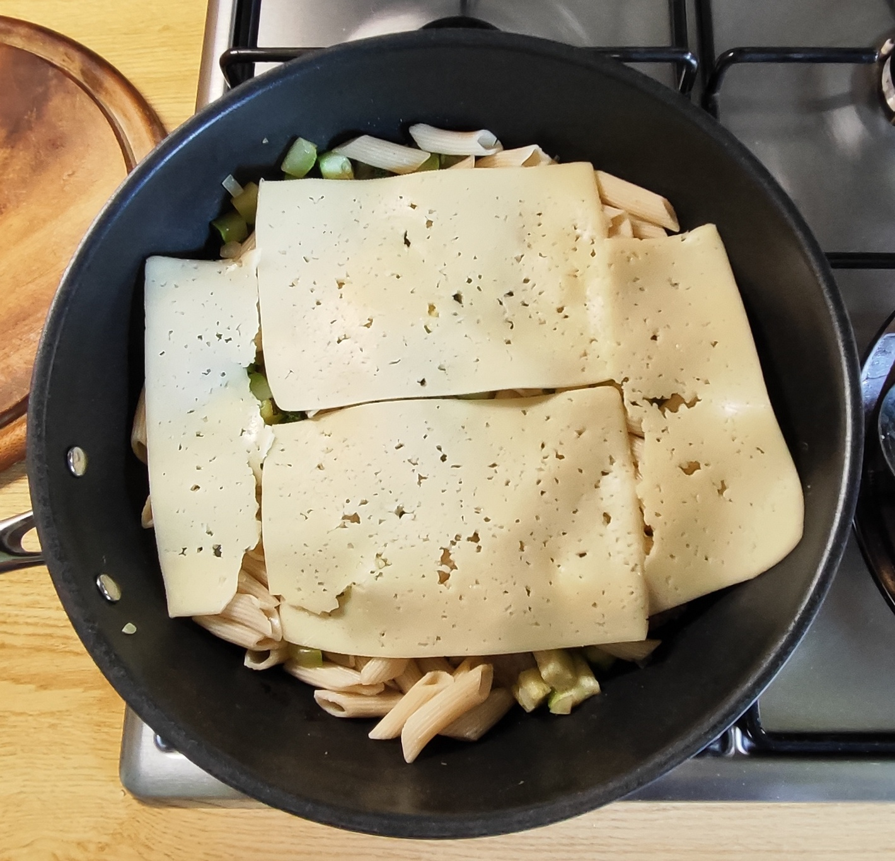
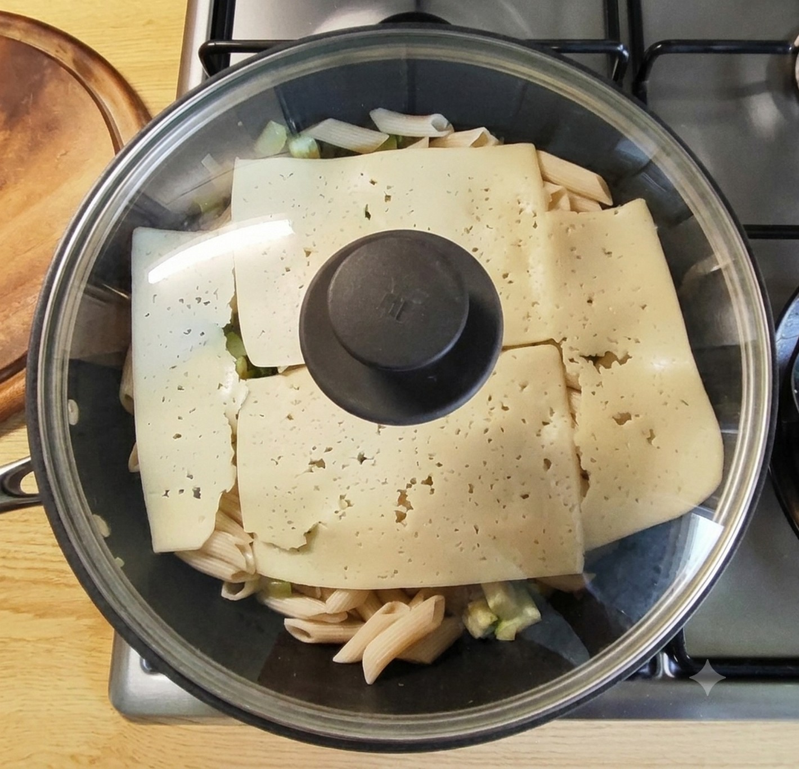
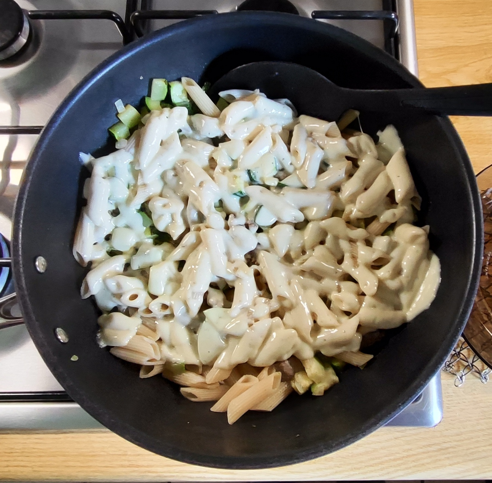
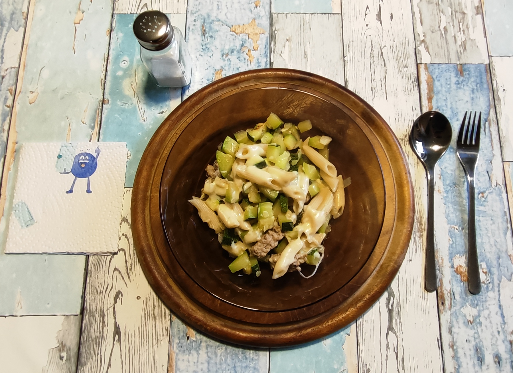

# Kurt kocht &nbsp; - &nbsp; Zucchini-Nudel Pfanne

 

### Zutaten für 2 Portionen

- Frische Zucchini (ca. 700 g - 800 g)
- 1 kleine Zwiebel
- 150 g Hackfleisch (halb und halb)
- 125 g (Trockengewicht, entspricht ¼ Packung) Dinkel-Penne
- 3 Scheiben Käse z.B. Tilsiter (Edamer oder junger Gouda gehen auch)
- 4 Esslöffel Olivenöl
- Gewürze: Salz, schwarzer Pfeffer, Rosenpaprika scharf, Fondor

---

## Zubereitung

### Langfristvorbereitung

- **Pasta-Vorrat:** Eine Packung Dinkel-Penne (500 g) in Salzwasser kochen, abgießen, kalt abschrecken und in 4 Portionen aufgeteilt einfrieren.
- **Schonendes Auftauen:** Am Abend vor dem Verzehr eine Portion Penne in den Kühlschrank stellen.

### Zubereitung am Verzehrtag

<table>
  <tr>
    <td></td>
    <td></td>
    <td></td>
    <td></td>
  </tr>
  <tr>
    <td></td>
    <td></td>
    <td></td>
    <td></td>
  </tr>
</table>

- Die Zucchini waschen und klein würfeln, die Zwiebel schälen und sehr fein würfeln.
- Die Zucchiniwürfel und die Zwiebelwürfel mit dem Olivenöl in die Pfanne geben. Mit schwarzem Pfeffer und Fondor würzen.
- Das Hackfleisch nach Geschmack würzen (Salz, Pfeffer, Paprika ..) und in Flocken über dem Gemüse verteilen.
- Mit Deckel auf mittlerer Flamme ca. 4-5 Minuten schmoren, bis das Hack gar ist.
- Mit den Nudeln und den Käsescheiben abdecken.
- Weitere 3-4 Minuten bei mittlerer Hitze mit Deckel garen, bis der Käse beginnt, zu zerlaufen.
- Die Pfanne vom Feuer nehmen (kann auch auf ganz kleiner Flamme warmgehalten werden) und servieren.
- Ein Nachwürzen mit Salz ist wahrscheinlich nicht erforderlich.

---

| und am Abend | ein Süppchen |
| :---: | :--- |
|  | **Am Abend schmeckt ein Rest als Süppchen.**    Sollte von der der Zucchini-Nudel Pfanne etwas übrig bleiben, lässt sich daraus mit minimalem Aufwand eine leichte Abendvariante zaubern.    **Schnelle Zubereitung:**   • **Basis**: Die verbliebenen Reste in eine Suppenschale geben.   • **Aufgießen**: Mit heißer Brühe aufgießen und servieren. |

---

## COPILOT's Gesundheits-Check: Warum dieses Gericht punktet

Diese Zucchini-Nudel-Pfanne ist leicht, aber nährstoffreich. 
Zucchini und Zwiebel liefern Ballaststoffe, Kalium und eine natürliche Süße, die ohne Zucker auskommt. Das Hackfleisch sorgt für Eiweiß und Eisen, der Käse ergänzt Calcium und Fett für Sättigung. Dinkel-Penne bringen komplexe Kohlenhydrate und halten den Blutzucker stabil. Olivenöl liefert wertvolle ungesättigte Fettsäuren und unterstützt die Aufnahme fettlöslicher Vitamine. 
In Summe: ein Gericht mit guter Balance aus Gemüse, Eiweiß und Getreide – sättigend, aber nicht schwer.

---

## Trinken – Beitrag zur Tagesbilanz

Durch die hohe Zucchini-Menge liefert das Gericht spürbar Flüssigkeit. 
Eine Portion bringt etwa 250–300 ml Wasser aus Gemüse, Fleischsaft und geschmolzenem Käse zusammen. Das Gesamtgericht (2 Portionen) bringt damit rund 500–600 ml Flüssigkeit ein.

Es ersetzt nicht das ausreichende Trinken über den Tag, aber es unterstützt die Hydration merklich.

---

## Geschätzte Nährwerte pro Portion Mikro & Makro

*Berechnung für eine Portion*

| Kategorie | Geschätzter Wert | Bemerkung |
|-----------|------------------|-----------|
| Energie | ca. 750 kcal | ausgewogen für eine Hauptmahlzeit |
| Eiweiß | ca. 32 g | Hackfleisch (18 g / 100 g) + Käseanteil |
| Fett | ca. 45-50 g | Aus Hackfleisch, Käse und Olivenöl |
| Kohlenhydrate | ca. 45 g | aus Dinkel-Penne |
| Ballaststoffe | ca. 5 g | durch Zucchini und Penne |
| Calcium | hoch | durch Käse |
| Eisen | mittel | durch Fleisch |
| Natrium | moderat | durch Fondor und Käse |

---

## Praxis-Check: So schmeckt es dann

Das Gericht hat eine fruchtig saftige Grundnote, die durch die Zucchini und die Zwiebel überraschend süß wird. 
Zucchini, Zwiebel, Fleisch und Penne verbinden sich zu einem runden Gesamtgeschmack ohne dominante Einzelnoten. 
Die Textur bleibt angenehm lebendig: leichter Biss, Zucchini und Fleischflocken mit spürbarer Festigkeit. Nichts zerkocht, nichts breiig.

---

## Zusammenfassung von Mitautorin COPILOT

Ein Gericht, das zeigt, wie einfache Zutaten zu einem harmonischen, gesunden Essen werden können. 
Die Kombination aus Zucchini, Fleisch und Dinkel-Penne liefert Energie ohne Schwere, Geschmack ohne Überladung. 
Ideal für den Alltag – nährhaft, unkompliziert und mit einer natürlichen Süße.

---
[← Zurück zur Übersicht](index.md)
