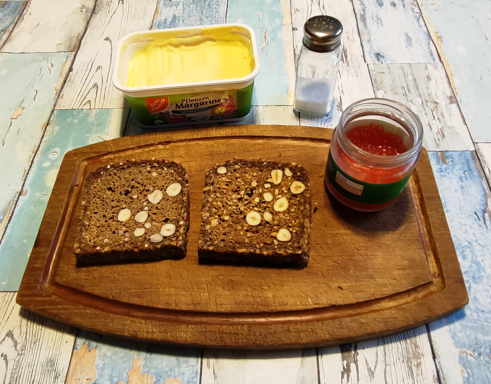
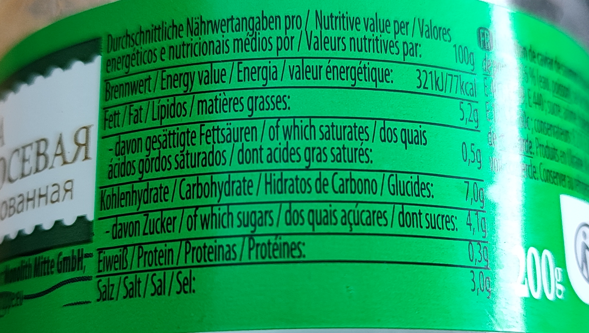
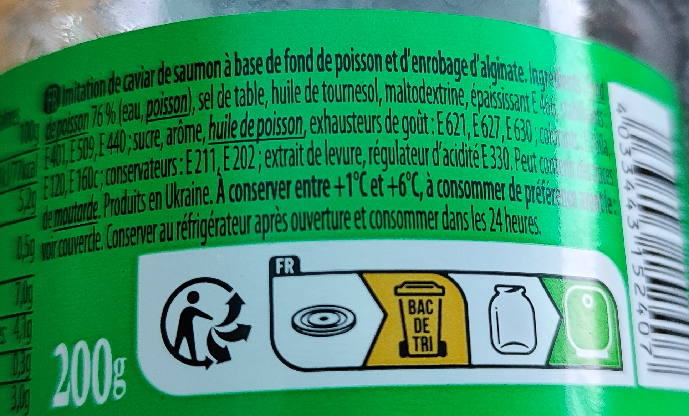
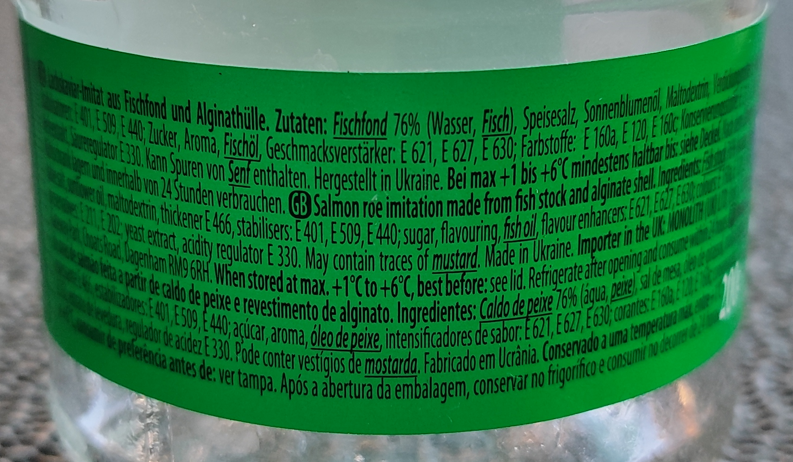
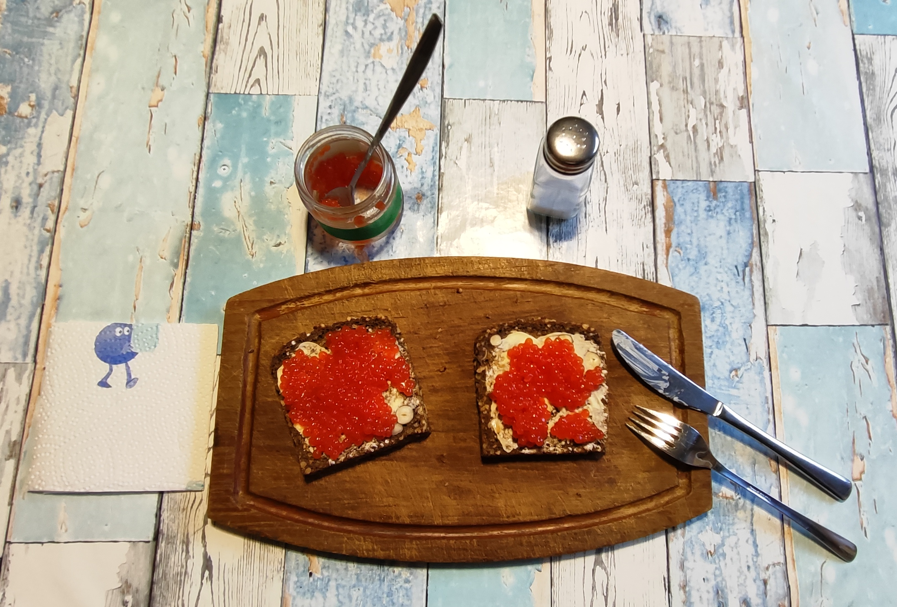

# Kurt kocht &nbsp; - &nbsp; Lachskaviar auf Vollkornbrot - Ein Abendessen

 

## Zutaten:
-	2 kräftige Scheiben Vollkornbrot
-	Ca. 120 g  imitierter Lachskaviar ("ИКРА ЛОСОСЕВАЯ имитированная")
-	Margarine
-	Ein wenig Salz

 

<table>
  <tr>
    <td></td>
    <td></td>
    <td></td>
  </tr>
</table>

---

## Zubereiten und servieren:
-	Die Brote dünn mit Margarine bestreichen
-	Den Kaviar großzügig verteilen
-	Mit ein paar Körnchen Salz abschmecken

---

## COPILOT’s Gesundheits Check: Warum dieses Gericht punktet 
Das Gericht kombiniert Vollkornbrot, eine dünne Schicht Margarine und Lachskaviar Imitat. 

Das Vollkornbrot liefert komplexe Kohlenhydrate und Ballaststoffe, die Margarine ergänzt pflanzliche Fette, und der Kaviarersatz steuert Aroma sowie eine kleine Menge Eiweiß bei. 

In dieser reduzierten Zusammensetzung entsteht ein leichtes, gut verträgliches Abendessen, das ohne dominante Zutaten auskommt.

---

## Geschätzte Nährwerte Mikro & Makro
Berechnung: zwei Scheiben Vollkornbrot, jeweils mit Margarine und ca. 60 g Lachskaviar Imitat
### Makronährstoffe
-	Energie — ca. 330–380 kcal
-	Kohlenhydrate — ca. 40–50 g
-	Ballaststoffe — ca. 6–8 g
-	Fett — ca. 12–16 g
-	Eiweiß — ca. 8–12 g
### Mikronährstoffe
-	Magnesium — ca. 40–60 mg
-	Natrium — ca. 1,6 g 
*Achtung: Das ist viel Salz – wer auf Natrium achten muss, sollte vorsichtig sein*
-	Eisen — ca. 1,4–2 mg
-	Zink — ca. 1–1,6 mg
-	Vitamin E — kleine Menge aus der Margarine
-	B Vitamine — moderate Beiträge aus dem Vollkorn (v. a. B1, B3, B6)

---

## So schmeckt es dann - Kurt:
„Dieser ‚poor man's caviar‘ hat einen erstaunlich Kaviar ähnlichen Geschmack und Biss. 
Aber er ruft nach Einhegung. 
Das Vollkornbrot schafft das - jedoch immer wieder gereizt durch den frechen Kaviar Geschmack. 
Eine interessante Kombination, unverstellt durch weitere Zutaten.“

---

## Zusammenfassung von Mitautorin COPILOT
Das Gericht zeigt eine klare Zweikomponenten Struktur: ein kräftiges Vollkornbrot als ruhige Basis und ein aromatisch dominanter Kaviarersatz als Akzent.  
Die Kombination bleibt puristisch, da keine weiteren Zutaten den sensorischen Eindruck verändern. 
Der Belag bringt eine deutliche salzig maritime Note mit charakteristischem Biss, während das Brot diese Intensität zuverlässig auffängt. 
Insgesamt entsteht ein schlichtes, ausgewogenes Abendessen mit funktionaler Nährstoffbasis. 

---
[← Zurück zur Übersicht](index.md)
