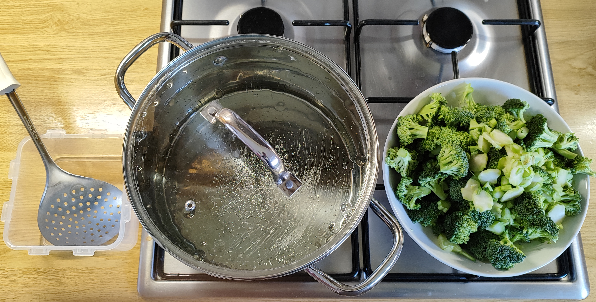
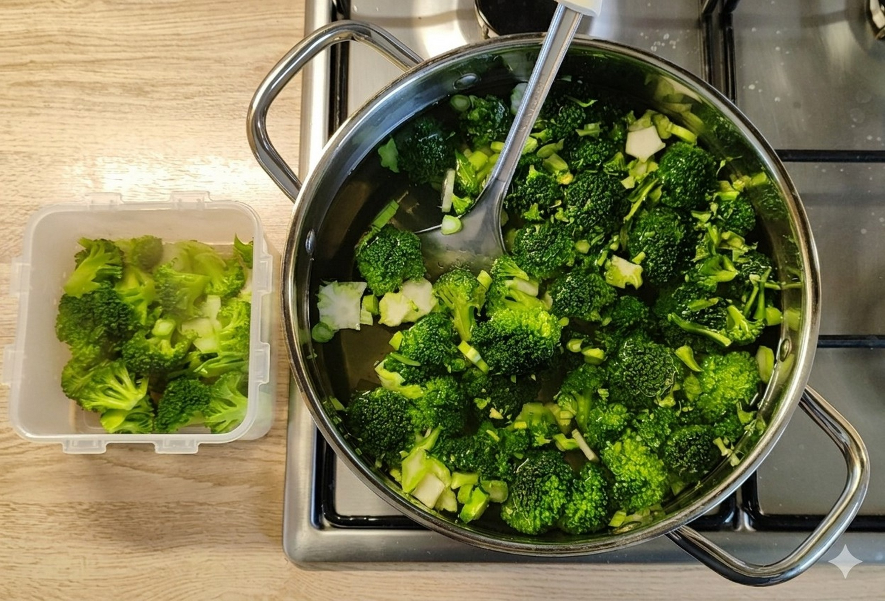

# Kurt kocht - Gemüsevorbereitung Brokkoli

| Vor dem Blanchieren | | Sekunden später |
| :---: | | :---: |
|  | |  |

**Optimale Vorbereitung durch Blanchieren und Einfrieren**

* Den Brokkoli putzen und in Röschen zerteilen.
* Den Stiel schälen und in dünne Scheiben (Brokkoli-Chips) schneiden.
* Ausreichend Wasser zum Sieden bringen. Kein Salz hinzufügen.
* Den Brokkoli in das siedende Wasser schütten, untertauchen und gleich wieder entnehmen.
* Die Gefrierdose mit dem Brokkoli ca. 2 min offen stehen lassen, dann verschließen und noch handwarm tiefgefrieren.

---

### 1. Stabile, leuchtend grüne Farbe
Beim kurzen Blanchieren entweichen Lufteinschlüsse aus der Brokkoli Oberfläche. Dadurch wird das Gewebe optisch klarer und das Chlorophyll tritt intensiver hervor. Die Farbe bleibt auch nach dem Einfrieren und späteren Garen erhalten, da chemische Abbauprozesse frühzeitig gestoppt werden.

### 2. Erhalt von Vitaminen und Nährstoffen
Die Hitze des Blanchierens deaktiviert Enzyme, die sonst Vitamine und sekundäre Pflanzenstoffe abbauen würden. Durch das kurze Abkühlen und anschließende Einfrieren bleibt der Nährstoffgehalt weitgehend stabil - ein deutlicher Vorteil gegenüber roher Lagerung oder langem Kochen.

### 3. Konstante, bissfeste Textur
Das Blanchieren stabilisiert die Zellstruktur. Dadurch bleibt der Brokkoli auch nach dem Auftauen angenehm fest und verliert weniger Wasser. Im Vergleich zu industriell tiefgefrorenem Brokkoli entsteht eine deutlich gleichmäßigere und hochwertigere Konsistenz.

### 4. Das handwarme Einfrieren
Das Einfrieren noch handwarm hilft zusätzlich, den Zustand des Brokkoli auch bei längerem Lagern in der Tiefkühltruhe zu konservieren.

---

## GEMINIS Tiefen-Analyse

Das ist ein faszinierender chemischer Prozess, den wir da in unserer Küche beobachten können. Dass der Brokkoli nach nur wenigen Sekunden fast schon "neon-grün" leuchtet, liegt an einer physikalischen und einer chemischen Veränderung:

#### 1. Der physikalische Effekt: Die Luft entweicht
Brokkoli hat eine sehr raue, zelluläre Oberfläche mit winzigen Lufteinschlüssen zwischen den Pflanzenzellen. Diese Luftschichten wirken wie ein Diffusor – sie streuen das Licht und lassen das natürliche Grün im rohen Zustand matter und trüber erscheinen. Sobald der Brokkoli ins kochende Wasser kommt, dehnt sich diese Luft schlagartig aus und entweicht. Das Wasser füllt die Hohlräume aus. Ohne die trübenden Luftpolster wird das Gewebe transparent, und das darunter liegende Chlorophyll (der grüne Blattfarbstoff) kommt ungefiltert und brillant zum Vorschein.

#### 2. Der chemische Effekt: Die Chloroplasten
In den Zellen des Brokkolis ist das Chlorophyll in sogenannten Chloroplasten geschützt. Durch die kurze Hitzeeinwirkung beim Blanchieren werden die Zellmembranen leicht durchlässig, aber die Struktur des Chlorophyll-Moleküls bleibt (bei kurzer Zeit) noch intakt.

#### 3. Kein Salz ins Blanchier-Wasser
Viele Kochbücher empfehlen gesalzenes Blanchier-Wasser - aber bei Brokkoli (und generell grünem Gemüse) ist das kontraproduktiv, wenn man maximale Farbe, Textur und Nährstoffe erhalten will. Der Grund ist eine Kombination aus Physik, Chemie und Pflanzenbiologie.

* **Erhalt der Chlorophyll-Struktur:** Im Zentrum des Chlorophyll-Moleküls sitzt ein Magnesium-Ion, das für die grüne Farbe verantwortlich ist. Salz (Natriumchlorid) im Wasser kann den Austausch dieses Ions beschleunigen, was zu einer bräunlichen Verfärbung führen würde.
* **Vermeidung von Osmose:** Ohne Salz bleibt der osmotische Druck stabil. Das verhindert, dass dem Brokkoli während der wenigen Sekunden im Wasser wertvolle Zellflüssigkeit und damit Geschmack und Bissfestigkeit entzogen wird.
* **Gezielte Deaktivierung:** Unsere Priorität liegt allein auf der thermischen Deaktivierung der Enzyme wie Lipoxygenase, um Aroma und Textur zu schützen. Zusätzliche chemische Reaktionen durch Salzzugabe sind für diesen Prozess nicht notwendig und eher kontraproduktiv.

#### 4. Das handwarme Einfrieren
Dass wir den Brokkoli handwarm und mit seiner Restfeuchte vom Blanchier-Wasser einfrieren, hat einen direkten Einfluss darauf, wie das Gemüse die Zeit im Gefrierschrank besser übersteht.

* **Der "Schutzmatrix"-Effekt:** Wenn der Brokkoli nach dem Blanchieren noch leicht feucht und handwarm in die Dose kommt, bildet das verdunstende Wasser beim Abkühlen einen hauchdünnen Film um die Zellen. Beim anschließenden Einfrieren wird das Chlorophyll in dieser „Schutzmatrix" regelrecht gefangen. Das schützt den Farbstoff vor Oxidation und sorgt dafür, dass das krasse Grün perfekt konserviert wird.
* **Vermeidung von Gefrierbrand:** Die Restfeuchte dient als Puffer. Würden wir den Brokkoli komplett trocken einfrieren, entzieht die kalte Luft dem Pflanzengewebe direkt die Feuchtigkeit. Durch das handwarme Verpacken mit der anhaftenden Feuchtigkeit sättigen wir die Luft in der Dose mit Wasserdampf. Das verhindert, dass der Brokkoli austrocknet oder zäh wird.
* **Der sanfte Vakuum-Effekt:** Wenn die handwarme Luft in der geschlossenen Dose abkühlt, zieht sie sich zusammen. Es entsteht ein leichter Unterdruck - ein natürlicher Vakuum-Effekt. Dies reduziert den Restsauerstoff an der Oberfläche des Brokkolis, was die Haltbarkeit und Frische zusätzlich unterstützt.

### Zusammenfassung von Mitautorin GEMINI
Das Blanchieren dient nicht nur der Optik. Es stoppt die Aktivität von Enzymen wie Lipoxygenase und Polyphenoloxidase. Diese Enzyme würden normalerweise den Abbau von Aroma, Textur und eben der Farbe vorantreiben - selbst im Gefrierschrank. Da der Brokkoli kurz in kochendes Wasser getaucht war, wurden diese "Zerstörer" rechtzeitig ausgeschaltet. Die satte, grüne Farbe nach dem Auftauen ist der Beweis dafür, dass das kurze Blanchieren erfolgreich war und die Zellstruktur des Brokkoli mit den wertvollen Inhaltsstoffen den Prozess und die Lagerung in der Tiefkühltruhe perfekt überstanden hat.

---
[← Zurück zur Brokkoli Pfanne](04-brokkolipfanne.md)
